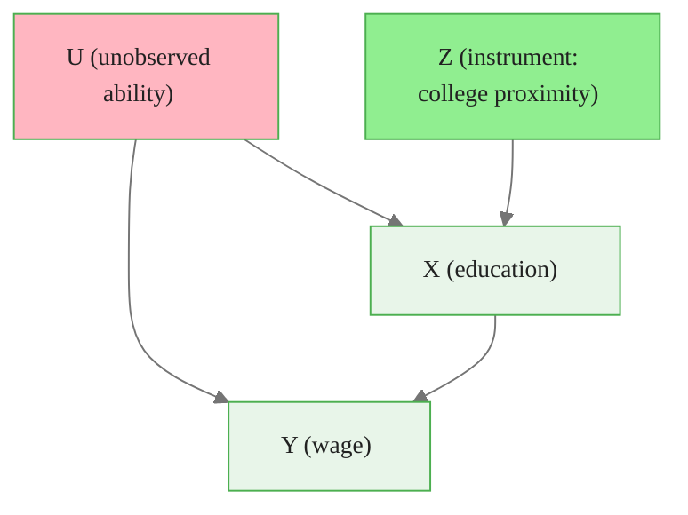

# Instrumental Variables: Fundamentals

> **Reading time:** ~8 min | **Module:** 6 — Instrumental Variables | **Prerequisites:** Module 0 — Causal Foundations, Module 5 — RDD

## Learning Objectives

By the end of this guide, you will be able to:
1. Explain the IV identification strategy and why OLS fails under endogeneity
2. State the two conditions for a valid instrument: relevance and exclusion
3. Interpret the IV (Wald) estimator as a ratio of reduced form to first stage
4. Explain the LATE interpretation of IV under heterogeneous treatment effects
5. Draw a DAG representing the IV design and verify assumptions graphically

---

## 1. The Problem: Endogeneity

Ordinary Least Squares (OLS) estimates the regression coefficient $\hat{\beta}$ by minimising $\sum(Y_i - X_i \hat{\beta})^2$. This gives an unbiased estimate of the causal effect of $X$ on $Y$ only if $X$ is **exogenous** — uncorrelated with the error term:

$$E[u_i \mid X_i] = 0$$

This assumption fails whenever there are:
- **Omitted variables** correlated with both $X$ and $Y$
- **Reverse causality** ($Y$ affects $X$ as well as $X$ affecting $Y$)
- **Measurement error** in $X$

### Example: Returns to Education

Estimating the effect of education on wages via OLS:

$$\log(\text{wage}_i) = \alpha + \beta \cdot \text{educ}_i + u_i$$

The coefficient $\hat{\beta}$ will be biased because education is correlated with unobservable **ability** ($u_i$). More able workers both complete more education AND earn more — the OLS coefficient mixes the causal effect of education with the correlation due to ability.

---

## 2. The IV Solution: Exogenous Variation

An **instrument** $Z_i$ provides exogenous variation in the endogenous variable $X_i$ that is unrelated to the confounders. The instrument allows us to isolate the part of $X$ variation that is genuinely exogenous and use only that variation to estimate the causal effect.

### The Two IV Conditions

**Condition 1: Relevance**
$$\text{Cov}(Z_i, X_i) \neq 0$$

The instrument must be correlated with the endogenous variable (the treatment). A weak instrument violates this — more on this in Guide 02.

**Condition 2: Exclusion Restriction**
$$\text{Cov}(Z_i, u_i) = 0$$

The instrument must affect the outcome **only through** the endogenous variable. It has no direct effect on $Y$ other than via $X$.

Both conditions together ensure that the only reason $Z$ correlates with $Y$ is through its effect on $X$, allowing us to use $Z$ to identify the causal effect of $X$ on $Y$.

---

## 3. The DAG Perspective



The instrument $Z$ satisfies:
- **Relevance:** Arrow from $Z$ to $X$ — proximity to college affects educational attainment
- **Exclusion:** No direct arrow from $Z$ to $Y$ — college proximity affects wages only through education
- $Z$ is not connected to $U$ — proximity to college is not correlated with unobserved ability

The exclusion restriction is the **untestable** condition. It requires judgment and domain knowledge.

---

## 4. The Wald Estimator

For binary instrument $Z_i \in \{0, 1\}$ and binary treatment $D_i$, the IV estimator simplifies to:

$$\hat{\tau}_{IV} = \frac{E[Y_i \mid Z_i = 1] - E[Y_i \mid Z_i = 0]}{E[D_i \mid Z_i = 1] - E[D_i \mid Z_i = 0]} = \frac{\text{Reduced Form}}{\text{First Stage}}$$

- **Reduced form (numerator):** The total effect of the instrument on the outcome
- **First stage (denominator):** The effect of the instrument on the treatment

The Wald estimator scales the reduced form by the first stage — it asks "of all the variation in $Y$ caused by $Z$, how much is explained by $Z$'s effect on $X$?"

### Worked Example

Card (1995) uses college proximity as an instrument for education:

| | No college nearby (Z=0) | College nearby (Z=1) | Difference |
|--|--|--|--|
| E[education] | 12.7 years | 13.1 years | 0.4 years |
| E[log wage] | 5.73 | 5.77 | 0.04 |

$$\hat{\tau}_{IV} = \frac{0.04}{0.4} = 0.10 \text{ (10% wage increase per year of education)}$$

The OLS estimate was around 0.07. The IV estimate is higher — consistent with downward ability bias in OLS (more able people need fewer years of formal education to achieve the same wage).

---

## 5. Two-Stage Least Squares (2SLS)

For continuous treatment and multiple instruments, the 2SLS estimator extends IV:

**Stage 1:** Regress the endogenous variable on the instruments (and any other exogenous controls):

$$X_i = \pi_0 + \pi_1 Z_i + \gamma W_i + \eta_i$$

Extract the **fitted values** $\hat{X}_i = \hat{\pi}_0 + \hat{\pi}_1 Z_i + \hat{\gamma} W_i$.

**Stage 2:** Regress the outcome on the fitted values:

$$Y_i = \alpha + \beta \hat{X}_i + \delta W_i + \epsilon_i$$

The coefficient $\hat{\beta}$ from Stage 2 is the 2SLS estimate of the causal effect.


<div class="code-window">
<div class="code-header">
<div class="dots"><span class="dot-red"></span><span class="dot-yellow"></span><span class="dot-green"></span></div>
<span class="filename">example.py</span>

```python
import numpy as np
import pandas as pd
import statsmodels.api as sm
from linearmodels.iv import IV2SLS

# Two-stage least squares
result = IV2SLS(
    dependent=df['log_wage'],
    exog=sm.add_constant(df[['experience', 'female']]),
    endog=df['education'],
    instruments=df[['college_nearby', 'sibling_education']]
).fit(cov_type='robust')

print(result.summary)
print(f"IV estimate: {result.params['education']:.4f}")
print(f"First stage F-stat: {result.first_stage.diagnostics['f.stat']:.2f}")
```

</div>
</div>

### Why Not Just Run 2SLS Manually?

Manual two-stage estimation has incorrect standard errors in Stage 2 — you need to account for estimation error from Stage 1. Packages like `linearmodels`, `statsmodels`, or `causalpy` handle this correctly.

---

## 6. LATE: The IV Estimand

Under heterogeneous treatment effects, what does IV estimate? With a binary instrument and binary treatment, Angrist, Imbens & Rubin (1996) show that IV identifies the **Local Average Treatment Effect for Compliers**:

$$\tau_{LATE} = E[Y_i(1) - Y_i(0) \mid \text{Complier}]$$

where **Compliers** are units who:
- Take treatment when Z = 1 (instrument active)
- Do NOT take treatment when Z = 0 (instrument inactive)

### The Four Subpopulations

| Subpopulation | D(Z=0) | D(Z=1) | Proportion |
|--------------|--------|--------|------------|
| Always-takers | 1 | 1 | $E[D \mid Z=0]$ |
| Compliers | 0 | 1 | $E[D \mid Z=1] - E[D \mid Z=0]$ |
| Never-takers | 0 | 0 | $1 - E[D \mid Z=1]$ |
| Defiers | 1 | 0 | 0 (by monotonicity) |

The LATE is identified under the additional **monotonicity assumption**: the instrument weakly pushes everyone in the same direction — no defiers.

### LATE vs ATE vs ATT

| Estimand | Who | When |
|----------|-----|------|
| ATE | Everyone | Usually not identified by IV |
| ATT | Treated units | Not identified by IV without additional assumptions |
| LATE | Compliers | Identified by IV under monotonicity |

IV estimates the LATE — a weighted effect for the complier subpopulation. This may or may not be the policy-relevant estimand, depending on context.

---

## 7. Classic Instruments

| Study | Instrument | Endogenous Variable | Outcome |
|-------|-----------|-------------------|---------|
| Card (1995) | College proximity | Years of education | Wages |
| Angrist & Evans (1998) | Sex of first two children (same sex?) | Family size | Women's labor supply |
| Angrist (1990) | Vietnam draft lottery | Military service | Wages |
| Acemoglu et al. (2001) | Settler mortality | Institutions | GDP per capita |
| Levitt (1996) | Firefighters (as instrument for police) | Police | Crime |

Each instrument works because it shifts the endogenous variable (education, family size, military service) through a mechanism that is plausibly unrelated to the confounders affecting the outcome.

---

## 8. Testing the IV Assumptions

### Testing Relevance: First Stage F-Statistic

The first stage F-statistic tests whether the instruments are jointly significant in predicting the endogenous variable. A conventional rule of thumb: F > 10 for a single instrument. More formally, use the effective F-statistic from Olea & Pflueger (2013).


<div class="code-window">
<div class="code-header">
<div class="dots"><span class="dot-red"></span><span class="dot-yellow"></span><span class="dot-green"></span></div>
<span class="filename">example.py</span>

```python

# Check first stage F-statistic
first_stage = smf.ols('education ~ college_nearby + experience + female', data=df).fit()
print(f"First stage F-stat: {first_stage.fvalue:.2f}")
print(f"Coefficient on instrument: {first_stage.params['college_nearby']:.3f}")
print(f"Standard error: {first_stage.bse['college_nearby']:.3f}")
```

</div>
</div>

### Testing Exclusion: Overidentification Test

If you have more instruments than endogenous variables (overidentified), you can test whether the extra instruments are valid using the Sargan-Hansen J-test. This tests the null that all instruments satisfy the exclusion restriction.

**Caveat:** The test requires assuming at least one instrument is valid to identify the causal effect of the others. You cannot test all instruments simultaneously.


<div class="code-window">
<div class="code-header">
<div class="dots"><span class="dot-red"></span><span class="dot-yellow"></span><span class="dot-green"></span></div>
<span class="filename">example.py</span>

```python

# Sargan-Hansen J-test (overidentification)
from linearmodels.iv import IV2SLS

result = IV2SLS(...).fit()
j_stat = result.wooldridge_overid   # test statistic
j_pval = result.wooldridge_overid_pvalue
print(f"J-statistic: {j_stat:.3f}, p-value: {j_pval:.3f}")

# p > 0.05: instruments are jointly valid (under assumption that at least one is)
```

</div>
</div>

---

## 9. Assumptions Checklist

Before reporting IV results:

- [ ] **Relevance:** First stage F-statistic > 10 (or effective F > threshold)
- [ ] **Exclusion restriction:** Credible economic/theoretical argument for no direct effect
- [ ] **Monotonicity:** Instrument does not cause defiance (i.e., never makes anyone switch away from treatment)
- [ ] **Independence:** Instrument is independent of potential outcomes (exogeneity of instrument)
- [ ] **Overidentification test:** If multiple instruments, J-test passes

The exclusion restriction cannot be tested — it requires theoretical justification.

---

## 10. Summary

| Concept | Key Point |
|---------|-----------|
| IV strategy | Use exogenous variation in Z to isolate causal variation in X |
| Relevance | Z must predict X (testable via first stage) |
| Exclusion | Z affects Y only through X (untestable — requires argument) |
| Wald estimator | Reduced form / First stage (for binary Z) |
| 2SLS | Extends IV to multiple instruments and controls |
| LATE | IV identifies the effect for compliers, not the ATE |
| Monotonicity | No defiers — instrument pushes everyone the same direction |
| Weak instruments | Low first stage → IV is biased and unreliable |

---


## Practice Questions

### Question 1: Conceptual Check
**Question:** In your own words, explain the core concept of Instrumental Variables: Fundamentals and why it matters for practical applications. What problem does it solve that simpler approaches cannot?

### Question 2: Application
**Question:** Describe a real-world scenario where you would apply the techniques from this guide. What assumptions would you need to verify before proceeding?

## Further Reading

- Angrist & Pischke (2009), *Mostly Harmless Econometrics*, Chapters 4
- Angrist, Imbens & Rubin (1996), "Identification of Causal Effects Using Instrumental Variables"
- Card (1995), "Using Geographic Variation in College Proximity to Estimate the Return to Schooling"
- Imbens & Rosenbaum (2005), "Robust, Accurate Confidence Intervals with a Weak Instrument"
- Murray (2006), "Avoiding Invalid Instruments and Coping With Weak Instruments"
<div class="callout-key">

<strong>Key Concept:</strong> - Angrist & Pischke (2009), *Mostly Harmless Econometrics*, Chapters 4
- Angrist, Imbens & Rubin (1996), "Identification of Causal Effects Using Instrumental Variables"
- Card (1995), "Using Geographic Variation in College Proximity to Estimate the Return to Schooling"
- Imbens & Rosenbaum (2005)...

</div>


---

**Next:** [02 — Advanced Designs: 2SLS, Weak Instruments, Combined Designs](02_advanced_designs_guide.md)
