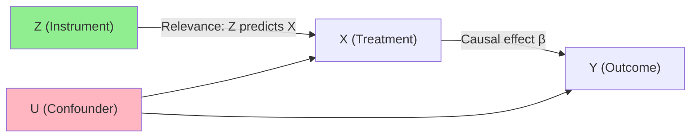
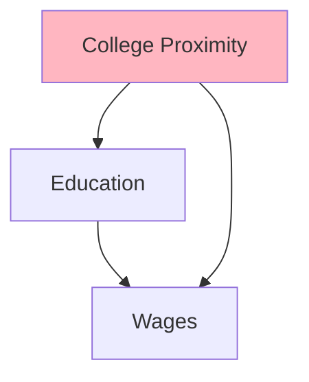

<!-- _class: lead -->

# Instrumental Variables

## Exploiting Exogenous Variation for Causal Inference

Module 06 | Causal Inference with CausalPy

<!-- Speaker notes: Instrumental variables is one of the most powerful — and most misused — tools in applied causal inference. The idea is elegant: find a variable that shifts the treatment you care about but doesn't directly affect the outcome. That variable is your instrument, and it allows you to isolate causal variation in the treatment. Today we build the intuition, formalize the conditions, and work through real examples. -->

---

## The Endogeneity Problem

We want to estimate the causal effect of $X$ on $Y$:

$$Y_i = \alpha + \beta X_i + u_i$$

OLS gives biased $\hat{\beta}$ if $X$ is **endogenous**: $\text{Cov}(X_i, u_i) \neq 0$

**Common sources:**
- **Omitted variable bias:** Ability drives both education and wages
- **Reverse causality:** Higher wages → more education investment
- **Measurement error:** Reported education ≠ true education

<!-- Speaker notes: Endogeneity is the central obstacle to causal inference in observational data. If we're trying to estimate the effect of education on wages, the problem is that education is correlated with unobserved ability — more able people get more education AND earn more wages independently. So the OLS coefficient mixes the causal effect of education with this ability correlation. We need a way to isolate the causal part. -->

---

## The IV Intuition

**Find a variable Z that:**



- Shifts $X$ (relevance)
- Affects $Y$ only through $X$ (exclusion)
- Is not correlated with the confounders (independence)

<!-- Speaker notes: The IV strategy exploits a variable Z that creates exogenous variation in X. Exogenous means: not caused by the confounders U. If Z shifts X but has no direct path to Y — only through X — then the correlation between Z and Y must come entirely from Z's effect on X. We can divide the Z-Y correlation by the Z-X correlation to get the X-Y causal effect. The arrows in this DAG are the key: Z has an arrow to X but no arrow to Y or U. -->

---

## The Two IV Conditions

**Condition 1: Relevance** (testable)

$$\text{Cov}(Z_i, X_i) \neq 0$$

The instrument must predict the treatment.
Test with first-stage regression.

**Condition 2: Exclusion Restriction** (untestable)

$$\text{Cov}(Z_i, u_i) = 0$$

The instrument affects $Y$ **only through** $X$.
Requires theoretical justification.

<!-- Speaker notes: Memorize these two conditions. Relevance is testable — you run the first stage regression and check if the instrument is a significant predictor of the endogenous variable. The F-statistic tells you how strong the instrument is. Exclusion is fundamentally untestable — you can only argue for it based on theory and domain knowledge. This is where IV gets abused: people claim exclusion without compelling arguments. Be skeptical of IV papers that don't seriously defend exclusion. -->

---

## Classic Instruments

| Study | Instrument Z | Treatment X | Outcome Y |
|-------|-------------|-------------|-----------|
| Card (1995) | College proximity | Education | Wages |
| Angrist & Evans (1998) | Same-sex first 2 kids | Family size | Labor supply |
| Angrist (1990) | Vietnam draft lottery | Military service | Wages |
| Acemoglu et al. (2001) | Settler mortality | Institutions | GDP |

**What makes these work:**
- Plausibly exogenous variation in X
- Strong theoretical exclusion argument
- Measurable and available in data

<!-- Speaker notes: Let's walk through a couple of these. College proximity: proximity to a college in your county at age 14 is largely determined by geography and historical factors. It shifts your education (you're more likely to attend if a college is close) but shouldn't directly affect your wages 20 years later except through the education channel. Draft lottery: your draft number was randomly assigned in 1969 — completely exogenous. It determined military service, which affected wages, but the lottery number itself has no direct effect on wages. Both are elegant because the exogeneity argument is clean. -->

---

## The Wald Estimator

For binary instrument $Z$ and binary treatment $D$:

$$\hat{\tau}_{IV} = \frac{\overbrace{E[Y \mid Z=1] - E[Y \mid Z=0]}^{\text{Reduced form}}}{\underbrace{E[D \mid Z=1] - E[D \mid Z=0]}_{\text{First stage}}}$$

**Card (1995) example:**

| | College nearby | No college nearby |
|--|--------------|-----------------|
| Education | 13.1 years | 12.7 years |
| Log wage | 5.77 | 5.73 |

$$\hat{\tau}_{IV} = \frac{5.77 - 5.73}{13.1 - 12.7} = \frac{0.04}{0.4} = 0.10$$

<!-- Speaker notes: The Wald estimator is the simplest IV formula and gives you a lot of intuition. The numerator is the reduced form: the total effect of proximity to college on wages. The denominator is the first stage: the effect of proximity on education. The ratio tells you: for every year of education caused by being near a college, wages went up by 10%. The OLS estimate was 7%, which is biased downward because ability correlates with education needs. Higher ability people need fewer years of formal education to reach the same wage — so the raw education-wage correlation understates the causal return. -->

---

## Two-Stage Least Squares (2SLS)

For continuous treatment and multiple instruments:

**Stage 1:** Regress $X$ on $Z$ (and controls $W$):
$$X_i = \pi_0 + \pi_1 Z_i + \gamma W_i + \eta_i \quad → \hat{X}_i$$

**Stage 2:** Regress $Y$ on $\hat{X}$ (not $X$!):
$$Y_i = \alpha + \beta \hat{X}_i + \delta W_i + \epsilon_i$$

$\hat{\beta}$ is the 2SLS estimate

```python
from linearmodels.iv import IV2SLS

result = IV2SLS(
    dependent=df['log_wage'],
    exog=sm.add_constant(df[['experience']]),
    endog=df['education'],
    instruments=df[['college_nearby']]
).fit(cov_type='robust')
```

<!-- Speaker notes: 2SLS generalises to continuous treatments and multiple instruments. The key insight: replace the endogenous variable with its instrument-predicted values. The fitted values from Stage 1 contain only the exogenous variation in X — the part driven by Z, not by the confounders. When you use these fitted values in Stage 2, you're effectively using only exogenous variation to identify the causal effect. Critical: you must use proper 2SLS software for correct standard errors. Manual two-stage gives wrong SEs. -->

---

## What Does IV Estimate? The LATE

Under heterogeneous treatment effects, IV estimates the **LATE: Local Average Treatment Effect for Compliers**

| Subpopulation | D when Z=0 | D when Z=1 |
|--------------|-----------|-----------|
| Always-takers | 1 | 1 |
| **Compliers** | **0** | **1** |
| Never-takers | 0 | 0 |
| Defiers | 1 | 0 |

$$\tau_{LATE} = E[Y(1) - Y(0) \mid \text{Complier}]$$

IV identifies the effect for **those who respond to the instrument**.

<!-- Speaker notes: This is the subtle but crucial point about what IV estimates. In the college proximity example, compliers are people who went to college because there was a college nearby and who would not have gone otherwise. The LATE is the wage return to education for these specific people. This might differ from the ATE. High-ability students might always go to college regardless of proximity — they're always-takers. The LATE is specifically for the marginal student who tips from no-college to college based on proximity. That marginal student might benefit more or less than the average student. -->

---

## IV vs OLS: What Differs?

```
If IV > OLS:
  OLS is downward biased
  → Unobservables that increase X also decrease Y
  → Example: Compulsory education → lower ability students forced to study longer

If IV < OLS:
  OLS is upward biased
  → Unobservables that increase X also increase Y
  → Example: Education returns: more able people get more education and earn more

If IV ≈ OLS:
  Little endogeneity bias, or OLS and IV identify the same effect
```

<!-- Speaker notes: The direction of IV vs OLS difference tells you something about the bias. In the Card (1995) paper, IV > OLS: the wage return to education is 10% for IV versus 7% for OLS. This means OLS is downward biased — the ability bias actually runs against the OLS estimate, not in its favor as you might first expect. Why? Very high ability people need fewer years of formal education. They achieve high wages with 12 years instead of 16. This creates a negative correlation between education and ability among high earners, pulling the OLS slope down. -->

---

## Testing the IV

**Relevance (testable):**
```python
# First stage regression
first_stage = smf.ols(
    'education ~ college_nearby + experience', data=df
).fit()

print(f"F-statistic: {first_stage.fvalue:.2f}")  # want >> 10
print(f"Instrument coef: {first_stage.params['college_nearby']:.3f}")
```

**Exclusion (not directly testable):**
- Requires economic/theoretical argument
- Check whether instrument correlates with relevant confounders
- Overidentification test (if multiple instruments)

<!-- Speaker notes: Testing relevance is straightforward: first stage F-statistic. The conventional threshold of F > 10 comes from Stock, Wright & Yogo (2002), who showed that with F < 10, the IV estimator has substantial bias relative to the OLS estimator, and confidence intervals may be very misleading. With multiple instruments, use the Olea-Pflueger effective F-statistic, which accounts for weak instrument bias more carefully. Exclusion cannot be tested directly — you're arguing for it. The closest you can get is the Sargan overidentification test when you have multiple instruments. -->

---

## The Exclusion Restriction: Common Violations



**Potential direct effects of college proximity on wages:**
- Living near a university → better local job market → higher wages
- College towns have higher living costs → higher nominal wages
- Selection: families valuing education choose to live near colleges

Each is a **direct path** from Z to Y → exclusion violation

<!-- Speaker notes: The exclusion restriction is where IV papers get attacked. For college proximity, critics argue: colleges create local job markets, so proximity to college directly raises wages through the local economy, not through education. Or: families who value education move near colleges — these are different families with different characteristics that directly affect children's wages. These are direct paths from Z to Y that bypass X. Card addresses these by controlling for local labor market conditions and arguing the proximity effect on wages is too large to be explained by these channels alone. The debate continues. -->

---

## Summary

| Concept | Key Point |
|---------|-----------|
| IV strategy | Exogenous Z shifts X; we divide Z-Y by Z-X |
| Relevance | Z must predict X — check first stage F > 10 |
| Exclusion | Z affects Y only through X — requires argument |
| Wald | Simple IV: reduced form / first stage |
| 2SLS | Extension to multiple instruments and controls |
| LATE | IV identifies effect for compliers, not the ATE |
| Monotonicity | No defiers — required for LATE interpretation |

<!-- Speaker notes: Summary: IV is powerful when you have a credible instrument. The key discipline is taking the exclusion restriction seriously. Many published IV papers have weak exclusion arguments. Before running IV, ask: is there any way my instrument could directly affect the outcome? Be honest about that. If your instrument is weak, IV can be worse than OLS — biased and with badly miscalibrated confidence intervals. The next guide covers weak instruments and more advanced IV settings. -->

---

<!-- _class: lead -->

## Next: Advanced Designs

2SLS in practice, weak instrument diagnostics, and combining causal designs

→ [02 — Advanced IV Designs](02_advanced_designs_guide.md)

<!-- Speaker notes: In the next guide we go deeper: how to handle weak instruments, what to do with multiple endogenous variables, and how to combine IV with other designs like DiD or RDD. We'll also cover the Angrist-Pischke F-statistics for multiple instruments and discuss the Local Instrumental Variables framework. -->
