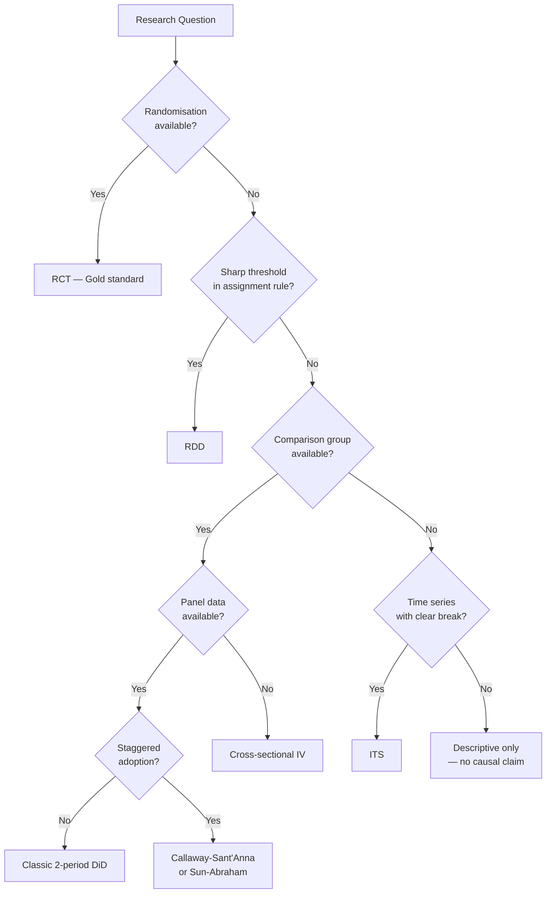

# Advanced IV Designs and Combining Causal Methods

> **Reading time:** ~7 min | **Module:** 6 — Instrumental Variables | **Prerequisites:** Module 0 — Causal Foundations, Module 5 — RDD

## Learning Objectives

By the end of this guide, you will be able to:
1. Diagnose and handle weak instruments
2. Implement 2SLS with multiple instruments
3. Combine ITS with DiD to strengthen identification
4. Combine RDD with IV (fuzzy RDD as IV)
5. Select the appropriate causal design for a given research question

---

## 1. Weak Instruments

An instrument is **weak** when the first stage F-statistic is low — the instrument explains little of the variation in the endogenous variable. Weak instruments are a serious problem:

1. **Bias:** Weak IV is biased toward OLS (the very estimate we're trying to correct)
2. **Size distortion:** Confidence intervals are badly miscalibrated — 95% CI may only contain the true value 50% of the time
3. **Over-rejection:** Wald tests over-reject the null hypothesis

### The F-Statistic Threshold

The conventional threshold is **F > 10** for a single instrument (Stock, Wright & Yogo, 2002). This ensures IV bias is at most 10% of the OLS bias.

For multiple instruments, use the **Angrist-Pischke** (AP) F-statistic for each instrument individually, and the **effective F-statistic** (Olea & Pflueger, 2013) for the joint first stage.


<span class="filename">example.py</span>
</div>

<div class="code-window">
<div class="code-header">
<div class="dots"><span class="dot-red"></span><span class="dot-yellow"></span><span class="dot-green"></span></div>

```python
import statsmodels.formula.api as smf
from linearmodels.iv import IV2SLS
import statsmodels.api as sm

# First stage regression
first_stage = smf.ols(
    'education ~ college_nearby + mother_educ + experience + female',
    data=df
).fit()

print(f"First stage F-statistic (joint): {first_stage.fvalue:.2f}")
print(f"F p-value: {first_stage.f_pvalue:.4f}")
print(f"\nInstrument-specific t-stats:")
for var in ['college_nearby', 'mother_educ']:
    t = first_stage.tvalues[var]
    print(f"  {var}: t = {t:.2f}, F (approx) = {t**2:.2f}")
```

</div>
</div>

### Handling Weak Instruments

| Approach | When to Use |
|----------|-------------|
| Anderson-Rubin (AR) test | Inference robust to weak instruments |
| LIML (Limited Information Maximum Likelihood) | Less biased than 2SLS with weak instruments |
| Fuller's modified LIML | Reduces bias further |
| Find a stronger instrument | Best solution if available |


<span class="filename">example.py</span>
</div>

<div class="code-window">
<div class="code-header">
<div class="dots"><span class="dot-red"></span><span class="dot-yellow"></span><span class="dot-green"></span></div>

```python
# Anderson-Rubin confidence intervals (weak-instrument robust)
# Using the ivmodels package
from ivmodels import KClass, AncestralInstruments

# AR test inverts the test to get a CI
ar_ci = KClass(k=1).fit_regularized(
    X=df[['education']],
    Z=df[['college_nearby']],
    y=df['log_wage'],
    W=df[['experience', 'female']]
)
```

</div>
</div>

---

## 2. Multiple Instruments: 2SLS in Practice

### Setup with Two Instruments


<span class="filename">example.py</span>
</div>

<div class="code-window">
<div class="code-header">
<div class="dots"><span class="dot-red"></span><span class="dot-yellow"></span><span class="dot-green"></span></div>

```python
import numpy as np
import pandas as pd
from linearmodels.iv import IV2SLS
import statsmodels.api as sm

# Generate example data
np.random.seed(42)
n = 2000

# Two instruments for education
college_nearby = np.random.binomial(1, 0.5, n)        # college proximity
mother_educ = np.random.normal(12, 2, n).round()      # mother's education

# Endogenous education
education = (10 + 0.8 * college_nearby + 0.4 * mother_educ
             + np.random.normal(0, 2, n))

# Unobservable ability (confounder)
ability = np.random.normal(0, 1, n)

# Wage (log)
experience = np.random.randint(1, 30, n)
log_wage = (1.5 + 0.08 * education + 0.3 * ability
            + 0.03 * experience + np.random.normal(0, 0.3, n))

df = pd.DataFrame({
    'log_wage': log_wage, 'education': education,
    'college_nearby': college_nearby, 'mother_educ': mother_educ,
    'experience': experience, 'ability': ability
})

# 2SLS with two instruments
model_iv = IV2SLS(
    dependent=df['log_wage'],
    exog=sm.add_constant(df['experience']),
    endog=df['education'],
    instruments=df[['college_nearby', 'mother_educ']]
).fit(cov_type='robust')

print("2SLS with two instruments:")
print(model_iv.summary)
print(f"\nFirst stage F-statistic: {model_iv.first_stage.diagnostics['f.stat']:.2f}")
```

</div>
</div>

### Overidentification Test

With two instruments and one endogenous variable (overidentified), test whether the instruments give consistent estimates:


<span class="filename">example.py</span>
</div>

<div class="code-window">
<div class="code-header">
<div class="dots"><span class="dot-red"></span><span class="dot-yellow"></span><span class="dot-green"></span></div>

```python
# Sargan-Hansen J-test
j_stat = model_iv.wooldridge_overid
j_pval = model_iv.wooldridge_overid_pvalue
print(f"Sargan J-test: stat = {j_stat:.3f}, p-value = {j_pval:.4f}")
if j_pval > 0.05:
    print("Fail to reject: instruments are jointly consistent with exclusion")
else:
    print("Reject: at least one instrument may violate exclusion restriction")
```

</div>
</div>

---

## 3. Combining ITS and DiD

ITS and DiD can be combined when you have:
- A treatment that turns on at a specific time (ITS)
- A control group not receiving the treatment (DiD)

This is sometimes called a **difference-in-differences ITS** or **controlled ITS**:

$$Y_{it} = \alpha_i + \lambda_t + \beta \cdot \text{Post}_t + \tau \cdot (\text{Treated}_i \times \text{Post}_t) + f(t) \cdot \text{Treated}_i + \epsilon_{it}$$

where $f(t)$ allows different pre-period trends for the treated group.

### Advantages of ITS+DiD

- ITS without a control group: trend extrapolation may be biased
- DiD without time series: parallel trends may be implausible
- Combined: control group removes common shocks; time series provides rich pre-period


<span class="filename">example.py</span>
</div>

<div class="code-window">
<div class="code-header">
<div class="dots"><span class="dot-red"></span><span class="dot-yellow"></span><span class="dot-green"></span></div>

```python
import statsmodels.formula.api as smf

# ITS+DiD: policy introduced in period T for treated states
df['post'] = (df['period'] >= df['treatment_period']).astype(int)
df['post_treated'] = df['post'] * df['treated']

# Allow different pre-trends by including treated × time
formula = ('outcome ~ C(state) + C(period) + post_treated'
           '+ period:treated')  # different time trends by group

model_its_did = smf.ols(formula, data=df).fit(cov_type='cluster',
                                               cov_kwds={'groups': df['state']})
tau = model_its_did.params['post_treated']
print(f"ITS+DiD treatment effect: {tau:.3f}")
```

</div>
</div>

---

## 4. Fuzzy RDD as IV

A fuzzy RDD is exactly a local IV problem. The cutoff serves as an instrument:

- **Instrument Z:** An indicator for being above the cutoff ($Z_i = \mathbf{1}[X_i \geq c]$)
- **Endogenous treatment D:** Actual treatment receipt (imperfect compliance)
- **Running variable X:** The forcing variable

The fuzzy RDD estimator is:

$$\tau_{fuzzy} = \frac{\lim_{x\downarrow c} E[Y \mid X=x] - \lim_{x\uparrow c} E[Y \mid X=x]}{\lim_{x\downarrow c} E[D \mid X=x] - \lim_{x\uparrow c} E[D \mid X=x]}$$


<span class="filename">example.py</span>
</div>

<div class="code-window">
<div class="code-header">
<div class="dots"><span class="dot-red"></span><span class="dot-yellow"></span><span class="dot-green"></span></div>

```python
# Fuzzy RDD as local IV
# Stage 1: Effect of cutoff crossing on treatment probability
first_stage_rdd = smf.ols(
    'enrolled ~ above_cutoff + x_centered + above_cutoff:x_centered',
    data=local_df
).fit()
jump_first_stage = first_stage_rdd.params['above_cutoff']

# Stage 2: Reduced form effect of cutoff on outcome
reduced_form = smf.ols(
    'outcome ~ above_cutoff + x_centered + above_cutoff:x_centered',
    data=local_df
).fit()
jump_reduced_form = reduced_form.params['above_cutoff']

# Fuzzy RDD estimate
tau_fuzzy = jump_reduced_form / jump_first_stage
print(f"Fuzzy RDD estimate (Wald): {tau_fuzzy:.3f}")
print(f"  Reduced form jump: {jump_reduced_form:.3f}")
print(f"  First stage jump: {jump_first_stage:.3f}")
```

</div>
</div>

---

## 5. Combining RDD and DiD (RD-DiD)

When you have multiple rounds of data around an RDD, you can combine it with DiD to:
1. Remove fixed pre-existing differences between just-above and just-below groups
2. Provide richer identification

This is the **Regression Discontinuity Difference-in-Differences** design:

$$Y_{it} = \alpha + \beta_1 D_i + \beta_2 \text{Post}_t + \tau \cdot (D_i \times \text{Post}_t) + g(X_i) + h(X_i) \times \text{Post}_t + \epsilon_{it}$$

where $D_i = \mathbf{1}[X_i \geq c]$ is the indicator for being above the cutoff.

The parameter $\tau$ captures:
- The change in the gap between above-cutoff and below-cutoff units after treatment
- After removing pre-existing differences and common time trends


<span class="filename">example.py</span>
</div>

<div class="code-window">
<div class="code-header">
<div class="dots"><span class="dot-red"></span><span class="dot-yellow"></span><span class="dot-green"></span></div>

```python
# RD-DiD: panel with pre and post periods
df['above_cutoff'] = (df['running_var'] >= cutoff).astype(int)
df['post'] = (df['period'] == 'post').astype(int)
df['x_c'] = df['running_var'] - cutoff

# RD-DiD regression
model_rddid = smf.ols(
    ('outcome ~ above_cutoff + post + above_cutoff:post'
     '+ x_c + x_c:post + above_cutoff:x_c + above_cutoff:x_c:post'),
    data=df
).fit(cov_type='HC1')

tau_rddid = model_rddid.params['above_cutoff:post']
print(f"RD-DiD estimate: {tau_rddid:.3f}")
```

</div>
</div>

---

## 6. Design Decision Framework



<!-- Speaker notes: This flowchart maps from research question to design. The first question is always: do you have randomization? If yes, stop — run an RCT. If not, look for natural experiments: threshold rules give you RDD; comparison groups with panel data give you DiD; exogenous variation in treatment gives you IV; a clear time break in treatment gives you ITS. The worst case is when none of these apply — then you cannot make causal claims from observational data. -->

---

## 7. Summary Table

| Design | Key Assumption | Estimand | Threats |
|--------|---------------|---------|---------|
| ITS | Counterfactual trend = extrapolation | ATT for treated series | Confounding events, non-linear trends |
| DiD | Parallel trends | ATT | PT violation, anticipation, spillovers |
| RDD | Continuity at cutoff | LATE at cutoff | Manipulation, compound discontinuity |
| IV | Exclusion restriction | LATE for compliers | Weak instrument, exclusion violation |
| Synthetic Control | Weighted match to pre-period | ATT | Donor pool inadequacy, extrapolation |

---


## Practice Questions

### Question 1: Conceptual Check
**Question:** In your own words, explain the core concept of Advanced IV Designs and Combining Causal Methods and why it matters for practical applications. What problem does it solve that simpler approaches cannot?

### Question 2: Application
**Question:** Describe a real-world scenario where you would apply the techniques from this guide. What assumptions would you need to verify before proceeding?

## Further Reading

- Angrist & Pischke (2009), *Mostly Harmless Econometrics*, Chapters 4-5
- Stock, Wright & Yogo (2002), "A Survey of Weak Instruments and Weak Identification in GMM"
- Olea & Pflueger (2013), "A Robust Test for Weak Instruments"
- Calonico, Cattaneo & Farrell (2020), "Optimal Mean Square Error Rates in the Fuzzy RDD"
- Roth et al. (2023), "What's Trending in Difference-in-Differences?"

---

**Previous:** [01 — IV Fundamentals](01_iv_fundamentals_guide.md)
**Next:** [Module 06 Notebooks](../notebooks/)

<div class="callout-key">

<strong>Key Concept:</strong> **Previous:** [01 — IV Fundamentals](01_iv_fundamentals_guide.md)
**Next:** [Module 06 Notebooks](../notebooks/)

</div>


## Resources

<a class="link-card" href="../notebooks/01_iv_estimation.ipynb">
  <div class="link-card-title">Hands-on Notebook</div>
  <div class="link-card-description">15-minute micro-notebook with guided exercises for this topic.</div>
</a>
