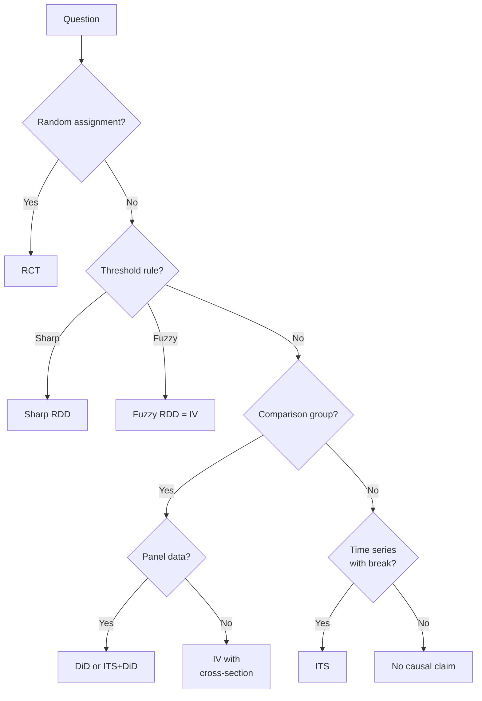

<!-- _class: lead -->

# Advanced IV and Combined Designs

## 2SLS, Weak Instruments, and Design Combinations

Module 06.2 | Causal Inference with CausalPy

<!-- Speaker notes: In this module we go deeper on IV — handling weak instruments, working with multiple instruments, and combining IV with other causal designs. We also build the capstone skill of this course: knowing when to use which design and how to layer designs for stronger identification. -->

---

## Weak Instruments: The Problem

When the first stage F-statistic is low, IV is worse than OLS:

| F-statistic | Relative IV bias | Confidence interval |
|------------|-----------------|---------------------|
| F = 10 | ~10% of OLS bias | Approximately correct |
| F = 5 | ~30% of OLS bias | Over-rejects |
| F = 2 | ~60% of OLS bias | Badly wrong |
| F = 1 | ≈ OLS bias | Meaningless |

**The paradox:** A weak instrument meant to fix OLS bias can make things worse

<!-- Speaker notes: This is one of the most important practical lessons in IV. If your instrument barely predicts the treatment, the 2SLS estimator essentially averages between the true IV estimate and the OLS estimate. With very weak instruments, you've accomplished nothing — you're basically running OLS with extra steps, plus your standard errors are wrong and your confidence intervals are badly miscalibrated. The F > 10 threshold is a minimum, not a goal. Aim for F > 100 if possible. -->

---

## First Stage F-Statistic

```python
import statsmodels.formula.api as smf

# First stage regression
first_stage = smf.ols(
    'education ~ college_nearby + experience + female',
    data=df
).fit()

print(f"First stage F-stat: {first_stage.fvalue:.2f}")
# F > 10: adequate; F > 100: strong

# Partial F-statistic for the instrument only
# (excludes other controls from the F-stat)
restricted = smf.ols('education ~ experience + female', data=df).fit()
n = len(df)
k = 1  # number of excluded instruments
F_partial = ((restricted.ssr - first_stage.ssr) / k) / (first_stage.ssr / (n - first_stage.df_model - 1))
print(f"Partial F-stat for instrument: {F_partial:.2f}")
```

<!-- Speaker notes: The overall F-statistic tests whether all variables in the first stage are jointly significant — that's not what you want. You want the partial F-statistic for the excluded instruments specifically. The linearmodels package gives you this directly through the first_stage property. The Olea-Pflueger effective F-statistic accounts for the fact that the Stock-Yogo critical values assume homoscedastic errors — if errors are heteroscedastic, the threshold changes. Use their tables for the appropriate critical value. -->

---

## Robust IV Inference: Anderson-Rubin

When instruments are weak, use **inference robust to weak instruments**:

```python
# Anderson-Rubin CI: valid regardless of instrument strength
from linearmodels.iv import IV2SLS

result_ar = IV2SLS(
    dependent=df['log_wage'],
    exog=sm.add_constant(df['experience']),
    endog=df['education'],
    instruments=df['college_nearby']
).fit(cov_type='robust')

# AR-based confidence intervals
print("AR 95% CI (weak-instrument robust):")
print(result_ar.conf_int(method='anderson-rubin'))
```

AR CIs are often much wider than standard 2SLS CIs — that's honesty, not a bug.

<!-- Speaker notes: The Anderson-Rubin confidence interval is constructed by inverting a test that is valid regardless of instrument strength. It comes at a cost: the CI is often wider than the 2SLS CI, especially when the instrument is weak. But that's the honest answer — when you have a weak instrument, you should have wide confidence intervals reflecting genuine uncertainty. A narrow CI with a weak instrument is false precision. Many journals now require AR CIs alongside standard 2SLS results. -->

---

## Multiple Instruments: 2SLS

With two instruments for one endogenous variable:

```python
from linearmodels.iv import IV2SLS

model_2sls = IV2SLS(
    dependent=df['log_wage'],
    exog=sm.add_constant(df[['experience', 'female']]),
    endog=df['education'],
    instruments=df[['college_nearby', 'mother_educ']]
).fit(cov_type='robust')

# First stage summary
print("First stage diagnostics:")
print(model_2sls.first_stage.diagnostics)

# Sargan overidentification test
print(f"\nSargan J-test: p = {model_2sls.wooldridge_overid_pvalue:.4f}")
```

If instruments agree: J-test passes; if not: at least one violates exclusion

<!-- Speaker notes: Multiple instruments increase first-stage power — you're combining two sources of exogenous variation in education. But they must all satisfy exclusion. The Sargan J-test tests the null that all instruments are valid — but this is only possible because you have more instruments than endogenous variables. The test is relative: it checks whether the instruments give consistent estimates of the same causal effect. If one instrument violates exclusion, its IV estimate will differ from the others, and the J-test will detect that. A passed J-test doesn't prove exclusion; a failed J-test proves at least one instrument is invalid. -->

---

## Overidentification Test

```
Test H0: All instruments satisfy exclusion restriction
Alternative H1: At least one instrument is invalid

Sargan/Hansen J-statistic:
- Under H0: J ~ χ²(L - K) where L = # instruments, K = # endogenous
- p > 0.05: fail to reject → instruments are consistent
- p < 0.05: reject → at least one instrument violates exclusion

Caveat: The test requires assuming at least one instrument is valid.
Cannot test ALL instruments simultaneously.
```

<!-- Speaker notes: The overidentification test is your best available test for instrument validity when you have multiple instruments. But understand its limitation: you can only run it if you're overidentified — more instruments than endogenous variables. And even if you pass, you've only shown consistency among the instruments, not that they're all valid. If all your instruments violate exclusion in the same direction, the test won't detect it. Think of it as a necessary but not sufficient condition for instrument validity. -->

---

## ITS + DiD: The Controlled ITS

When you have both a treatment time series AND a control group:

```
Outcome
  |         Control (no treatment)
  |    ─────────────────────────────
  |                     ↑ same time trend
  |    ─────────────────|──────────────
  |         Treated     |  ← DiD effect
  |                     |  (above the
  |              * * * *|* * *  common trend)
  |_________________Treatment_Time_________→ t
```

**What you gain:**
- Control group removes common time trends (no need to extrapolate)
- Time series provides rich pre-period for parallel trends testing

<!-- Speaker notes: The controlled ITS is arguably the most robust design in this course. You combine the benefits of both DiD and ITS. From DiD you get a comparison group that removes confounding from common time trends. From ITS you get a long pre-treatment time series that lets you thoroughly test parallel trends and model complex temporal dynamics. If you have panel data with a clear treatment time and a comparison group, use this design. It's more credible than either ITS or DiD alone. -->

---

## ITS + DiD: Implementation

```python
import statsmodels.formula.api as smf

# Long panel: multiple pre and post periods
df['post'] = (df['period'] >= treatment_time).astype(int)
df['post_treated'] = df['post'] * df['treated']

# Allow different time trends by group (controlled ITS)
model = smf.ols(
    'outcome ~ C(unit) + C(period)'  # unit + time FE
    '+ post:treated'                  # treatment effect
    '+ period:treated',               # different pre-trend (optional)
    data=df
).fit(cov_type='cluster',
       cov_kwds={'groups': df['unit']})

tau = model.params['post:treated']
print(f"Controlled ITS estimate: {tau:.3f}")
```

<!-- Speaker notes: The controlled ITS regression combines two-way fixed effects (unit and time) with an interaction for the post-treatment period for treated units. The unit fixed effects absorb time-invariant unit characteristics. The time fixed effects absorb common shocks. The post:treated interaction is your treatment effect. Optionally, you can include period:treated to allow different pre-period trends for the treated group — but be careful, this eats degrees of freedom and can over-fit the pre-period. -->

---

## Fuzzy RDD as IV

Fuzzy RDD = Local IV at the cutoff

```
E[Y | X = c+ε] - E[Y | X = c-ε]
────────────────────────────────── = τ_fuzzy
E[D | X = c+ε] - E[D | X = c-ε]

    Reduced form        First stage
```

```python
# First stage
fs = smf.ols('enrolled ~ above + x_c + above:x_c', data=local).fit()
jump_fs = fs.params['above']

# Reduced form
rf = smf.ols('outcome ~ above + x_c + above:x_c', data=local).fit()
jump_rf = rf.params['above']

tau_fuzzy = jump_rf / jump_fs
```

<!-- Speaker notes: A fuzzy RDD is literally an IV design where the cutoff crossing is the instrument and actual treatment receipt is the endogenous variable. The Wald formula applies: reduced form jump divided by first stage jump. The LATE interpretation also applies: you're estimating the effect for compliers — units who are induced into treatment by crossing the cutoff. Units who would always take treatment regardless, or who never take treatment regardless, don't contribute to identification. -->

---

## Which Design for Which Question?



<!-- Speaker notes: This decision tree is the capstone of the course. Learn it. When you encounter a new causal question, work through it systematically. Start with the gold standard — do you have randomisation? No? Then look for natural experiments. Threshold rules give you RDD. Panel data with comparison groups gives you DiD. If you have exogenous variation in treatment, use IV. If you have a time series with a clear break and no comparison group, use ITS. And if none of these apply, be honest: you cannot make causal claims from observational data without strong, defensible assumptions. -->

---

## Design Assumptions Compared

| Design | Key Assumption | Testable? |
|--------|---------------|----------|
| ITS | No confounding events at treatment time | Partially |
| DiD | Parallel trends | Partially (pre-trends) |
| Sharp RDD | Continuity of potential outcomes at cutoff | Partially |
| Fuzzy RDD | Exclusion + monotonicity | Partially |
| IV | Exclusion restriction | Partially |
| Synth. Control | Weights reproduce pre-period outcomes | Yes |

<!-- Speaker notes: All designs rest on untestable assumptions — that's what makes causal inference hard. What varies is how much of the assumption is testable. Pre-trend tests for DiD, density tests for RDD, first stage for IV — these are the diagnostics that build credibility. None of them prove the key assumption, but they demonstrate it's plausible. The goal is to present your design transparently, run all available diagnostics, and let readers judge credibility. -->

---

## Summary

| Topic | Key Point |
|-------|-----------|
| Weak instruments | F < 10 means IV can be worse than OLS; use AR inference |
| Multiple instruments | 2SLS with overidentification test for consistency |
| ITS+DiD | Strongest observational design: comparison group + time series |
| Fuzzy RDD = IV | Cutoff is the instrument; Wald formula applies |
| Design choice | Follow the decision tree: randomisation → threshold → panel → IV → ITS |

<!-- Speaker notes: These five points summarise what separates competent from excellent causal inference. Weak instruments are common and often ignored — don't. Multiple instruments add power but require the J-test. ITS+DiD is underused and very powerful. Fuzzy RDD is nothing but a local IV. And the design choice flowchart should be second nature. -->

---

<!-- _class: lead -->

## Next: Module 07 — Production Pipelines

Operationalising causal inference: model selection, reporting, and deployment

→ [Module 07 Guides](../../module_07_production_pipelines/guides/)

<!-- Speaker notes: We've now covered every major causal design: ITS, synthetic control, DiD, RDD, and IV. Module 07 brings it all together into production workflows: how to systematically choose a design, how to write up and communicate causal estimates, and how to deploy causal models in production systems. This is where academic methodology meets practical application. -->
