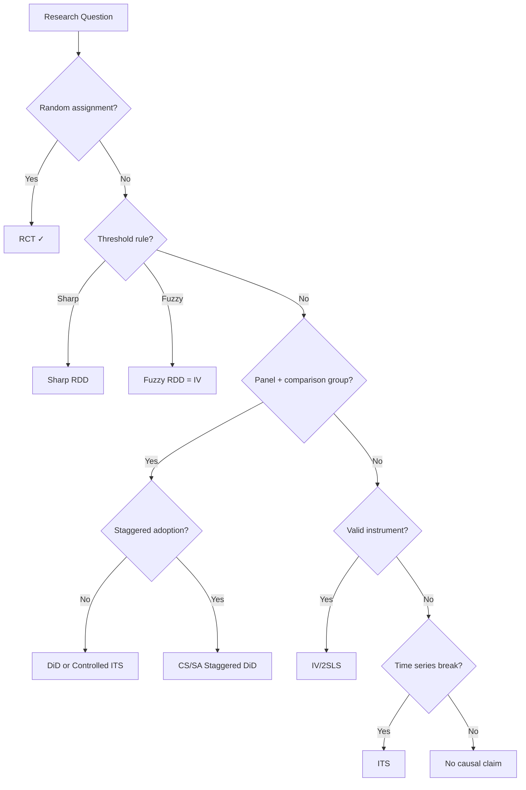

<!-- _class: lead -->

# Causal Model Selection

## Which Design for Which Research Question

Module 07 | Causal Inference with CausalPy

<!-- Speaker notes: This is the capstone module. You've learned ITS, Synthetic Control, DiD, RDD, and IV. Now we answer: given a real research question and dataset, which of these do you use? The answer is a decision framework, not a formula. It depends on the nature of your data, the research question, and what assumptions you can credibly defend. -->

---

## The Central Question

Before running any model, ask:

> **Where does the exogenous variation in treatment come from?**

This determines the design.

| Source of Variation | Design |
|--------------------|--------|
| Explicit randomisation | RCT |
| Threshold/cutoff rule | RDD |
| Policy timing + comparison group | DiD |
| Natural experiment | IV |
| Policy timing, no comparison | ITS |
| Historical donor units | Synthetic Control |

<!-- Speaker notes: This is the key question that separates credible from non-credible causal inference. If you can't answer where the exogenous variation comes from, you can't make a causal claim. Every design corresponds to a specific source of exogenous variation: randomisation, a threshold, a time break, a natural experiment, or the synthetic weighting of donors. -->

---

## The Design Decision Tree



<!-- Speaker notes: Walk through this flowchart with the class. The first question is always: is there randomisation? If yes, RCT and you're done. If not, look for the next best thing: a threshold rule (RDD), a comparison group in a panel (DiD), exogenous variation (IV), or just a time series (ITS). If none of these apply, you can do descriptive work but you cannot make causal claims without strong, usually indefensible assumptions. -->

---

## Data Requirements by Design

| Design | Minimum Data | Ideal |
|--------|-------------|-------|
| RDD | Running var + known cutoff | Dense obs near cutoff |
| DiD | Panel + group + time | Long pre-period |
| IV | Instrument + treatment | Strong first stage |
| ITS | Time series + treatment date | ≥20 pre-periods |
| Synth. Control | Donor units + long pre | Many donors |

**Before choosing a design:** inventory your data

<!-- Speaker notes: Data availability constrains the design choice. You can't run an RDD without a continuous running variable and a known cutoff. You can't run DiD without a comparison group. You can't run synthetic control without suitable donors. Inventory your data first, then consider which designs are feasible. The best design is the most credible one that your data actually supports. -->

---

## The Credibility Hierarchy

Most to least credible (internal validity):

```
1. RCT                     ← randomisation eliminates confounding
2. Sharp RDD               ← quasi-random near cutoff
3. IV with strong F        ← exogenous variation
4. DiD with parallel trends← parallel trends supported
5. ITS with no confounders ← trend extrapolation
6. Observational regression← assumes unconfoundedness (strong!)
```

**But:** A poorly designed RCT < well-designed DiD

Implementation quality matters more than design class.

<!-- Speaker notes: This hierarchy is a starting point, not a rigid rule. A randomised experiment with 50% attrition and systematic non-compliance may be less credible than a DiD with flat pre-trends, a rich comparison group, and many robustness checks. The hierarchy reflects the minimum assumptions required: RCT requires the fewest, observational regression requires the most. But execution, diagnostics, and transparency matter hugely at every level. -->

---

## Stating and Defending Assumptions

**Every design has one key assumption:**

| Design | Key Assumption |
|--------|---------------|
| RDD | Continuity of potential outcomes at cutoff |
| DiD | Parallel trends |
| IV | Exclusion restriction |
| ITS | No confounding events at treatment time |
| SC | Synthetic weights reproduce counterfactual |

**For each, you must:**
1. State it clearly in plain language
2. Explain why it's plausible in your context
3. Provide evidence where possible
4. Acknowledge main threats and their likely direction of bias

<!-- Speaker notes: The best causal inference papers are transparent about assumptions. They state the assumption in plain language, provide the best available evidence that it holds, and honestly discuss what would happen if it were violated. Reviewers and readers appreciate this transparency — it shows you understand your own analysis. The worst papers sweep assumptions under the rug and let readers find the problems later. -->

---

## What Should Your Report Include?

```
Section 1: Research Question
  "We estimate the effect of [X] on [Y] for [population]"

Section 2: Design Choice and Justification
  "[Design] because [reason]. Key assumption: [assumption].
  Evidence: [diagnostics]. Alternative designs considered: [...]"

Section 3: Primary Estimate
  "Treatment effect = [τ] (SE/HDI). [Bayesian/frequentist details]"

Section 4: Robustness Checks
  "Results are stable under [bandwidth variation / alternative controls /
  placebo tests / prior sensitivity]"

Section 5: Limitations
  "The main threat is [X]. Under this violation, bias would be [direction]"
```

<!-- Speaker notes: This five-section structure works for an academic paper, an internal business report, or a presentation. The key sections are the justification section (where you defend your design and assumptions) and the robustness section (where you show the result doesn't depend on arbitrary choices). Most practitioners skip both of these and go straight to the estimate. Don't. -->

---

## Common Design Selection Mistakes

<div class="columns">

**Mistake 1: Defaulting to OLS**
"We controlled for covariates"
→ Unconfoundedness is rarely plausible

**Mistake 2: Parallel trends without checking**
"We used DiD"
→ Always test and plot pre-trends

**Mistake 3: High-order polynomials in RDD**
"We used a cubic polynomial"
→ Use local linear; test with quadratic

**Mistake 4: Ignoring staggered adoption**
"We used TWFE DiD"
→ Check for treatment effect heterogeneity

</div>

<!-- Speaker notes: These four mistakes show up constantly in applied work. OLS with controls is not causal unless you can credibly argue that all confounders are observed and correctly modelled — almost never true. DiD without pre-trend testing is incomplete. High-order polynomials in RDD give erratic estimates near the boundary. And TWFE with staggered adoption has been shown to be biased in most real-world settings. Knowing these mistakes is as important as knowing the correct methods. -->

---

## Design Checklist

Before finalising your analysis:

- [ ] Research question is precisely stated
- [ ] All applicable designs have been considered
- [ ] Key assumption is stated and defended
- [ ] Primary diagnostics have been run
- [ ] Robustness checks are planned
- [ ] Estimand (ATT, ATE, LATE) matches the policy question
- [ ] Limitations are documented with bias direction
- [ ] Results are reproducible from raw data

<!-- Speaker notes: Use this as a literal checklist. Print it out and tick each box before you finalize results. If you can't tick a box, go back and address it. The goal is not to have a perfect study — no study is perfect. The goal is to be honest about what you can and can't claim, and to have done everything reasonable to support your causal claim. A checklist-complete study that acknowledges limitations is far more credible than a study that presents overconfident results without diagnostics. -->

---

## Summary

| Question | Answer |
|----------|--------|
| Which design to use? | The most credible one given your data |
| What makes it credible? | A defensible key assumption |
| How to defend it? | Theory + diagnostics + robustness |
| What to report? | Design, assumption, evidence, estimate, sensitivity |
| Common mistakes? | OLS default, no pre-trends test, high-order polynomials, ignoring staggered adoption |

<!-- Speaker notes: This slide summarises the entire module. The design choice is determined by the exogenous variation available in your data. Credibility comes from defending the key assumption. You defend it with theory and diagnostics. You report all of that — not just the estimate. And you avoid the common mistakes we listed. This framework will serve you across every empirical study you conduct. -->

---

<!-- _class: lead -->

## Next: Reporting Causal Estimates

Effect sizes, credible intervals, and communicating uncertainty

→ [02 — Reporting Guide](02_reporting_guide.md)

<!-- Speaker notes: We've covered how to select and justify a design. Next we cover how to communicate results: what to report beyond the point estimate, how to present effect sizes meaningfully, how to handle uncertainty communication with Bayesian and frequentist tools, and how to write the main results sentence that conveys both magnitude and uncertainty. -->
