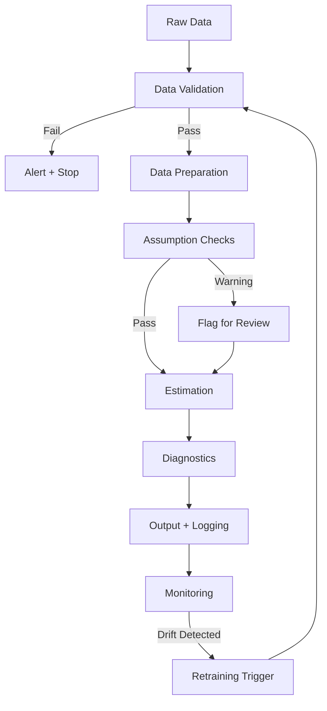

<!-- _class: lead -->

# Deploying Causal Models in Production

## Pipelines, Monitoring, and Retraining

Module 07.3 | Causal Inference with CausalPy

<!-- Speaker notes: The final guide. We've learned every major causal design and how to report results. This slide deck covers what happens after: when causal analysis moves from a one-time study to a recurring pipeline. This happens in industry — A/B testing systems, policy evaluation dashboards, ongoing program evaluations. The challenges are different from academic one-off analyses. -->

---

## Causal ≠ Predictive Pipelines

| Dimension | Predictive ML | Causal Inference |
|-----------|-------------|-----------------|
| Goal | Minimise prediction error | Identify causal effect |
| Validation | Hold-out RMSE | Assumption diagnostics |
| "Drift" | Prediction error increases | Assumptions violated |
| Retraining trigger | Accuracy degrades | Design context changes |
| Output | Score / probability | Effect + uncertainty |

**Key insight:** Causal models don't get more accurate — they get more precise.
Assumptions either hold or don't.

<!-- Speaker notes: This contrast is important for practitioners coming from ML backgrounds. You can't just monitor RMSE and retrain when it rises. The question for a causal model isn't "is it predicting well?" but "are the identifying assumptions still valid?" A DiD model deployed in January 2024 might be perfectly valid then but invalid in January 2025 if the comparison group starts diverging from the treated group's counterfactual trajectory. -->

---

## Production Pipeline Architecture



<!-- Speaker notes: This is the full production pipeline. Notice the assumption checks come BEFORE estimation — if the assumptions fail, you should flag the result for human review before acting on it. The monitoring step compares each new run to a baseline to detect drift. And the retraining trigger sends the pipeline back to data ingestion when the context has changed. Every step should be logged and versioned. -->

---

## Data Validation: First Line of Defence

```python
def validate_did_data(df, required_cols, outcome):
    errors = []

    # Schema check
    for col in required_cols:
        if col not in df.columns:
            errors.append(f"Missing column: {col}")

    # Missing values
    if df[outcome].isna().sum() > 0:
        errors.append(f"Missing outcome: {df[outcome].isna().sum()} rows")

    # Group completeness
    if df['treated'].nunique() < 2:
        errors.append("Need treated and control groups")

    if errors:
        raise ValueError(f"Data validation failed:\n" + "\n".join(errors))

    return True
```

Fail loudly early — better to stop than to produce a silently wrong estimate.

<!-- Speaker notes: Data validation is boring but critical. The worst bugs in production causal pipelines come from silent data quality issues: a merge that produces duplicates, a treatment indicator that's all zeros, missing values in the pre-treatment period. Write explicit checks for each of these and raise descriptive errors. "Data validation failed: treatment indicator has zero variance" is far better than a silently wrong coefficient. -->

---

## Automated Assumption Checks

```python
def check_assumptions_did(df, treatment_time, alpha=0.05):
    """Automated pre-trend and balance checks."""
    warnings = []

    pre_df = df[df['period'] < treatment_time]

    # Pre-trend test
    model = smf.ols(
        'outcome ~ treated * period + C(unit)',
        data=pre_df
    ).fit()

    interaction_p = model.pvalues.get('treated:period', 1.0)
    if interaction_p < alpha:
        warnings.append(
            f"Pre-trend test FAILED: p={interaction_p:.4f} < {alpha}. "
            "Parallel trends assumption may be violated."
        )

    # Balance: are groups similar in pre-period?
    pre_treated = pre_df[pre_df['treated']==1]['outcome'].mean()
    pre_control = pre_df[pre_df['treated']==0]['outcome'].mean()
    pre_diff = abs(pre_treated - pre_control) / pre_df['outcome'].std()

    return {'warnings': warnings, 'pre_trend_p': interaction_p, 'pre_period_d': pre_diff}
```

<!-- Speaker notes: The assumption checks should be automated and quantitative. For DiD, the pre-trend test tests whether treated and control groups were on parallel trajectories before the treatment. For RDD, the McCrary test is your automated check. For IV, the first-stage F-statistic. Implement all of these as functions that return structured results, and log those results alongside every causal estimate you produce. -->

---

## Monitoring: Detecting Assumption Drift

```python
class CausalEstimateMonitor:
    def __init__(self, baseline_estimate, baseline_se):
        self.baseline = baseline_estimate
        self.se = baseline_se

    def check(self, new_estimate) -> dict:
        z = abs(new_estimate - self.baseline) / self.se

        return {
            'stable': z < 2.0,   # within 2 baseline SEs
            'z_score': z,
            'baseline': self.baseline,
            'new': new_estimate,
            'delta': new_estimate - self.baseline,
            'alert': z >= 2.0
        }

# Usage
monitor = CausalEstimateMonitor(baseline_estimate=2.7, baseline_se=0.8)
new_run = run_pipeline(new_data)
status = monitor.check(new_run.estimate)
if status['alert']:
    send_alert(f"Estimate drift: z = {status['z_score']:.2f}")
```

<!-- Speaker notes: Drift monitoring for causal models is different from ML. We're not checking if predictions are accurate; we're checking if the treatment effect estimate has shifted significantly from a baseline. A large shift might mean the treatment effect has genuinely changed (which is interesting), or it might mean an assumption has been violated (which is a problem). Either way, it warrants investigation. The z-score threshold of 2 is a starting point — tune it based on your context. -->

---

## Retraining vs. Redesign

**Retraining (more data, same design):**
- New time periods → extend the estimation window
- New treatment cohorts → add cohorts to staggered DiD
- Larger sample → more precision, same design

**Redesign (context changed):**
- Treatment rule changed → RDD cutoff moved
- Comparison group diverged → need new control units
- New confounding event → may invalidate the design
- Better instrument found → upgrade to IV

Retraining is mechanical; redesign requires judgment.

<!-- Speaker notes: This distinction matters for automation. You can automate retraining — just add new data and re-estimate. But redesign requires a human decision about whether the identifying assumptions still hold. Never automate redesign. If you detect that the design context has changed fundamentally — say, a new policy created a confounding event — you need a human to assess whether the old design is still valid and what the new design should be. -->

---

## Retraining Triggers

| Trigger | Response |
|---------|----------|
| New month of data available | Automated re-estimate |
| Pre-trend test fails | Flag for review; do not auto-publish |
| Running variable distribution shifts | Check McCrary test; possibly redesign |
| Comparison group policy change | Evaluate whether comparison is still valid |
| Published critique of your design | Human review; robustness check |
| Estimate drift > 2 baseline SEs | Human investigation |

**Default rule:** Automate routine updates; require human sign-off on assumption failures.

<!-- Speaker notes: This table gives you a decision matrix. Not every change requires human intervention. Monthly data updates can be automated if the assumption checks pass. But if the pre-trend test fails or the running variable density develops a spike at the cutoff, you need a human to assess what happened and whether to act on the estimate. Build these escalation rules into your pipeline from the start. -->

---

## Reproducibility: The Non-Negotiable

Every causal analysis run must be reproducible:

```python
manifest = {
    'run_id': datetime.utcnow().isoformat(),
    'data_hash': hash(df),      # hash of input data
    'n_rows': len(df),
    'config': pipeline_config,   # all parameters
    'result': {
        'estimate': tau,
        'se': se,
        'ci': [lo, hi],
    },
    'assumptions': assumption_results,
    'code_version': '2.3.1',     # git tag
}
save_manifest(manifest, f'results/{run_id}.json')
```

Without reproducibility, causal claims are anecdotes.

<!-- Speaker notes: Every production causal analysis should generate a manifest that records: the hash of the input data, all configuration parameters, the full results including assumption checks, and the code version. If someone questions your result six months later, you should be able to reproduce it exactly from the run ID. This is table stakes for any serious deployment. Use git tags to version your analysis code and store results in a structured results directory with the run ID as the filename. -->

---

## Summary: Production Causal Pipelines

| Stage | What to Do |
|-------|-----------|
| Validation | Schema + missing values + group completeness |
| Assumption checks | Pre-trend, density, F-stat — automated and logged |
| Estimation | Run model, extract estimate + uncertainty |
| Monitoring | Compare to baseline, alert on drift |
| Retraining | Automated for new data; human review for assumption failures |
| Reproducibility | Hash inputs, version code, save manifest |

<!-- Speaker notes: These six stages are your production causal pipeline framework. Validation and assumption checks protect you from silently wrong estimates. Monitoring catches drift before it causes decisions. Retraining distinguishes routine updates from redesign. And reproducibility is non-negotiable. Build all six stages before deploying any causal pipeline to production. -->

---

<!-- _class: lead -->

## Course Complete

You now have the full toolkit for rigorous causal inference:

ITS → Synthetic Control → DiD → RDD → IV → Production

→ [Module 07 Notebooks](../notebooks/) | [Projects](../../../projects/)

<!-- Speaker notes: This is the end of the course content. You've covered every major causal design, the assumptions each requires, the diagnostics that support those assumptions, and now how to deploy and monitor these analyses in production. The projects section gives you open-ended problems to apply everything you've learned. The best way to consolidate this knowledge is to run a complete analysis on a dataset you care about — that's what the portfolio projects are for. -->
