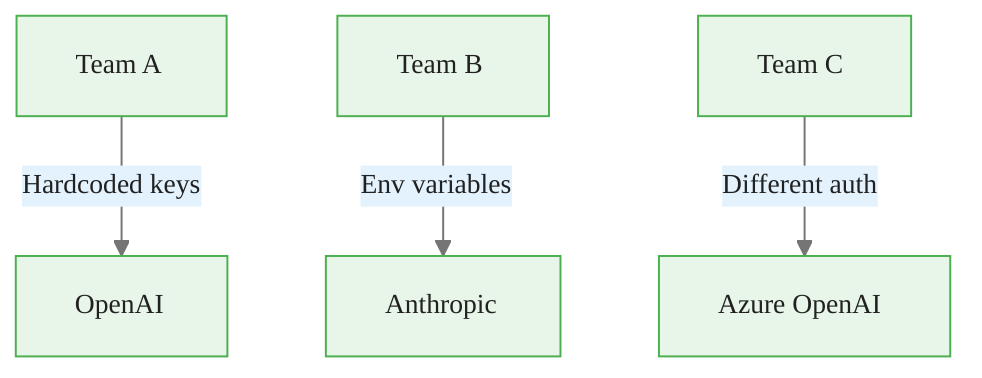
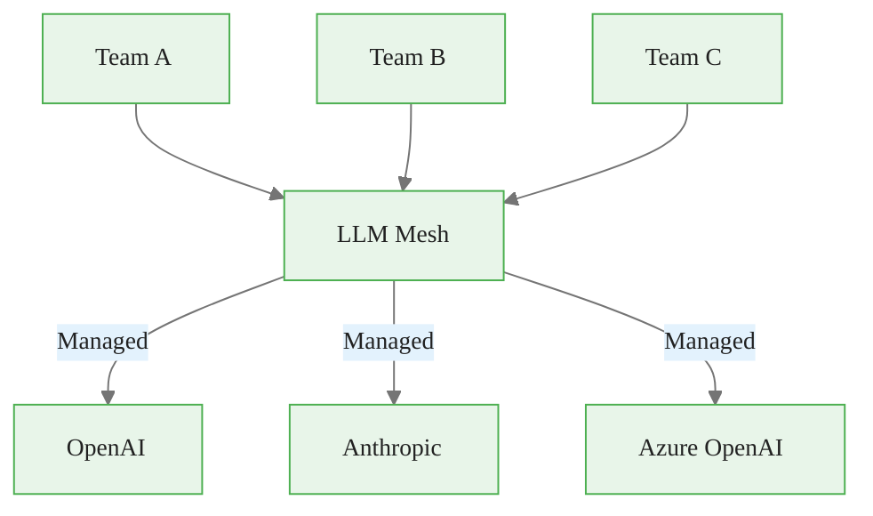
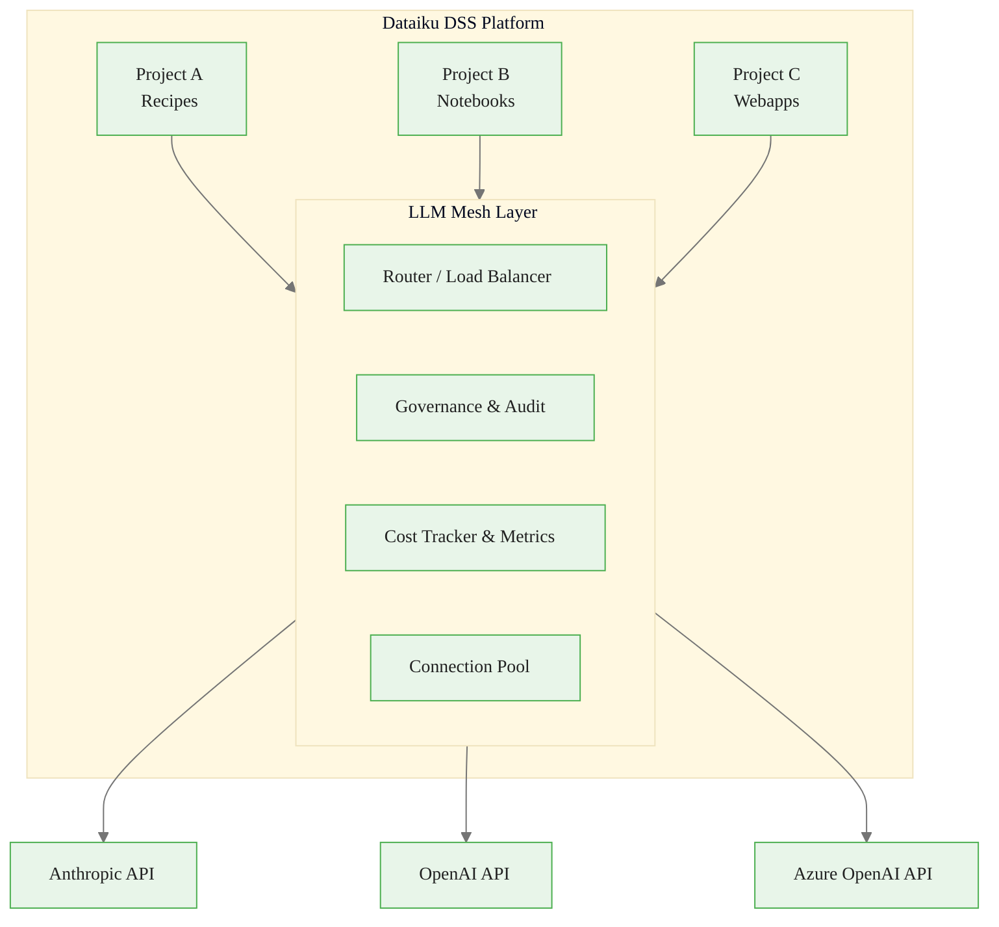
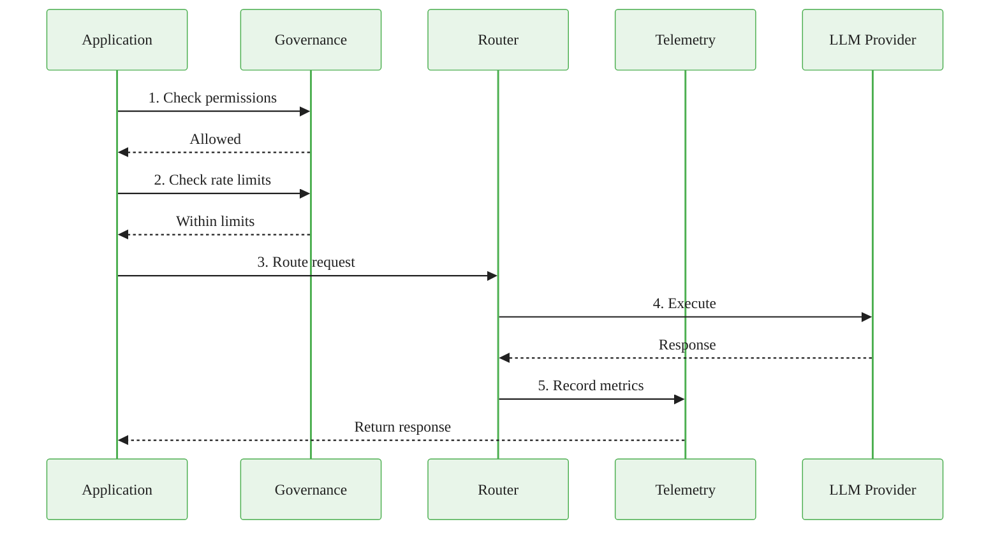
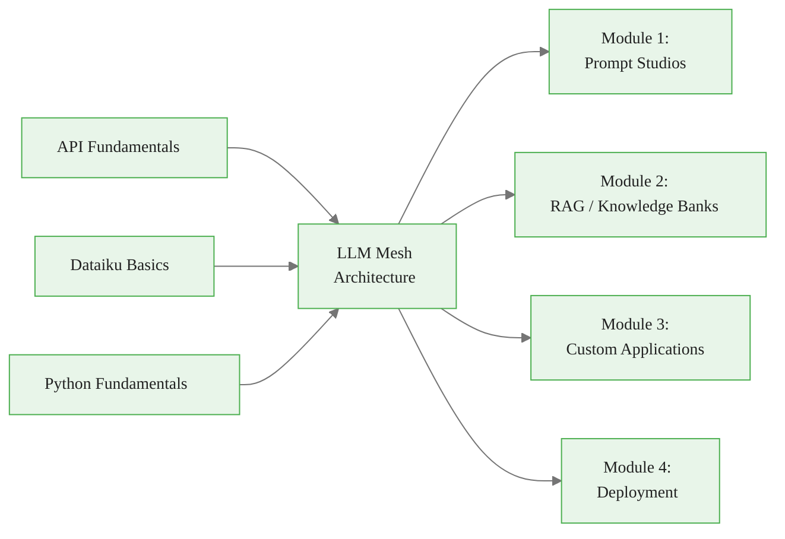

# LLM Mesh Architecture
## Module 0 — Dataiku GenAI Foundations

> A unified abstraction layer for enterprise LLM management

<!-- Speaker notes: Welcome to Module 0. This deck covers the LLM Mesh -- Dataiku's provider-agnostic orchestration layer. By the end, learners will understand the architecture, configure connections, and write their first LLM calls. Estimated time: 20 minutes. -->

---

<!-- _class: lead -->

# What is LLM Mesh?

<!-- Speaker notes: We start with the "why" -- what problem does LLM Mesh solve? Use the before/after diagrams to make it concrete. -->

---

## LLM Mesh in One Sentence

> LLM Mesh is a **provider-agnostic orchestration layer** that centralizes configuration, cost tracking, access control, and monitoring for all LLM interactions.

Think of it as an **air traffic control system** sitting between your applications and multiple LLM providers.

<!-- Speaker notes: The air traffic control analogy works well here -- one control tower managing many airlines (providers), routing flights (requests), and ensuring safety (governance). Ask learners: "How many different LLM providers does your team use today?" -->

<div class="callout-info">
Info: provider-agnostic orchestration layer
</div>

---

## The Problem Without LLM Mesh



- No visibility into total monthly LLM spend
- Switching providers requires code changes across dozens of projects
- No consistent error handling or retry logic

<!-- Speaker notes: Paint the pain picture. Most enterprises start here -- scattered API keys, no cost visibility, no governance. Ask: "Has anyone been surprised by an LLM bill?" -->

---

## The Solution With LLM Mesh



- All teams connect through **one interface**
- Usage tracked by team, project, and user
- Automatic failover if a provider is down

<!-- Speaker notes: This is the target state. Emphasize: "One interface, full visibility, automatic governance." The green box is the value -- everything flows through it. -->

---

<!-- _class: lead -->

# Architecture Overview

<!-- Speaker notes: Now we go deeper into what's inside that green box. -->

---

## Architecture Diagram



<!-- Speaker notes: Walk through each component: Router handles load balancing, Governance checks permissions and budgets, Cost Tracker logs usage, Connection Pool manages provider connections. All four work together on every request. -->

---

## Middleware Pattern

The architecture follows a **middleware pattern** -- every LLM call passes through the same governed pipeline:

1. Intercept all LLM requests
2. Apply governance policies (permissions, rate limits, budget)
3. Route to appropriate provider
4. Capture telemetry
5. Return responses

<!-- Speaker notes: The middleware pattern is the key architectural insight. Compare to web middleware (Express.js, Django) if the audience is familiar. -->

---

<!-- _class: lead -->

# Key Components

<!-- Speaker notes: Let's look at each component in more detail, starting with routing. -->

---

## Component: Router

<div class="columns">
<div>

**Routing Strategies:**

| Strategy | Use Case |
|----------|----------|
| `primary` | Default connection |
| `round_robin` | Distribute load |
| `least_latency` | Fastest provider |
| `cost_optimized` | Cheapest provider |

</div>
<div>

```python
class LLMMeshRouter:
    def route_request(
        self,
        request,
        strategy="primary"
    ):
        available = [
            c for c in self.connections
            if self.health_checker
                .is_healthy(c)
        ]
        if strategy == "primary":
            return available[0]
        elif strategy == "round_robin":
            return self.load_balancer
                .get_next(available)
```

</div>
</div>

<!-- Speaker notes: The router is the brain. Note that it only considers healthy connections -- unhealthy ones are automatically excluded. Ask: "Which routing strategy would you use for a batch processing job vs a user-facing chatbot?" -->

---

## Component: Governance Layer

```python
class GovernanceLayer:
    def check_permissions(self, user, connection, project):
        """Verify user has access to connection in project."""
        return self.access_control.has_permission(
            user=user, connection=connection,
            project=project, action="llm.generate"
        )

    def check_rate_limit(self, connection, user):
        """Check if request would exceed rate limits."""
        return self.rate_limiter.check(
            key=f"{connection}:{user}",
            limits={"rpm": 100, "tpm": 50000}
        )
```

<!-- Speaker notes: Three checks happen before any LLM call: permissions, rate limits, and budget. This is what makes LLM Mesh enterprise-grade. The checks are fast -- typically sub-millisecond. -->

---

## Request Flow



<!-- Speaker notes: This is the full request lifecycle. Walk through each step. Emphasize that governance happens BEFORE the request reaches the provider -- fail fast if not authorized. Telemetry happens AFTER -- don't slow down the response. -->

---

<!-- _class: lead -->

# Configuring Connections

<!-- Speaker notes: Now we move from architecture to hands-on configuration. This is where learners will spend most of their initial setup time. -->

---

## Anthropic Claude Setup

Navigate to **Administration > Connections > + New Connection > LLM**

```yaml
connection_name: anthropic-claude
provider: anthropic
api_key: ${ANTHROPIC_API_KEY}  # From secrets
default_model: claude-sonnet-4-20250514

# Rate limiting
max_requests_per_minute: 60
max_tokens_per_minute: 100000

# Timeout settings
timeout_seconds: 120
```

<!-- Speaker notes: This is the admin-level configuration. Note the secrets reference -- never hardcode API keys. The rate limits here are per-connection, not per-user. -->

<div class="callout-key">
Key Point: Administration > Connections > + New Connection > LLM
</div>

---

## OpenAI and Azure Setup

<div class="columns">
<div>

**OpenAI:**
```yaml
connection_name: openai-gpt4
provider: openai
api_key: ${OPENAI_API_KEY}
default_model: gpt-4o
organization_id: org-xxx

max_requests_per_minute: 100
max_tokens_per_minute: 150000
```

</div>
<div>

**Azure OpenAI:**
```yaml
connection_name: azure-openai
provider: azure_openai
api_key: ${AZURE_OPENAI_KEY}
endpoint: https://your-resource
    .openai.azure.com/
deployment_name: gpt-4-deployment
api_version: 2024-02-15-preview
```

</div>
</div>

> Azure requires **deployment names**, not model names.

<!-- Speaker notes: The Azure gotcha is the most common mistake. Emphasize: deployment_name != model name. If someone tries to pass "gpt-4" to Azure, it will fail silently or return unexpected results. -->

---

<!-- _class: lead -->

# Using LLM Mesh in Python

<!-- Speaker notes: Time for code. We'll go from simple to advanced. -->

---

## Simple Completion

```python
import dataiku
from dataiku.llm import LLM

# Simple usage - all governance automatic
llm = LLM("claude-production")

response = llm.complete(
    prompt="Analyze this commodity report: ...",
    max_tokens=500
)

print(response.text)
print(f"Tokens used: {response.usage.total_tokens}")
print(f"Cost: ${response.estimated_cost:.4f}")
```

> The LLM Mesh automatically: verified permissions, checked rate limits, validated budget, routed to healthy connection, logged the interaction.

<!-- Speaker notes: This is the "hello world" of LLM Mesh. One line to get a handle, one line to call. All six middleware steps happen transparently. Point out that cost is automatically tracked. -->

---

## Chat Interface

```python
# Pseudocode — multi-turn pattern (verify against your Dataiku version)
import dataiku

client = dataiku.api_client()
project = client.get_default_project()
llm = project.get_llm("anthropic-claude")

# Build a multi-turn conversation via completion API
completion = llm.new_completion()
completion.with_message("You are a commodity market analyst.", role="system")
completion.with_message("What drove oil prices this week?", role="user")
response = completion.execute()
print(response.text)
```

<!-- Speaker notes: Multi-turn conversations are built by appending messages to completion requests. The exact API depends on your Dataiku version. Check your instance's documentation for the current LLM completion interface. -->

---

## Automatic Failover

```python
class LLMRouter:
    """Route requests with failover."""
    def __init__(self, primary, fallback):
        self.primary = LLM(primary)
        self.fallback = LLM(fallback)

    def complete(self, prompt, **kwargs):
        try:
            return self.primary.complete(
                prompt, **kwargs
            ).text
        except Exception as e:
            print(f"Primary failed: {e}")
            return self.fallback.complete(
                prompt, **kwargs
            ).text

router = LLMRouter("anthropic-claude", "openai-gpt4")
```

<!-- Speaker notes: This is a simple two-connection failover. In production, you'd chain more connections. The key insight: because LLM Mesh abstracts providers, the failover code is provider-agnostic. -->

<div class="callout-insight">
Insight: kwargs):
        try:
            return self.primary.complete(
                prompt, 
</div>

---

<!-- _class: lead -->

# Common Pitfalls

<!-- Speaker notes: Let's cover the mistakes we see most often. These come from real enterprise deployments. -->

---

## Pitfall 1: Hardcoding Connection Names

<div class="columns">
<div>

**Bad:**
```python
# Hardcoded connection
llm = LLM("claude-production")
```

</div>
<div>

**Good:**
```python
# Use project variables
project = dataiku.api_client()\
    .get_project(
        dataiku.default_project_key()
    )
connection = project.get_variable(
    "llm_connection",
    "claude-production"
)
llm = LLM(connection)
```

</div>
</div>

<!-- Speaker notes: Hardcoded names break when moving between environments (dev/staging/prod). Project variables let admins change the connection without touching code. -->

<div class="callout-warning">
Warning: 
```python
# Hardcoded connection
llm = LLM("claude-production")
```

</div>
<div>

</div>

---

## Pitfall 2: Ignoring Rate Limits

<div class="columns">
<div>

**Bad:**
```python
for text in large_dataset:
    response = llm.complete(text)
```

</div>
<div>

**Good:**
```python
def process_with_backoff(text, llm):
    for attempt in range(3):
        try:
            return llm.complete(text)
        except RateLimitError:
            time.sleep(2 ** attempt)

with ThreadPoolExecutor(5) as ex:
    results = ex.map(
        lambda t: process_with_backoff(
            t, llm
        ), large_dataset
    )
```

</div>
</div>

<!-- Speaker notes: Batch processing without backoff will hit rate limits fast. Exponential backoff + bounded concurrency is the production pattern. We'll cover this more in Module 3. -->

---

## Pitfall 3: Not Monitoring Costs

```python
# Pseudocode — CostTracker is not a real Dataiku import.
# Cost monitoring is built into the LLM Mesh admin console.
# Custom budget enforcement pattern:

class CostTracker:
    """User-defined tracker — not a Dataiku built-in."""
    def __init__(self, daily_budget=100.0):
        self.daily_total = 0.0
        self.daily_budget = daily_budget

tracker = CostTracker(daily_budget=50.0)

for row in df.iterrows():
    if tracker.daily_total > tracker.daily_budget:
        logger.warning("Approaching daily budget, stopping")
        break
    response = llm.complete(row['long_text'])
    tracker.daily_total += response.estimated_cost
```

> Always estimate before calling and track cumulative costs.

<!-- Speaker notes: This pattern prevents runaway costs on large datasets. The estimate_cost call is cheap (local calculation). The record call logs to telemetry. Module 4 covers this in more detail. -->

---

## How LLM Mesh Connects to Other Topics



<!-- Speaker notes: LLM Mesh is the foundation for everything that follows. Every module builds on the patterns we've covered here. -->

---

## Key Takeaways

1. LLM Mesh provides a **unified, governed interface** to multiple LLM providers
2. The **middleware pattern** intercepts, governs, routes, and logs every request
3. **Configure once** at the admin level, use across all projects
4. **Azure requires deployment names** not model names -- the most common gotcha
5. **Failover routing** improves reliability across providers
6. **Cost tracking** is built-in -- always estimate before calling

> Configure once at the platform level. Use everywhere in your projects.

<!-- Speaker notes: Recap the six key points. The most important takeaway: LLM Mesh makes LLM usage an infrastructure concern, not a per-project concern. Next up: provider setup deep-dive and governance. -->
