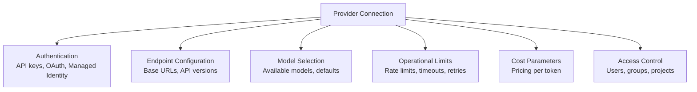
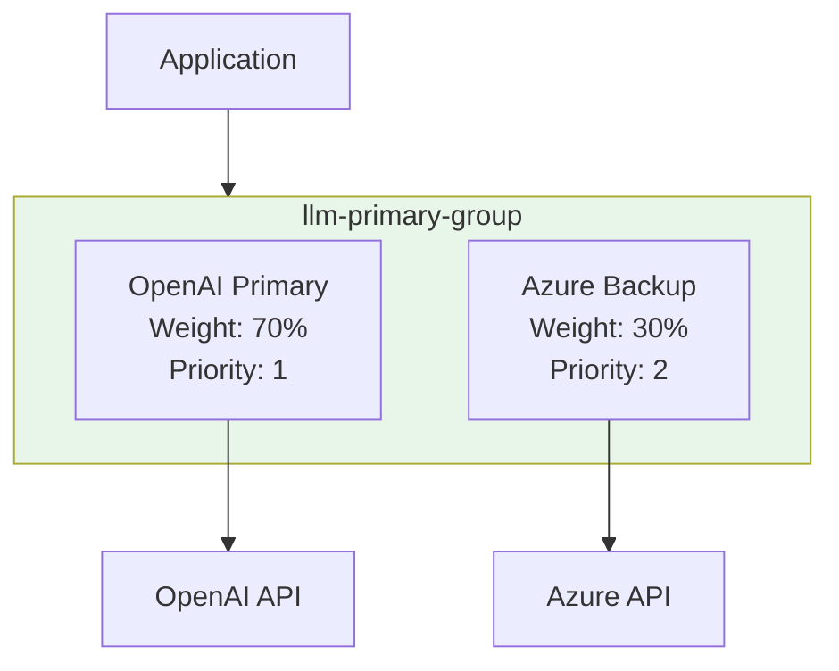
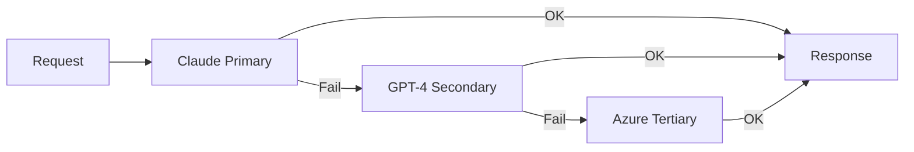
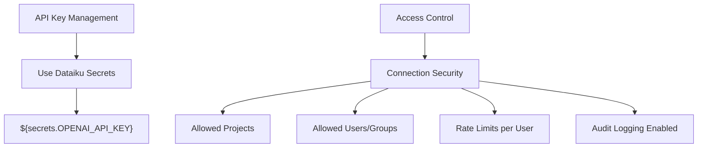

# Configuring LLM Connections
## Module 0 — Dataiku GenAI Foundations

> Configure once, use everywhere

<!-- Speaker notes: This deck covers provider-specific connection setup, testing, failover, and load balancing. Prerequisite: the architecture deck (01). Estimated time: 18 minutes. -->

---

<!-- _class: lead -->

# Provider Abstraction

<!-- Speaker notes: Start with the "why" of abstraction before diving into provider-specific configs. -->

---

## The Phone System Analogy

Think of provider setup like configuring a company's **phone system**:

| Phone System | LLM Mesh |
|-------------|----------|
| Negotiate carrier contracts | Configure provider APIs |
| Set up extensions | Create connections |
| Define international call access | Access control per group |
| Monitor bills by department | Cost tracking per project |
| Auto-route if carrier is down | Failover between providers |

> Employees just pick up the phone. They don't care which carrier routes the call.

<!-- Speaker notes: This analogy is very effective. The key insight: developers just call LLM("connection-name") -- they don't manage keys, retries, or routing. All of that is "infrastructure managed by the platform." -->

---

## What a Provider Connection Encapsulates



<!-- Speaker notes: Six concerns, all in one configuration. Without LLM Mesh, each project would need to manage all six independently. -->

---

<!-- _class: lead -->

# Provider-Specific Configuration

<!-- Speaker notes: Now we walk through each major provider. The key differences are in authentication and model naming. -->

---

## Anthropic Claude Setup

```python
connection_config = {
    "name": "claude-production",
    "type": "anthropic",
    "auth": {
        "api_key": "${secrets.ANTHROPIC_API_KEY}",
    },
    "models": {
        "default": "claude-sonnet-4-20250514",
        "available": [
            "claude-sonnet-4-20250514",
```

<!-- Speaker notes: Code continues on the next slide. -->

---

## (continued)

```python
            "claude-3-haiku-20240307"
        ]
    },
    "limits": {
        "max_requests_per_minute": 60,
        "max_tokens_per_minute": 100000,
        "timeout_seconds": 120,
        "max_retries": 3
    }
}
```

<!-- Speaker notes: Note the secrets reference -- never put raw API keys in configuration. The limits section prevents runaway usage. -->

---

## OpenAI Setup

```python
connection_config = {
    "name": "openai-gpt4",
    "type": "openai",
    "auth": {
        "api_key": "${secrets.OPENAI_API_KEY}",
        "organization_id": "org-xxxxxxxx",
    },
    "models": {
        "default": "gpt-4o",
        "available": [
```

<!-- Speaker notes: Code continues on the next slide. -->

---

## (continued)

```python
            "gpt-4o",
            "gpt-4-turbo-preview",
            "gpt-3.5-turbo"
        ]
    },
    "limits": {
        "max_requests_per_minute": 100,
        "max_tokens_per_minute": 150000,
        "timeout_seconds": 60
    }
}
```

<!-- Speaker notes: OpenAI requires an organization_id if you belong to multiple orgs. The higher rate limits reflect OpenAI's typical tier-2+ allowances. -->

---

## Azure OpenAI Setup

```python
connection_config = {
    "name": "azure-openai-prod",
    "type": "azure_openai",
    "auth": {
        "api_key": "${secrets.AZURE_OPENAI_KEY}",
        "use_managed_identity": True,
        "tenant_id": "xxxxxxxx-xxxx"
    },
```

<!-- Speaker notes: Code continues on the next slide. -->

---

## (continued)

```python
    "endpoint": {
        "resource_name": "your-resource-name",
        "deployment_name": "gpt-4-deployment",
        "api_base": "https://your-resource"
                    ".openai.azure.com/",
        "api_version": "2024-02-15-preview"
    }
}
```

> In Azure, model = **deployment name**, not model name. This is the #1 gotcha.

<!-- Speaker notes: Repeat the Azure gotcha from the architecture deck. It's worth saying twice because it catches everyone. Managed identity is preferred over API keys for Azure deployments. -->

---

<!-- _class: lead -->

# Connection Testing

<!-- Speaker notes: Never deploy a connection without testing it first. -->

---

## Health Check

```python
def test_llm_connection(connection_name):
    """Test LLM connection health."""
    try:
        llm = LLM(connection_name)
        response = llm.complete(
            prompt="Say 'connection successful'",
            max_tokens=10
        )
        if "successful" in response.text.lower():
            return {"status": "healthy"}
```

<!-- Speaker notes: Code continues on the next slide. -->

---

## (continued)

```python
        else:
            return {"status": "unexpected_response"}
    except Exception as e:
        return {"status": "error", "error": str(e)}

# Test all connections before deploying
for conn in ["claude-production", "openai-gpt4"]:
    result = test_llm_connection(conn)
    print(f"{conn}: {result['status']}")
```

<!-- Speaker notes: Run this after any configuration change. A simple "say X" prompt is the cheapest possible health check. Consider automating this as a scheduled scenario. -->

---

## Latency Benchmarking

```python
def benchmark_connection(name, n_requests=10):
    """Benchmark LLM connection performance."""
    llm = LLM(name)
    latencies = []

```

<!-- Speaker notes: Code continues on the next slide. -->

---

## (continued)

```python
    for i in range(n_requests):
        start = time.time()
        try:
            llm.complete(
                prompt=f"Count to 5. Request {i+1}.",
                max_tokens=50
            )
            latencies.append(
                (time.time() - start) * 1000
            )
        except:
            pass
        time.sleep(0.5)  # Respect rate limits

    return {
        "mean_ms": np.mean(latencies),
        "p95_ms": np.percentile(latencies, 95)
    }
```

<!-- Speaker notes: Run benchmarks during off-peak hours. The p95 matters more than mean for user-facing applications. Compare providers to inform your routing strategy. -->

---

<!-- _class: lead -->

# Load Balancing & Failover

<!-- Speaker notes: Now we combine multiple connections for reliability and performance. -->

---

## Load Balancing Architecture



<!-- Speaker notes: Connection groups let you split traffic between providers. Weights control the distribution under normal conditions. Priority determines failover order. -->

---

## Multi-Connection Fallback

```python
def generate_with_fallback(prompt, **kwargs):
    connections = [
        "claude-production",
        "openai-gpt4",
        "azure-openai-prod"
    ]
    for conn_name in connections:
        try:
            llm = LLM(conn_name)
            return llm.complete(prompt, **kwargs)
        except Exception as e:
            print(f"{conn_name} failed: {e}")
            continue
    raise Exception("All connections failed")
```



<!-- Speaker notes: This is the simplest failover pattern. For production, add exponential backoff between retries. The sequence matters -- put your preferred (fastest/cheapest) provider first. -->

---

<!-- _class: lead -->

# Common Pitfalls

<!-- Speaker notes: These come from real enterprise deployments. Each one has bitten a team at least once. -->

---

## Pitfall 1: Hardcoding API Keys

<div class="columns">
<div>

**Never do this:**
```python
import anthropic
client = anthropic.Anthropic(
    api_key="sk-ant-api03-..."
)
```

</div>
<div>

**Use Dataiku connections:**
```python
from dataiku.llm import LLM
llm = LLM("claude-production")
# API key in secure storage
```

</div>
</div>

<!-- Speaker notes: This seems obvious but happens constantly. Keys in code end up in git history, logs, and error messages. LLM Mesh eliminates this entirely. -->

---

## Pitfall 2: Azure Deployment vs Model Names

<div class="columns">
<div>

**Wrong:**
```python
llm = LLM("azure-openai-prod")
response = llm.complete(
    prompt="...",
    model="gpt-4-turbo-preview"
    # This is a model name!
)
```

</div>
<div>

**Correct:**
```python
llm = LLM("azure-openai-prod")
response = llm.complete(
    prompt="...",
    model="gpt-4-deployment"
    # Use deployment name
)
```

</div>
</div>

<!-- Speaker notes: Third time we've mentioned this -- it's that important. The error message from Azure is often unhelpful ("Resource not found"), making this hard to debug. -->

---

## Pitfall 3: Mixed Provider Assumptions

```python
# Check provider before using provider-specific features
def get_provider_type(connection_name):
    client = dataiku.api_client()
    conn = client.get_connection(connection_name)
    return conn.type

provider = get_provider_type("openai-gpt4")

```

<!-- Speaker notes: Code continues on the next slide. -->

---

## (continued)

```python
if provider == "anthropic":
    response = llm.complete(
        prompt, metadata={"user_id": "user123"}
    )
elif provider == "openai":
    response = llm.complete(
        prompt, user="user123"  # OpenAI format
    )
```

> Different providers have different parameter names for the same feature.

<!-- Speaker notes: This is why the abstraction layer matters. Ideally, use only the common parameters that work across providers. Provider-specific features should be isolated behind a conditional. -->

---

## Security Best Practices



> **Never hardcode API keys.** Always use Dataiku's secrets management.

<!-- Speaker notes: Security summary slide. Secrets management, fine-grained access control, and audit logging are the three pillars. Module 4 covers governance in more depth. -->

---

## Key Takeaways

1. **Provider connections** encapsulate auth, models, limits, pricing, and access
2. **Configure once** at the admin level, use across all projects
3. **Azure requires deployment names** -- the most common configuration mistake
4. **Test connections** before production with health checks and benchmarks
5. **Failover chains** provide resilience across multiple providers
6. **Never hardcode API keys** -- use Dataiku secrets management

> Like a phone system: employees just pick up the phone. The infrastructure handles routing.

<!-- Speaker notes: Recap. The phone system analogy ties back to the opening. Next up: governance -- who can use what, and how much. -->
