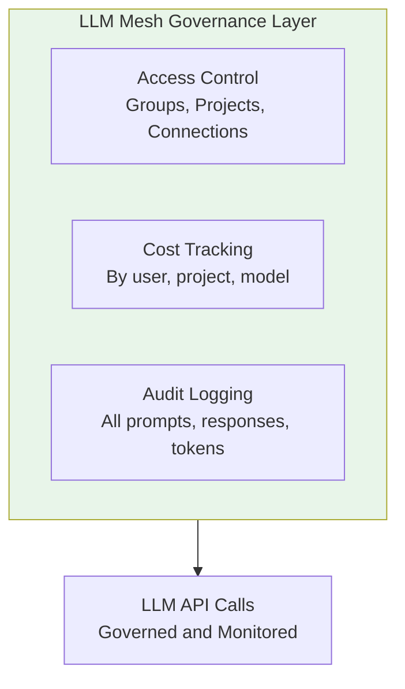
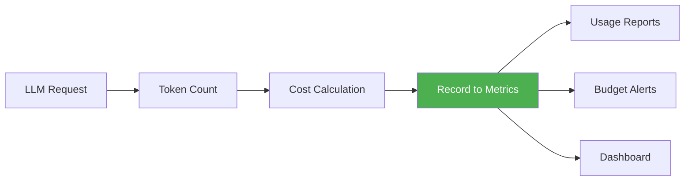
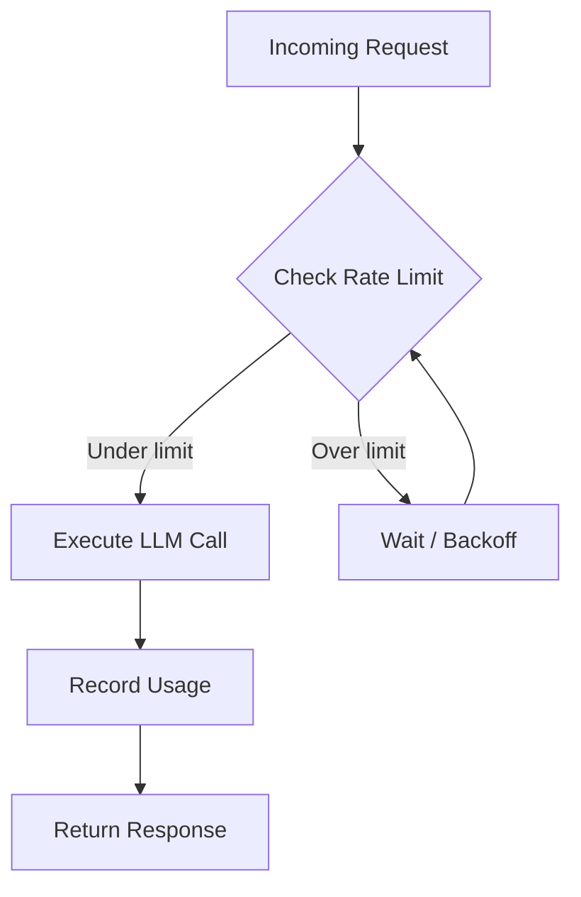

# Governance and Access Control in LLM Mesh
## Module 0 — Dataiku GenAI Foundations

> Balance innovation with control

<!-- Speaker notes: This deck covers governance -- access control, cost tracking, audit logging, and rate limiting. These are the guardrails that make enterprise LLM adoption safe. Estimated time: 18 minutes. -->

---

<!-- _class: lead -->

# Why Governance?

<!-- Speaker notes: Start with the business case. Without governance, LLM adoption stalls due to security, cost, and compliance concerns. -->

---

## Key Insight

> Enterprise Gen AI requires a governance layer that balances **innovation** with **control**. LLM Mesh provides this through connection-level access control, project-based quotas, and comprehensive audit trails -- without requiring changes to application code.

<!-- Speaker notes: The key phrase is "without requiring changes to application code." Governance is transparent to developers -- they just call LLM("connection"). All the checks happen automatically. -->

---

## The Corporate Credit Card Analogy

| Credit Card System | LLM Mesh Governance |
|-------------------|---------------------|
| Employee has access to cards | User has access to connections |
| Spending limits per card | Token/cost quotas |
| All transactions logged | All API calls logged |
| Finance monitors spending | Admins monitor usage |
| Budgets by department | Budgets by project |

<!-- Speaker notes: The credit card analogy works well because every enterprise has this system. The key insight: you don't block spending, you control and monitor it. Same with LLM usage. -->

---

## Governance Components



<!-- Speaker notes: Three pillars: who can use what (access control), how much it costs (cost tracking), and what happened (audit logging). We'll cover each in detail. -->

---

<!-- _class: lead -->

# Access Control

<!-- Speaker notes: Access control is the first line of defense. It determines who can use which LLM connections and how much. -->

---

## Setting Up Access Control

```python
def configure_connection_access(
    connection_name, allowed_groups, daily_token_limit=None
):
    connection = client.get_connection(connection_name)
    connection.set_permission(
        groups=allowed_groups,
        permissions=['READ', 'USE']
    )
    if daily_token_limit:
        connection.set_rate_limit(
            type='daily_tokens',
            limit=daily_token_limit, scope='user'
        )
    return {'connection': connection_name,
            'allowed_groups': allowed_groups}
```

<!-- Speaker notes: This is admin-level code. Note: permissions are set per group, not per user. Rate limits are per-user within that group. This prevents one user from consuming the entire team's quota. -->

---

## Project-Level Quotas

```python
def set_project_llm_quota(
    project_key, monthly_budget_usd, alert_threshold=0.8
):
    project = client.get_project(project_key)
    project.set_llm_quota(
        monthly_budget=monthly_budget_usd,
        alert_at=alert_threshold,
        hard_limit=True  # Stop when quota exceeded
    )
    project.add_quota_alert(
        recipients=['project-admins@company.com'],
        when='threshold_reached'
    )
```

<!-- Speaker notes: Project quotas complement connection-level limits. The alert_threshold triggers a notification before the hard limit is hit. Set hard_limit=True for production to prevent runaway costs. -->

---

<!-- _class: lead -->

# Cost Tracking

<!-- Speaker notes: Cost visibility is what makes governance practical. Without it, you're flying blind. -->

---

## Usage Report Generation

```python
def get_llm_usage_report(project_key=None, group_by='user'):
    usage_logs = client.get_llm_usage_logs(
        project=project_key,
        start_date=start_date, end_date=end_date
    )
    df = pd.DataFrame(usage_logs)

    model_costs = {
        'claude-sonnet-4': {'input': 3.0, 'output': 15.0},
        'gpt-4o': {'input': 2.5, 'output': 10.0}
    }
```

> Note: Model pricing changes frequently. Always verify current rates.

<!-- Speaker notes: First half of the usage report function -- loads logs and defines cost lookup. The pricing note is important: hardcoded prices will go stale. Consider fetching from a config dataset instead. -->

---

## Usage Report: Cost Calculation

```python
    def calculate_cost(row):
        costs = model_costs.get(
            row['model'], {'input': 0, 'output': 0}
        )
        return (
            row['input_tokens'] / 1_000_000 * costs['input'] +
            row['output_tokens'] / 1_000_000 * costs['output']
        )

    df['cost_usd'] = df.apply(calculate_cost, axis=1)

    return df.groupby(group_by).agg({
        'request_id': 'count', 'cost_usd': 'sum'
    }).sort_values('cost_usd', ascending=False)
```

<!-- Speaker notes: The groupby enables reports by user, project, model, or connection. The sort by cost descending puts the biggest spenders first -- useful for optimization. -->

---

## Cost Visibility Flow



<!-- Speaker notes: Every request flows through this pipeline. The recording happens asynchronously so it doesn't add latency. Reports, alerts, and dashboards all read from the same metrics store. -->

---

<!-- _class: lead -->

# Audit Logging

<!-- Speaker notes: Audit logging is the compliance cornerstone. Every LLM interaction is recorded for regulatory and debugging purposes. -->

---

## Querying Audit Logs

```python
def query_audit_logs(connection_name=None,
                     user=None, include_prompts=False):
    logs = client.get_llm_audit_logs(
        connection=connection_name, user=user,
        start_date=start_date, end_date=end_date,
        include_content=include_prompts
    )
    formatted = []
    for log in logs:
```

<!-- Speaker notes: Code continues on the next slide. -->

---

## (continued)

```python
        entry = {
            'timestamp': log['timestamp'],
            'user': log['user'],
            'project': log['project'],
            'tokens': log['input_tokens'] + log['output_tokens'],
            'status': log['status']
        }
        formatted.append(entry)
    return formatted
```

<!-- Speaker notes: The include_prompts flag controls whether the actual prompt text is included. For compliance, you may need it; for routine monitoring, skip it to reduce data volume. Note: prompt content may contain PII -- handle with care. -->

---

## What Gets Logged

| Field | Description |
|-------|-------------|
| `timestamp` | When the request occurred |
| `user` | Who made the request |
| `project` | Which project context |
| `connection` | Which LLM connection |
| `model` | Which model was used |
| `input_tokens` | Tokens in the prompt |
| `output_tokens` | Tokens in the response |
| `latency_ms` | Response time |
| `status` | Success or error |
| `prompt_preview` | First 200 chars (optional) |

<!-- Speaker notes: This is the full audit record. The prompt_preview is opt-in due to privacy concerns. For regulated industries, you may need full prompt/response logging with encrypted storage. -->

---

<!-- _class: lead -->

# Rate Limiting

<!-- Speaker notes: Rate limiting protects both the platform and the LLM provider from abuse. -->

---

## Client-Side Rate Limiter

```python
class RateLimitedLLM:
    def __init__(self, connection_name,
                 max_rpm=10, max_tpm=50_000):
        self.llm = LLM(connection_name)
        self.max_rpm = max_rpm
        self.max_tpm = max_tpm
        self.request_times = []
        self.token_usage = []
```

<!-- Speaker notes: Code continues on the next slide. -->

---

## (continued)

```python
    def _check_rate_limit(self, estimated_tokens):
        now = time.time()
        cutoff = now - 60
        self.request_times = [
            t for t in self.request_times if t > cutoff
        ]
        if len(self.request_times) >= self.max_rpm:
            raise RuntimeError("Rate limit exceeded")
```

<!-- Speaker notes: First half of the rate limiter -- tracks requests and tokens in a sliding 60-second window. The deque-based approach is memory efficient. This is client-side protection on top of server-side limits. -->

---

## Rate Limiter: Token Tracking

```python
    def complete(self, prompt, estimated_tokens=1000,
                 **kwargs):
        self._check_rate_limit(estimated_tokens)
        response = self.llm.complete(prompt, **kwargs)
        self.request_times.append(time.time())
        self.token_usage.append(
            (time.time(), response.usage.total_tokens)
        )
        return response.text
```



<!-- Speaker notes: The complete() method wraps the LLM call with rate limit checks. In production, add a sleep-and-retry loop instead of raising immediately. The estimated_tokens parameter helps predict whether the request will exceed the token limit. -->

---

<!-- _class: lead -->

# Common Pitfalls

<!-- Speaker notes: Five real-world governance mistakes and how to avoid them. -->

---

## Five Governance Pitfalls

| Pitfall | Impact | Fix |
|---------|--------|-----|
| **No alerts on quotas** | Discover overages after the fact | Alert at 75-80% threshold |
| **Overly restrictive** | Stifles innovation | Start permissive, tighten later |
| **Ignoring audit logs** | Miss optimization opportunities | Regular log reviews |
| **Same quota all models** | Budget mismatch | Set quotas based on model cost mix |
| **Forgetting compliance** | Regulatory risk | Configure retention policies |

<!-- Speaker notes: The second pitfall is counterintuitive -- governance should enable, not block. Start with soft limits and monitoring, then tighten based on actual usage patterns. -->

---

## Key Takeaways

1. **Access control** uses groups, projects, and connections for fine-grained permissions
2. **Cost tracking** with usage reports enables budget management and chargeback
3. **Audit logging** provides complete history for compliance and debugging
4. **Rate limiting** prevents abuse while maintaining user experience
5. **Alerts and quotas** catch problems before they become costly

> Governance enables innovation by providing guardrails, not roadblocks.

<!-- Speaker notes: Recap the five pillars. The quote at the end is the key message: governance is an enabler, not a blocker. Next up: Module 1 -- Prompt Studios. -->
