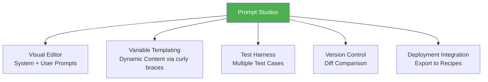
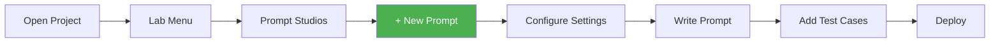
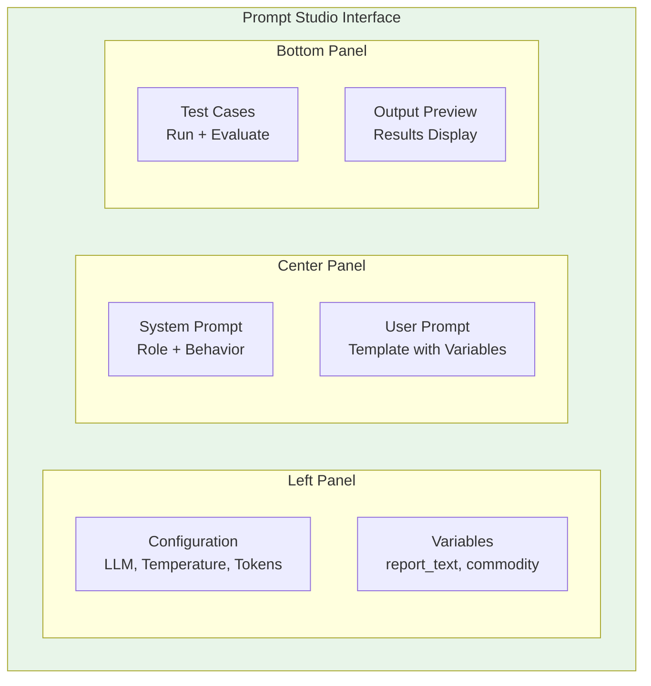
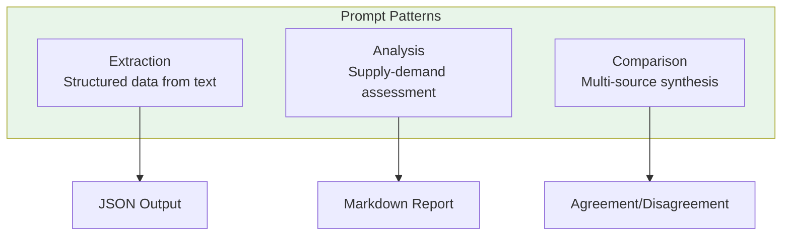
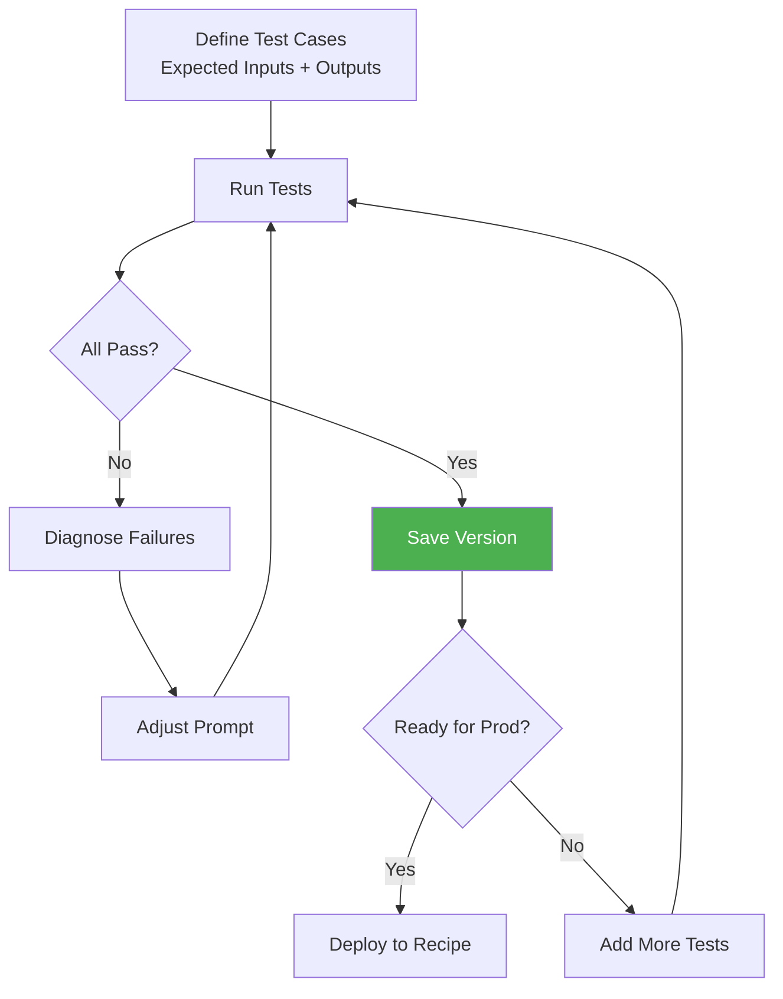
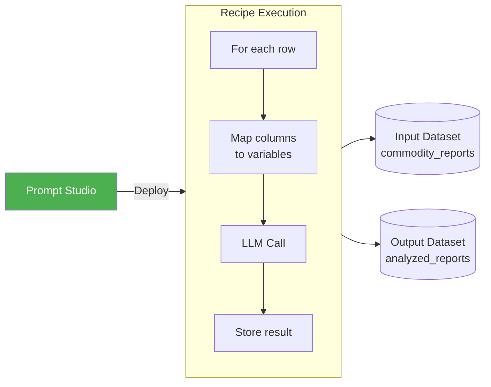

# Dataiku Prompt Studios
## Module 1 — Dataiku GenAI Foundations

> Design, test, and deploy prompts without writing code

<!-- Speaker notes: This deck introduces Prompt Studios -- Dataiku's visual prompt development environment. By the end, learners will know how to create prompts, add test cases, use prompt patterns, and deploy to recipes. Estimated time: 18 minutes. -->

---

<!-- _class: lead -->

# What is Prompt Studios?

<!-- Speaker notes: Start with the analogy, then show the interface layout. -->

---

## The IDE Analogy

| Code IDE | Prompt Studios |
|----------|---------------|
| Syntax highlighting | Variable highlighting |
| Unit test runner | Test case runner |
| Git version control | Built-in versioning |
| Build & deploy | Export to recipe |
| Debug console | Output preview |

> Just as you wouldn't write complex code in a plain text editor, you shouldn't develop production prompts in a notebook cell.

<!-- Speaker notes: This analogy resonates with developer audiences. Prompt Studios brings the same rigor to prompt engineering that IDEs brought to software engineering. Ask: "How do you currently iterate on prompts?" -->

---

## Prompt Studios Components



<!-- Speaker notes: Five pillars. Each one maps to a stage of the prompt development lifecycle. We'll cover all five in this deck. -->

---

## Getting Started

1. Open your Dataiku project
2. Navigate to **Lab** > **Prompt Studios**
3. Click **+ New Prompt**



<!-- Speaker notes: Walk through the UI navigation. Three clicks to get started. The interface has three panels: settings (left), editor (center), and test output (bottom). -->

---

## Interface Layout



<!-- Speaker notes: Left panel sets model parameters and defines variables. Center is where you write prompts. Bottom is for testing and output review. Spend most of your time in center + bottom. -->

---

<!-- _class: lead -->

# Creating Effective Prompts

<!-- Speaker notes: Now we get hands-on with prompt creation, starting with variables. -->

---

## System vs User Messages

<div class="columns">
<div>

**System Message** (sets behavior):
```
You are a senior commodity analyst
at a major trading firm.
You analyze market data with precision
and objectivity.
Always cite specific numbers from
the data provided.
```

</div>
<div>

**User Message** (task-specific):
```
Analyze this week's EIA report:
{{report_text}}

Provide:
- Key inventory changes
- Comparison to expectations
- Trading implications
```

</div>
</div>

> Variables are the key to making prompts **reusable** across different inputs.

<!-- Speaker notes: System message stays constant across all calls. User message changes per input via variables. This separation is crucial for consistency. -->

---

<!-- _class: lead -->

# Prompt Patterns for Commodities

<!-- Speaker notes: Three proven patterns for commodity analysis. Each solves a different class of problem. -->

---

## Extraction Pattern

```
TASK: Extract structured data from commodity reports.

INPUT:
{{report_text}}

EXTRACT THE FOLLOWING (use null if not found):
- Inventory level (number, unit)
- Week-over-week change (number, unit)
- Year-over-year change (percentage)
- Comparison to 5-year average (percentage)

OUTPUT FORMAT: JSON only, no explanation.
```

<!-- Speaker notes: Extraction is the most common pattern. The "JSON only, no explanation" instruction is critical -- without it, the model will add narrative text that breaks JSON parsing. -->

---

## Pattern Comparison

| Pattern | Use Case | Output |
|---------|----------|--------|
| **Extraction** | Pull numbers from reports | JSON with fields |
| **Analysis** | Assess market fundamentals | Structured markdown |
| **Comparison** | Compare multiple sources | Synthesis with citations |



<!-- Speaker notes: Choose your pattern based on the output type you need. Extraction for pipelines (JSON), Analysis for reports (markdown), Comparison for multi-source intelligence. -->

---

## Analysis Pattern

```
CONTEXT: You are analyzing {{commodity}} fundamentals.

DATA:
{{supply_data}}
{{demand_data}}

ANALYSIS FRAMEWORK:
1. Supply assessment (production, imports, inventory)
2. Demand assessment (consumption, seasonal factors)
3. Balance calculation (surplus or deficit)
4. Price implication (bullish, bearish, neutral)

Provide analysis in structured format.
```

<!-- Speaker notes: The framework approach forces the model to be systematic. Without it, analysis tends to be shallow or inconsistent between runs. -->

---

<!-- _class: lead -->

# Testing Prompts

<!-- Speaker notes: Testing is what separates ad-hoc prompting from prompt engineering. -->

---

## Creating Test Cases

```yaml
test_name: "EIA Weekly Report - Bullish Draw"
variables:
  report_text: |
    U.S. commercial crude oil inventories decreased
    by 5.2 million barrels from the previous week.
    At 430.0 million barrels, inventories are about
    3% below the five year average.
  commodity: "crude_oil"

expected:
  contains:
    - "-5.2"
    - "million barrels"
    - "below"
  sentiment: "bullish"
```

> Every prompt should have at least **3-5 test cases** covering typical scenarios.

<!-- Speaker notes: Test cases are the quality gate. Without them, you're guessing whether a prompt change helped or hurt. Include edge cases: empty reports, unusual formats, bearish/neutral/bullish examples. -->

---

## Automated Evaluation

```python
def evaluate_prompt_output(output, test_case):
    results = {'passed': True, 'checks': []}

    for required in test_case.get(
        'expected', {}
    ).get('contains', []):
        present = required.lower() in output.lower()
        results['checks'].append({
            'type': 'contains',
            'value': required,
            'passed': present
        })
        if not present:
            results['passed'] = False

    return results
```

<!-- Speaker notes: This is a simple evaluator. For production, add JSON validity checks, sentiment classification, and response length constraints. The key is automating the checks so you can run them on every prompt change. -->

---

## Test-Driven Prompt Development



<!-- Speaker notes: Write tests first, then iterate the prompt until tests pass. This is TDD for prompts. The loop is fast because Prompt Studios provides immediate feedback. -->

---

<!-- _class: lead -->

# Version Control

<!-- Speaker notes: Prompt versioning prevents "I changed something and now it's worse" disasters. -->

---

## Tracking Prompt Evolution

```
Version History:
+-- v1.0 - Initial prompt
+-- v1.1 - Added JSON output format
+-- v1.2 - Improved extraction accuracy
+-- v2.0 - Added comparison to expectations
```

| Version | Score | Tokens | Cost |
|---------|-------|--------|------|
| v1.0 | 0.72 | 1,245 | $0.0062 |
| v1.1 | 0.89 | 1,102 | $0.0055 |
| **Change** | **+23%** | **-11%** | **-11%** |

<!-- Speaker notes: Every version is a snapshot. Compare versions on score (test pass rate), tokens (cost proxy), and output quality. Note that v1.1 is both better AND cheaper -- this is common when prompts become more focused. -->

---

<!-- _class: lead -->

# Deploying Prompts

<!-- Speaker notes: The final step: moving a tested prompt into production. -->

---

## From Prompt Studio to Recipe

<div class="columns">
<div>

**Python Recipe:**
```python
# Auto-generated from Prompt Studio
llm = LLM("anthropic-claude")

for _, row in df.iterrows():
    prompt = TEMPLATE.replace(
        "{{report_text}}",
        row['report_text']
    )
    response = llm.complete(
        prompt, max_tokens=500
    )
    results.append({
        'id': row['id'],
        'analysis': response.text
    })
```

</div>
<div>

**LLM Recipe (Visual):**
1. Create new **LLM Recipe**
2. Select input dataset
3. Choose Prompt Studio prompt
4. Map columns to variables
5. Configure output columns

> Use LLM Recipe for simpler cases; Python Recipe for custom logic.

</div>
</div>

<!-- Speaker notes: Two deployment paths. Visual LLM Recipe for simple column-to-variable mappings. Python Recipe when you need custom logic like error handling, batching, or post-processing. -->

---

## Deployment Flow



<!-- Speaker notes: The flow is: tested prompt -> recipe -> dataset. This is the core production pattern for batch LLM processing in Dataiku. -->

---

## Five Common Pitfalls

| Pitfall | Impact | Fix |
|---------|--------|-----|
| **No test cases** | Regressions undetected | Add 3-5 cases minimum |
| **Generic system prompt** | Poor output quality | Be specific about role |
| **Hardcoded values** | Inflexible prompts | Use `{{variables}}` |
| **Ignoring token counts** | Cost surprises | Track tokens per test |
| **Skipping versioning** | Cannot rollback | Save before every change |

<!-- Speaker notes: Quick reference for the most common mistakes. The first one -- no test cases -- is by far the most dangerous. Everything else can be fixed; untested prompts in production cause silent quality degradation. -->

---

## Key Takeaways

1. **Visual interface** enables rapid prompt iteration without writing code
2. **Template variables** with `{{syntax}}` make prompts reusable across data
3. **Prompt patterns** (extraction, analysis, comparison) solve common tasks
4. **Test cases** ensure quality before production deployment
5. **Version control** tracks evolution and enables safe iteration

> Design visually, test systematically, deploy confidently.

<!-- Speaker notes: Recap the five pillars from the opening. Next up: template variables deep-dive (02) and testing iteration (03). -->
