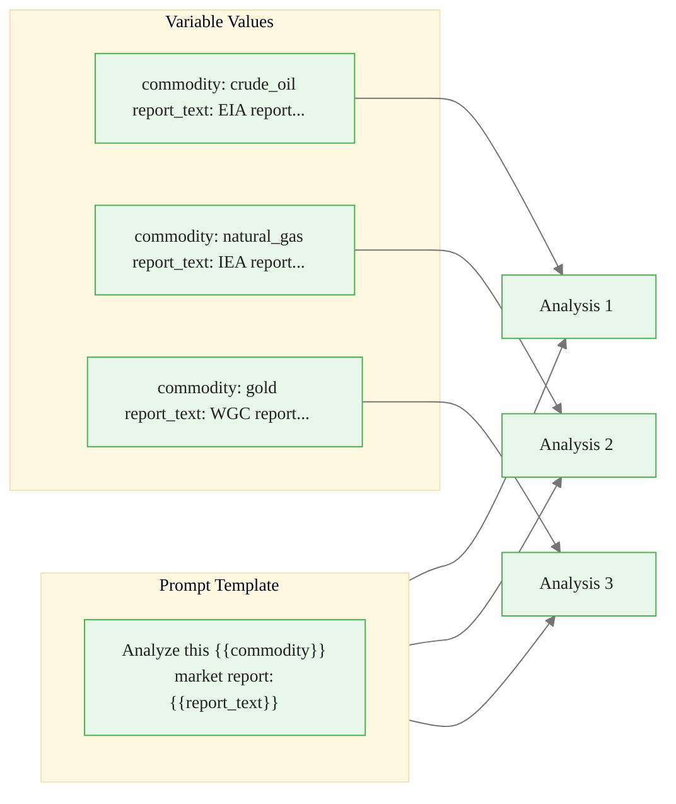
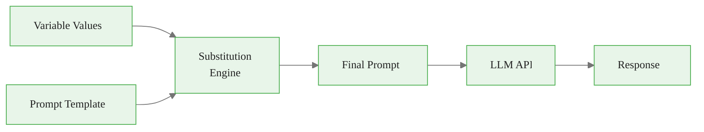
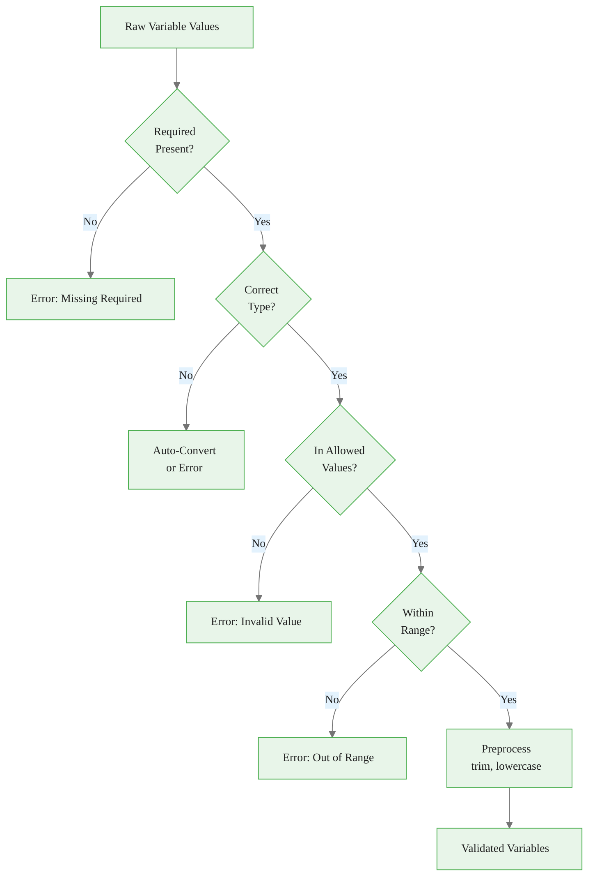
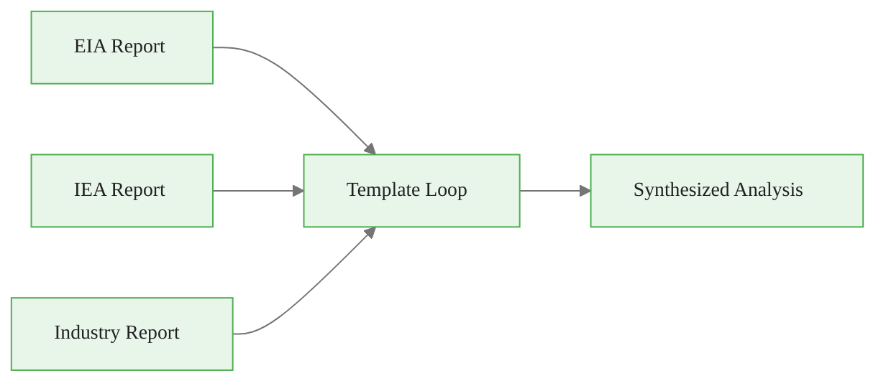
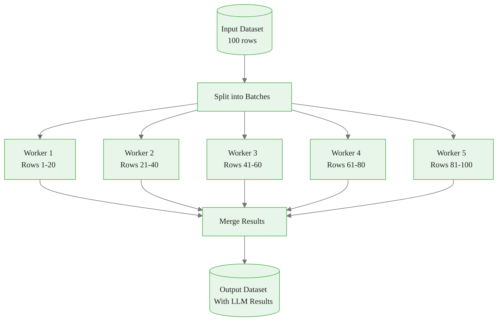

# Using Template Variables in Prompt Studios
## Module 1 — Dataiku GenAI Foundations

> Separate prompt logic from prompt data

<!-- Speaker notes: This deck covers template variables -- the mechanism that makes prompts reusable. By the end, learners will use variables, conditionals, loops, and batch processing. Estimated time: 20 minutes. -->
---

<!-- _class: lead -->

# Why Template Variables?

<!-- Speaker notes: Transition to the Why Template Variables? section. -->
---

## Key Insight

> The power of production LLM applications comes from separating **prompt logic** (the template) from **prompt data** (the variables). This separation enables batch processing, A/B testing, and maintainability -- turning prompts from one-off scripts into **engineered software components**.

<!-- Speaker notes: Read the insight aloud, then expand with an example from the audience's domain. -->

---

## The Mail Merge Analogy



<!-- Speaker notes: The mail merge analogy is immediately intuitive. One template, many outputs. Ask: 'Who has used mail merge?' Then connect to prompt templates. -->
---

## Variable Types

| Type | Syntax | Example |
|------|--------|---------|
| **String** | `{{commodity}}` | `"crude_oil"` |
| **Number** | `{{min_confidence}}` | `0.7` |
| **List** | `{{metrics_to_extract}}` | `["inventory", "production"]` |
| **Object** | `{{comparison_baseline}}` | `{"period": "5-year avg"}` |
| **Boolean** | `{{include_forecast}}` | `true / false` |

<!-- Speaker notes: Five variable types cover most use cases. String is by far the most common. Emphasize that lists and objects enable multi-source prompts. -->

<div class="callout-key">
Key Point:  | `{{commodity}}` | `"crude_oil"` |
| 
</div>

---

<!-- _class: lead -->

# Basic Variable Usage

<!-- Speaker notes: Transition to the Basic Variable Usage section. -->
---

## Defining Variables

```python
studio = PromptStudio("market-analyzer")

```

<!-- Speaker notes: Code continues on the next slide. -->

---

## (continued)

```python
studio.set_variables([
    {
        'name': 'commodity',
        'type': 'string',
        'required': True,
        'description': 'Type of commodity (e.g., crude_oil)'
    },
    {
        'name': 'report_text',
        'type': 'string',
```

<!-- Speaker notes: Code continues on the next slide. -->

---

## (continued)

```python
        'required': True,
        'description': 'Full text of market report'
    },
    {
        'name': 'sentiment_options',
        'type': 'string',
        'required': False,
        'default': 'bullish, bearish, neutral'
    }
])
```

<!-- Speaker notes: Show how variables are defined in code. The 'required' and 'default' fields prevent runtime errors. Good naming is critical -- 'commodity' not 'text1'. -->
---

## Executing with Variables

```python
result = studio.complete(
    variables={
        'commodity': 'crude_oil',
        'report_text': 'U.S. crude oil inventories decreased...',
        'sentiment_options': 'bullish, bearish, neutral'
    }
)
print(result.text)
```



<!-- Speaker notes: This is the execution flow. Variables are substituted before the prompt hits the LLM. The substitution engine handles all types. -->
---

<!-- _class: lead -->

# Advanced Variable Types

<!-- Speaker notes: Transition to the Advanced Variable Types section. -->
---

## Complex Variable Definitions

```python
variables = [
    # String with allowed values (enum)
    {
        'name': 'commodity', 'type': 'string', 'required': True,
        'allowed_values': ['crude_oil', 'natural_gas', 'gold', 'copper']
    },
    # Multi-line text with length limit
    {
        'name': 'report_text', 'type': 'text', 'required': True,
        'max_length': 10000
    },
```

<!-- Speaker notes: Code continues on the next slide. -->

---

## (continued)

```python
    # Numeric with range constraints
    {
        'name': 'min_confidence', 'type': 'number', 'required': False,
        'default': 0.7, 'min_value': 0.0, 'max_value': 1.0
    },
    # List of strings
    {
        'name': 'metrics_to_extract', 'type': 'list', 'required': False,
        'default': ['inventory', 'production', 'price']
    }
]
```

<!-- Speaker notes: Advanced variable definitions with constraints. Enum values prevent invalid inputs. Max length prevents context overflow. Range constraints ensure numeric sanity. -->
---

## Variable Validation Flow



<!-- Speaker notes: Walk through the flowchart. Each check is a potential failure point. Validation happens before the LLM call -- fail fast, save tokens. -->
---

<!-- _class: lead -->

# Conditional Variables

<!-- Speaker notes: Transition to the Conditional Variables section. -->
---

## Toggling Prompt Sections

```python
template = """Analyze this {{commodity}} market report:

{{report_text}}

{{#if include_historical}}
Compare to historical trends:
- 1-month trend
- 3-month trend
- 1-year trend
{{/if}}
```

<!-- Speaker notes: Code continues on the next slide. -->

---

## (continued)

```python
{{#if include_forecast}}
Provide short-term forecast:
- Next week outlook
- Key factors to watch
{{/if}}

Return analysis as structured markdown."""
```

> Boolean variables act as **feature flags** for your prompts.

<!-- Speaker notes: Conditionals are like feature flags for prompts. Enable/disable sections without maintaining separate templates. The if/endif syntax follows Handlebars conventions. -->
---

## Quick vs Full Analysis

<div class="columns">
<div>

**Quick Mode:**
```python
quick_result = studio.complete(
    variables={
        'commodity': 'crude_oil',
        'report_text': 'Report...',
        'include_historical': False,
        'include_forecast': False,
        'detailed_mode': False
    }
)
# ~200 tokens, $0.001
```

</div>
<div>

**Full Mode:**
```python
full_result = studio.complete(
    variables={
        'commodity': 'crude_oil',
        'report_text': 'Report...',
        'include_historical': True,
        'include_forecast': True,
        'detailed_mode': True
    }
)
# ~800 tokens, $0.004
```

</div>
</div>

<!-- Speaker notes: Same template, different modes. Quick mode saves tokens and cost. Full mode provides comprehensive analysis. Let the caller choose based on their needs. -->
---

<!-- _class: lead -->

# Looping Over Lists

<!-- Speaker notes: Transition to the Looping Over Lists section. -->
---

## Multi-Source Analysis

```python
template = """Synthesize insights from multiple {{commodity}} reports:

{{#each sources}}
## Source: {{this.name}}
Report Date: {{this.date}}
{{this.content}}

<!-- Speaker notes: The each loop handles variable-length inputs. Perfect for comparing multiple reports. Note the 'this' reference inside the loop. -->
---
{{/each}}

Provide a synthesized view that:
1. Identifies consensus views across sources
2. Highlights disagreements or discrepancies
3. Generates unified outlook"""
```



<!-- Speaker notes: Quick code example. Point out the important patterns. -->
---

<!-- _class: lead -->

# Validation and Preprocessing

<!-- Speaker notes: Transition to the Validation and Preprocessing section. -->
---

## Variable Validation

```python
def validate_and_preprocess_variables(variables, schema):
    processed = {}
    for var_name, var_schema in schema.items():
        value = variables.get(var_name)

        # Check required
        if var_schema.get('required') and value is None:
            raise ValueError(f"Required variable '{var_name}' missing")

        # Use default if not provided
        if value is None:
            value = var_schema.get('default')
```

<!-- Speaker notes: Code continues on the next slide. -->

---

## (continued)

```python
        # Allowed values check
        if 'allowed_values' in var_schema:
            if value not in var_schema['allowed_values']:
                raise ValueError(f"Invalid value for '{var_name}'")

        # Custom preprocessing
        if 'preprocess' in var_schema:
            value = var_schema['preprocess'](value)

        processed[var_name] = value
    return processed
```

<!-- Speaker notes: Validation code that prevents bad inputs from reaching the LLM. The preprocess hook enables custom transformations like trimming whitespace or lowercasing. -->
---

<!-- _class: lead -->

# Batch Processing

<!-- Speaker notes: Transition to the Batch Processing section. -->
---

## Processing Datasets with Variables

```python
def batch_process_with_variables(
    studio, input_df, column_mapping, max_workers=5
):
    def process_row(row):
        variables = {var: row[col] for var, col in column_mapping.items()}
        try:
            result = studio.complete(variables=variables)
            return {'status': 'success', 'output': result.text,
```

<!-- Speaker notes: Code continues on the next slide. -->

---

## (continued)

```python
                    'tokens': result.usage.total_tokens, 'cost': result.cost}
        except Exception as e:
            return {'status': 'error', 'output': None, 'error': str(e)}

    with ThreadPoolExecutor(max_workers=max_workers) as executor:
        results = list(executor.map(
            process_row, [row for _, row in input_df.iterrows()]
        ))
    return results
```

<!-- Speaker notes: Batch processing scales templates to thousands of rows. ThreadPoolExecutor provides parallelism. Each row maps columns to variables automatically. -->
---

## Batch Processing Architecture



<!-- Speaker notes: Visual overview of the parallel processing architecture. Five workers process 20 rows each simultaneously. The merge step combines results. -->

<div class="callout-insight">
Insight: Template variables turn static prompts into reusable pipelines. A single well-designed template can replace dozens of hardcoded prompts.
</div>

---

## Five Common Pitfalls

| Pitfall | Impact | Fix |
|---------|--------|-----|
| **No input validation** | Runtime errors, poor outputs | Schema-based validation |
| **Overusing variables** | Unstable instructions | Keep stable text in template |
| **Poor naming** | Confusion, errors | `{{customer_feedback}}` not `{{text}}` |
| **Missing defaults** | Errors when optional vars absent | Always set sensible defaults |
| **Ignoring variable size** | Context limit exceeded | Validate max length, truncate |

<!-- Speaker notes: Walk through each pitfall. 'No input validation' is the most dangerous -- garbage in, garbage out. 'Overusing variables' makes prompts unstable. -->

<div class="callout-insight">
Insight:  | Runtime errors, poor outputs | Schema-based validation |
| 
</div>

---

## Key Takeaways

1. **Template variables** separate prompt logic from data using `{{variable}}` syntax
2. **Variable types** include string, number, list, object, and boolean
3. **Conditional sections** with `{{#if}}` enable prompt feature flags
4. **List iteration** with `{{#each}}` handles multi-source inputs
5. **Validation** prevents runtime errors and ensures data quality
6. **Batch processing** with parallel workers scales to thousands of inputs

> One template, thousands of executions -- that is the power of template variables.

<!-- Speaker notes: Recap the main points. Ask if there are questions before moving to the next topic. -->

<div class="callout-warning">
Warning:  separate prompt logic from data using `{{variable}}` syntax
2. 
</div>
