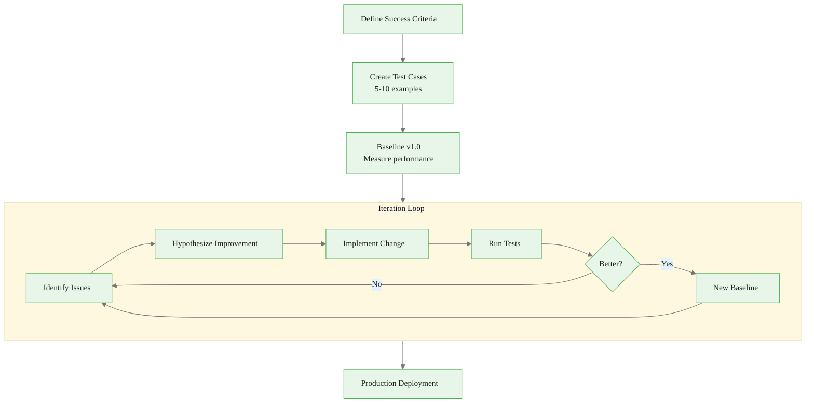
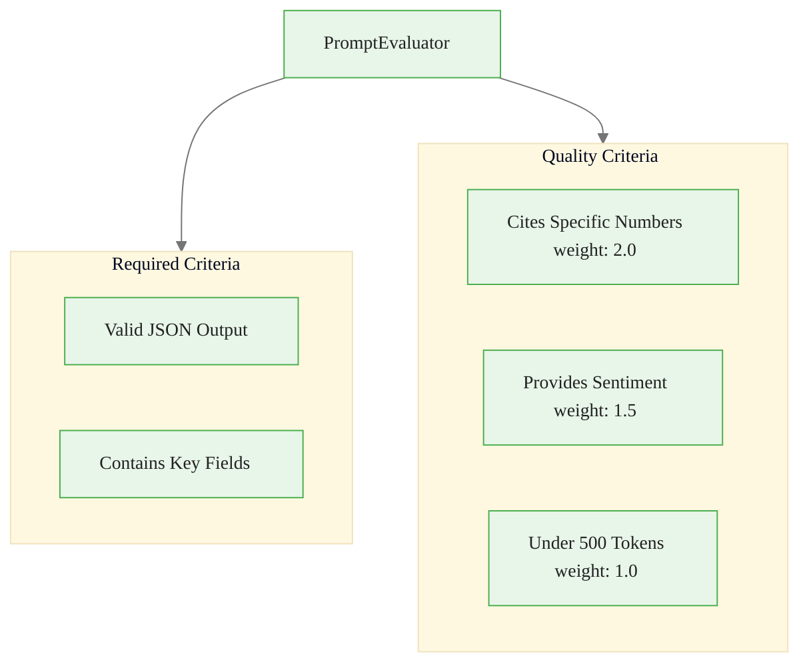
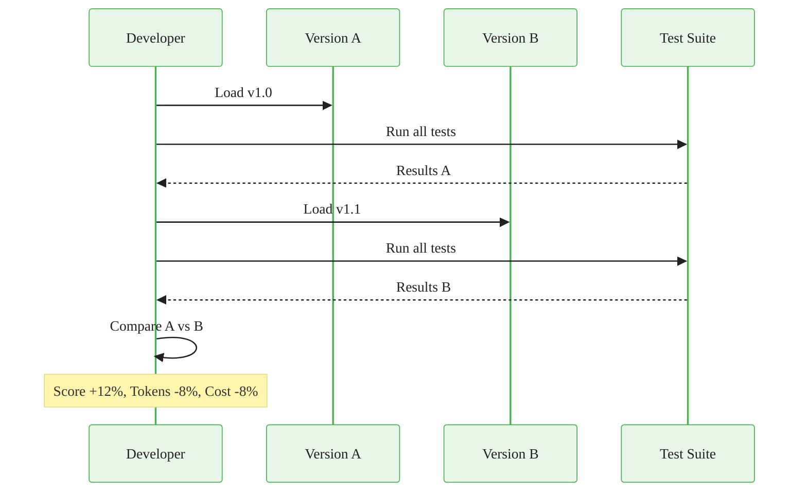
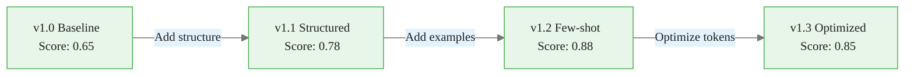
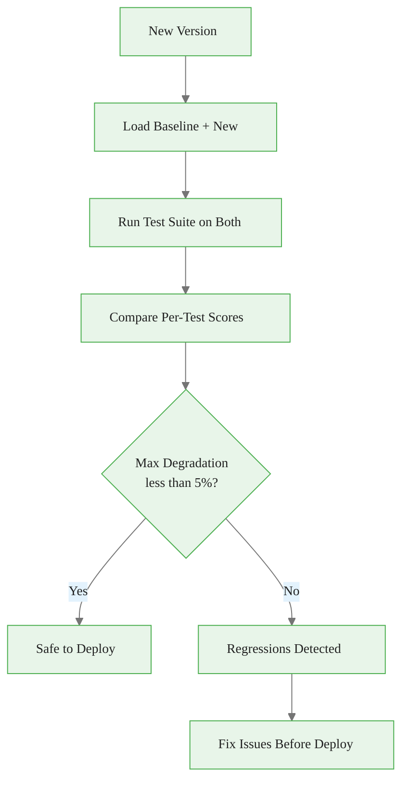

# Testing and Iterating on Prompts
## Module 1 — Dataiku GenAI Foundations

> From trial-and-error to engineering discipline

<!-- Speaker notes: This deck covers systematic prompt testing and iteration. By the end, learners will build evaluators, test suites, and version comparison workflows. Estimated time: 22 minutes. -->
---

<!-- _class: lead -->

# Why Systematic Testing?

<!-- Speaker notes: Transition to the Why Systematic Testing? section. -->
---

## Key Insight

> The best prompt is rarely the first prompt. Systematic iteration -- test, measure, hypothesize improvement, implement, retest -- yields **2-3x better results** than ad-hoc experimentation. The key is defining clear success criteria upfront and measuring every change against them.

<!-- Speaker notes: Read the insight aloud, then expand with an example from the audience's domain. -->
---

## The Recipe Development Analogy

| Cooking | Prompt Engineering |
|---------|-------------------|
| Baseline recipe | First prompt attempt |
| Taste test | Run test cases |
| "Needs more salt" | Identify failure mode |
| Add salt, taste again | Iterate and retest |
| Compare to original | Version comparison |
| Publish recipe | Deploy to production |

<!-- Speaker notes: Cooking analogy grounds the concept. You don't publish a recipe after the first attempt. Same with prompts -- iterate systematically. -->
---

## Prompt Iteration Workflow



<!-- Speaker notes: The iteration loop is the core workflow. Define success criteria first, then iterate. Each change is a hypothesis to test. -->
---

<!-- _class: lead -->

# Defining Success Criteria

<!-- Speaker notes: Transition to the Defining Success Criteria section. -->
---

## The PromptEvaluator Class

```python
class PromptEvaluator:
    def __init__(self):
        self.criteria = []

    def add_criterion(self, name, check_function,
                      weight=1.0, required=False):
        self.criteria.append({
            'name': name, 'check': check_function,
            'weight': weight, 'required': required
        })

```

<!-- Speaker notes: Code continues on the next slide. -->

---

## (continued)

```python
    def evaluate(self, output):
        total_weight = sum(c['weight'] for c in self.criteria)
        weighted_score = 0
        for criterion in self.criteria:
            if criterion['check'](output):
                weighted_score += criterion['weight']

        return {
            'score': weighted_score / total_weight,
            'overall_pass': not any(
                not c['check'](output) and c['required']
                for c in self.criteria
            )
        }
```

<!-- Speaker notes: The PromptEvaluator separates required criteria (must pass) from weighted criteria (contribute to score). This enables nuanced quality assessment. -->
---

## Criteria Types



> **Required** criteria cause total failure. **Weighted** criteria contribute to a quality score.

<!-- Speaker notes: Two categories: required (red, binary pass/fail) and weighted (green, scored). Required criteria gate deployment. Weighted criteria guide improvement. -->

<div class="callout-info">
Info:  criteria cause total failure. 
</div>

---

## Setting Up Evaluation Criteria

```python
evaluator = PromptEvaluator()

# Required: Must pass
evaluator.add_criterion(
    name='Valid JSON output',
    check_function=lambda x: is_valid_json(x),
    required=True
)

evaluator.add_criterion(
    name='Contains inventory_change field',
    check_function=lambda x: 'inventory_change' in json.loads(x),
    required=True
)
```

<!-- Speaker notes: Code continues on the next slide. -->

---

## (continued)

```python
# Weighted: Contributes to score
evaluator.add_criterion(
    name='Cites specific numbers',
    check_function=lambda x: contains_numbers(x),
    weight=2.0
)

evaluator.add_criterion(
    name='Provides sentiment',
    check_function=lambda x: any(
        w in x.lower() for w in ['bullish', 'bearish', 'neutral']
    ),
    weight=1.5
)
```

<!-- Speaker notes: Concrete example of setting up criteria for commodity analysis. Note the weights -- citing numbers is worth 2x because data-driven analysis is the core value. -->
---

<!-- _class: lead -->

# Test Suite Implementation

<!-- Speaker notes: Transition to the Test Suite Implementation section. -->
---

## The PromptTestSuite Class

```python
class PromptTestSuite:
    def __init__(self, prompt_studio, evaluator):
        self.studio = prompt_studio
        self.evaluator = evaluator
        self.test_cases = []

    def add_test_case(self, name, variables, notes=""):
        self.test_cases.append({
            'name': name, 'variables': variables, 'notes': notes
        })

```

<!-- Speaker notes: Code continues on the next slide. -->

---

## (continued)

```python
    def run_all_tests(self):
        results = []
        for test_case in self.test_cases:
            response = self.studio.complete(variables=test_case['variables'])
            evaluation = self.evaluator.evaluate(response.text)
            results.append({
                'test_name': test_case['name'],
                'passed': evaluation['overall_pass'],
                'score': evaluation['score'],
                'tokens': response.usage.total_tokens,
                'cost_usd': response.cost
            })
        return pd.DataFrame(results)
```

<!-- Speaker notes: The test suite orchestrates running all test cases through the evaluator. It returns a DataFrame for easy comparison and reporting. -->
---

## Test Suite Output

```
============================================================
Test Suite Summary
============================================================
Total tests: 5
Passed: 4 (80.0%)
Average score: 0.82
Average tokens: 847
Total cost: $0.0245
Average latency: 1.8s
```

| Test Name | Passed | Score | Tokens | Cost |
|-----------|--------|-------|--------|------|
| EIA Crude - Bullish Draw | Yes | 0.95 | 892 | $0.0052 |
| Nat Gas - Neutral Build | Yes | 0.82 | 756 | $0.0044 |
| Gold - Bearish Sell-off | Yes | 0.78 | 901 | $0.0053 |
| Edge Case - Empty Report | No | 0.40 | 312 | $0.0018 |
| Long Report - 5000 words | Yes | 0.88 | 1374 | $0.0078 |

<!-- Speaker notes: Sample output from a test run. 80% pass rate with one edge case failure. The cost column helps estimate production expenses. -->
---

<!-- _class: lead -->

# Version Comparison

<!-- Speaker notes: Transition to the Version Comparison section. -->
---

## Comparing Prompt Versions



<!-- Speaker notes: Version comparison is the quantitative backbone of iteration. Run both versions against the same test suite and compare scores, tokens, and cost. -->
---

## Version Comparison Code

```python
def compare_prompt_versions(studio, version_a, version_b, test_suite):
    # Run version A
    studio.load_version(version_a)
    results_a = test_suite.run_all_tests()

    # Run version B
    studio.load_version(version_b)
    results_b = test_suite.run_all_tests()

```

<!-- Speaker notes: Code continues on the next slide. -->

---

## (continued)

```python
    # Calculate improvements
    comparison = pd.DataFrame({
        'test_name': results_a['test_name'],
        'score_improvement': results_b['score'] - results_a['score'],
        'token_change': results_b['tokens'] - results_a['tokens'],
        'cost_change': results_b['cost_usd'] - results_a['cost_usd']
    })

    print(f"Avg score improvement: {comparison['score_improvement'].mean():+.2f}")
    print(f"Tests improved: {(comparison['score_improvement'] > 0).sum()}")
    print(f"Tests degraded: {(comparison['score_improvement'] < 0).sum()}")
    return comparison
```

<!-- Speaker notes: The comparison code runs both versions and calculates deltas. The output tells you exactly how many tests improved vs degraded. -->
---

<!-- _class: lead -->

# Systematic Iteration

<!-- Speaker notes: Transition to the Systematic Iteration section. -->
---

## The PromptIterator



> Change **one dimension per iteration**. Track the hypothesis for each change.

<!-- Speaker notes: Visual history of iteration. Note v1.3 scores lower than v1.2 -- optimizing for tokens can hurt quality. Choose the version that matches your priority. -->

<div class="callout-key">
Key Point: one dimension per iteration
</div>

---

## Iteration Examples

| Version | Hypothesis | Score | Tokens | Cost |
|---------|-----------|-------|--------|------|
| v1.0 | Baseline prompt | 0.65 | 1,245 | $0.0062 |
| v1.1 | Structured output improves consistency | 0.78 | 1,102 | $0.0055 |
| v1.2 | Few-shot examples improve accuracy | **0.88** | 1,356 | $0.0068 |
| v1.3 | Concise prompt reduces tokens | 0.85 | **847** | **$0.0042** |

> v1.2 is best for quality. v1.3 is best for cost. Choose based on your priority.

<!-- Speaker notes: Data table showing the trade-off. v1.2 is best for quality, v1.3 for cost. In production, quality usually wins unless you have strict budget constraints. -->

<div class="callout-insight">
Insight:  | 1,356 | $0.0068 |
| v1.3 | Concise prompt reduces tokens | 0.85 | 
</div>

---

## Iteration Code Pattern

```python
iterator = PromptIterator(studio, test_suite)

# Baseline
iterator.iterate(
    hypothesis="Baseline - simple extraction prompt",
    changes={
        'system_prompt': 'You are a commodity analyst.',
        'user_template': 'Analyze: {{report_text}}'
    },
    version_name='v1.0-baseline'
)

```

<!-- Speaker notes: Code continues on the next slide. -->

---

## (continued)

```python
# Add structure
iterator.iterate(
    hypothesis="Structured output should improve consistency",
    changes={
        'user_template': '''Analyze: {{report_text}}
Return JSON with: inventory_change, sentiment, key_factors'''
    },
    version_name='v1.1-structured'
)

# Find best
best = iterator.get_best_version()
```

<!-- Speaker notes: The PromptIterator tracks hypothesis and results for each iteration. This creates an auditable record of why each change was made. -->
---

<!-- _class: lead -->

# Regression Testing

<!-- Speaker notes: Transition to the Regression Testing section. -->
---

## Preventing Regressions

```python
def run_regression_tests(studio, current_version,
                         baseline_version, test_suite,
                         max_degradation=0.05):
    studio.load_version(baseline_version)
    baseline_results = test_suite.run_all_tests()

    studio.load_version(current_version)
    current_results = test_suite.run_all_tests()

```

<!-- Speaker notes: Code continues on the next slide. -->

---

## (continued)

```python
    regressions = []
    for i, test_name in enumerate(baseline_results['test_name']):
        baseline_score = baseline_results.iloc[i]['score']
        current_score = current_results.iloc[i]['score']
        if current_score < baseline_score - max_degradation:
            regressions.append({
                'test': test_name,
                'degradation': baseline_score - current_score
            })

    return len(regressions) == 0  # True = safe to deploy
```

<!-- Speaker notes: Regression testing ensures improvements don't break existing behavior. The max_degradation threshold allows small fluctuations while catching real regressions. -->
---

## Regression Test Flow



<!-- Speaker notes: Walk through the flowchart. The 5% degradation threshold is a good starting point. Adjust based on your quality requirements. -->
---

## Five Common Pitfalls

| Pitfall | Impact | Fix |
|---------|--------|-----|
| **Too few test cases** | Missed edge cases | 10-15 cases minimum |
| **Subjective evaluation** | Inconsistent quality | Define objective, measurable criteria |
| **Multiple changes at once** | Cannot isolate improvements | One change per iteration |
| **Overfitting to tests** | Brittle in production | Add new cases from production failures |
| **Ignoring cost/latency** | Expensive or slow prompts | Track tokens, cost, latency per version |

<!-- Speaker notes: Key pitfall: 'Multiple changes at once' -- you can't isolate what helped. One change per iteration is the rule. -->

<div class="callout-warning">
Warning:  | Missed edge cases | 10-15 cases minimum |
| 
</div>

---

## Key Takeaways

1. **Success criteria first** -- define what "good" means before writing prompts
2. **Weighted evaluation** separates required criteria from quality metrics
3. **Version comparison** quantifies improvements across test suites
4. **One change per iteration** isolates what helps and what hurts
5. **Regression testing** prevents improvements from breaking existing behavior

> Systematic testing transforms prompt engineering from art into engineering.

<!-- Speaker notes: Recap the main points. Ask if there are questions before moving to the next topic. -->