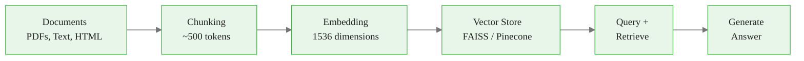
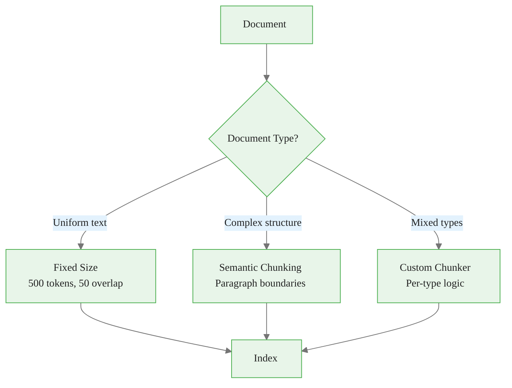
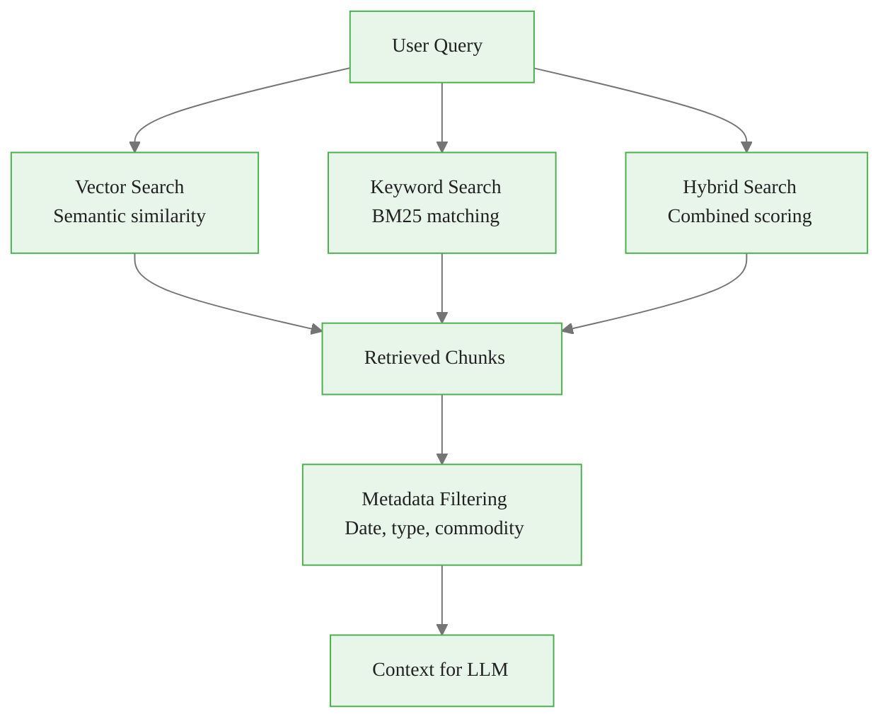
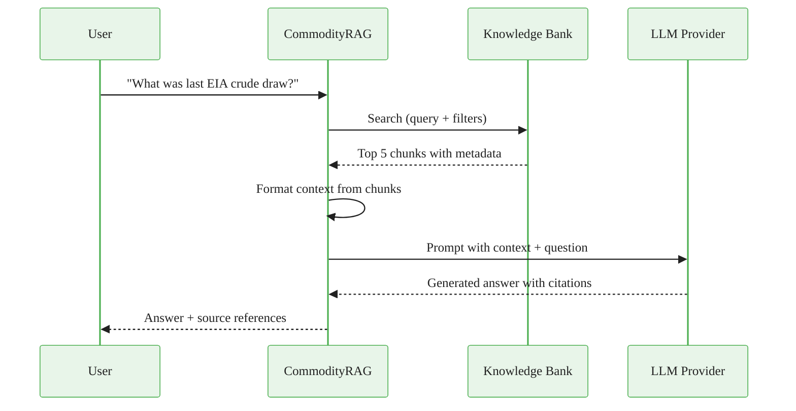
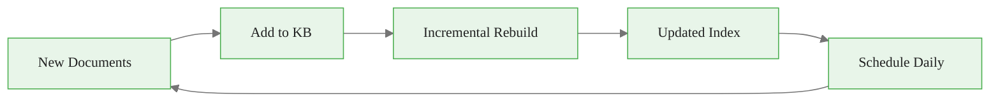

# Knowledge Banks for RAG Applications
## Module 2 — Dataiku GenAI Foundations

> Managed RAG pipeline: documents to answers

<!-- Speaker notes: This deck introduces Knowledge Banks -- Dataiku's managed RAG pipeline. By the end, learners will create, configure, query, and maintain knowledge banks. Estimated time: 20 minutes. -->
---

<!-- _class: lead -->

# What are Knowledge Banks?

<!-- Speaker notes: Transition to the What are Knowledge Banks? section. -->
---

## The RAG Pipeline



> Knowledge Banks manage this entire pipeline as a single managed resource in Dataiku.

<!-- Speaker notes: The RAG pipeline in one diagram. Knowledge Banks manage everything from chunking to retrieval as a single managed resource. -->
---

## Creating a Knowledge Bank

<div class="columns">
<div>

**From the UI:**
1. **Project** > **Knowledge Banks**
2. **+ New Knowledge Bank**
3. Configure sources, chunking, embedding

</div>
<div>

**Programmatically:**
```python
kb = KnowledgeBank.create(
    project_key="COMMODITY_ANALYSIS",
    name="commodity_reports_kb",
    embedding_connection="openai-embeddings",
    embedding_model="text-embedding-3-small"
)

kb.add_documents_from_dataset(
    dataset_name="eia_reports",
    text_column="report_text",
    metadata_columns=[
        "report_date", "report_type",
        "commodity"
    ]
)

kb.build()
```

</div>
</div>

<!-- Speaker notes: Two paths: UI for quick setup, code for automation. The programmatic approach is better for reproducible pipelines. -->

---

## Knowledge Bank Configuration

```yaml
knowledge_bank:
  name: commodity_reports_kb
  sources:
    - type: folder
      path: /data/reports/eia
    - type: dataset
      name: usda_wasde_reports
  chunking:
    method: recursive
    chunk_size: 500    # tokens
    chunk_overlap: 50
  embedding:
    model: text-embedding-3-small
    connection: openai-embeddings
  vector_store:
    type: faiss
    index_type: IVF_FLAT
```

<!-- Speaker notes: YAML configuration showing all the knobs. Chunk size of 500 tokens with 50 overlap is a good starting point for most documents. -->
---

<!-- _class: lead -->

# Chunking Strategies

<!-- Speaker notes: Transition to the Chunking Strategies section. -->
---

## Choosing a Chunking Method



<!-- Speaker notes: Decision tree for chunking strategy. Fixed for uniform text, semantic for structured documents, custom for mixed types. -->
---

## Chunking Methods Compared

<div class="columns">
<div>

**Fixed Size:**
```python
chunking_config = {
    "method": "fixed",
    "chunk_size": 500,
    "chunk_overlap": 50
}
```

**Semantic:**
```python
chunking_config = {
    "method": "semantic",
    "max_chunk_size": 1000,
    "similarity_threshold": 0.8,
    "respect_paragraphs": True
}
```

</div>
<div>

| Method | Pros | Cons |
|--------|------|------|
| **Fixed** | Simple, predictable | May split mid-sentence |
| **Semantic** | Preserves meaning | Variable sizes |
| **Custom** | Document-aware | More complex |

</div>
</div>

<!-- Speaker notes: Side-by-side code and trade-off table. Fixed is the safe default. Semantic is better when you need to preserve paragraph meaning. -->

<div class="callout-key">
Key Point:  | Simple, predictable | May split mid-sentence |
| 
</div>

---

## Document-Specific Chunking

```python
def custom_chunker(document: dict) -> list:
    doc_type = document.get('type', 'text')
    content = document['content']

    if doc_type == 'eia_report':
        # Chunk by sections
        sections = content.split('\n\n')
        return [{'text': s, 'section': i}
                for i, s in enumerate(sections)]

```

<!-- Speaker notes: Code continues on the next slide. -->

---

## (continued)

```python
    elif doc_type == 'earnings_transcript':
        # Chunk by speaker turns
        turns = re.split(r'\n(?=[A-Z][a-z]+ [A-Z][a-z]+:)', content)
        return [{'text': t} for t in turns if len(t) > 100]

    else:
        # Default recursive chunking
        splitter = RecursiveCharacterTextSplitter(
            chunk_size=500, chunk_overlap=50
        )
        return [{'text': c} for c in splitter.split_text(content)]
```

<!-- Speaker notes: Custom chunker that handles different document types differently. EIA reports chunk by section, earnings transcripts by speaker turn. This is the production pattern. -->
---

<!-- _class: lead -->

# Querying Knowledge Banks

<!-- Speaker notes: Transition to the Querying Knowledge Banks section. -->
---

## Retrieval Methods



<!-- Speaker notes: Three search types: vector (meaning), keyword (exact terms), hybrid (best of both). Hybrid is the production default. -->
---

## Search Examples

<div class="columns">
<div>

**Basic Search:**
```python
kb = KnowledgeBank("commodity_reports_kb")
results = kb.search(
    query="crude oil inventory changes",
    top_k=5
)
for r in results:
    print(f"Score: {r.score:.3f}")
    print(f"Content: {r.text[:200]}...")
```

</div>
<div>

**Filtered Search:**
```python
results = kb.search(
    query="OPEC production decisions",
    top_k=5,
    filters={
        "report_type": "iea_omr",
        "date_range": {
            "start": "2024-01-01",
            "end": "2024-06-30"
        }
    }
)
```

</div>
</div>

<!-- Speaker notes: Basic vs filtered search. Metadata filtering is crucial for production -- narrows results to relevant time periods and document types. -->
---

## Hybrid Search

```python
results = kb.search(
    query="crude inventory draw",
    top_k=5,
    search_type="hybrid",
    keyword_weight=0.3,   # 30% keyword matching
    required_keywords=["EIA", "crude"]
)
```

| Search Type | Strengths | Best For |
|-------------|-----------|----------|
| **Vector** | Understands meaning | Conceptual queries |
| **Keyword** | Exact matches | Specific terms, names |
| **Hybrid** | Best of both | Production use |

<!-- Speaker notes: Hybrid search with configurable weights. 70/30 vector/keyword is a good starting point. Required keywords ensure critical terms appear. -->

<div class="callout-insight">
Insight:  | Understands meaning | Conceptual queries |
| 
</div>

---

<!-- _class: lead -->

# Complete RAG Pipeline

<!-- Speaker notes: Transition to the Complete RAG Pipeline section. -->
---

## CommodityRAG Class

```python
class CommodityRAG:
    def __init__(self, kb_name, llm_connection, top_k=5):
        self.kb = KnowledgeBank(kb_name)
        self.llm = LLM(llm_connection)
        self.top_k = top_k

    def query(self, question, filters=None):
        # 1. Retrieve relevant context
        results = self.kb.search(query=question,
            top_k=self.top_k, filters=filters)

```

<!-- Speaker notes: Code continues on the next slide. -->

---

## (continued)

```python
        # 2. Format context
        context = "\n\n---\n\n".join([
            f"Source: {r.metadata.get('source')}\n"
            f"Date: {r.metadata.get('date')}\n"
            f"Content: {r.text}"
            for r in results
        ])

        # 3. Generate answer with context
        prompt = f"""Answer based on context. Cite sources.
CONTEXT: {context}
QUESTION: {question}"""

        response = self.llm.complete(prompt, max_tokens=500)
        return {'answer': response.text, 'sources': results}
```

<!-- Speaker notes: The complete RAG pipeline in one class. Retrieve, format context with metadata, generate answer with citations. This is the pattern learners will use most. -->
---

## RAG Pipeline Architecture



<!-- Speaker notes: Sequence diagram showing the full request lifecycle. Note that the RAG class orchestrates all three services: Knowledge Bank, LLM, and metadata. -->
---

<!-- _class: lead -->

# Evaluation and Maintenance

<!-- Speaker notes: Transition to the Evaluation and Maintenance section. -->
---

## Evaluating RAG Responses

```python
def evaluate_rag_response(question, response, ground_truth=None):
    llm = LLM("anthropic-claude")

    # Check relevance of retrieved sources
    relevance = llm.complete(
        f"Rate source relevance to question (1-5):\n"
        f"Question: {question}\n"
        f"Sources: {response['sources']}\n"
        f"Return just a number."
    )

```

<!-- Speaker notes: Code continues on the next slide. -->

---

## (continued)

```python
    # Check answer quality
    quality = llm.complete(
        f"Rate answer quality (1-5) for accuracy, "
        f"completeness, citation:\n"
        f"Question: {question}\n"
        f"Answer: {response['answer']}\n"
        f"Return just a number."
    )

    return {
        'relevance_score': float(relevance.text.strip()),
        'quality_score': float(quality.text.strip())
    }
```

<!-- Speaker notes: LLM-as-judge evaluation for RAG responses. Two dimensions: source relevance and answer quality. This is a quick quality check, not a replacement for human evaluation. -->
---

## Maintaining Knowledge Banks

```python
def refresh_kb():
    """Daily knowledge bank refresh."""
    kb = KnowledgeBank("commodity_reports_kb")

    # Get new reports
    ds = dataiku.Dataset("new_reports")
    df = ds.get_dataframe()

```

<!-- Speaker notes: Code continues on the next slide. -->

---

## (continued)

```python
    # Add to knowledge bank
    for _, row in df.iterrows():
        kb.add_document(
            text=row['report_text'],
            metadata={
                'date': row['report_date'],
                'type': row['report_type'],
                'source': row['source']
            }
        )

    # Incremental rebuild
    kb.rebuild(incremental=True)
    print(f"KB now has {kb.document_count} documents")
```



<!-- Speaker notes: Knowledge bank maintenance pattern. Incremental rebuild is key -- don't re-embed everything when you add new documents. -->

<div class="callout-key">
Key Point: Chunk size and overlap are the two most impactful parameters for RAG quality. Start with 500 tokens / 50 overlap and tune based on retrieval relevance.
</div>

---

## Key Takeaways

1. **Knowledge Banks** manage the full RAG pipeline: chunking, embedding, storage, retrieval
2. **Chunking strategy** should match document type -- fixed, semantic, or custom
3. **Metadata filtering** enables targeted retrieval by date, type, or source
4. **Hybrid search** combines semantic understanding with keyword precision
5. **Regular maintenance** with incremental rebuilds keeps the knowledge bank current

> Knowledge Banks turn your documents into an intelligent, searchable knowledge layer.

<!-- Speaker notes: Recap the main points. Ask if there are questions before moving to the next topic. -->

<div class="callout-warning">
Warning:  manage the full RAG pipeline: chunking, embedding, storage, retrieval
2. 
</div>
