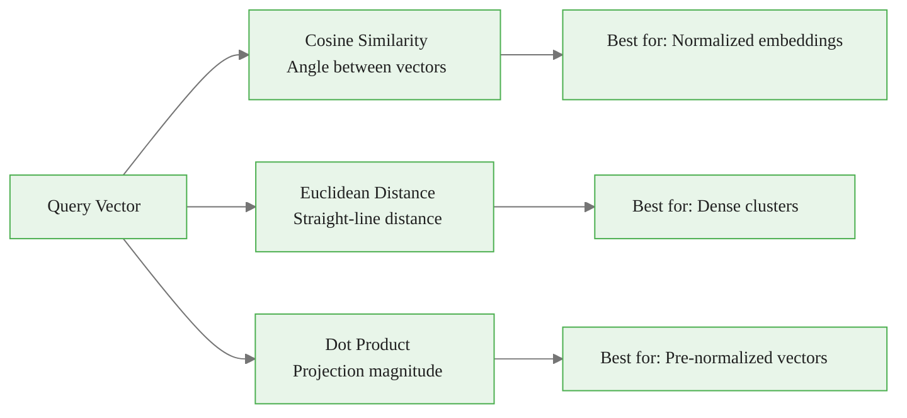
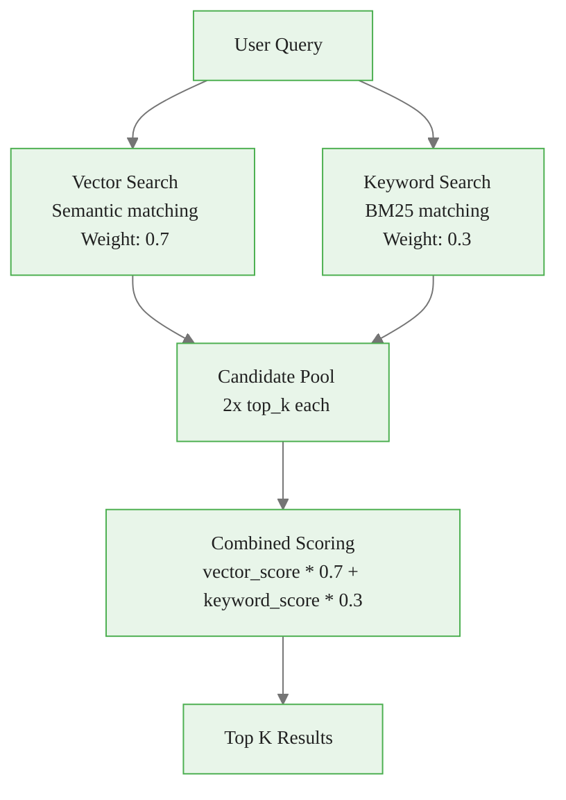
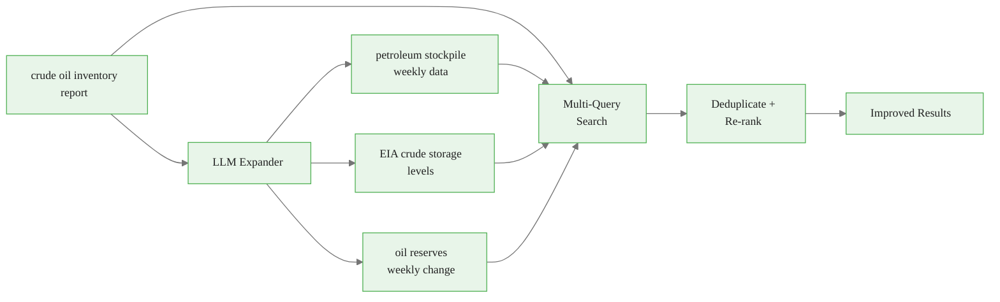
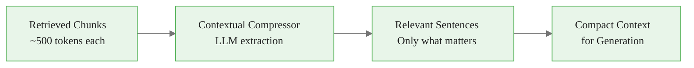
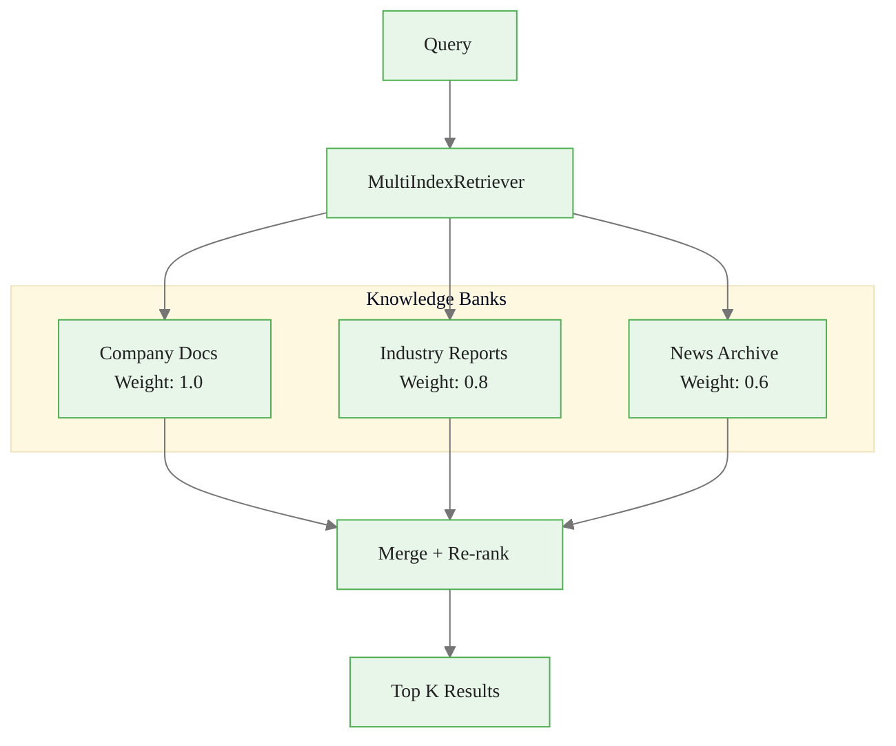
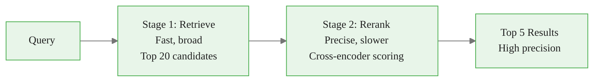
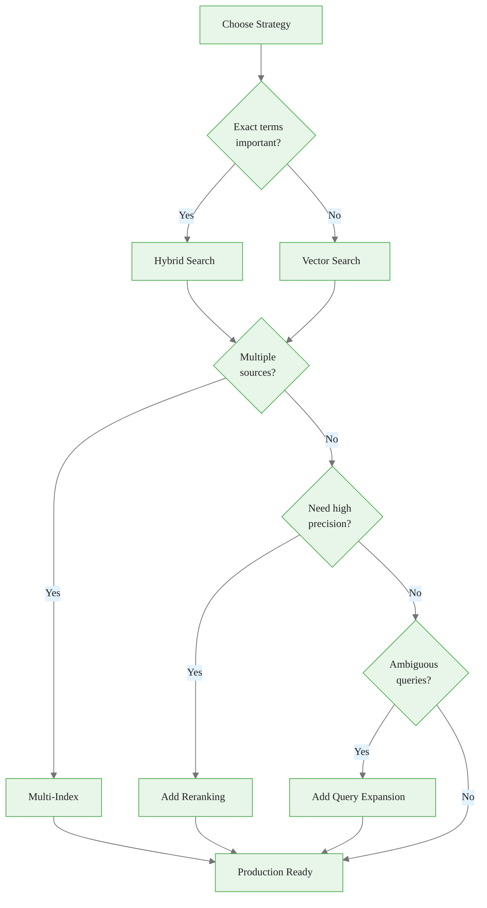

# Retrieval Strategies for RAG
## Module 2 — Dataiku GenAI Foundations

> Optimize how documents are found and ranked

<!-- Speaker notes: This deck covers advanced retrieval strategies for RAG. By the end, learners will implement hybrid search, query expansion, compression, multi-index retrieval, and reranking. Estimated time: 24 minutes. -->
---

<!-- _class: lead -->

# Embedding-Based Retrieval

<!-- Speaker notes: Transition to the Embedding-Based Retrieval section. -->
---

## Vector Similarity Search

```python
class VectorRetriever:
    def __init__(self, knowledge_bank, embedding_model, top_k=5):
        self.kb = knowledge_bank
        self.embedding_model = embedding_model
        self.top_k = top_k

    def retrieve(self, query):
        # Embed query into vector space
        query_embedding = self.embedding_model.encode(query)
```

<!-- Speaker notes: Code continues on the next slide. -->

---

## (continued)

```python
        # Search by similarity
        results = self.kb.similarity_search(
            query_embedding, k=self.top_k
        )

        return [{"content": r.content, "score": r.similarity_score,
                 "metadata": r.metadata} for r in results]
```

> The embedding model maps text to high-dimensional vectors where **similar meanings are nearby**.

<!-- Speaker notes: The VectorRetriever is the simplest retrieval pattern. Embed the query, search by similarity. Good for conceptual queries, weaker for exact term matching. -->

<div class="callout-info">
Info: similar meanings are nearby
</div>

---

## Distance Metrics



$$\text{cosine}(a, b) = \frac{a \cdot b}{\|a\| \|b\|}$$

$$\text{euclidean}(a, b) = \|a - b\|_2$$

<!-- Speaker notes: Three distance metrics. Cosine similarity is the default for most embedding models. The formulas are reference material -- learners don't need to memorize them. -->
---

## Index Configuration

```python
retrieval_config = {
    "distance_metric": "cosine",
    "normalize_embeddings": True,
    "index_type": "hnsw",
    "hnsw_params": {
        "M": 16,                # Connections per layer
        "ef_construction": 200, # Build-time candidate list
        "ef_search": 100        # Search-time candidate list
    }
}
```

| Index Type | Speed | Accuracy | Memory |
|-----------|-------|----------|--------|
| **Flat** | Slow | Perfect | Low |
| **IVF** | Fast | Good | Medium |
| **HNSW** | Very fast | Very good | High |

<!-- Speaker notes: HNSW is the production default -- very fast with high accuracy. Flat is for small datasets where exact results matter. IVF is the middle ground. -->

<div class="callout-key">
Key Point:  | Slow | Perfect | Low |
| 
</div>

---

<!-- _class: lead -->

# Hybrid Retrieval

<!-- Speaker notes: Transition to the Hybrid Retrieval section. -->
---

## Combining Vector and Keyword Search



<!-- Speaker notes: Hybrid retrieval diagram. Both search methods contribute candidates. Combined scoring with configurable weights produces the final ranking. -->
---

## HybridRetriever Implementation

```python
class HybridRetriever:
    def __init__(self, knowledge_bank, embedding_model,
                 vector_weight=0.7, keyword_weight=0.3, top_k=5):
        self.kb = knowledge_bank
        self.vector_weight = vector_weight
        self.keyword_weight = keyword_weight
        self.top_k = top_k

    def retrieve(self, query):
        # Get candidates from both methods
        vector_results = self.kb.similarity_search(
            self.embedding_model.encode(query), k=self.top_k * 2)
        keyword_results = self.kb.keyword_search(
            query, k=self.top_k * 2)

```

<!-- Speaker notes: Code continues on the next slide. -->

---

## (continued)

```python
        # Combine scores
        combined = {}
        for r in vector_results:
            combined[r.document_id] = {
                "content": r.content,
                "score": r.similarity_score * self.vector_weight
            }
        for r in keyword_results:
            if r.document_id in combined:
                combined[r.document_id]["score"] += r.score * self.keyword_weight
            else:
                combined[r.document_id] = {
                    "content": r.content,
                    "score": r.score * self.keyword_weight
                }
        return sorted(combined.values(),
                      key=lambda x: x["score"], reverse=True)[:self.top_k]
```

<!-- Speaker notes: The HybridRetriever merges results from both search methods. Documents found by both methods get a combined score. This is the most important code in the deck. -->
---

## When to Use Which Strategy

| Strategy | Best For | Example |
|----------|----------|---------|
| **Vector only** | Conceptual queries | "What affects oil prices?" |
| **Keyword only** | Exact terms, codes | "WTI CL1 settlement price" |
| **Hybrid** | Production systems | Most real-world queries |

> Start with **hybrid** (70/30 vector/keyword) and tune weights based on evaluation.

<!-- Speaker notes: Quick reference table. Vector for 'what affects oil prices?', keyword for 'WTI CL1 settlement price', hybrid for everything in between. -->

<div class="callout-insight">
Insight:  | Conceptual queries | "What affects oil prices?" |
| 
</div>

---

<!-- _class: lead -->

# Query Expansion

<!-- Speaker notes: Transition to the Query Expansion section. -->
---

## Expanding Queries for Better Recall



<!-- Speaker notes: Query expansion uses the LLM to generate alternative phrasings. This improves recall for ambiguous queries like 'crude inventory' vs 'petroleum stockpile'. -->
---

## QueryExpander Implementation

```python
class QueryExpander:
    def __init__(self, llm_connection):
        self.llm = llm_connection

    def expand_query(self, query, n_expansions=3):
        prompt = f"""Generate {n_expansions} alternative phrasings
of this search query using different words:

Original: {query}

Return one alternative per line, no numbering."""

```

<!-- Speaker notes: Code continues on the next slide. -->

---

## (continued)

```python
        response = self.llm.generate(prompt, max_tokens=200)
        expansions = [query]  # Include original
        for line in response.text.strip().split('\n'):
            if line.strip():
                expansions.append(line.strip())
        return expansions

    def retrieve_with_expansion(self, query, retriever):
        expanded = self.expand_query(query)
        all_results, seen_ids = [], set()
        for q in expanded:
            for r in retriever.retrieve(q):
                if r.get('document_id') not in seen_ids:
                    all_results.append(r)
                    seen_ids.add(r.get('document_id'))
        return sorted(all_results,
                      key=lambda x: x.get('score', 0), reverse=True)
```

<!-- Speaker notes: The QueryExpander generates alternative queries and deduplicates results. Note the seen_ids set prevents duplicate documents across expanded queries. -->
---

<!-- _class: lead -->

# Contextual Compression

<!-- Speaker notes: Transition to the Contextual Compression section. -->
---

## Reducing Noise in Retrieved Content



```python
class ContextualCompressor:
    def __init__(self, llm_connection, max_compressed_length=500):
        self.llm = llm_connection
        self.max_length = max_compressed_length

```

<!-- Speaker notes: Code continues on the next slide. -->

---

## (continued)

```python
    def compress(self, query, documents):
        compressed = []
        for doc in documents:
            prompt = f"""Extract only sentences relevant to the query.
Query: {query}
Document: {doc['content'][:2000]}
Relevant excerpts:"""
            response = self.llm.generate(prompt, max_tokens=self.max_length)
            compressed.append({
                "compressed_content": response.text.strip(),
                "score": doc.get('score', 0)
            })
        return compressed
```

<!-- Speaker notes: Contextual compression extracts only the relevant sentences from retrieved chunks. This reduces noise and saves context window tokens. -->
---

<!-- _class: lead -->

# Multi-Index Retrieval

<!-- Speaker notes: Transition to the Multi-Index Retrieval section. -->
---

## Searching Across Knowledge Banks



<!-- Speaker notes: Multi-index retrieval searches across multiple knowledge banks with weighted scoring. Useful when information spans company docs, industry reports, and news. -->
---

## Merge Strategies

```python
class MultiIndexRetriever:
    def retrieve(self, query, top_k=5, strategy='merge'):
        all_results = []
        for name, kb in self.kbs.items():
            results = kb.search(query, k=top_k)
            weight = self.weights.get(name, 1.0)
            for r in results:
                r['weighted_score'] = r.get('score', 0) * weight
                all_results.append(r)
```

<!-- Speaker notes: Code continues on the next slide. -->

---

## (continued)

```python
        if strategy == 'merge':
            return sorted(all_results,
                key=lambda x: x['weighted_score'], reverse=True)[:top_k]
        elif strategy == 'round_robin':
            # Alternate between sources
            ...
        elif strategy == 'source_balanced':
            # Equal results per source
            ...
```

| Strategy | Use Case |
|----------|----------|
| **Merge** | Best overall relevance |
| **Round Robin** | Diverse perspectives |
| **Source Balanced** | Equal representation |

<!-- Speaker notes: Three merge strategies for multi-index results. Merge gives best relevance. Round robin ensures diversity. Source balanced guarantees representation. -->

<div class="callout-warning">
Warning:  | Best overall relevance |
| 
</div>

---

<!-- _class: lead -->

# Reranking

<!-- Speaker notes: Transition to the Reranking section. -->
---

## Two-Stage Retrieval



<!-- Speaker notes: Reranking is the precision booster. Stage 1 retrieves broadly (fast), Stage 2 reranks precisely (slower). The cross-encoder or LLM scores relevance more accurately. -->
---

## Reranker Implementation

<div class="columns">
<div>

**Cross-Encoder:**
```python
def _rerank_cross_encoder(
    self, query, documents, top_k
):
    model = CrossEncoder(
        'cross-encoder/ms-marco-MiniLM-L-6-v2'
    )
    pairs = [
        (query, doc['content'][:512])
        for doc in documents
    ]
    scores = model.predict(pairs)

    for i, doc in enumerate(documents):
        doc['rerank_score'] = float(scores[i])

    documents.sort(
        key=lambda x: x['rerank_score'],
        reverse=True
    )
    return documents[:top_k]
```

</div>
<div>

**LLM-Based:**
```python
def _rerank_llm(
    self, query, documents, top_k
):
    for doc in documents:
        prompt = (
            f"Rate relevance 1-10.\n"
            f"Query: {query}\n"
            f"Document: {doc['content'][:500]}"
        )
        response = self.llm.generate(
            prompt, max_tokens=5
        )
        doc['llm_score'] = int(
            response.text.strip()
        )
```

<!-- Speaker notes: Code continues on the next slide. -->

---

## (continued)

```python
    documents.sort(
        key=lambda x: x['llm_score'],
        reverse=True
    )
    return documents[:top_k]
```

</div>
</div>

<!-- Speaker notes: Two reranking approaches. Cross-encoder is faster and cheaper. LLM-based is more flexible but slower. Choose based on latency requirements. -->
---

<!-- _class: lead -->

# Performance Optimization

<!-- Speaker notes: Transition to the Performance Optimization section. -->
---

## Caching for Production

```python
class CachedRetriever:
    def __init__(self, base_retriever, cache_ttl=3600):
        self.retriever = base_retriever
        self.cache = {}
        self.cache_ttl = cache_ttl

    def retrieve(self, query, **kwargs):
        cache_key = hashlib.md5(query.encode()).hexdigest()

```

<!-- Speaker notes: Code continues on the next slide. -->

---

## (continued)

```python
        if cache_key in self.cache:
            entry = self.cache[cache_key]
            if time.time() - entry['timestamp'] < self.cache_ttl:
                return entry['results']  # Cache hit

        results = self.retriever.retrieve(query, **kwargs)
        self.cache[cache_key] = {
            'results': results, 'timestamp': time.time()
        }
        return results
```

<!-- Speaker notes: Caching eliminates redundant retrieval calls. MD5 hash of the query is the cache key. TTL prevents stale results. Essential for user-facing applications. -->
---

## Retrieval Strategy Decision Tree



<!-- Speaker notes: The decision tree ties everything together. Start at the top and follow the questions. Most production systems end up with hybrid + reranking + caching. -->
---

## Key Takeaways

1. **Hybrid retrieval** combines vector semantics with keyword precision for best results
2. **Query expansion** via LLM improves recall for ambiguous or narrow queries
3. **Contextual compression** extracts only relevant sentences, reducing noise
4. **Multi-index retrieval** searches across diverse knowledge sources with weighted scoring
5. **Reranking** with cross-encoders significantly improves precision at moderate cost
6. **Caching** is essential for production performance with repeated queries

> Layer these strategies: hybrid search + reranking + caching covers most production needs.

<!-- Speaker notes: Recap the main points. Ask if there are questions before moving to the next topic. -->