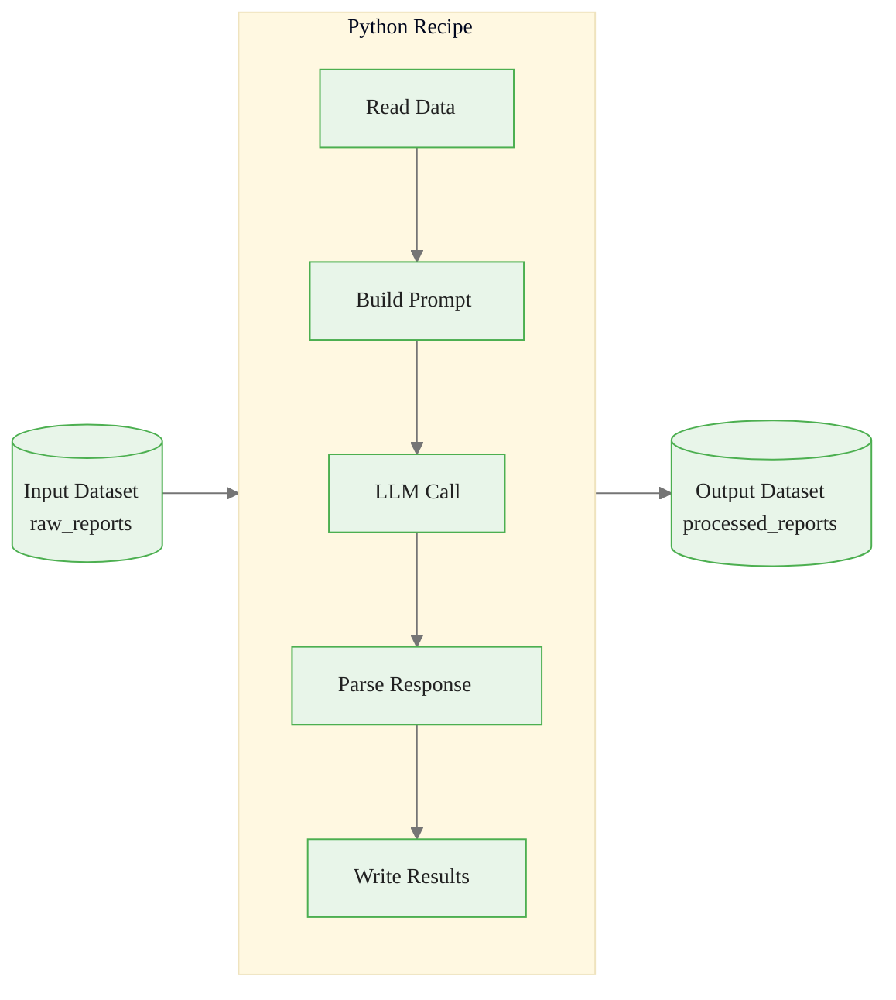
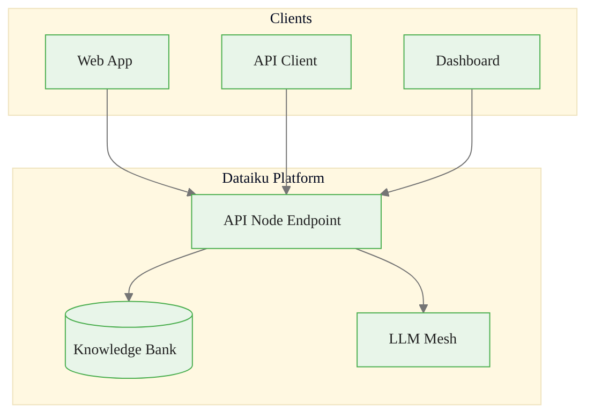
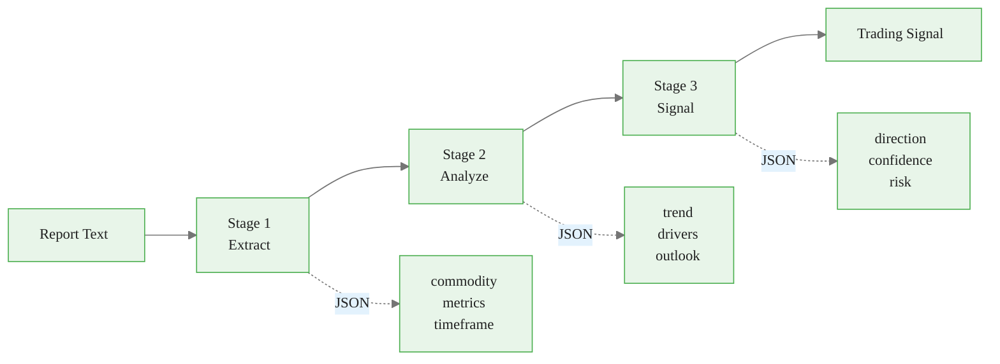

# Custom LLM Applications in Dataiku
## Module 3 — Dataiku GenAI Foundations

> Full flexibility with Python recipes

<!-- Speaker notes: This deck covers building custom LLM applications using Python recipes in Dataiku. By the end, learners will implement batch processing, custom endpoints, and multi-stage pipelines. Estimated time: 18 minutes. -->
---

<!-- _class: lead -->

# Basic LLM Recipes

<!-- Speaker notes: Transition to the Basic LLM Recipes section. -->
---

## Python Recipe Pattern

```python
import dataiku
import pandas as pd
from dataiku.llm import LLM

# Input/Output
input_dataset = dataiku.Dataset("raw_reports")
output_dataset = dataiku.Dataset("processed_reports")
df = input_dataset.get_dataframe()

# Setup LLM
llm = LLM("anthropic-claude")
```

<!-- Speaker notes: Code continues on the next slide. -->

---

## (continued)

```python
def extract_data(report_text: str) -> dict:
    prompt = f"""Extract from this commodity report:
    - Commodity name, Key metric, Value, Sentiment
    Report: {report_text}
    Return JSON only."""
    response = llm.complete(prompt, max_tokens=200, temperature=0)
    return json.loads(response.text)

# Process and write
results = [extract_data(row['report_text']) for _, row in df.iterrows()]
output_dataset.write_with_schema(pd.DataFrame(results))
```

<!-- Speaker notes: The basic recipe pattern: read dataset, process with LLM, write results. This is the foundation for all custom LLM processing in Dataiku. -->
---

## Recipe Architecture



<!-- Speaker notes: Visual overview of the recipe flow. Input dataset flows through prompt building, LLM call, response parsing, and output writing. -->
---

<!-- _class: lead -->

# Batch Processing Patterns

<!-- Speaker notes: Transition to the Batch Processing Patterns section. -->
---

## Parallel Processing

```python
from concurrent.futures import ThreadPoolExecutor, as_completed

def process_with_llm(row_data, llm_connection):
    llm = LLM(llm_connection)
    response = llm.complete(f"Analyze: {row_data['text']}", max_tokens=200)
    return {
        'id': row_data['id'],
        'analysis': response.text,
        'tokens_used': response.usage.total_tokens
    }

```

<!-- Speaker notes: Code continues on the next slide. -->

---

## (continued)

```python
results = []
with ThreadPoolExecutor(max_workers=5) as executor:
    futures = {
        executor.submit(process_with_llm, row, "anthropic-claude"): row['id']
        for row in df.to_dict('records')
    }
    for future in as_completed(futures):
        try:
            results.append(future.result())
        except Exception as e:
            results.append({'id': futures[future], 'error': str(e)})
```

<!-- Speaker notes: Parallel processing with ThreadPoolExecutor. Five workers process five rows simultaneously. Note the error handling per future -- one failure doesn't kill the batch. -->
---

## Parallel vs Sequential

```mermaid
%%{init: {"theme": "base", "themeVariables": {"primaryColor": "#e8f5e9", "primaryBorderColor": "#4caf50", "primaryTextColor": "#212121", "secondaryColor": "#e3f2fd", "tertiaryColor": "#fff8e1", "lineColor": "#757575", "fontFamily": "Inter, sans-serif", "fontSize": "14px"}}}%%
gantt
    title Processing Time Comparison
    dateFormat X
    axisFormat %s

    section Sequential
    Row 1    :0, 2
    Row 2    :2, 4
    Row 3    :4, 6
    Row 4    :6, 8
    Row 5    :8, 10

    section Parallel (5 workers)
    Row 1    :0, 2
    Row 2    :0, 2
    Row 3    :0, 2
    Row 4    :0, 2
    Row 5    :0, 2
```



| Approach | 100 Rows | 1000 Rows |
|----------|----------|-----------|
| Sequential | ~200s | ~2000s |
| Parallel (5x) | ~40s | ~400s |
| Parallel (10x) | ~20s | ~200s |

<!-- Speaker notes: The Gantt chart makes the speedup visual. 5x workers gives roughly 5x speedup. But watch out for rate limits at high parallelism. -->
---

## Chunked Processing for Large Datasets

```python
def process_in_chunks(input_name, output_name, chunk_size=100):
    input_ds = dataiku.Dataset(input_name)
    output_ds = dataiku.Dataset(output_name)
    llm = LLM("anthropic-claude")
    first_chunk = True

    for chunk_df in input_ds.iter_dataframes(chunksize=chunk_size):
        results = []
        for _, row in chunk_df.iterrows():
            try:
                response = llm.complete(
                    f"Summarize: {row['text']}", max_tokens=100)
                results.append({'id': row['id'], 'summary': response.text})
            except Exception as e:
                results.append({'id': row['id'], 'error': str(e)})
```

<!-- Speaker notes: Code continues on the next slide. -->

---

## (continued)

```python
        result_df = pd.DataFrame(results)
        if first_chunk:
            output_ds.write_with_schema(result_df)
            first_chunk = False
        else:
            output_ds.write_dataframe(result_df, infer_schema=False)
```

<!-- Speaker notes: Chunked processing for datasets that don't fit in memory. iter_dataframes reads in chunks. The first_chunk flag handles schema initialization. -->
---

<!-- _class: lead -->

# Building Custom Endpoints

<!-- Speaker notes: Transition to the Building Custom Endpoints section. -->
---

## API Node Endpoint

```python
def api_handler(request):
    """Handle API request for commodity Q&A."""
    body = json.loads(request.get('body', '{}'))
    question = body.get('question', '')

    if not question:
        return {'status_code': 400,
                'body': json.dumps({'error': 'Question required'})}

    # RAG: Retrieve + Generate
    kb = KnowledgeBank("commodity_reports_kb")
    llm = LLM("anthropic-claude")
```

<!-- Speaker notes: Code continues on the next slide. -->

---

## (continued)

```python
    results = kb.search(query=question, top_k=5)
    context = "\n\n".join([r.text for r in results])

    prompt = f"""Based on context, answer the question.
    Context: {context}
    Question: {question}"""

    response = llm.complete(prompt, max_tokens=300)

    return {'status_code': 200,
            'body': json.dumps({'answer': response.text})}
```

<!-- Speaker notes: API endpoint pattern for serving LLM capabilities as a REST service. Combines Knowledge Bank retrieval with LLM generation. -->
---

## Application Architecture



<!-- Speaker notes: Architecture showing clients connecting to the Dataiku API Node. The endpoint orchestrates Knowledge Bank and LLM Mesh behind a single API. -->
---

## Webapp Backend (Flask)

```python
# Pseudocode — ChatSession is not a real Dataiku import.
# Manage conversation history manually.
from flask import request, jsonify
import dataiku

chat_histories = {}  # session_id -> list of messages

def get_or_create_history(session_id):
    if session_id not in chat_histories:
        chat_histories[session_id] = [
            {"role": "system",
             "content": "You are a commodity market analyst."}
        ]
    return chat_histories[session_id]
```

<!-- Speaker notes: We manage conversation state manually rather than using a ChatSession class. The real Dataiku API uses project.get_llm() with completion objects. -->

---

## (continued)

```python
@app.route('/chat', methods=['POST'])
def chat():
    data = request.json
    session = get_or_create_session(data.get('session_id', 'default'))
    response = session.send(data.get('message', ''))
    return jsonify({'response': response.text})
```

<!-- Speaker notes: Flask webapp pattern with session management. The chat_sessions dict is in-memory -- Module 4 covers persistent alternatives. -->
---

<!-- _class: lead -->

# Multi-Stage Pipelines

<!-- Speaker notes: Transition to the Multi-Stage Pipelines section. -->
---

## CommodityAnalysisPipeline



<!-- Speaker notes: Visual representation of a three-stage pipeline. Each stage produces structured JSON that feeds the next stage. -->
---

## Pipeline Implementation

```python
class CommodityAnalysisPipeline:
    def __init__(self, llm_connection):
        self.llm = LLM(llm_connection)

    def stage1_extract(self, report_text):
        response = self.llm.complete(
            f"Extract commodity, metrics, timeframe from: {report_text}\nJSON.",
            max_tokens=200, temperature=0)
        return json.loads(response.text)

    def stage2_analyze(self, extracted):
        response = self.llm.complete(
            f"Analyze: {json.dumps(extracted)}\nTrend, drivers, outlook. JSON.",
            max_tokens=300)
        return json.loads(response.text)
```

<!-- Speaker notes: Code continues on the next slide. -->

---

## (continued)

```python
    def stage3_signal(self, analysis):
        response = self.llm.complete(
            f"Trading signal from: {json.dumps(analysis)}\n"
            f"Direction, confidence, risk. JSON.", max_tokens=150)
        return json.loads(response.text)

    def process(self, report_text):
        extracted = self.stage1_extract(report_text)
        analysis = self.stage2_analyze(extracted)
        return self.stage3_signal(analysis)
```

<!-- Speaker notes: Three-stage pipeline implementation. Each stage is a separate LLM call with specific extraction or analysis goals. The process method chains them together. -->

<div class="callout-warning">
Warning: Long-running LLM calls in recipes should implement timeout handling and partial result caching to avoid losing work on failures.
</div>

---

## Error Handling: RobustLLMProcessor

```python
class RobustLLMProcessor:
    def __init__(self, connection, max_retries=3):
        self.llm = LLM(connection)
        self.max_retries = max_retries

    def process(self, prompt, **kwargs):
        last_error = None
        for attempt in range(self.max_retries):
            try:
                response = self.llm.complete(prompt, **kwargs)
                if kwargs.get('expect_json', False):
                    return {'success': True,
```

<!-- Speaker notes: Code continues on the next slide. -->

<div class="callout-key">
Key Point: Use `dataiku.api_node_client()` for calling LLM endpoints in recipes. This automatically handles authentication, retries, and usage tracking.
</div>

---

## (continued)

```python
                            'data': json.loads(response.text)}
                return {'success': True, 'text': response.text}
            except json.JSONDecodeError:
                prompt += "\n\nIMPORTANT: Return valid JSON only."
                last_error = "Invalid JSON"
            except Exception as e:
                last_error = e
                time.sleep(2 ** attempt)  # Exponential backoff

        return {'success': False, 'error': str(last_error)}
```

<!-- Speaker notes: Production error handling pattern. Retries with exponential backoff. JSON validation with automatic prompt correction. Returns structured success/error results. -->

<div class="callout-insight">
Insight: Python recipes in Dataiku execute within the project's managed code environment, giving you access to all LLM Mesh connections without manual API key management.
</div>

---

## Key Takeaways

1. **Python recipes** provide full flexibility for custom LLM logic in Dataiku
2. **Parallel processing** with ThreadPoolExecutor speeds up batch operations
3. **Chunked processing** handles large datasets without memory issues
4. **API endpoints** expose LLM capabilities as services for external consumers
5. **Multi-stage pipelines** chain LLM calls for complex analysis workflows
6. **Error handling** with retries and exponential backoff is essential for production

> Python recipes are the bridge between Prompt Studios and production-grade LLM applications.

<!-- Speaker notes: Recap the main points. Ask if there are questions before moving to the next topic. -->

<div class="callout-info">
Info:  provide full flexibility for custom LLM logic in Dataiku
2. 
</div>
