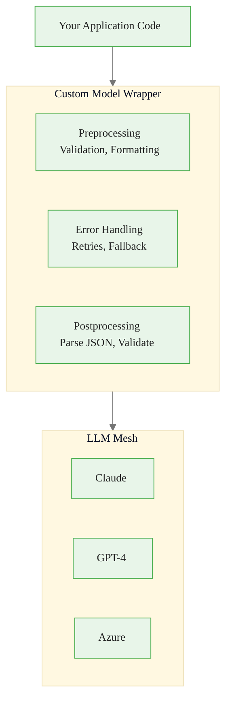
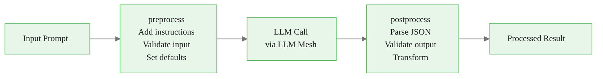
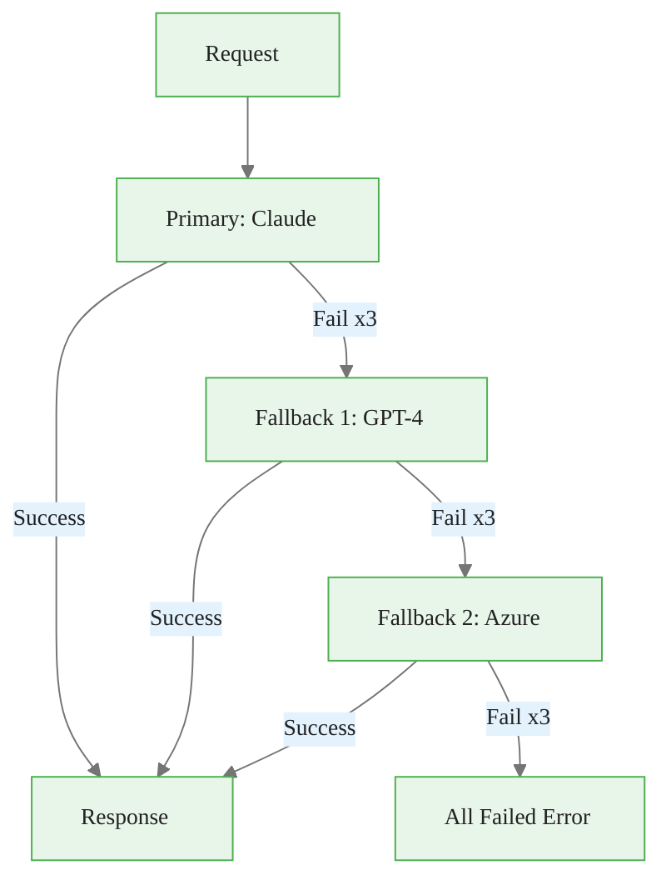
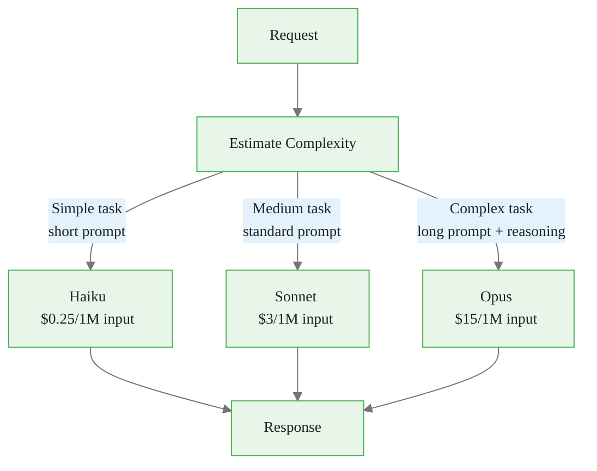
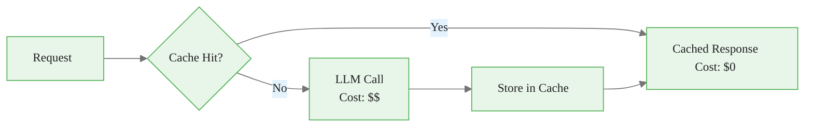

# Custom Model Wrappers in Dataiku
## Module 3 — Dataiku GenAI Foundations

> Middleware for production LLM applications

<!-- Speaker notes: This deck covers custom model wrappers -- the middleware pattern for production LLM applications. By the end, learners will build JSON extractors, retry handlers, cost routers, and domain-specific wrappers. Estimated time: 20 minutes. -->
---

<!-- _class: lead -->

# Why Custom Wrappers?

<!-- Speaker notes: Transition to the Why Custom Wrappers? section. -->
---

## Key Insight

> Production LLM applications require more than just API calls -- they need error handling, response validation, cost optimization, and domain-specific logic. Custom wrappers provide a clean abstraction layer that encapsulates this complexity, making advanced LLM patterns **reusable across projects**.

<!-- Speaker notes: Read the insight aloud, then expand with an example from the audience's domain. -->

---

## The Middleware Analogy



> Just as web middleware handles auth, logging, and errors, LLM wrappers handle retries, parsing, and validation.

<!-- Speaker notes: The middleware analogy connects to developers' existing mental models. Pre-processing, error handling, post-processing -- same pattern as web middleware. -->
---

<!-- _class: lead -->

# Base Wrapper Pattern

<!-- Speaker notes: Transition to the Base Wrapper Pattern section. -->
---

## BaseLLMWrapper

```python
class BaseLLMWrapper:
    def __init__(self, connection_name, **kwargs):
        self.llm = LLM(connection_name)
        self.config = kwargs

    def preprocess(self, prompt, **kwargs):
        """Override to add preprocessing logic."""
        return prompt, kwargs  # Default: pass through
```

<!-- Speaker notes: Code continues on the next slide. -->

---

## (continued)

```python
    def postprocess(self, response):
        """Override to add postprocessing logic."""
        return response  # Default: pass through

    def complete(self, prompt, **kwargs):
        processed_prompt, processed_kwargs = self.preprocess(prompt, **kwargs)
        response = self.llm.complete(processed_prompt, **processed_kwargs)
        return self.postprocess(response)
```

<!-- Speaker notes: The base class defines three extension points: preprocess, postprocess, and complete. All specialized wrappers inherit from this. -->

<div class="callout-key">
Key Point: kwargs):
        processed_prompt, processed_kwargs = self.preprocess(prompt, 
</div>

---

## Wrapper Extension Points



| Extension Point | What You Can Do |
|----------------|-----------------|
| `preprocess` | Add instructions, validate, set defaults |
| `postprocess` | Parse JSON, validate schema, transform |
| `complete` | Add retries, fallback, caching |

<!-- Speaker notes: Visual showing the three extension points in the request lifecycle. Preprocessing adds instructions, postprocessing parses results. -->
---

<!-- _class: lead -->

# JSON Extraction Wrapper

<!-- Speaker notes: Transition to the JSON Extraction Wrapper section. -->
---

## JSONExtractorLLM

```python
class JSONExtractorLLM(BaseLLMWrapper):
    def __init__(self, connection_name, max_retries=3):
        super().__init__(connection_name)
        self.max_retries = max_retries

    def preprocess(self, prompt, **kwargs):
        if "Return valid JSON" not in prompt:
            prompt += "\n\nReturn valid JSON only. No explanatory text."
        kwargs['temperature'] = kwargs.get('temperature', 0)
        return prompt, kwargs

    def postprocess(self, response):
        text = response.text.strip()
        # Extract JSON from markdown code blocks
        if '```json' in text:
            text = text.split('```json')[1].split('```')[0].strip()
        return json.loads(text)

    def complete(self, prompt, **kwargs):
        for attempt in range(self.max_retries):
            try:
                return super().complete(prompt, **kwargs)
            except json.JSONDecodeError:
                prompt += "\nPrevious attempt was invalid JSON. Return ONLY valid JSON."
        raise ValueError(f"Failed after {self.max_retries} attempts")
```

<!-- Speaker notes: The JSON extractor adds 'Return valid JSON' to prompts, strips markdown code blocks from responses, and retries on parse failures. This is the most-used wrapper. -->
---

## JSON Wrapper in Action

```python
json_llm = JSONExtractorLLM('anthropic-claude')

result = json_llm.complete("""
Extract from this report:
- inventory_change (number)
- sentiment (bullish/bearish/neutral)
- key_factors (list of strings)

Report: U.S. crude inventories fell 5.2 million barrels...
""")

print(result)
# {'inventory_change': -5.2, 'sentiment': 'bullish',
#  'key_factors': ['large draw', 'below average']}
```

> Automatic JSON parsing, retry on failure, markdown extraction -- all transparent to the caller.

<!-- Speaker notes: Usage example showing clean API. The caller just passes a prompt and gets back a Python dict. All JSON handling is transparent. -->
---

<!-- _class: lead -->

# Retry and Fallback Wrapper

<!-- Speaker notes: Transition to the Retry and Fallback Wrapper section. -->
---

## RetryFallbackLLM



<!-- Speaker notes: Retry and fallback flowchart. Three retries per connection, then move to the next fallback. This provides production-grade resilience. -->
---

## RetryFallbackLLM Implementation

```python
class RetryFallbackLLM(BaseLLMWrapper):
    def __init__(self, primary_connection, fallback_connections,
                 max_retries=3, retry_delay=1.0):
        super().__init__(primary_connection)
        self.fallback_connections = fallback_connections
        self.max_retries = max_retries
        self.retry_delay = retry_delay

    def complete(self, prompt, **kwargs):
        connections = [self.llm] + [LLM(c) for c in self.fallback_connections]

```

<!-- Speaker notes: Code continues on the next slide. -->

---

## (continued)

```python
        for conn_idx, connection in enumerate(connections):
            for attempt in range(self.max_retries):
                try:
                    processed_prompt, processed_kwargs = self.preprocess(
                        prompt, **kwargs)
                    response = connection.complete(
                        processed_prompt, **processed_kwargs)
                    return self.postprocess(response)
                except Exception as e:
                    if attempt < self.max_retries - 1:
                        time.sleep(self.retry_delay * (2 ** attempt))

        raise RuntimeError("All connections failed")
```

<!-- Speaker notes: Implementation uses nested loops: outer loop over connections, inner loop for retries with exponential backoff. -->
---

<!-- _class: lead -->

# Cost-Optimized Router

<!-- Speaker notes: Transition to the Cost-Optimized Router section. -->
---

## CostOptimizedLLM



<!-- Speaker notes: Cost router that sends simple tasks to cheap models and complex tasks to expensive ones. The decision tree shows the routing logic. -->
---

## Complexity Estimation

```python
class CostOptimizedLLM(BaseLLMWrapper):
    def estimate_complexity(self, prompt):
        estimated_tokens = len(prompt) // 4
        has_code = 'def ' in prompt or 'class ' in prompt
        has_analysis = any(w in prompt.lower()
            for w in ['analyze', 'compare', 'evaluate'])
        has_reasoning = any(w in prompt.lower()
            for w in ['explain', 'justify', 'prove'])

        score = estimated_tokens
        if has_code: score += 1000
        if has_analysis: score += 500
        if has_reasoning: score += 500
```

<!-- Speaker notes: Code continues on the next slide. -->

---

## (continued)

```python
        if score > 5000: return 'high'
        elif score > 1000: return 'medium'
        else: return 'low'

    def complete(self, prompt, force_tier=None, **kwargs):
        tier = force_tier or self.estimate_complexity(prompt)
        connection = self.connections[tier]
        return connection.complete(prompt, **kwargs)
```

<!-- Speaker notes: The complexity estimator is simple -- keyword detection and token estimation. It's not perfect but catches the obvious cases. Use force_tier to override. -->
---

<!-- _class: lead -->

# Domain-Specific Wrapper

<!-- Speaker notes: Transition to the Domain-Specific Wrapper section. -->
---

## CommodityAnalysisLLM

```python
class CommodityAnalysisLLM(BaseLLMWrapper):
    SYSTEM_PROMPT = """You are an expert commodity market analyst.
Your analysis should:
- Cite specific data points from source material
- Provide bullish/bearish/neutral sentiment with confidence
- Be objective and data-driven
Always return structured JSON output."""

    def preprocess(self, prompt, **kwargs):
        full_prompt = f"{self.SYSTEM_PROMPT}\n\n{prompt}"
        kwargs.setdefault('temperature', 0.3)
        kwargs.setdefault('max_tokens', 1500)
        return full_prompt, kwargs
```

<!-- Speaker notes: Code continues on the next slide. -->

---

## (continued)

```python
    def analyze_report(self, commodity, report_text, metrics=None):
        prompt = f"""Analyze this {commodity} market report:
{report_text}
Return JSON: metrics, sentiment, confidence, key_factors, outlook"""
        return self.complete(prompt)

    def compare_reports(self, commodity, reports):
        reports_text = "\n\n".join(
            [f"## {r['source']}\n{r['content']}" for r in reports])
        prompt = f"Compare these {commodity} reports:\n{reports_text}\nJSON."
        return self.complete(prompt)
```

<!-- Speaker notes: Domain-specific wrapper that encapsulates the system prompt, default parameters, and domain methods. Analysts call analyze_report() instead of raw LLM calls. -->
---

## Domain Wrapper Usage

```python
commodity_llm = CommodityAnalysisLLM('anthropic-claude')

# Single report analysis
analysis = commodity_llm.analyze_report(
    commodity='crude_oil',
    report_text="U.S. commercial crude oil inventories decreased...",
    metrics=['inventory_change', 'production', 'imports']
)
```

<!-- Speaker notes: Code continues on the next slide. -->

---

## (continued)

```python
# Multi-report comparison
comparison = commodity_llm.compare_reports(
    commodity='natural_gas',
    reports=[
        {'source': 'EIA', 'content': 'Storage increased...'},
        {'source': 'IEA', 'content': 'Global supply...'}
    ]
)
```

> Domain wrappers encapsulate system prompts, defaults, and domain-specific methods.

<!-- Speaker notes: Clean API for domain users. Single report analysis and multi-report comparison with one method call each. -->
---

<!-- _class: lead -->

# Caching Wrapper

<!-- Speaker notes: Transition to the Caching Wrapper section. -->
---

## CachedLLM

```python
class CachedLLM(BaseLLMWrapper):
    def __init__(self, connection_name, cache_backend=None):
        super().__init__(connection_name)
        self.cache = cache_backend or {}

    def _cache_key(self, prompt, **kwargs):
        cache_str = f"{prompt}||{kwargs.get('temperature', 0.7)}"
        return hashlib.sha256(cache_str.encode()).hexdigest()

```

<!-- Speaker notes: Code continues on the next slide. -->

---

## (continued)

```python
    def complete(self, prompt, use_cache=True, **kwargs):
        if use_cache:
            key = self._cache_key(prompt, **kwargs)
            if key in self.cache:
                return self.cache[key]  # Cache hit -- free!

        result = super().complete(prompt, **kwargs)

        if use_cache:
            self.cache[key] = result
        return result
```



<!-- Speaker notes: Caching wrapper uses SHA-256 hash of prompt + temperature as cache key. Cache hit returns instantly at zero cost. Essential for repeated queries. -->

<div class="callout-insight">
Insight: kwargs):
        if use_cache:
            key = self._cache_key(prompt, 
</div>

---

## Wrapper Selection Guide

| Wrapper | Use When |
|---------|----------|
| **JSONExtractorLLM** | Need structured data from LLM |
| **RetryFallbackLLM** | Production reliability required |
| **CostOptimizedLLM** | Budget constraints, mixed complexity |
| **CommodityAnalysisLLM** | Domain-specific analysis tasks |
| **CachedLLM** | Repeated similar queries |

> Wrappers can be **composed**: `CachedLLM(RetryFallbackLLM(JSONExtractorLLM(...)))`

<!-- Speaker notes: Quick reference for choosing the right wrapper. Key insight: wrappers compose -- you can nest CachedLLM around RetryFallbackLLM around JSONExtractorLLM. -->

<div class="callout-warning">
Warning:  | Need structured data from LLM |
| 
</div>

---

## Key Takeaways

1. **BaseLLMWrapper** provides a clean pre/postprocess pattern for all wrappers
2. **JSONExtractorLLM** guarantees structured output with automatic retry
3. **RetryFallbackLLM** provides production resilience across multiple providers
4. **CostOptimizedLLM** routes requests to appropriate model tiers by complexity
5. **Domain wrappers** encapsulate system prompts and domain-specific methods
6. **CachedLLM** eliminates redundant API calls and reduces costs

> Write the wrapper once, use it everywhere -- consistent behavior across all LLM interactions.

<!-- Speaker notes: Recap the main points. Ask if there are questions before moving to the next topic. -->

<div class="callout-key">
Key Point: Custom models in Dataiku can wrap any LLM pipeline -- use this to create domain-specific models that combine retrieval, prompting, and post-processing.
</div>
