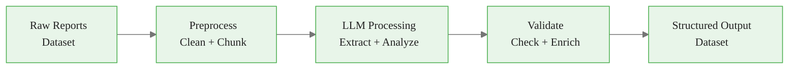
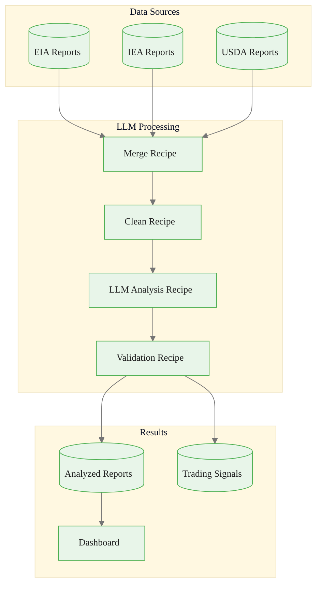
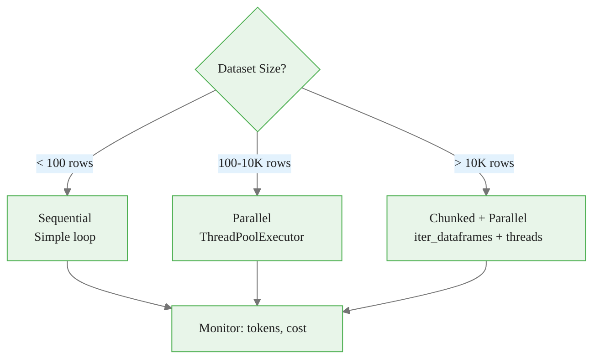
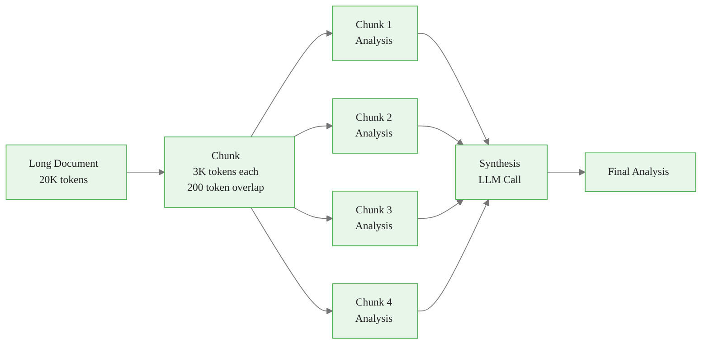
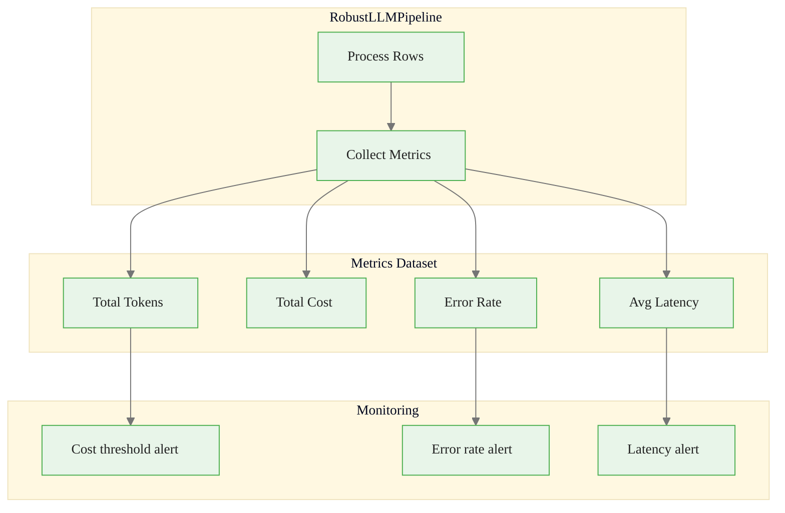
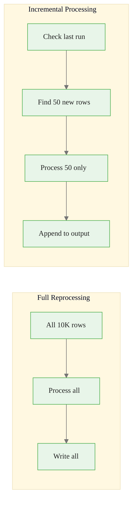

# Integrating LLMs into Dataiku Pipelines
## Module 3 — Dataiku GenAI Foundations

> Treat LLMs as transformation steps in data pipelines

<!-- Speaker notes: This deck covers integrating LLMs as transformation steps in Dataiku pipelines. By the end, learners will build batch processors, chunked handlers, monitored pipelines, and incremental processors. Estimated time: 20 minutes. -->
---

<!-- _class: lead -->

# Why Pipeline Integration?

<!-- Speaker notes: Transition to the Why Pipeline Integration? section. -->
---

## Key Insight

> The real power of LLMs in data pipelines comes from treating them as **transformation steps** -- not standalone applications. You gain automatic dependency tracking, version control, scheduling, monitoring, and governance that would require extensive custom engineering otherwise.

<!-- Speaker notes: Read the insight aloud, then expand with an example from the audience's domain. -->

---

## The Assembly Line Analogy



| Assembly Line | Data Pipeline |
|--------------|---------------|
| Raw materials enter | Raw text ingested |
| Cutting, welding stations | Preprocessing recipes |
| Quality inspection | LLM extraction + analysis |
| Packaging | Validation + formatting |
| Finished product | Structured insights |

<!-- Speaker notes: The assembly line analogy maps each pipeline step to a station. The LLM is just one station -- not the whole factory. -->
---

<!-- _class: lead -->

# Basic LLM Recipe Integration

<!-- Speaker notes: Transition to the Basic LLM Recipe Integration section. -->
---

## Processing Reports with LLMs

```python
# Input/Output
input_dataset = dataiku.Dataset("raw_market_reports")
df_input = input_dataset.get_dataframe()
llm = LLM("anthropic-claude")

ANALYSIS_PROMPT = """Analyze this {commodity} market report:
{report_text}

Extract: inventory_change, production, sentiment, key_factors
Return JSON only."""

```

<!-- Speaker notes: Code continues on the next slide. -->

---

## (continued)

```python
def process_row(row):
    try:
        prompt = ANALYSIS_PROMPT.format(
            commodity=row['commodity'], report_text=row['report_text'])
        response = llm.complete(prompt, temperature=0, max_tokens=500)
        data = json.loads(response.text)
        return {'report_id': row['report_id'], 'status': 'success',
                'tokens_used': response.usage.total_tokens, **data}
    except Exception as e:
        return {'report_id': row['report_id'], 'status': 'error',
                'error_message': str(e)}

results = df_input.apply(process_row, axis=1, result_type='expand')
dataiku.Dataset("analyzed_reports").write_with_schema(results)
```

<!-- Speaker notes: Basic recipe pattern with error handling per row. The process_row function returns either success data or an error record. No row failure kills the pipeline. -->
---

## Pipeline Flow in Dataiku



<!-- Speaker notes: Full pipeline diagram showing data flow from three sources through merge, clean, LLM analysis, and validation to outputs and dashboards. -->
---

<!-- _class: lead -->

# Parallel Batch Processing

<!-- Speaker notes: Transition to the Parallel Batch Processing section. -->
---

## BatchLLMProcessor

```python
class BatchLLMProcessor:
    def __init__(self, connection_name, max_workers=10):
        self.connection_name = connection_name
        self.max_workers = max_workers

    def process_batch(self, df, prompt_template, variable_columns):
        def process_row(row_tuple):
            idx, row = row_tuple
            llm = LLM(self.connection_name)
            prompt_vars = {var: row[col]
                          for var, col in variable_columns.items()}
            prompt = prompt_template.format(**prompt_vars)
            try:
                response = llm.complete(prompt, temperature=0, max_tokens=500)
                return {'index': idx, 'status': 'success',
```

<!-- Speaker notes: Code continues on the next slide. -->

---

## (continued)

```python
                        'output': response.text,
                        'tokens': response.usage.total_tokens}
            except Exception as e:
                return {'index': idx, 'status': 'error', 'error': str(e)}

        with ThreadPoolExecutor(max_workers=self.max_workers) as executor:
            futures = {executor.submit(process_row, rt): rt[0]
                       for rt in df.iterrows()}
            return [f.result() for f in as_completed(futures)]
```

<!-- Speaker notes: The BatchLLMProcessor wraps parallel processing in a reusable class. Pass a template and column mapping, get results back. -->
---

## Scaling Strategy



| Dataset Size | Strategy | Workers | Est. Time (1s/row) |
|-------------|----------|---------|-------------------|
| 50 rows | Sequential | 1 | ~50s |
| 500 rows | Parallel | 5 | ~100s |
| 5,000 rows | Parallel | 10 | ~500s |
| 50,000 rows | Chunked+Parallel | 10 | ~5,000s |

<!-- Speaker notes: Decision tree for choosing processing strategy based on dataset size. Sequential for small, parallel for medium, chunked+parallel for large. -->
---

<!-- _class: lead -->

# Chunked Processing for Long Texts

<!-- Speaker notes: Transition to the Chunked Processing for Long Texts section. -->
---

## Handling Documents That Exceed Context Limits



<!-- Speaker notes: Chunk-and-synthesize pattern. Long documents are split into chunks, each analyzed independently, then a synthesis LLM call combines the results. -->
---

## Chunking Implementation

```python
def chunk_text(text, max_chunk_tokens=3000, overlap_tokens=200):
    max_chars = max_chunk_tokens * 4
    overlap_chars = overlap_tokens * 4
    chunks, start = [], 0

    while start < len(text):
        end = start + max_chars
        if end < len(text):
```

<!-- Speaker notes: Code continues on the next slide. -->

---

## (continued)

```python
            # Break on sentence boundary
            sentence_end = text.rfind('. ', end - max_chars // 5, end)
            if sentence_end > start:
                end = sentence_end + 1
        chunks.append(text[start:end])
        start = end - overlap_chars if end < len(text) else end
    return chunks

# Process each chunk, then synthesize
chunk_results = [llm.complete(f"Analyze: {c}").text for c in chunks]
synthesis = llm.complete(
    f"Synthesize these analyses:\n" + "\n---\n".join(chunk_results)
)
```

<!-- Speaker notes: Smart chunking that breaks on sentence boundaries to avoid splitting mid-thought. The overlap prevents losing context at chunk boundaries. -->
---

<!-- _class: lead -->

# Production Pipeline with Monitoring

<!-- Speaker notes: Transition to the Production Pipeline with Monitoring section. -->
---

## RobustLLMPipeline

```python
class RobustLLMPipeline:
    def __init__(self, connection_name, metrics_dataset=None):
        self.llm = LLM(connection_name)
        self.metrics_dataset = metrics_dataset
        self.metrics = []

    def process_with_retry(self, prompt, max_retries=3):
        for attempt in range(max_retries):
            try:
                start = time.time()
                response = self.llm.complete(prompt, temperature=0)
                self.metrics.append({
                    'timestamp': datetime.now(),
                    'status': 'success',
                    'tokens': response.usage.total_tokens,
                    'cost': response.cost,
                    'latency_sec': time.time() - start
                })
                return {'status': 'success', 'output': response.text}
```

<!-- Speaker notes: Code continues on the next slide. -->

---

## (continued)

```python
            except Exception as e:
                self.metrics.append({
                    'timestamp': datetime.now(),
                    'status': 'error', 'error': str(e)
                })
                time.sleep(2 ** attempt)
        return {'status': 'error', 'error': str(e)}
```

<!-- Speaker notes: Production pipeline with built-in metrics collection. Every request records timestamp, status, tokens, cost, and latency. Retry with exponential backoff on failure. -->
---

## Pipeline Monitoring Dashboard



<!-- Speaker notes: Visual showing metrics flowing from the pipeline into monitoring dashboards and alerts. Cost, error rate, and latency alerts catch issues early. -->
---

<!-- _class: lead -->

# Incremental Processing

<!-- Speaker notes: Transition to the Incremental Processing section. -->
---

## Only Process New Records

```python
def incremental_llm_processing(input_name, output_name,
                                timestamp_column, lookback_days=1):
    # Load existing output
    try:
        output_df = dataiku.Dataset(output_name).get_dataframe()
        last_processed = output_df[timestamp_column].max()
    except:
        last_processed = datetime.now() - timedelta(days=lookback_days)
        output_df = pd.DataFrame()

    # Get only new records
    input_df = dataiku.Dataset(input_name).get_dataframe()
    new_records = input_df[input_df[timestamp_column] > last_processed]
```

<!-- Speaker notes: Code continues on the next slide. -->

---

## (continued)

```python
    if len(new_records) == 0:
        return  # Nothing to process

    # Process new records
    llm = LLM("anthropic-claude")
    results = []
    for _, row in new_records.iterrows():
        response = llm.complete(f"Analyze: {row['text']}", max_tokens=500)
        results.append({'id': row['id'], 'output': response.text})

    # Append to existing output
    combined = pd.concat([output_df, pd.DataFrame(results)])
    dataiku.Dataset(output_name).write_with_schema(combined)
```

<!-- Speaker notes: Incremental processing pattern. Check the timestamp of the last processed record, process only new ones, append to output. Saves massive cost on daily runs. -->

<div class="callout-warning">
Warning: Pipeline steps that call LLMs should always have fallback behaviour defined -- provider outages are common and should not crash your workflow.
</div>

---

## Incremental vs Full Processing



| Approach | Daily Run (50 new) | Cost/Day |
|----------|-------------------|----------|
| **Full** | 10,000 rows | ~$50 |
| **Incremental** | 50 rows | ~$0.25 |

<!-- Speaker notes: The cost comparison is compelling: $50/day for full reprocessing vs $0.25/day for incremental. This is often the single biggest cost optimization. -->

<div class="callout-key">
Key Point: Use Dataiku scenarios to orchestrate LLM pipelines with retry logic, error handling, and quality checks between steps.
</div>

---

## Five Common Pitfalls

| Pitfall | Impact | Fix |
|---------|--------|-----|
| **Sequential processing** | Days for large datasets | Use ThreadPoolExecutor |
| **No error isolation** | One failure kills pipeline | Wrap each row in try/except |
| **No cost controls** | Budget exhaustion | Estimate before processing |
| **Ignoring token limits** | Context window errors | Chunk long documents |
| **No observability** | Black-box pipelines | Log tokens, costs, latency |

<!-- Speaker notes: Key pitfall: 'Sequential processing' -- days for large datasets. ThreadPoolExecutor is the fix. Always parallelize batch LLM operations. -->

<div class="callout-insight">
Insight: The most effective LLM pipelines in Dataiku chain multiple steps: retrieve context, construct prompt, generate response, validate output, and store results.
</div>

---

## Key Takeaways

1. **LLMs as transformation steps** integrate naturally into Dataiku data pipelines
2. **Parallel batch processing** scales to thousands of rows with ThreadPoolExecutor
3. **Chunked processing** handles documents exceeding model context limits
4. **Retry logic** with exponential backoff ensures production reliability
5. **Incremental processing** only handles new records, saving time and cost
6. **Metrics collection** enables monitoring dashboards and cost tracking

> Production LLM pipelines need the same engineering rigor as any data pipeline.

<!-- Speaker notes: Recap the main points. Ask if there are questions before moving to the next topic. -->

<div class="callout-warning">
Warning: LLMs as transformation steps
</div>
