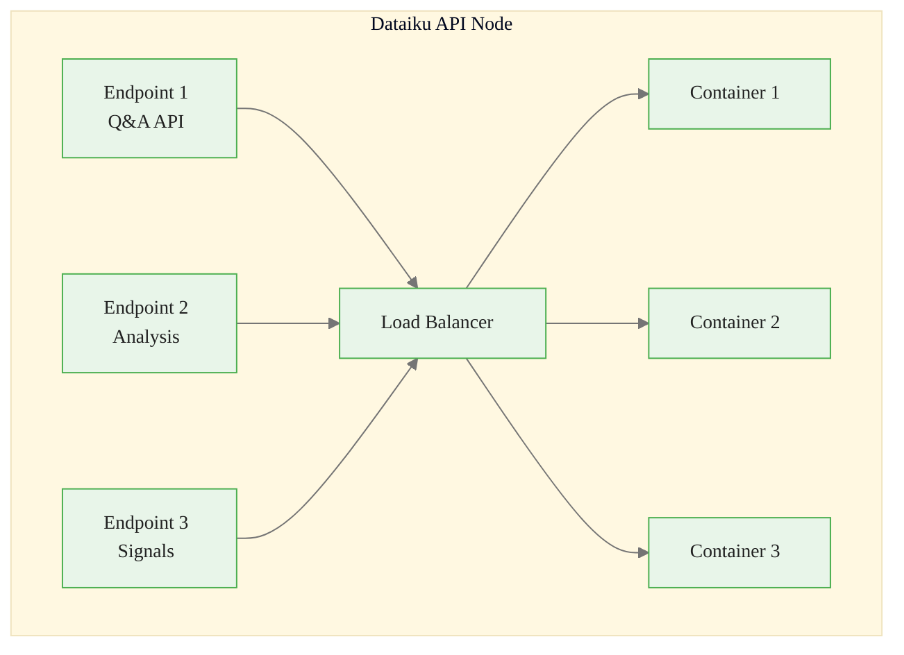
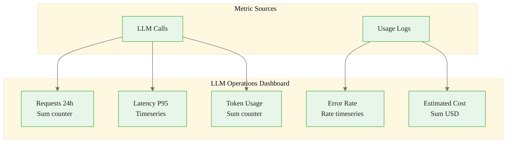
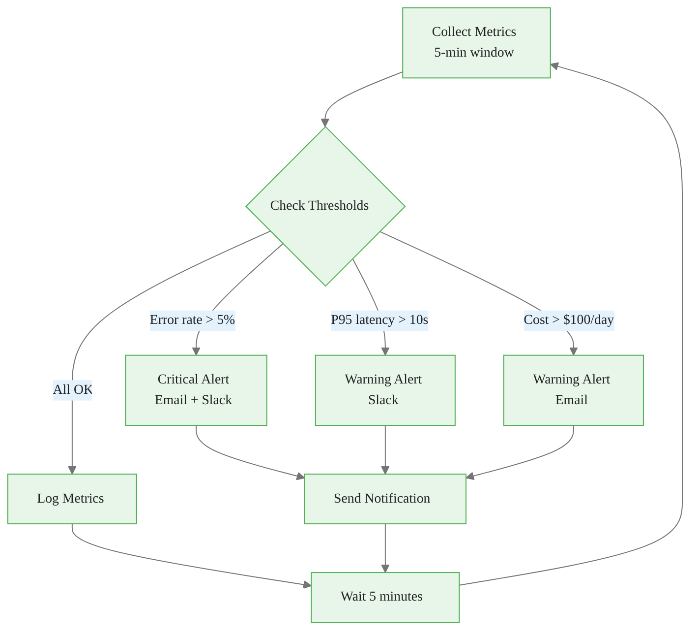
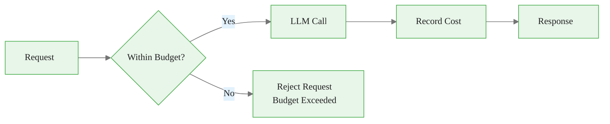

# Deployment and Monitoring in Dataiku
## Module 4 — Dataiku GenAI Foundations

> From prototype to production with observability

<!-- Speaker notes: This deck covers deploying LLM applications via API Node and setting up production monitoring. By the end, learners will configure endpoints, monitoring, alerting, and cost management. Estimated time: 18 minutes. -->
---

<!-- _class: lead -->

# API Node Deployment

<!-- Speaker notes: Transition to the API Node Deployment section. -->
---

## Deployment Architecture



<!-- Speaker notes: API Node architecture with load balancer and multiple containers. This is Dataiku's production deployment pattern for LLM services. -->
---

## Creating an API Endpoint

```python
def process_commodity_query(query: str, commodity: str = None) -> dict:
    """Process commodity market query."""
    kb = KnowledgeBank("commodity_reports_kb")
    llm = LLM("anthropic-claude")

    # Retrieve context
    filters = {"commodity": commodity} if commodity else None
    results = kb.search(query=query, top_k=5, filters=filters)
    context = "\n\n".join([r.text for r in results])

```

<!-- Speaker notes: Code continues on the next slide. -->

---

## (continued)

```python
    # Generate response
    prompt = f"""Answer based on this context:
    {context}
    Question: {query}"""

    response = llm.complete(prompt, max_tokens=500)

    return {
        "answer": response.text,
        "sources": [r.metadata.get("source") for r in results],
        "confidence": "high" if results[0].score > 0.8 else "medium"
    }
```

<!-- Speaker notes: Complete API endpoint handler. Combines Knowledge Bank retrieval with LLM generation. Note the confidence scoring based on retrieval relevance. -->
---

## Deployment Configuration

```yaml
api_service:
  name: commodity-analysis-api
  version: "1.0.0"
  infrastructure:
    type: kubernetes
    replicas: 3
    resources:
      cpu: "2"
      memory: "4Gi"
  endpoints:
    - name: commodity_qa
      path: /api/v1/query
      method: POST
      rate_limit: 100  # requests per minute
  authentication:
    type: api_key
    header: X-API-Key
  monitoring:
    enabled: true
    metrics_endpoint: /metrics
```

<!-- Speaker notes: YAML configuration for the API service. Key settings: replicas for scaling, rate_limit for protection, authentication for security, monitoring for observability. -->
---

<!-- _class: lead -->

# Monitoring Setup

<!-- Speaker notes: Transition to the Monitoring Setup section. -->
---

## Built-in Metrics

| Metric | Description |
|--------|-------------|
| `llm_requests_total` | Total LLM API calls |
| `llm_tokens_total` | Total tokens consumed |
| `llm_latency_seconds` | Response time histogram |
| `llm_errors_total` | Error count by type |
| `llm_cost_usd` | Estimated cost |

<!-- Speaker notes: Five built-in metrics that every LLM deployment should track. Requests, tokens, latency, errors, and cost. These feed dashboards and alerts. -->
---

## MonitoredLLM Wrapper

```python
class MonitoredLLM:
    def __init__(self, connection: str):
        self.llm = LLM(connection)
        self.metrics = MetricsClient()

```

<!-- Speaker notes: Code continues on the next slide. -->

---

## (continued)

```python
    def complete(self, prompt: str, **kwargs) -> dict:
        start_time = time.time()
        try:
            response = self.llm.complete(prompt, **kwargs)
            latency = time.time() - start_time
            self.metrics.gauge("llm_latency", latency, tags={
                "connection": self.llm.connection_name, "status": "success"
            })
            self.metrics.increment("llm_tokens",
                value=response.usage.total_tokens,
                tags={"connection": self.llm.connection_name}
            )
            return response
```

<!-- Speaker notes: Code continues on the next slide. -->

---

## (continued)

```python
        except Exception as e:
            self.metrics.increment("llm_requests", tags={
                "status": "error", "error_type": type(e).__name__
            })
            raise
```

<!-- Speaker notes: The MonitoredLLM wrapper adds metrics collection to every LLM call. Latency gauge, token counter, and error tracking -- all transparent to the caller. -->
---

## Monitoring Dashboard



<!-- Speaker notes: Dashboard layout with five panels. Requests and tokens are counters, latency is a timeseries, error rate and cost are rates. All sourced from LLM calls and usage logs. -->
---

<!-- _class: lead -->

# Alerting

<!-- Speaker notes: Transition to the Alerting section. -->
---

## Alert Configuration

```yaml
alerts:
  - name: high_error_rate
    condition: rate(llm_errors[5m]) / rate(llm_requests[5m]) > 0.05
    severity: critical
    notification: [email, slack]

  - name: high_latency
    condition: histogram_quantile(0.95, llm_latency_seconds) > 10
    severity: warning
    notification: [slack]

  - name: daily_cost_exceeded
    condition: sum(llm_cost_usd{period="daily"}) > 100
    severity: warning
    notification: [email]

  - name: rate_limit_approaching
    condition: rate(llm_requests[1m]) > 80  # 80% of limit
    severity: info
    notification: [slack]
```

<!-- Speaker notes: YAML alert configuration with four alert types. Critical for error rate, warning for latency and cost. The rate_limit_approaching alert is proactive prevention. -->
---

## Programmatic Alerts



<!-- Speaker notes: Alert flow diagram. Metrics collected, thresholds checked, notifications sent. The 5-minute cycle is a good balance between responsiveness and noise. -->
---

<!-- _class: lead -->

# Cost Management

<!-- Speaker notes: Transition to the Cost Management section. -->
---

## CostTracker

```python
class CostTracker:
    COSTS = {
        "claude-sonnet-4": {"input": 3.0, "output": 15.0},
        "gpt-4o": {"input": 2.5, "output": 10.0},
        "claude-3-haiku": {"input": 0.25, "output": 1.25}
    }

```

<!-- Speaker notes: Code continues on the next slide. -->

---

## (continued)

```python
    def record_usage(self, model, input_tokens, output_tokens):
        costs = self.COSTS.get(model, {"input": 5.0, "output": 15.0})
        cost = (input_tokens * costs["input"] / 1_000_000 +
                output_tokens * costs["output"] / 1_000_000)
        self.metrics.increment("llm_cost_usd", value=cost,
                               tags={"model": model})
        return cost

    def check_budget(self, daily_limit):
        current = self.daily_costs.get(today, 0)
        return {"current_cost": current, "remaining": daily_limit - current,
                "percent_used": (current / daily_limit) * 100,
                "within_budget": current < daily_limit}
```

<!-- Speaker notes: CostTracker with per-model pricing. Note: these prices will change -- add a 'verify current pricing' step to your deployment checklist. -->

<div class="callout-danger">
Danger: Production LLM endpoints without rate limiting and cost caps can generate unbounded charges from automated or adversarial usage.
</div>

---

## BudgetEnforcedLLM



```python
class BudgetEnforcedLLM:
    def __init__(self, connection: str, daily_budget: float):
        self.llm = LLM(connection)
        self.cost_tracker = CostTracker()
        self.daily_budget = daily_budget

    def complete(self, prompt: str, **kwargs) -> dict:
        budget_status = self.cost_tracker.check_budget(self.daily_budget)
        if not budget_status["within_budget"]:
            raise Exception(f"Daily budget exceeded: "
                f"${budget_status['current_cost']:.2f}")
        response = self.llm.complete(prompt, **kwargs)
        self.cost_tracker.record_usage(...)
        return response
```

<!-- Speaker notes: Budget enforcement wrapper that rejects requests when the daily budget is exceeded. The flowchart shows the check-before-call pattern. -->

<div class="callout-key">
Key Point: Set up automated alerts for latency spikes, cost anomalies, and output quality degradation before going to production.
</div>

---

## Production Checklist

<div class="columns">
<div>

**Pre-Deployment:**
- All test cases passing
- Rate limits configured
- Error handling implemented
- Logging enabled
- Cost tracking active
- Alerts configured
- API authentication set up
- Backup LLM connection ready

</div>
<div>

**Post-Deployment:**
- Monitor error rates
- Track latency percentiles
- Review daily costs
- Check rate limit utilization
- Validate response quality
- Review audit logs

</div>
</div>

<!-- Speaker notes: Pre-deployment and post-deployment checklists. Print this slide as a reference card. Every item matters. -->

<div class="callout-warning">
Warning: LLM outputs can degrade silently over time as provider models are updated. Monitoring response quality is as important as monitoring uptime.
</div>

---

## Key Takeaways

1. **API Node** provides scalable deployment for LLM applications as REST services
2. **Comprehensive monitoring** tracks requests, latency, errors, tokens, and costs
3. **Custom metrics** via MonitoredLLM wrapper enable fine-grained observability
4. **Alerting** with configurable thresholds enables proactive issue detection
5. **Cost management** with CostTracker and BudgetEnforcedLLM prevents overruns
6. **Production checklist** ensures nothing is missed before and after go-live

> Production LLM applications need monitoring from day one -- not as an afterthought.

<!-- Speaker notes: Recap the main points. Ask if there are questions before moving to the next topic. -->

<div class="callout-info">
Info:  provides scalable deployment for LLM applications as REST services
2. 
</div>
