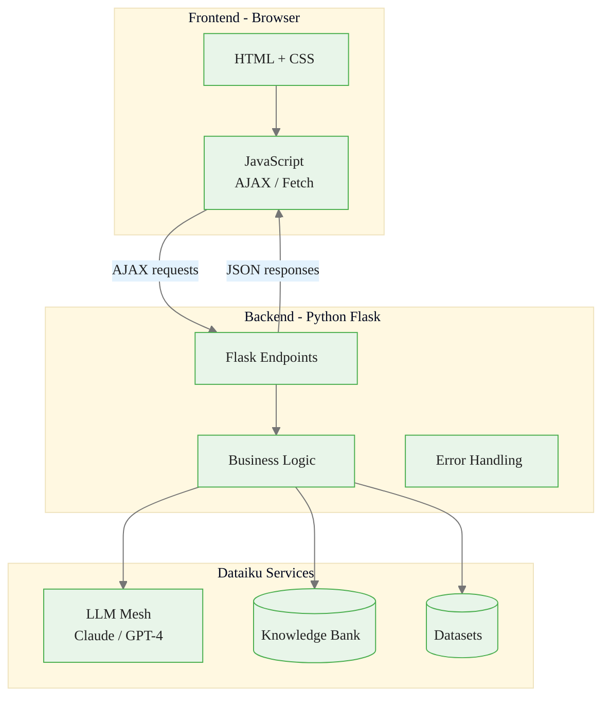
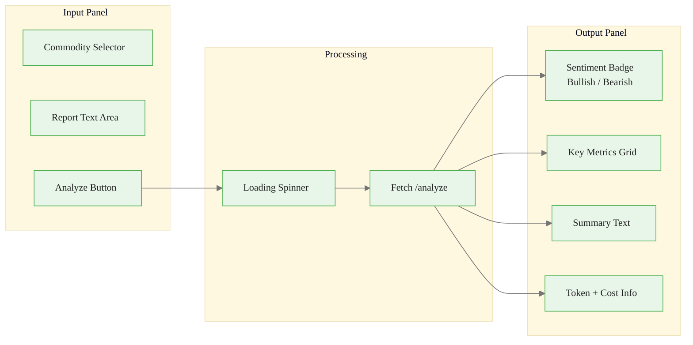
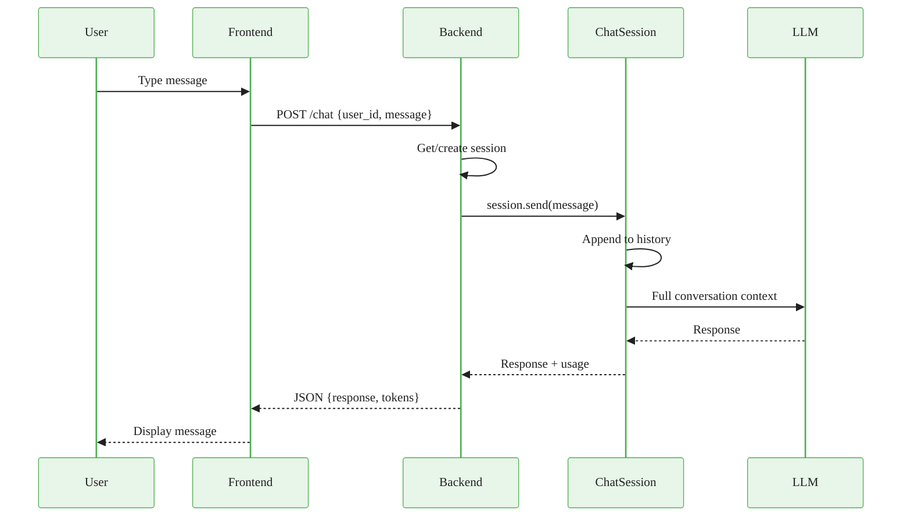
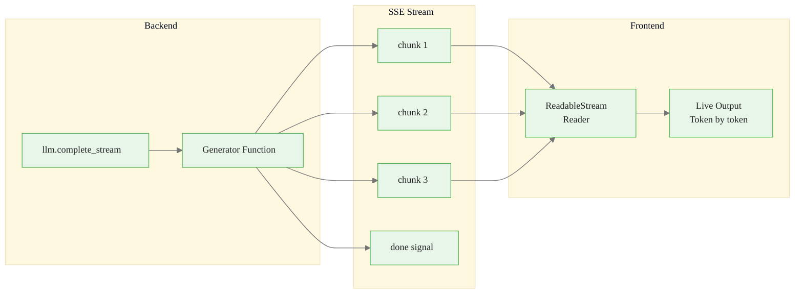

# Webapp Integration for Gen AI Applications
## Module 4 — Dataiku GenAI Foundations

> Build interactive user interfaces powered by LLMs

<!-- Speaker notes: This deck covers building interactive web applications powered by LLMs in Dataiku. By the end, learners will implement Flask backends, chat interfaces, and streaming responses. Estimated time: 20 minutes. -->
---

<!-- _class: lead -->

# Webapp Architecture

<!-- Speaker notes: Transition to the Webapp Architecture section. -->
---

## Key Insight

> The best Gen AI applications hide complexity from users. A well-designed webapp transforms complex LLM interactions into simple, intuitive interfaces -- Dataiku webapps handle infrastructure, security, and deployment so you can focus on user experience.

<!-- Speaker notes: The key takeaway: hide complexity from users. The webapp should feel simple even though LLM Mesh, Knowledge Banks, and governance are all working behind the scenes. -->
---

## Full Stack Architecture



<!-- Speaker notes: Walk through the three layers: frontend (HTML/JS), backend (Flask), and services (LLM Mesh, Knowledge Bank, Datasets). Data flows down from frontend and back up. -->
---

<!-- _class: lead -->

# Basic Webapp Pattern

<!-- Speaker notes: Transition to the Basic Webapp Pattern section. -->
---

## Backend: Flask Endpoint

```python
# backend.py
from dataiku.llm import LLM
from flask import request, jsonify

llm = LLM("anthropic-claude")

@app.route('/analyze', methods=['POST'])
def analyze_report():
    try:
        data = request.get_json()
        report_text = data.get('report_text', '')
        commodity = data.get('commodity', 'crude_oil')

        if not report_text:
            return jsonify({'status': 'error',
```

<!-- Speaker notes: Code continues on the next slide. -->

---

## (continued)

```python
                            'message': 'Report text required'}), 400

        prompt = f"""Analyze this {commodity} market report:
{report_text}
Return JSON: sentiment, key_metrics, summary, confidence"""

        response = llm.complete(prompt, temperature=0.3, max_tokens=800)
        analysis = json.loads(response.text)

        return jsonify({'status': 'success', 'analysis': analysis,
                        'tokens_used': response.usage.total_tokens})
    except Exception as e:
        return jsonify({'status': 'error', 'message': str(e)}), 500
```

<!-- Speaker notes: Basic Flask endpoint pattern. Input validation, prompt construction, LLM call, and JSON response. The try/except ensures graceful error handling. -->
---

## Frontend: User Interface



<!-- Speaker notes: UI flow diagram. Input panel collects data, processing shows a spinner, output panel displays results. Note the token/cost info for transparency. -->
---

## Frontend Request Pattern

```javascript
async function analyzeReport() {
    const commodity = document.getElementById('commodity').value;
    const reportText = document.getElementById('reportText').value;
    if (!reportText.trim()) { alert('Please enter report text'); return; }

    // Show loading state
    document.getElementById('analyzeBtn').disabled = true;
    document.getElementById('loading').style.display = 'block';

```

<!-- Speaker notes: Code continues on the next slide. -->

---

## (continued)

```javascript
    try {
        const response = await fetch('/analyze', {
            method: 'POST',
            headers: {'Content-Type': 'application/json'},
            body: JSON.stringify({commodity, report_text: reportText})
        });
        const data = await response.json();
        if (data.status === 'success') displayResults(data.analysis);
        else displayError(data.message);
    } catch (error) {
        displayError(error.message);
    } finally {
        document.getElementById('analyzeBtn').disabled = false;
        document.getElementById('loading').style.display = 'none';
    }
}
```

<!-- Speaker notes: Frontend JavaScript with async/await and proper loading states. The finally block ensures the button is re-enabled even if the request fails. -->
---

<!-- _class: lead -->

# Chatbot Interface

<!-- Speaker notes: Transition to the Chatbot Interface section. -->
---

## Chat Backend with Session Management

```python
from dataiku.llm import ChatSession

chat_sessions = {}

@app.route('/chat', methods=['POST'])
def chat():
    data = request.get_json()
    user_id = data.get('user_id', 'default')
    message = data.get('message', '')

```

<!-- Speaker notes: Code continues on the next slide. -->

---

## (continued)

```python
    # Get or create session
    if user_id not in chat_sessions:
        llm = LLM("anthropic-claude")
        session = ChatSession(llm)
        session.set_system_message(
            "You are a commodity market analyst assistant.")
        chat_sessions[user_id] = session

    session = chat_sessions[user_id]
    response = session.send(message)

    return jsonify({'status': 'success', 'response': response.text,
                    'tokens_used': response.usage.total_tokens})
```

<!-- Speaker notes: Chat backend with per-user sessions. The ChatSession object manages conversation history automatically. Note: in-memory dict is for development only. -->
---

## Chatbot Architecture



<!-- Speaker notes: Sequence diagram showing the full chat lifecycle. Key point: ChatSession appends messages and sends full history to the LLM for context. -->
---

## Chat Session Management

<div class="columns">
<div>

**Endpoints:**
```python
@app.route('/chat/reset', methods=['POST'])
def reset_chat():
    user_id = data.get('user_id')
    if user_id in chat_sessions:
        del chat_sessions[user_id]
    return jsonify({'status': 'success'})

@app.route('/chat/history', methods=['GET'])
def chat_history():
    user_id = request.args.get('user_id')
    if user_id not in chat_sessions:
        return jsonify({'history': []})
    session = chat_sessions[user_id]
    history = [{'role': m.role,
                'content': m.content}
               for m in session.messages]
    return jsonify({'history': history})
```

</div>
<div>

**Frontend:**
```javascript
const userId = 'user_' +
    Math.random().toString(36).substr(2, 9);

async function sendMessage() {
    const message = input.value.trim();
    if (!message) return;
    addMessage('user', message);
    input.value = '';

```

<!-- Speaker notes: Code continues on the next slide. -->

---

## (continued)

```javascript
    const response = await fetch('/chat', {
        method: 'POST',
        headers: {'Content-Type':
                  'application/json'},
        body: JSON.stringify({
            user_id: userId,
            message: message
        })
    });
    const data = await response.json();
    addMessage('assistant', data.response);
}
```

</div>
</div>

<!-- Speaker notes: Session reset and history endpoints. These are needed for the frontend to implement 'New Chat' and 'View History' features. -->
---

<!-- _class: lead -->

# Streaming Responses

<!-- Speaker notes: Transition to the Streaming Responses section. -->
---

## Server-Sent Events (SSE)



<!-- Speaker notes: SSE streaming architecture. The generator function yields chunks as they arrive from the LLM. The frontend reader processes them in real-time. -->
---

## Streaming Implementation

<div class="columns">
<div>

**Backend:**
```python
@app.route('/stream-analysis',
           methods=['POST'])
def stream_analysis():
    data = request.get_json()
    report_text = data.get('report_text')

    def generate():
        llm = LLM("anthropic-claude")
        prompt = f"Analyze:\n\n{report_text}"

        for chunk in llm.complete_stream(
            prompt, max_tokens=1000
        ):
            yield (f"data: {json.dumps({
                'type': 'chunk',
                'content': chunk.text
            })}\n\n")

        yield (f"data: {json.dumps({
            'type': 'done'
        })}\n\n")

    return Response(
        stream_with_context(generate()),
        mimetype='text/event-stream'
    )
```

</div>
<div>

**Frontend:**
```javascript
async function streamAnalysis() {
    const response = await fetch(
        '/stream-analysis', {
        method: 'POST',
        headers: {
            'Content-Type': 'application/json'
        },
        body: JSON.stringify({
            report_text: reportText
        })
    });

    const reader =
        response.body.getReader();
    const decoder = new TextDecoder();

```

<!-- Speaker notes: Code continues on the next slide. -->

<div class="callout-warning">
Warning: Never expose raw LLM responses to end users without output validation. Implement guardrails for format, content safety, and factual grounding.
</div>

---

## (continued)

```javascript
    while (true) {
        const {value, done} =
            await reader.read();
        if (done) break;
        const chunk = decoder.decode(value);
        const lines = chunk.split('\n')
            .filter(l => l.startsWith('data:'));
        for (const line of lines) {
            const data = JSON.parse(
                line.slice(5).trim()
            );
            if (data.type === 'done') return;
            output.innerHTML += data.content;
        }
    }
}
```

</div>
</div>

<!-- Speaker notes: Backend uses Flask's stream_with_context with a generator. Frontend parses SSE lines, extracts JSON data, and appends content to the output element. -->

<div class="callout-key">
Key Point: Always implement client-side loading indicators for LLM calls -- response latency is inherently variable and users need feedback.
</div>

---

## Five Common Pitfalls

| Pitfall | Impact | Fix |
|---------|--------|-----|
| **No session management** | Data lost on restart | Use persistent storage |
| **Blocking UI** | Frozen interface | Async/await + loading states |
| **No error handling** | Broken UX on failures | User-friendly error messages |
| **Exposing sensitive data** | Prompt/logic leakage | Sanitize all outputs |
| **No usage monitoring** | Cannot optimize | Log tokens, costs per user |

<!-- Speaker notes: Key pitfall: 'No session management' -- all chat history is lost on restart. Use a persistent store (database, dataset) for production. -->

<div class="callout-info">
Info: Dataiku webapps can embed LLM-powered features using the standard API endpoint pattern -- no special SDK required beyond the REST client.
</div>

---

## Key Takeaways

1. **Flask backends** handle LLM calls, input validation, and response formatting
2. **Frontend patterns** use async/await with loading states for responsive UX
3. **ChatSession** manages multi-turn conversations with automatic history
4. **Session management** per user enables personalized, persistent interactions
5. **Streaming via SSE** delivers token-by-token output for real-time feedback
6. **Error handling** on both frontend and backend is essential for production

> Dataiku webapps let you build production Gen AI interfaces without managing infrastructure.

<!-- Speaker notes: Recap the main points. Ask if there are questions before moving to the next topic. -->

<div class="callout-key">
Key Point:  handle LLM calls, input validation, and response formatting
2. 
</div>
