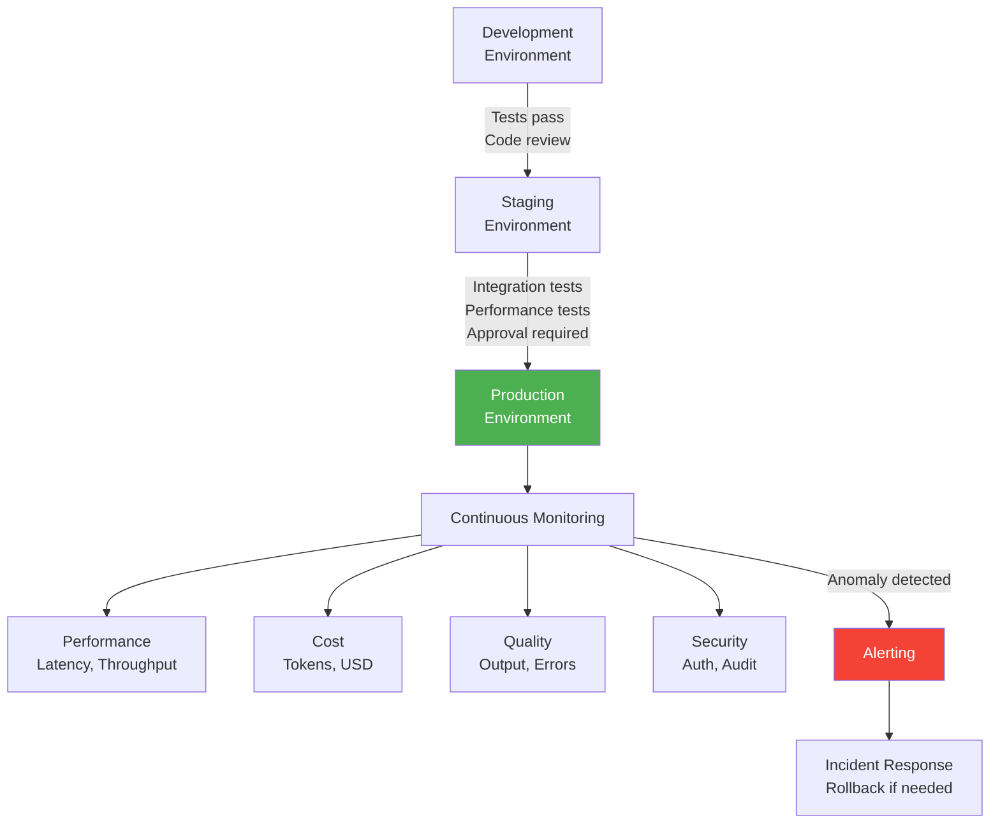
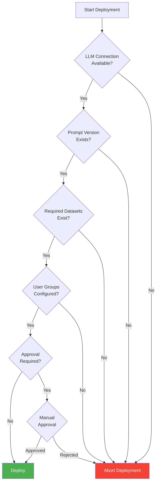
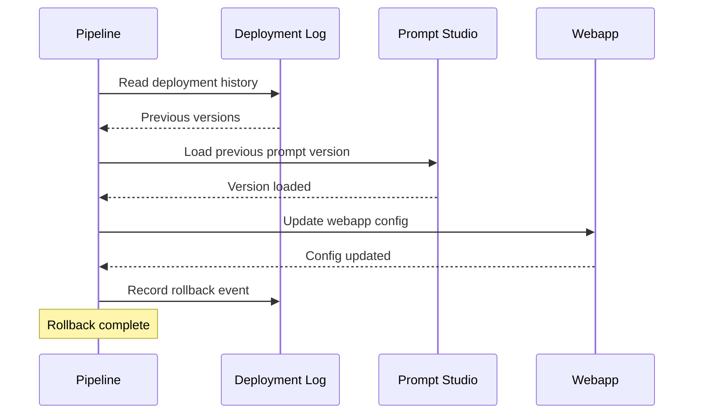
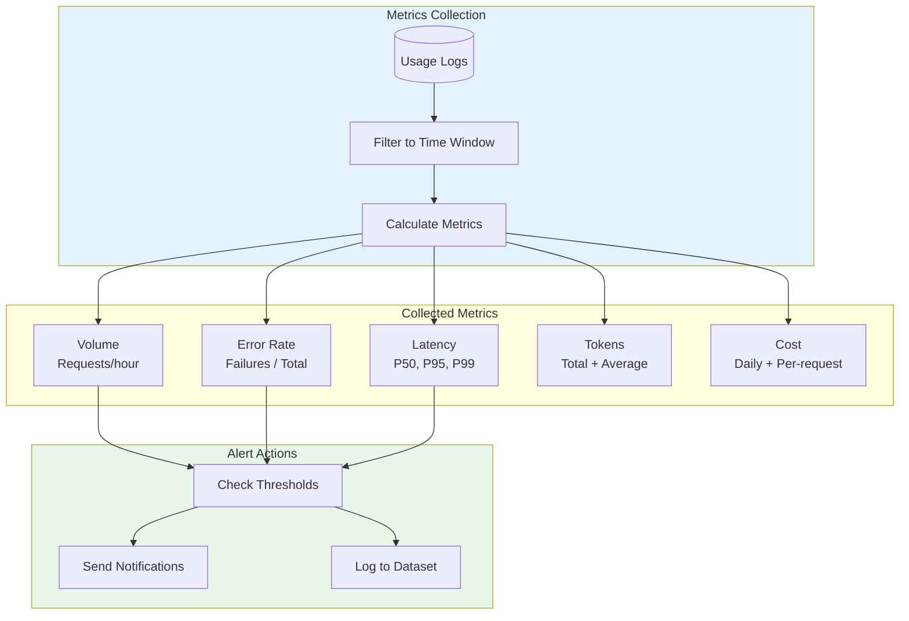

# Deployment Governance for Gen AI Applications
## Module 4 — Dataiku GenAI Foundations

> Air traffic control for production Gen AI

<!-- Speaker notes: This deck covers deployment governance -- the framework for moving Gen AI from dev to production safely. By the end, learners will implement deployment configs, pipelines, checks, and monitoring. Estimated time: 18 minutes. -->
---

<!-- _class: lead -->

# Governance Framework

<!-- Speaker notes: Transition to the Governance Framework section. -->
---

## Key Insight

> Production Gen AI requires the same rigor as traditional software -- version control, automated testing, staged deployments, monitoring, and rollback -- plus unique concerns like **prompt versioning**, **token budgets**, **model drift**, and **output quality monitoring**.

<!-- Speaker notes: Emphasize the unique Gen AI governance concerns: prompt versioning, token budgets, model drift, and output quality. These are on top of standard software governance. -->
---

## Governance Framework Overview



<!-- Speaker notes: The full governance framework from dev through staging to production, with continuous monitoring feeding back to incident response. -->
---

<!-- _class: lead -->

# Deployment Configuration

<!-- Speaker notes: Transition to the Deployment Configuration section. -->
---

## Environment-Specific Config

```python
class Environment(Enum):
    DEVELOPMENT = "dev"
    STAGING = "staging"
    PRODUCTION = "prod"

@dataclass
```

<!-- Speaker notes: Code continues on the next slide. -->

---

## (continued)

```python
class DeploymentConfig:
    environment: Environment
    llm_connection: str
    model: str
    temperature: float
    max_tokens: int
    max_concurrent_requests: int
    request_timeout_sec: int
```

<!-- Speaker notes: Code continues on the next slide. -->

---

## (continued)

```python
    daily_token_budget: int
    daily_cost_budget_usd: float
    enable_logging: bool
    enable_metrics: bool
    alert_email: str
    allowed_user_groups: list[str]
    require_approval: bool
    prompt_version: str
    deployment_version: str
```

<!-- Speaker notes: DeploymentConfig dataclass with all the settings that change between environments. This is the single source of truth for each environment. -->
---

## Config by Environment

```mermaid
graph LR
    subgraph DEV[Development]
        D1[5 concurrent]
        D2[$10/day budget]
        D3[100K tokens/day]
        D4[No approval]
    end

    subgraph STAGE[Staging]
        S1[20 concurrent]
        S2[$50/day budget]
        S3[500K tokens/day]
        S4[Approval required]
    end

    subgraph PROD[Production]
        P1[100 concurrent]
        P2[$500/day budget]
        P3[5M tokens/day]
        P4[Approval required]
    end

    DEV --> STAGE --> PROD

    style DEV fill:#e3f2fd
    style STAGE fill:#fff3e0
    style PROD fill:#e8f5e9
```



| Setting | Dev | Staging | Prod |
|---------|-----|---------|------|
| Concurrent requests | 5 | 20 | 100 |
| Daily budget (USD) | $10 | $50 | $500 |
| Token budget | 100K | 500K | 5M |
| Approval required | No | Yes | Yes |

<!-- Speaker notes: Visual comparison of dev, staging, and production settings. Note the 50x difference in concurrent requests and budget between dev and prod. -->
---

<!-- _class: lead -->

# Deployment Pipeline

<!-- Speaker notes: Transition to the Deployment Pipeline section. -->
---

## Pre-Deployment Checks



<!-- Speaker notes: Flowchart showing the four checks before deployment. Each check must pass before proceeding. The approval gate is required for staging and production. -->
---

## DeploymentPipeline Class

```python
class DeploymentPipeline:
    def __init__(self, config: DeploymentConfig):
        self.config = config

    def run_pre_deployment_checks(self) -> bool:
        checks = []
        # Check 1: LLM connection
        try:
            llm = LLM(self.config.llm_connection)
            llm.complete("test", max_tokens=10)
            checks.append(("LLM Connection", True))
        except Exception as e:
            checks.append(("LLM Connection", False))

        # Check 2: Prompt version exists
```

<!-- Speaker notes: Code continues on the next slide. -->

---

## (continued)

```python
        # Check 3: Required datasets exist
        # Check 4: User permissions configured
        return all(passed for _, passed in checks)

    def deploy(self) -> bool:
        if not self.run_pre_deployment_checks():
            return False
        try:
            prompt_studio = dataiku.PromptStudio("market-analyzer")
            prompt_studio.load_version(self.config.prompt_version)
            self.record_deployment()
            return True
        except Exception:
            self.rollback()
            return False
```

<!-- Speaker notes: The DeploymentPipeline runs pre-deployment checks, loads the prompt version, and records the deployment. Rollback is automatic on failure. -->
---

## Rollback Procedure



```python
def rollback(self, to_version=None):
    if to_version is None:
        log_df = dataiku.Dataset("deployment_log").get_dataframe()
        env_log = log_df[log_df['environment'] == self.config.environment.value]
        to_version = env_log.sort_values('timestamp', ascending=False).iloc[1]['prompt_version']

    prompt_studio = dataiku.PromptStudio("market-analyzer")
    prompt_studio.load_version(to_version)
```

<!-- Speaker notes: Rollback sequence diagram. Read deployment history, load previous version, update config, record rollback event. The iloc[1] gets the second-most-recent deployment. -->
---

<!-- _class: lead -->

# Production Monitoring

<!-- Speaker notes: Transition to the Production Monitoring section. -->
---

## ProductionMonitor: Alert Configuration

```python
class ProductionMonitor:
```

<!-- Speaker notes: Code continues on the next slide. -->

---

## (continued)

```python
    def __init__(self, config: DeploymentConfig):
        self.config = config
        self.alerts = [
            Alert(name="High Error Rate",
                  condition=lambda m: m['error_rate'] > 0.05,
                  severity="critical"),
            Alert(name="Budget Exceeded",
                  condition=lambda m:
                      m['daily_cost'] > config.daily_cost_budget_usd * 0.9,
                  severity="warning"),
            Alert(name="High Latency",
```

<!-- Speaker notes: Code continues on the next slide. -->

---

## (continued)

```python
                  condition=lambda m: m['p95_latency'] > 10.0,
                  severity="warning"),
            Alert(name="Token Budget Warning",
                  condition=lambda m:
                      m['daily_tokens'] > config.daily_token_budget * 0.9,
                  severity="warning"),
            Alert(name="Unusual Volume",
                  condition=lambda m:
                      m['requests_per_hour'] > m['avg_requests_per_hour'] * 2,
                  severity="warning"),
        ]
```

<!-- Speaker notes: Five alert conditions covering error rate, budget, latency, token budget, and unusual volume. Each has a severity level for appropriate response. -->
---

## Metrics Collection



<!-- Speaker notes: Full metrics collection and alerting flow. Collection feeds five metric types, which feed threshold checks, which trigger notifications and logging. -->
---

## Monitoring Cycle

```python
def run_monitoring_cycle(self):
    """Run one monitoring cycle -- schedule as recurring job."""
    # 1. Collect metrics from last hour
    metrics = self.collect_metrics(lookback_hours=1)

    # 2. Check alert conditions
    triggered = self.check_alerts(metrics)

    # 3. Send notifications for triggered alerts
    for alert in triggered:
        self.send_alert(alert, metrics)

    # 4. Log metrics to monitoring dataset
    self.log_metrics(metrics)
```

| Metric | How Calculated | Alert Threshold |
|--------|---------------|-----------------|
| Error rate | errors / requests | > 5% |
| P95 latency | 95th percentile | > 10 seconds |
| Daily cost | Sum of costs | > 90% of budget |
| Daily tokens | Sum of tokens | > 90% of budget |
| Request volume | Requests / hour | > 2x historical avg |

<!-- Speaker notes: Simple four-step monitoring cycle. Collect metrics, check alerts, send notifications, log metrics. Schedule as a recurring job at 5-minute intervals. -->
---

## Five Common Pitfalls

| Pitfall | Impact | Fix |
|---------|--------|-----|
| **No staged rollout** | Broken production | Dev -> staging -> prod pipeline |
| **Insufficient monitoring** | Blind to issues | Track all critical metrics |
| **No rollback plan** | Stuck with bugs | Maintain versions + test rollback |
| **Missing cost controls** | Runaway expenses | Hard limits + soft alerts |
| **Over-permissive access** | Security/audit risk | Least privilege + separate envs |

<!-- Speaker notes: Key pitfall: 'No rollback plan' -- always test rollback before you need it. The cost of a broken production deployment is far higher than the cost of testing rollback. -->
---

## Key Takeaways

1. **DeploymentConfig** per environment ensures appropriate limits and controls
2. **Pre-deployment checks** validate connections, versions, datasets, and permissions
3. **Approval gates** for staging and production prevent unauthorized deployments
4. **Automated rollback** restores the previous version when deployment fails
5. **ProductionMonitor** continuously checks error rates, latency, costs, and volume
6. **Alert thresholds** with severity levels enable proactive incident response

> Governance transforms experimental Gen AI prototypes into enterprise-grade systems.

<!-- Speaker notes: Recap the main points. Ask if there are questions before moving to the next topic. -->