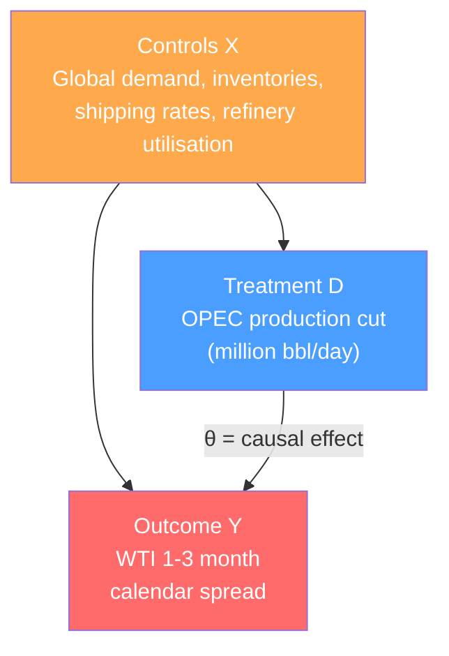
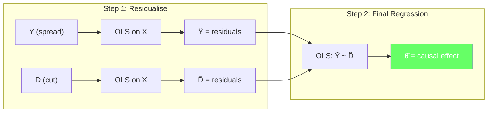
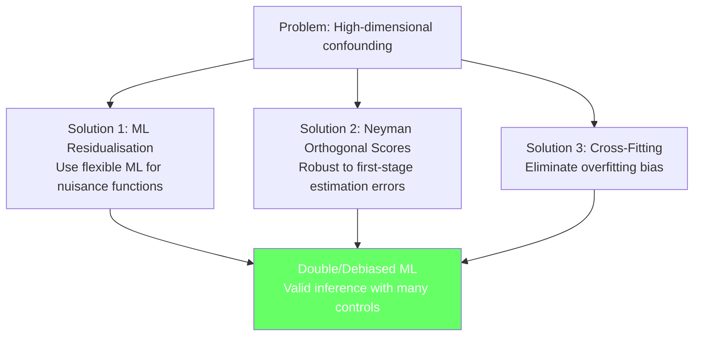
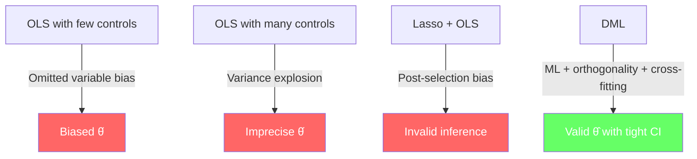

<!-- _class: lead -->

# The Causal Inference Problem

## Module 0: Foundations
### Double/Debiased Machine Learning

<!-- Speaker notes: Welcome to the opening deck of the Double Machine Learning course. We start by examining why the standard econometric toolkit — OLS regression — fails when you need causal inference with many controls. By the end, you will understand the core problem that motivates DML: high-dimensional confounding breaks both naive and penalised regression. -->

---

## In Brief

Naive regression fails for causal inference when controls are high-dimensional.

> **Problem:** OLS forces a tradeoff — omit confounders (bias) or include too many (variance explosion).

DML breaks this tradeoff by using **ML for prediction** and **econometrics for inference**.

<!-- Speaker notes: This is the central tension of the entire course. Traditional econometrics handles a handful of controls well. Machine learning handles hundreds of predictors well. But neither alone gives you a valid causal estimate with many controls. DML combines them — ML predicts, econometrics infers. -->

---

## The Causal Inference Tradeoff

```
Few Controls (OLS)          Many Controls (OLS)         DML Approach
┌──────────────────┐      ┌──────────────────┐      ┌──────────────────┐
│ ✗ Omitted var    │      │ ✗ Overfitting    │      │ ✓ ML handles     │
│   bias           │      │ ✗ Variance       │      │   high-dim X     │
│ ✗ Confounders    │      │   explosion      │      │ ✓ Orthogonality  │
│   distort θ      │      │ ✗ Multicollin.   │      │   protects θ     │
│                  │      │                  │      │ ✓ Cross-fitting   │
│ Bias: HIGH       │      │ Variance: HIGH   │      │   removes overfit │
└──────────────────┘      └──────────────────┘      └──────────────────┘
```

<!-- Speaker notes: Walk through each column. Left: classic omitted variable bias. You leave out important confounders and your treatment effect estimate absorbs their influence. Middle: you throw in every variable you can find, and OLS breaks down because p approaches n. Right: DML uses ML to flexibly model confounders while protecting the treatment effect with orthogonal scores and cross-fitting. -->

---

## Commodity Example: OPEC Production Cuts

**Question:** What is the causal effect of OPEC production cuts on crude oil calendar spreads?



<!-- Speaker notes: This is our running example. OPEC does not cut production randomly — they respond to market conditions (demand, inventories, geopolitics). These same conditions also affect calendar spreads directly. So the naive correlation between cuts and spreads mixes the causal effect with confounding. We need to partial out the confounders to isolate theta. -->

---

## Why Naive OLS Fails

```python
import numpy as np
import statsmodels.api as sm

np.random.seed(42)
n = 1000
X = np.random.randn(n, 5)  # Confounders

# Treatment correlated with confounders
D = 0.5 * X[:, 0] + 0.3 * X[:, 1] + np.random.randn(n) * 0.5

# True causal effect = 2.0
Y = 2.0 * D + 1.5 * X[:, 0] + 0.8 * X[:, 2] + np.random.randn(n)

naive = sm.OLS(Y, sm.add_constant(D)).fit()
print(f"True effect: 2.00")
print(f"Naive OLS:   {naive.params[1]:.2f}")  # Biased!
```

**Result:** Naive OLS overestimates because demand conditions drive both OPEC decisions and spreads.

<!-- Speaker notes: Walk through the data generating process. X_0 is global demand, which affects both D (OPEC responds to demand) and Y (spreads respond to demand). When we omit X from the regression, the coefficient on D picks up some of the demand effect. This is textbook omitted variable bias, but in a commodity context. The bias direction depends on the correlation structure. -->

---

## The Omitted Variable Bias Formula

For the model $Y = \theta D + X\beta + \epsilon$, omitting $X$ gives:

$$\hat{\theta}_{naive} \xrightarrow{p} \theta + \underbrace{\beta \cdot \frac{Cov(D, X)}{Var(D)}}_{\text{OVB: confounding bias}}$$

In our OPEC example:
- $\beta > 0$ (demand raises spreads)
- $Cov(D, X) > 0$ (OPEC cuts when demand is high)
- **Bias is positive** — we overestimate the cut effect

<!-- Speaker notes: This formula is the key diagnostic. The bias equals the effect of the omitted variable on Y, times the regression coefficient of the omitted variable on D. When both are positive (as in our example), the bias inflates the treatment effect. The solution seems simple: add X to the regression. But what happens when X is 200-dimensional? That is the next slide. -->

---

## Scaling Up: 200 Controls

```python
p = 200  # Realistic for commodity markets
X_large = np.random.randn(n, p)

D_large = 0.5 * X_large[:, 0] + 0.3 * X_large[:, 1] + np.random.randn(n) * 0.5
Y_large = 2.0 * D_large + 1.5 * X_large[:, 0] + 0.8 * X_large[:, 2] + np.random.randn(n)

# OLS with all 200 controls
controls_and_D = np.column_stack([D_large, X_large])
ols_full = sm.OLS(Y_large, sm.add_constant(controls_and_D)).fit()
print(f"Estimate: {ols_full.params[1]:.2f}")
print(f"SE:       {ols_full.bse[1]:.2f}")  # Huge!
```

| Metric | 5 controls | 200 controls |
|--------|-----------|--------------|
| Point estimate | ~2.00 | ~2.00 |
| Standard error | ~0.05 | ~0.15+ |
| 95% CI width | ~0.20 | ~0.60+ |

<!-- Speaker notes: The point estimate may still be roughly correct with 200 controls, but the standard error triples or more. The confidence interval becomes so wide it is practically useless. And this is with perfectly independent controls — in real data with multicollinearity, it gets much worse. This motivates using ML to handle the high-dimensional controls while keeping inference tight. -->

---

## The Frisch-Waugh-Lovell Theorem

**Key insight:** You can estimate $\theta$ by residualising both $Y$ and $D$ on $X$:

$$\tilde{Y} = Y - \hat{\Pi}_Y X \quad \text{(partial out X from Y)}$$
$$\tilde{D} = D - \hat{\Pi}_D X \quad \text{(partial out X from D)}$$
$$\hat{\theta}_{FWL} = \frac{\tilde{D}'\tilde{Y}}{\tilde{D}'\tilde{D}}$$

**Intuition:** Strip out what controls explain, then correlate the leftovers.

<!-- Speaker notes: FWL is the bridge between classical econometrics and DML. It says: instead of running one big regression, you can run two regressions to residualise, then one final regression on the residuals. The treatment effect from this three-step procedure is identical to the one-step OLS. But here is the magic: the first two steps do not need to be OLS. They can be any flexible prediction method. That is exactly what DML does. -->

---

## FWL Visually



<!-- Speaker notes: This diagram is the template for the entire course. Step 1 removes confounding by partialling out X from both Y and D. Step 2 runs a simple regression on the residuals. In DML, we replace the Step 1 OLS boxes with ML models (random forests, gradient boosting, neural nets) and add cross-fitting to prevent overfitting. The rest of the course builds on this exact pipeline. -->

---

## From FWL to DML

Replace OLS first stages with ML:

<div class="columns">
<div>

### FWL (Classical)
- $\hat{g}(X) = X\hat{\beta}_Y$ (linear)
- $\hat{m}(X) = X\hat{\beta}_D$ (linear)
- Works with $p \ll n$
- Fails with many controls

</div>
<div>

### DML (Modern)
- $\hat{g}(X) = \text{RandomForest}(X)$ (flexible)
- $\hat{m}(X) = \text{GBM}(X)$ (flexible)
- Works with $p \gg n$
- **+ cross-fitting + orthogonal scores**

</div>
</div>

<!-- Speaker notes: This side-by-side comparison captures the entire conceptual leap. FWL uses OLS in the first stage, which limits you to linear relationships and low-dimensional X. DML uses any ML model, which handles nonlinearity and high dimensions. But swapping OLS for ML introduces two new problems: overfitting bias and sensitivity to first-stage errors. Cross-fitting and orthogonal scores solve these. Modules 02-04 cover each in detail. -->

---

## DML Preview: Recovering the True Effect

```python
from sklearn.ensemble import RandomForestRegressor
from sklearn.model_selection import cross_val_predict

rf = RandomForestRegressor(n_estimators=100, random_state=42)

# ML residualisation with all 200 controls
Y_hat = cross_val_predict(rf, X_large, Y_large, cv=5)
D_hat = cross_val_predict(rf, X_large, D_large, cv=5)

resid_Y = Y_large - Y_hat
resid_D = D_large - D_hat

theta_dml = sm.OLS(resid_Y, sm.add_constant(resid_D)).fit()
print(f"DML estimate: {theta_dml.params[1]:.2f}")  # Close to 2.0!
print(f"SE:           {theta_dml.bse[1]:.2f}")      # Tight!
```

<!-- Speaker notes: This is the payoff. Random forests handle the 200 controls flexibly, and cross_val_predict provides out-of-sample predictions to avoid overfitting. The estimate is close to 2.0 with a tight standard error. This simplified version already works well, but the full DML procedure adds formal orthogonal scores and K-fold cross-fitting for rigorous asymptotic guarantees. That is what the rest of the course builds toward. -->

---

<!-- _class: lead -->

# Common Pitfalls

<!-- Speaker notes: Before we move on, let us cover the three most common mistakes practitioners make when trying to combine ML with causal inference. Each one is a trap that DML is specifically designed to avoid. -->

---

## Pitfall 1: Post-Selection Inference

> Running Lasso to select variables, then running OLS on the selected variables.

- Lasso selects variables that predict $Y$ well, **not** variables that confound $D$
- Dropping a confounder of $D$ reintroduces omitted variable bias
- Standard errors from the second-stage OLS are **invalid** (ignore selection uncertainty)

**Commodity example:** Lasso selects shipping rates and refinery margins to predict spreads but drops inventory levels. Inventories confound OPEC decisions, so the treatment effect is biased.

<!-- Speaker notes: This is the most common mistake in applied work. Researchers run Lasso, take the selected variables, and run OLS as if no selection happened. The problem is twofold: Lasso may drop confounders that are important for D even if they are weak predictors of Y, and the standard errors ignore the selection step entirely. Module 01 covers this in detail with a full simulation. -->

---

## Pitfall 2: Plug-in Bias

> Using ML predictions $\hat{g}(X)$ directly without orthogonal scores.

If $\hat{g}(X)$ has error $r_n$ in estimating $E[Y|X]$, the treatment effect estimate has bias:

$$\text{Bias} \propto r_n \cdot s_n$$

where $s_n$ is the error in $\hat{m}(X)$. This bias does **not** vanish fast enough for valid inference.

**DML fix:** Neyman orthogonal scores make the bias proportional to $r_n \cdot s_n$ (product of errors), which vanishes fast enough.

<!-- Speaker notes: This is subtle but critical. If you just plug in ML predictions and residualise, the estimation error in your ML models contaminates the treatment effect. The contamination is first-order, meaning it does not shrink fast enough for root-n inference. Orthogonal scores make the contamination second-order (a product of two small errors), which does vanish. Module 03 covers the math in detail. -->

---

## Pitfall 3: Overfitting the Nuisance

> Training ML models on the same data used for inference.

- ML models that overfit $X$ produce residuals that are too small
- Small residuals $\tilde{D}$ in the denominator inflate $\hat{\theta}$
- Cross-validation **within** the residualisation is not enough

**DML fix:** Cross-fitting — train ML on fold $k$, predict on fold $-k$, never use in-sample predictions.

<!-- Speaker notes: This is why cross_val_predict is not just a nice-to-have but essential. If you train a random forest on all n observations and then compute residuals on those same observations, the residuals are artificially small because the model has memorised some of the signal. In the treatment effect formula, small D-tilde residuals in the denominator make theta-hat explode. Cross-fitting ensures all predictions are truly out-of-sample. Module 04 covers the full cross-fitting algorithm. -->

---

## The DML Solution: Three Key Ideas



<!-- Speaker notes: This diagram summarises the three pillars of DML that the course will build one by one. Module 02 covers ML residualisation (the orthogonalisation trick). Module 03 covers Neyman orthogonal scores (why DML is robust). Module 04 covers cross-fitting (eliminating overfitting). Modules 05-09 then apply these ideas to specific models and production settings. -->

---

## Connections

<div class="columns">
<div>

### Builds On
- OLS regression and OVB formula
- Frisch-Waugh-Lovell theorem
- Basic ML (random forests, GBM)

</div>
<div>

### Leads To
- Module 01: Why Lasso + OLS fails
- Module 02: Orthogonalisation trick
- Module 03: Neyman orthogonal scores
- Module 04: Cross-fitting algorithm

</div>
</div>

<!-- Speaker notes: This deck establishes the problem that the rest of the course solves. Module 01 shows that the naive fix (Lasso for variable selection) does not work for causal inference. Module 02 introduces Robinson's partially linear model and the residual-on-residual approach. Module 03 explains why orthogonality gives robustness. Module 04 completes the picture with cross-fitting. Modules 05-09 apply DML to specific models and production settings. -->

---

## Visual Summary



<!-- Speaker notes: This is the punchline of the entire deck. Three common approaches all fail for different reasons. DML succeeds by combining ML flexibility with econometric rigour. The rest of the course teaches you exactly how and why each component works, and how to implement it in production. Next up: Module 01 dives deep into why Lasso plus OLS produces invalid causal estimates. -->
