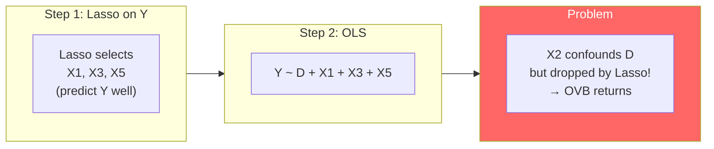
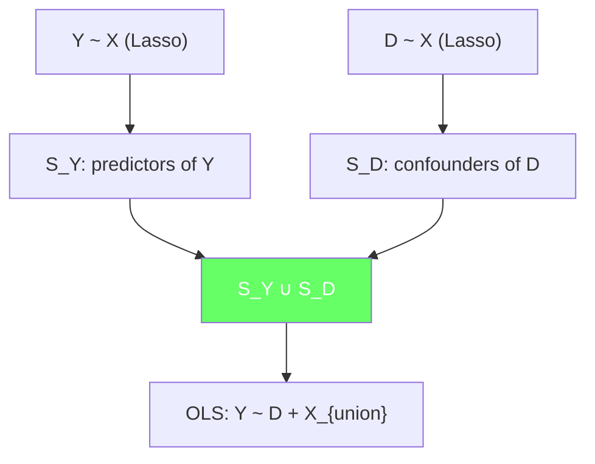
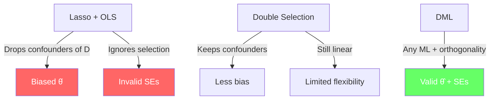

<!-- _class: lead -->

# Why OLS Fails with High-Dimensional Controls

## Module 1: OLS Limitations
### Double/Debiased Machine Learning

<!-- Speaker notes: This deck demonstrates that the obvious fix for high-dimensional confounding — Lasso variable selection followed by OLS — produces biased treatment effects and invalid confidence intervals. We will see why post-selection inference is fundamentally broken and how double selection partially addresses the problem. -->

---

## In Brief

The obvious fix — Lasso to select variables, then OLS — produces **biased** treatment effects and **invalid** confidence intervals.

> **Problem:** Lasso selects variables that predict $Y$ well, not variables that confound $D$.

Dropping a confounder of $D$ reintroduces omitted variable bias.

<!-- Speaker notes: This is the most common mistake in applied causal inference with many controls. Researchers run Lasso on Y, take the selected variables, and run OLS as if no selection happened. The problem is that Lasso's objective function optimises prediction of Y, which is fundamentally different from identifying confounders of D. A variable can be a strong confounder of D while being a weak predictor of Y. -->

---

## The Post-Selection Inference Trap



<!-- Speaker notes: Walk through the diagram. Lasso in step 1 selects variables based on their predictive power for Y. X2 is a strong confounder of D but a weak predictor of Y after controlling for other variables, so Lasso drops it. Step 2 runs OLS without X2, which means the omitted variable bias from X2 contaminates the treatment effect estimate. The standard errors from step 2 also ignore the selection uncertainty from step 1. -->

---

## Lasso Objective Function

$$\hat{\beta}_{Lasso} = \arg\min_\beta \frac{1}{2n}\|Y - X\beta\|^2 + \lambda\|\beta\|_1$$

**What Lasso optimises:** Minimise prediction error for $Y$ with sparsity penalty.

**What causal inference needs:** Include all confounders of $D$, regardless of their predictive power for $Y$.

These are **different objectives** — Lasso solves the wrong problem for causal inference.

<!-- Speaker notes: The Lasso objective is about prediction. It wants to find a sparse model that predicts Y well. It does not care whether a variable confounds D. A variable with coefficient 0.01 on Y but correlation 0.9 with D will be dropped — and that creates massive omitted variable bias. This is the fundamental mismatch between prediction and causal inference. -->

---

## Commodity Example: Carbon Tax Effects

**Question:** Effect of carbon tax increases on power generation costs.

| Variable | Predicts Y? | Confounds D? | Lasso keeps? |
|----------|-------------|--------------|--------------|
| Gas price | Strong | Strong | Yes |
| Renewable capacity | Strong | Weak | Yes |
| **Political cycle** | **Weak** | **Strong** | **No!** |
| Weather | Moderate | Weak | Maybe |

Political cycle drives carbon tax changes but barely predicts power costs directly → Lasso drops it → bias.

<!-- Speaker notes: This table makes the selection problem concrete. Political cycle is the perfect example of a variable that Lasso would drop but that is critical for causal inference. Election years affect carbon tax legislation, but after controlling for gas prices and renewables, political cycle adds little predictive power for generation costs. Dropping it means the treatment effect absorbs the political cycle confounding. -->

---

## Code: Lasso Selection Demo

```python
import numpy as np
from sklearn.linear_model import LassoCV
import statsmodels.api as sm

np.random.seed(42)
n, p = 1000, 200
X = np.random.randn(n, p)
D = 0.3 * X[:, 0] + 0.2 * X[:, 1] + 0.15 * X[:, 3] + np.random.randn(n) * 0.5
Y = 1.5 * D + 0.8 * X[:, 0] + 0.5 * X[:, 2] + 0.3 * X[:, 3] + np.random.randn(n)

lasso = LassoCV(cv=5, random_state=42).fit(X, Y)
selected = np.where(np.abs(lasso.coef_) > 0)[0]
print(f"Selected: {selected}")
print(f"X1 (confounds D): {'KEPT' if 1 in selected else 'DROPPED!'}")
```

<!-- Speaker notes: This code demonstrates the selection problem. X1 has correlation 0.2 with D (it is a confounder) but may be a weak predictor of Y after controlling for X0 and X2. Run this code and check whether X1 is selected. If not, the post-selection OLS estimate will be biased. The key teaching point is that whether X1 is selected depends on its prediction power for Y, not its confounding role for D. -->

---

## Code: Post-Selection OLS Bias

```python
# Post-selection OLS
X_sel = X[:, selected]
DX_sel = np.column_stack([D, X_sel])
post_lasso = sm.OLS(Y, sm.add_constant(DX_sel)).fit()

print(f"True effect:       1.50")
print(f"Post-Lasso OLS:    {post_lasso.params[1]:.2f}")
print(f"SE (WRONG):        {post_lasso.bse[1]:.3f}")
```

The SE is wrong because it **ignores the selection step** — treats selected variables as if they were pre-specified.

<!-- Speaker notes: The standard error from this regression assumes the model was specified a priori. But we selected variables using the same data, which introduces a form of data snooping. The true uncertainty is larger than reported because the model itself is random — different data would select different variables. This is why the coverage of the reported 95% CI is often only 60-80%. -->

---

## Coverage Failure: Monte Carlo Evidence

| Method | Nominal Coverage | Actual Coverage |
|--------|:---------------:|:---------------:|
| Post-Lasso OLS | 95% | **60-80%** |
| Double Selection | 95% | **85-90%** |
| DML (RF) | 95% | **93-96%** |

> Post-Lasso OLS confidence intervals contain the true effect far less often than advertised.

<!-- Speaker notes: This table summarises Monte Carlo results from the simulation in the guide. Post-Lasso OLS has dramatically undercovered confidence intervals. Double selection improves things by also selecting confounders of D, but still falls short of nominal coverage. DML achieves near-nominal coverage because orthogonal scores and cross-fitting properly account for the ML estimation step. This is the strongest argument for DML over post-selection methods. -->

---

## The Double Selection Fix

**Belloni, Chernozhukov, Hansen (2014):**

1. Lasso: select variables predicting $Y$ → set $S_Y$
2. Lasso: select variables predicting $D$ → set $S_D$
3. OLS with $D$ and $S_Y \cup S_D$ as controls



<!-- Speaker notes: Double selection runs Lasso twice — once for Y and once for D. The union ensures confounders of D are included even if they are weak predictors of Y. This is a substantial improvement over single selection. But it still relies on Lasso's linear model being correct, and the standard errors still do not fully account for the selection step. DML generalises this by replacing Lasso with any ML model and adding orthogonal scores for robustness. -->

---

## From Double Selection to DML

<div class="columns">
<div>

### Double Selection
- Linear Lasso for both stages
- Relies on sparsity assumption
- SEs approximately valid
- Limited to linear relationships

</div>
<div>

### DML
- Any ML model for both stages
- Works with dense, nonlinear effects
- SEs rigorously valid via orthogonality
- Handles arbitrary complexity

</div>
</div>

<!-- Speaker notes: This comparison shows why DML supersedes double selection. Double selection was the right idea — run selection for both Y and D — but it is limited by the linearity assumption of Lasso. DML replaces Lasso with any ML model, which handles nonlinear and dense confounding patterns. The orthogonal scores in DML provide a formal guarantee that the ML estimation errors do not contaminate the treatment effect, which double selection's standard errors do not quite achieve. -->

---

## Connections

<div class="columns">
<div>

### Builds On
- Module 00: Causal inference problem
- Lasso and regularisation
- OVB formula

</div>
<div>

### Leads To
- Module 02: Orthogonalisation trick
- Module 03: Neyman orthogonal scores
- Module 05: `doubleml` PLR implementation

</div>
</div>

<!-- Speaker notes: This deck establishes why naive variable selection fails for causal inference, motivating the need for DML's more principled approach. Module 02 shows how to replace selection with residualisation using flexible ML. Module 03 explains why orthogonal scores make DML robust to ML estimation errors that plague post-selection methods. -->

---

## Visual Summary



<!-- Speaker notes: The visual summary captures the progression from naive Lasso selection (broken) through double selection (improved but limited) to DML (rigorous). The key message is that prediction-oriented variable selection is fundamentally the wrong tool for causal inference. DML reframes the problem: instead of selecting variables, use ML to flexibly partial out confounders while protecting inference with orthogonal scores. -->
