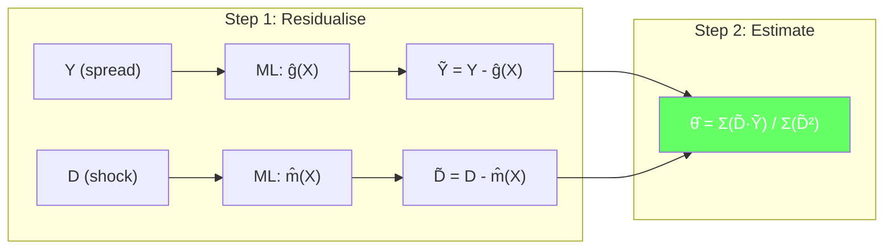
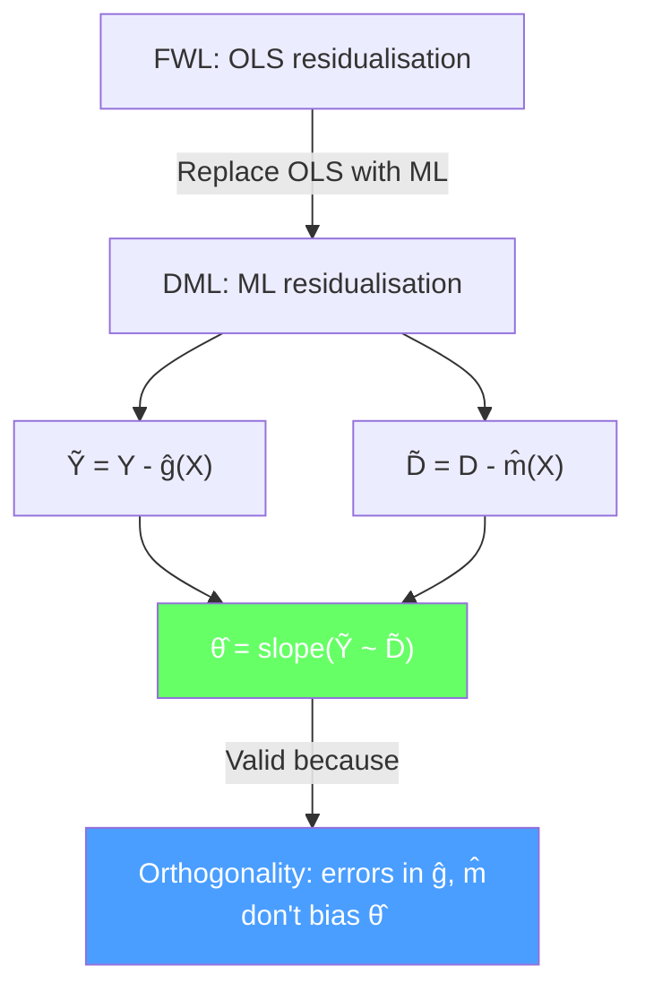

<!-- _class: lead -->

# The Orthogonalisation Trick

## Module 2: Residual-on-Residual Regression
### Double/Debiased Machine Learning

<!-- Speaker notes: This is the core technical deck of the course. We will implement the residual-on-residual regression that forms the heart of DML. By the end, students will understand Robinson's partially linear model and be able to implement DML from scratch in about 30 lines of Python. The commodity example is weather shocks on natural gas basis spreads. -->

---

## In Brief

DML **residualises** both $Y$ and $D$ using ML, then estimates $\theta$ from the residuals.

> **Key idea:** The treatment effect lives in the correlation between what ML *cannot* explain.

This is Robinson's (1988) partially linear model, powered by modern ML.

<!-- Speaker notes: The fundamental insight is that we do not need to select variables. Instead, we let ML explain as much as it can about both Y and D using the controls X. Whatever correlation remains between the residuals — the parts ML cannot explain — is the causal effect of D on Y. This is a complete paradigm shift from variable selection to residualisation. -->

---

## The DML Pipeline



<!-- Speaker notes: This pipeline diagram is the visual anchor for the entire course. Step 1 trains two ML models — one predicting Y from X, one predicting D from X — and computes residuals. Step 2 runs a simple ratio to get the treatment effect. The magic is that this simple ratio produces a valid causal estimate even with hundreds of controls and nonlinear confounding, provided we use cross-fitting (Module 04). -->

---

## Robinson's Partially Linear Model

$$Y = \theta D + g_0(X) + \epsilon, \quad E[\epsilon|D, X] = 0$$
$$D = m_0(X) + V, \quad E[V|X] = 0$$

Subtract conditional expectations:

$$\underbrace{Y - E[Y|X]}_{\tilde{Y}} = \theta \underbrace{(D - E[D|X])}_{\tilde{D}} + \epsilon$$

**Result:** $\theta$ is the slope of the residual-on-residual regression.

<!-- Speaker notes: Walk through the algebra step by step. Taking E[Y|X] of both sides of the first equation gives E[Y|X] = theta * E[D|X] + g0(X). Subtracting this from the original gives Y - E[Y|X] = theta * (D - E[D|X]) + epsilon. This is a simple bivariate regression on residuals. The function g0(X) has been eliminated entirely. We only need to estimate E[Y|X] and E[D|X], which is what ML does well. -->

---

## Commodity Example: Weather Shocks on Natural Gas

**Setup:**
- $D$ = weather shock intensity (unexpected cold snap)
- $Y$ = natural gas basis spread (hub vs delivery point)
- $X$ = storage levels, pipeline capacity, regional demand, heating degree days

**Challenge:** Nonlinear confounding
- Storage affects both weather sensitivity and basis spreads
- Pipeline constraints interact with demand in nonlinear ways
- OLS with linear controls misses these patterns

<!-- Speaker notes: Natural gas basis spreads are the difference between prices at a hub and a delivery point. Weather shocks affect basis through increased demand, but storage levels and pipeline capacity modulate this effect nonlinearly. When storage is low, a weather shock has a much larger effect on basis than when storage is high. OLS with linear terms cannot capture this interaction. ML models like random forests handle it naturally. -->

---

## DML in 30 Lines of Python

```python
import numpy as np
from sklearn.ensemble import RandomForestRegressor
from sklearn.model_selection import KFold

def manual_dml(Y, D, X, n_folds=5):
    n = len(Y)
    resid_Y, resid_D = np.zeros(n), np.zeros(n)
    kf = KFold(n_splits=n_folds, shuffle=True, random_state=42)

    for train_idx, test_idx in kf.split(X):
        rf_y = RandomForestRegressor(n_estimators=100, random_state=42)
        rf_d = RandomForestRegressor(n_estimators=100, random_state=42)
        rf_y.fit(X[train_idx], Y[train_idx])
        rf_d.fit(X[train_idx], D[train_idx])
        resid_Y[test_idx] = Y[test_idx] - rf_y.predict(X[test_idx])
        resid_D[test_idx] = D[test_idx] - rf_d.predict(X[test_idx])

    theta = np.sum(resid_D * resid_Y) / np.sum(resid_D ** 2)
    eps = resid_Y - theta * resid_D
    se = np.sqrt(np.mean(resid_D**2 * eps**2) /
                 (np.mean(resid_D**2)**2) / n)
    return theta, se
```

<!-- Speaker notes: Walk through the code line by line. The KFold loop implements cross-fitting — training on one fold, predicting on another. The treatment effect is a simple ratio of cross-products to sum of squares. The standard error uses the heteroskedasticity-robust formula. This is the complete DML algorithm. Everything else in the course is about understanding why this works and how to extend it. -->

---

## Results: DML vs OLS

```python
np.random.seed(42)
n, p = 2000, 50
X = np.random.randn(n, p)
D = np.sin(X[:, 0]) + 0.5 * X[:, 1]**2 + np.random.randn(n) * 0.3
Y = 0.8 * D + np.exp(0.3*X[:, 0]) + 0.5*np.abs(X[:, 2]) + np.random.randn(n) * 0.5

theta, se = manual_dml(Y, D, X)
print(f"True: 0.80, DML: {theta:.2f} (SE: {se:.3f})")
```

| Method | Estimate | SE | 95% CI |
|--------|:--------:|:--:|:------:|
| True | 0.80 | — | — |
| OLS (linear) | ~0.65 | 0.05 | [0.55, 0.75] |
| **DML (RF)** | **~0.80** | **0.04** | **[0.72, 0.88]** |

<!-- Speaker notes: The OLS estimate is biased because it cannot capture the nonlinear confounding (sin, squared terms, absolute values). DML handles these patterns through the random forest first stages and produces an unbiased estimate with a tight confidence interval. The key comparison is that DML's CI covers the true value while OLS's does not. -->

---

## Why Orthogonality Matters

After residualisation, $\tilde{D}$ is orthogonal to the space of $X$:

$$E[\tilde{D} \cdot f(X)] = 0 \quad \text{for any function } f$$

**Consequence:** Errors in estimating $g_0(X)$ do not bias $\hat{\theta}$.

If $\hat{g}$ has error $r$, the bias is:

$$\text{Bias} \propto E[r \cdot V] = E[r] \cdot E[V] + Cov(r, V) \approx 0$$

because $V = D - m_0(X)$ is orthogonal to functions of $X$.

<!-- Speaker notes: This is the crucial theoretical insight. Because D-tilde is orthogonal to X, any error in the ML estimate of g0(X) is also approximately orthogonal to D-tilde. This means the error does not contaminate the treatment effect estimate. This is the first-order insensitivity property that makes DML robust. Module 03 formalises this with Neyman orthogonal scores and shows the exact conditions under which it holds. -->

---

<div class="columns">
<div>

## OLS Residuals

- Linear projections only
- Misses nonlinear confounding
- Residuals still contain confounding signal
- Treatment effect biased

</div>
<div>

## ML Residuals

- Captures nonlinear patterns
- Removes most confounding
- Residuals contain mainly causal signal
- Treatment effect unbiased

</div>
</div>

<!-- Speaker notes: This comparison summarises why replacing OLS with ML in the first stage matters. OLS residuals retain nonlinear confounding patterns that bias the treatment effect. ML residuals remove much more of the confounding, leaving primarily the causal signal. The improvement is especially large when confounders have nonlinear effects, which is the norm in commodity markets. -->

---

## Connections

<div class="columns">
<div>

### Builds On
- Module 00: FWL theorem
- Module 01: Why Lasso fails
- Robinson (1988)

</div>
<div>

### Leads To
- Module 03: Neyman orthogonal scores
- Module 04: Cross-fitting
- Module 05: `doubleml` PLR

</div>
</div>

<!-- Speaker notes: This deck is the technical core of the course. You now understand the residualisation pipeline and can implement DML from scratch. Module 03 formalises the orthogonality property with Neyman orthogonal scores. Module 04 explains why cross-fitting is essential. Module 05 shows how to use the doubleml library, which implements all of this in a production-ready package. -->

---

## Visual Summary



<!-- Speaker notes: The visual summary shows the flow from FWL to DML. Replace OLS with ML in the first stage, compute residuals, estimate theta from the residual regression. The orthogonality property ensures that ML errors do not contaminate the treatment effect. This is the foundation that the rest of the course builds on. -->
