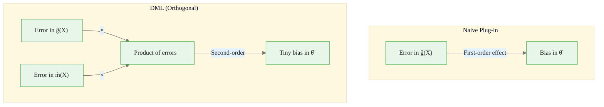
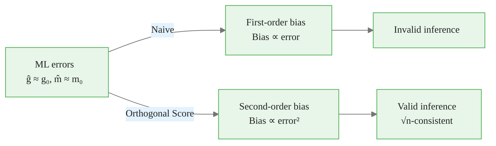

<!-- _class: lead -->

# Neyman Orthogonal Scores

## Module 3: Why DML Is Robust
### Double/Debiased Machine Learning

<!-- Speaker notes: This deck explains the theoretical foundation of DML — Neyman orthogonal scores. We will show why the treatment effect estimate is insensitive to first-stage ML errors, which is the key guarantee that makes DML valid. The main demonstration is a sensitivity experiment where we intentionally degrade the ML models and show DML remains approximately unbiased. -->

---

## In Brief

A naive plug-in estimator has bias proportional to **first-stage ML error**.

DML uses an **orthogonal score** that makes bias proportional to the **product** of two errors.

> Product of two small numbers is much smaller than either number alone.

This is the "double" in Double Machine Learning.

<!-- Speaker notes: This is the punchline of the entire theoretical framework. If your ML model has 10% error in predicting Y and 10% error in predicting D, the naive bias is about 10%, but the DML bias is about 1% (10% times 10%). This product structure means DML tolerates substantially worse ML models than the naive approach. It is the reason DML works in practice where ML is never perfect. -->

---

## Naive vs Orthogonal: The Bias Comparison

| Approach | Bias Formula | If ML error = 10% |
|----------|:----------:|:---------:|
| Naive plug-in | $\text{Bias} \propto r_n$ | ~10% bias |
| **DML (orthogonal)** | **$\text{Bias} \propto r_n \times s_n$** | **~1% bias** |

Where $r_n$ = error in $\hat{g}(X)$, $s_n$ = error in $\hat{m}(X)$.

> **10x reduction** in bias from orthogonality alone.

<!-- Speaker notes: This table is the most important comparison in the course. The naive approach — just plug in ML predictions without the orthogonal score structure — has first-order sensitivity to ML errors. DML's orthogonal score reduces this to second-order. The practical implication is enormous: you do not need perfect ML models, just reasonably good ones. This is why DML works with off-the-shelf random forests and gradient boosting without extensive hyperparameter tuning. -->

<div class="callout-key">
Key Point: $\text{Bias} \propto r_n \times s_n$
</div>

---

## The Orthogonal Score Function

For the partially linear model:

$$\psi(W; \theta, g, m) = \underbrace{(D - m(X))}_{\text{treatment residual}} \cdot \underbrace{(Y - g(X) - \theta(D - m(X)))}_{\text{structural residual}}$$

**Orthogonality condition:**

$$\frac{\partial}{\partial \eta} E[\psi(W; \theta_0, \eta)]\bigg|_{\eta = \eta_0} = 0$$

Small errors in $\hat{\eta} = (\hat{g}, \hat{m})$ do not affect $E[\psi]$ to first order.

<!-- Speaker notes: The score function psi has two components multiplied together. The first is the treatment residual D minus m(X) — this is the part of D that X cannot explain. The second is the structural residual — the part of Y that neither X nor the treatment effect can explain. The orthogonality condition says that the derivative of the expected score with respect to the nuisance parameters is zero at the truth. This means small perturbations of g and m around their true values have no first-order effect on the moment condition. -->

---

## Geometric Intuition



<!-- Speaker notes: The diagram shows the key difference. In the naive approach, error in g-hat directly affects the treatment effect estimate. In DML, the error in g-hat only affects theta-hat through its product with the error in m-hat. Since both errors are small (because ML is decent), their product is very small. This is like the difference between a first-order and second-order Taylor approximation — the second-order term is much smaller. -->

---

## Experiment: Degrade the ML Models

```python
def estimate_with_degraded_ml(Y, D, X, noise_level):
    """DML with intentionally noisy ML predictions."""
    # ... (cross-fitting with added noise) ...
    return theta

noise_levels = [0.0, 0.1, 0.2, 0.5, 1.0]
```

| Noise Level | DML Estimate | DML Bias | Naive Bias |
|:-----------:|:----------:|:------:|:--------:|
| 0.0 | ~1.00 | ~0.00 | ~0.00 |
| 0.1 | ~1.00 | ~0.01 | ~0.10 |
| 0.2 | ~1.01 | ~0.01 | ~0.20 |
| 0.5 | ~1.02 | ~0.02 | ~0.50 |
| 1.0 | ~1.05 | ~0.05 | ~1.00 |

<!-- Speaker notes: This experiment adds Gaussian noise to the ML predictions before computing residuals. As noise increases, the naive plug-in diverges linearly (bias proportional to noise), while DML stays close to the true effect (bias proportional to noise squared). At noise level 0.5, the naive approach has 50% bias while DML has only about 2%. This is the orthogonality property in action. Run this experiment yourself in the notebook to see the exact numbers. -->

---

## Why "Double" Matters

<div class="columns">
<div>

### Residualise only Y
$$\hat{\theta} = \frac{\sum D_i(Y_i - \hat{g}(X_i))}{\sum D_i^2}$$

- Error in $\hat{g}$ directly biases $\hat{\theta}$
- Not orthogonal
- **First-order sensitivity**

</div>
<div>

### Residualise BOTH Y and D
$$\hat{\theta} = \frac{\sum \tilde{D}_i \tilde{Y}_i}{\sum \tilde{D}_i^2}$$

- Errors in $\hat{g}$ and $\hat{m}$ cancel
- Orthogonal score
- **Second-order sensitivity**

</div>
</div>

<!-- Speaker notes: The left column shows what happens if you only residualise Y. The treatment D enters raw, and any error in g-hat directly contaminates the estimate. The right column shows full DML where both Y and D are residualised. Now errors in both nuisance functions enter, but they enter as a product, which is second-order. The double residualisation is not just a convenience — it is what makes the estimator orthogonal. -->

---

## The Rate Condition

For valid inference, DML requires:

$$\|\hat{g} - g_0\| \cdot \|\hat{m} - m_0\| = o(n^{-1/2})$$

**Translation:** The product of the two ML errors must shrink faster than $1/\sqrt{n}$.

- Each ML model only needs $n^{-1/4}$ rate (much weaker than $n^{-1/2}$)
- Random forests achieve this under mild conditions
- Even slow ML learners can be sufficient

<!-- Speaker notes: This is the formal rate condition from Chernozhukov et al. (2018). The key insight is that each individual ML model only needs to converge at the n to the minus one-quarter rate, not the usual n to the minus one-half rate. This is a much weaker requirement. Most well-tuned ML models achieve n to the minus one-quarter or better, which means DML's theoretical requirements are easily satisfied in practice. This is why DML works reliably with standard random forests and gradient boosting. -->

---

## Connection to Doubly Robust Estimation

DML's orthogonal score is **doubly robust:**

- If $\hat{g} = g_0$ (perfect outcome model): $\hat{\theta}$ is consistent regardless of $\hat{m}$
- If $\hat{m} = m_0$ (perfect treatment model): $\hat{\theta}$ is consistent regardless of $\hat{g}$

In practice, neither is perfect, but the product structure means **both being decent is enough**.

<!-- Speaker notes: The doubly robust property is a bonus of the orthogonal score. In biostatistics, doubly robust estimators are valued because they give you two chances to get it right. If either the outcome model or the treatment model is correct, the estimator is consistent. In DML, both models are estimated with ML, so neither is exactly correct. But the product structure means both being approximately correct is sufficient. This is the practical consequence of the orthogonality condition. -->

---

## Commodity Application: Imperfect ML in Energy Markets

Energy market data is messy — regime changes, missing observations, structural breaks.

ML models for nuisance functions are **never perfect**:
- Random forest $R^2$ for $E[Y|X]$ typically 0.3-0.6
- Gradient boosting $R^2$ for $E[D|X]$ typically 0.2-0.5

**DML still works** because orthogonality makes bias $\propto 0.4 \times 0.5 = 0.20$
rather than $\propto 0.4$ (naive) — a substantial reduction.

> In commodity applications, "good enough" ML is sufficient for valid causal inference.

<!-- Speaker notes: This slide connects the theory to practice. In energy markets, you rarely get very high R-squared for predicting spreads or production decisions from observable controls. The signal-to-noise ratio is low. But the orthogonality property means you do not need high R-squared. You need both models to be reasonably good, and their product of errors to be small enough. This is almost always satisfied with standard gradient boosting on commodity data. The practical message: do not over-tune your ML models. Focus on getting both to a reasonable level. -->

<div class="callout-warning">
Warning: Not every moment condition is Neyman orthogonal. The DML framework specifically constructs score functions with this property -- do not assume arbitrary estimating equations are orthogonal.
</div>

---

## Connections

<div class="columns">
<div>

### Builds On
- Module 02: Orthogonalisation trick
- Influence functions
- Semiparametric theory

</div>
<div>

### Leads To
- Module 04: Cross-fitting
- Module 05: `doubleml` PLR
- Module 08: CATE orthogonal scores

</div>
</div>

<!-- Speaker notes: This deck provides the theoretical justification for the residualisation approach introduced in Module 02. The orthogonal score guarantees robustness to first-stage errors. But there is one more piece needed: cross-fitting, which eliminates overfitting bias. Module 04 covers that. Together, orthogonal scores and cross-fitting are the two pillars that make DML rigorously valid. -->

<div class="callout-key">
Key Point: Without orthogonality, ML estimation errors in the nuisance functions propagate directly into the treatment effect estimate, destroying inference validity.
</div>

---

## Visual Summary



<!-- Speaker notes: The visual summary captures the entire message. ML models are imperfect — they have estimation errors. The naive approach translates these errors linearly into bias. The orthogonal score translates them quadratically, which is negligible for root-n inference. This is why DML produces valid confidence intervals while naive ML plug-in methods do not. Next up: Module 04 on cross-fitting, the other essential ingredient. -->

<div class="callout-insight">
Insight: Neyman orthogonality means the score function is insensitive to small errors in nuisance parameter estimation -- this is what allows ML (which has slow convergence) to be used in the first stage.
</div>
