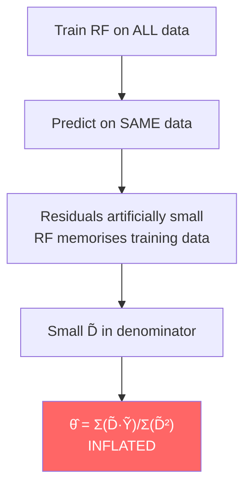
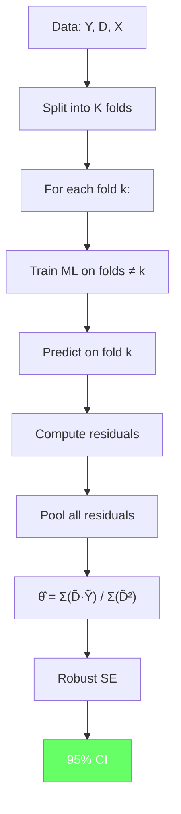
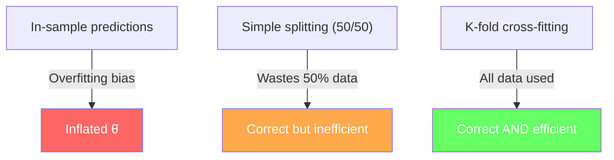

<!-- _class: lead -->

# Cross-Fitting and Sample Splitting

## Module 4: Eliminating Overfitting Bias
### Double/Debiased Machine Learning

<!-- Speaker notes: This deck covers cross-fitting, the second pillar of DML alongside orthogonal scores. Without cross-fitting, even orthogonal estimators can be biased because in-sample ML predictions are too good. We will demonstrate the overfitting bias and show how K-fold cross-fitting eliminates it. -->

---

## In Brief

In-sample ML predictions are **too good** — the model has memorised the training data.

> **Problem:** Small residuals inflate the treatment effect estimate.

Cross-fitting ensures all predictions are genuinely **out-of-sample**.

<!-- Speaker notes: The core problem is simple. When a random forest trains on observation i and then predicts observation i, it partially memorises that observation. The prediction is biased toward the true value, making the residual artificially small. In the treatment effect formula, small treatment residuals in the denominator inflate theta-hat. Cross-fitting solves this by ensuring every prediction is made by a model that never saw that observation during training. -->

---

## Cross-Fitting Algorithm

```
K=5 Folds:

Fold 1: [TRAIN TRAIN TRAIN TRAIN | TEST ]  → predictions for fold 5
Fold 2: [TRAIN TRAIN TRAIN | TEST  TRAIN]  → predictions for fold 4
Fold 3: [TRAIN TRAIN | TEST  TRAIN TRAIN]  → predictions for fold 3
Fold 4: [TRAIN | TEST  TRAIN TRAIN TRAIN]  → predictions for fold 2
Fold 5: [TEST  TRAIN TRAIN TRAIN TRAIN]   → predictions for fold 1

→ Every observation has an OUT-OF-SAMPLE prediction
→ No data leakage
```

<!-- Speaker notes: Walk through the diagram row by row. In each iteration, 80% of the data trains the ML model and 20% receives out-of-sample predictions. After all 5 iterations, every observation has a prediction from a model that never saw it. This is computationally cheap (train 5 models instead of 1) but eliminates the overfitting bias entirely. The algorithm is identical to cross-validated predictions in sklearn. -->

---

## Why In-Sample Predictions Are Biased



With in-sample predictions:
- $\hat{g}_{in}(X_i) \approx Y_i$ → $\tilde{Y}_i \approx 0$
- $\hat{m}_{in}(X_i) \approx D_i$ → $\tilde{D}_i \approx 0$
- $\hat{\theta} = 0/0$ situation → unstable, biased

<!-- Speaker notes: This is the mechanism of the overfitting bias. The random forest with many trees and unlimited depth can perfectly fit the training data. When you then compute residuals on that same training data, they are essentially zero. The treatment effect formula divides a near-zero numerator by a near-zero denominator, which is numerically unstable and systematically biased. Even with limited depth, the in-sample predictions are still too close to the truth. -->

---

## Code: In-Sample vs Cross-Fitted

```python
# In-sample (WRONG)
rf_y = RandomForestRegressor(200).fit(X, Y)
rf_d = RandomForestRegressor(200).fit(X, D)
rY_in = Y - rf_y.predict(X)  # Too small!
rD_in = D - rf_d.predict(X)  # Too small!
theta_in = sum(rD_in * rY_in) / sum(rD_in ** 2)

# Cross-fitted (CORRECT)
rY_cf, rD_cf = np.zeros(n), np.zeros(n)
for train, test in KFold(5).split(X):
    rf_y.fit(X[train], Y[train])
    rf_d.fit(X[train], D[train])
    rY_cf[test] = Y[test] - rf_y.predict(X[test])
    rD_cf[test] = D[test] - rf_d.predict(X[test])
theta_cf = sum(rD_cf * rY_cf) / sum(rD_cf ** 2)
```

| Method | Estimate | True = 1.0 |
|--------|:--------:|:----------:|
| In-sample | ~1.30 | Biased |
| **Cross-fitted** | **~1.00** | **Unbiased** |

<!-- Speaker notes: The code comparison is stark. Same data, same ML model, but in-sample gives a biased estimate while cross-fitting gives an unbiased one. The typical bias from in-sample DML is 20-40% in our simulations, which is substantial. The only difference is whether the model saw the observation during training. This is why cross-fitting is mandatory in DML, not optional. -->

---

## DML1 vs DML2

<div class="columns">
<div>

### DML1 (Average)
$$\hat{\theta}_{DML1} = \frac{1}{K}\sum_{k=1}^K \hat{\theta}_k$$

- Average fold-specific estimates
- Higher variance with small folds
- Easier to interpret per-fold

</div>
<div>

### DML2 (Pool)
$$\hat{\theta}_{DML2} = \frac{\sum_i \tilde{D}_i\tilde{Y}_i}{\sum_i \tilde{D}_i^2}$$

- Pool all residuals, estimate once
- Lower variance (recommended)
- Default in `doubleml` package

</div>
</div>

<!-- Speaker notes: DML1 computes a separate treatment effect for each fold and averages them. DML2 pools all cross-fitted residuals and computes one estimate. Both are consistent, but DML2 has lower variance because it uses all residuals in one regression. DML2 is the default in the doubleml package and is recommended unless you have a specific reason to use DML1, such as checking for fold-level heterogeneity. -->

---

## Effect of Number of Folds K

| K | Training data per fold | Estimate quality |
|:-:|:--------------------:|:----------------:|
| 2 | 50% | Fewer training samples, noisier ML |
| 5 | 80% | Good balance (default) |
| 10 | 90% | More training, more computation |
| 20 | 95% | Diminishing returns |

> $K = 5$ is the standard choice. Larger $K$ uses more training data but increases computation linearly.

<!-- Speaker notes: The choice of K involves a tradeoff. Larger K means each fold uses more data for training, which gives better ML models. But it also means more models to train, which increases computation. K equals 5 is the standard choice in the DML literature and in the doubleml package. Going beyond 10 rarely helps because the ML models are already trained on 90% of the data. -->

---

## Commodity Context: Oil Spread Estimation

**Scenario:** Estimate the effect of OPEC announcements on WTI calendar spreads with 50 market controls.

Without cross-fitting:
- Random forest memorises spread patterns in the training data
- Treatment residuals are artificially small → $\hat{\theta}$ inflated by 20-30%

With cross-fitting:
- All spread predictions are out-of-sample
- $\hat{\theta}$ is centred on the true effect
- CI achieves nominal 95% coverage

> In commodity applications with flexible ML models, cross-fitting is mandatory.

<!-- Speaker notes: This slide grounds the cross-fitting discussion in a concrete commodity example. When you estimate the effect of OPEC announcements on calendar spreads using random forests with 200 trees, the in-sample predictions are almost perfect — the forest has memorised the training data. The treatment residuals become near-zero, and the treatment effect estimate blows up. Cross-fitting prevents this by ensuring each prediction is from a model that never saw that observation. The bias reduction is dramatic: from 20-30% inflation to approximately zero. -->

---

## Repeated Cross-Fitting for Stability

Results can vary with the random fold assignment. **Repeated cross-fitting** averages over $R$ random fold splits:

$$\hat{\theta}_{RCF} = \frac{1}{R}\sum_{r=1}^R \hat{\theta}^{(r)}$$

| Approach | Variability | Cost |
|----------|:-----------:|:----:|
| Single cross-fitting | Moderate | 1x |
| Repeated ($R=5$) | Low | 5x |
| Repeated ($R=10$) | Very low | 10x |

> Use $R=5$ to 10 in production. Report median and IQR for robustness.

<!-- Speaker notes: A single cross-fitting run depends on the random fold assignment. Different random seeds produce slightly different estimates. Repeated cross-fitting runs the full DML algorithm R times with different fold assignments and averages the results. This is computationally expensive but reduces the variability from fold assignment to negligible levels. In production, R equals 5 to 10 is a good default. Report the median estimate and interquartile range rather than just a single run. -->

---

## Complete DML Algorithm Summary



<!-- Speaker notes: This diagram summarises the complete DML algorithm that we have built over Modules 02-04. Start with data, split into K folds, for each fold train the ML models on the other folds and predict on the held-out fold, compute residuals, pool all residuals, and compute the treatment effect. The standard error uses the heteroskedasticity-robust formula. This is exactly what the doubleml library implements internally, which we will use starting in Module 05. -->

---

## Connections

<div class="columns">
<div>

### Builds On
- Module 02: Orthogonalisation trick
- Module 03: Neyman orthogonal scores
- Cross-validation in ML

</div>
<div>

### Leads To
- Module 05: `doubleml` (uses cross-fitting)
- Module 09: Production pipeline
- Repeated cross-fitting for stability

</div>
</div>

<!-- Speaker notes: Cross-fitting completes the theoretical foundation of DML. Combined with orthogonal scores from Module 03, it ensures valid root-n inference with ML nuisance estimates. Module 05 uses the doubleml package which implements cross-fitting automatically. Module 09 covers production considerations like optimal K selection and repeated cross-fitting for stability. -->

---

## Visual Summary



<!-- Speaker notes: Three approaches: in-sample (biased), simple splitting (unbiased but wasteful), and cross-fitting (unbiased and efficient). Cross-fitting is strictly better than both alternatives and is always the recommended approach. With orthogonal scores from Module 03 and cross-fitting from this module, we now have the complete DML framework. Module 05 puts it all together with the doubleml package. -->
