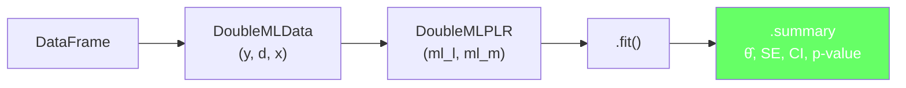
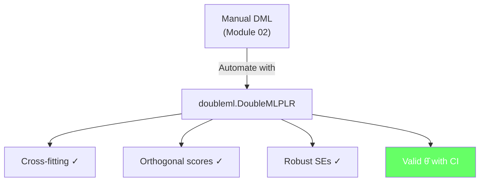

<!-- _class: lead -->

# Partially Linear Models in Practice

## Module 5: Production PLR with `doubleml`
### Double/Debiased Machine Learning

<!-- Speaker notes: This deck takes you from manual DML to the production-ready doubleml library. We cover the DoubleMLPLR class end-to-end: data preparation, nuisance model selection, fitting, inference, and diagnostics. The commodity example is carbon price effects on power generation fuel mix. -->

---

## In Brief

`doubleml.DoubleMLPLR` handles cross-fitting, orthogonal scores, and standard errors **automatically**.

> **Your job:** Choose good nuisance ML models and validate results.

The library handles the econometric machinery.

<!-- Speaker notes: This is the practical payoff of Modules 02-04. Everything we built from scratch — residualisation, orthogonal scores, cross-fitting — is implemented in a production-ready package. The doubleml library by Bach, Chernozhukov, Kurz, and Spindler implements the full DML framework with rigorous asymptotic inference. Your main task is selecting appropriate ML models for the nuisance functions. -->

---

## The `doubleml` Pipeline



<!-- Speaker notes: The pipeline is four steps: create a DataFrame, wrap it in DoubleMLData specifying which columns are Y, D, and X, instantiate DoubleMLPLR with your chosen ML models, and call fit. The summary gives you everything you need: the treatment effect, standard error, confidence interval, and p-value. The library handles all the internal cross-fitting and score computation. -->

---

## Step 1: Create DoubleMLData

```python
from doubleml import DoubleMLData
import pandas as pd

dml_data = DoubleMLData(df,
                        y_col='coal_share',
                        d_cols='carbon_price_change',
                        x_cols=control_columns)
print(dml_data)
```

| Parameter | Description |
|-----------|-------------|
| `y_col` | Outcome variable name |
| `d_cols` | Treatment variable(s) |
| `x_cols` | Control variables |
| `z_cols` | Instruments (for IV, Module 07) |

<!-- Speaker notes: DoubleMLData is a container that organises your data. It stores which columns are the outcome, treatment, and controls. The x_cols parameter accepts a list of column names for the control variables. For multiple treatments, d_cols can be a list. The z_cols parameter is used for instrumental variables, which we cover in Module 07. -->

---

## Step 2: Choose Nuisance Models

<div class="columns">
<div>

### ml_l: Predict Y from X
- $\hat{g}(X) \approx E[Y|X]$
- Pure prediction task
- Use best ML model available

</div>
<div>

### ml_m: Predict D from X
- $\hat{m}(X) \approx E[D|X]$
- Pure prediction task
- Same ML model or different

</div>
</div>

```python
from sklearn.ensemble import GradientBoostingRegressor

ml_l = GradientBoostingRegressor(200, max_depth=5, learning_rate=0.1)
ml_m = GradientBoostingRegressor(200, max_depth=5, learning_rate=0.1)
```

<!-- Speaker notes: The two nuisance models are ordinary prediction models. ml_l predicts the outcome Y from controls X. ml_m predicts the treatment D from controls X. These are standard supervised learning tasks — use whatever model gives the best out-of-sample prediction. Gradient boosting and random forests are the most common choices. You can use different models for ml_l and ml_m if the prediction tasks have different characteristics. -->

---

## Step 3: Fit and Interpret

```python
from doubleml import DoubleMLPLR

dml_plr = DoubleMLPLR(dml_data, ml_l=ml_l, ml_m=ml_m,
                       n_folds=5, score='partialling out')
dml_plr.fit()
print(dml_plr.summary)
```

| Output | Meaning |
|--------|---------|
| `coef` | Treatment effect $\hat{\theta}$ |
| `se` | Standard error |
| `t` | t-statistic = coef / se |
| `P>\|t\|` | Two-sided p-value |
| `confint()` | 95% confidence interval |

<!-- Speaker notes: The fit method runs the full DML algorithm internally: K-fold cross-fitting, orthogonal score computation, and robust standard error estimation. The summary table looks like a standard regression output but with valid inference thanks to DML's asymptotic theory. The confidence interval uses the normal approximation, which is justified by the root-n consistency and asymptotic normality of the DML estimator. -->

---

## Commodity Example: Carbon Price on Coal Share

```python
# Setup
dml_plr = DoubleMLPLR(dml_data, ml_l=ml_l_gb, ml_m=ml_m_gb)
dml_plr.fit()

print(f"Effect:  {dml_plr.coef[0]:.4f}")
print(f"SE:      {dml_plr.se[0]:.4f}")
print(f"95% CI:  {dml_plr.confint().values[0]}")
```

**Interpretation:** A 1-unit increase in carbon price reduces coal share of generation by ~0.5 percentage points, controlling for 50 market variables nonlinearly.

<!-- Speaker notes: In the carbon price example, the treatment effect is negative — higher carbon prices reduce coal generation share. The 95% CI tells you the range of plausible effects. If the CI excludes zero, the effect is statistically significant. The key advantage over OLS is that you have controlled for 50 market variables with flexible nonlinear relationships, which OLS cannot do without manual feature engineering. -->

---

## Comparing Nuisance Models

| ML Model | $\hat{\theta}$ | SE | 95% CI |
|----------|:--:|:--:|:------:|
| Lasso | -0.48 | 0.05 | [-0.58, -0.38] |
| Random Forest | -0.50 | 0.04 | [-0.58, -0.42] |
| **Gradient Boosting** | **-0.50** | **0.04** | **[-0.58, -0.42]** |

> All models agree → result is **robust** to nuisance model choice.

<!-- Speaker notes: When multiple nuisance model choices give similar treatment effects, you can be confident the result is robust. If they disagree substantially, it suggests the confounding structure matters and you should investigate further — perhaps the linear Lasso cannot capture important nonlinearities. In practice, gradient boosting and random forests usually agree closely, which is reassuring. -->

---

## Connections

<div class="columns">
<div>

### Builds On
- Modules 02-04: DML theory
- `scikit-learn` ML models

</div>
<div>

### Leads To
- Module 06: IRM (binary treatment)
- Module 07: PLIV (instruments)
- Module 09: Production pipeline

</div>
</div>

<!-- Speaker notes: This module is the practical turning point of the course. You now have a production tool for estimating causal effects with many controls. Modules 06-08 extend this to binary treatments, instrumental variables, and heterogeneous effects. Module 09 wraps everything into a production pipeline with validation and diagnostics. -->

---

## Visual Summary



<!-- Speaker notes: The doubleml library automates everything from Modules 02-04. Cross-fitting, orthogonal scores, and robust standard errors are all handled internally. You provide the data, choose ML models, and call fit. The result is a valid treatment effect with confidence intervals. This is the workhorse tool for the rest of the course. -->
