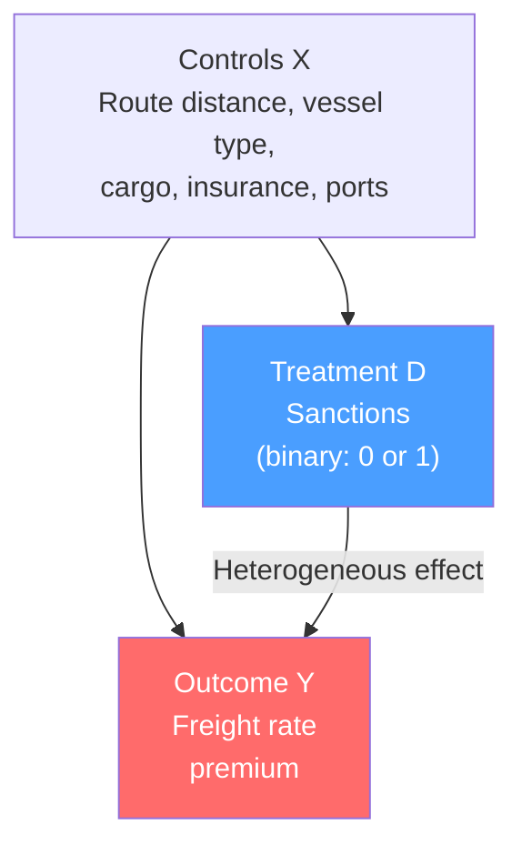
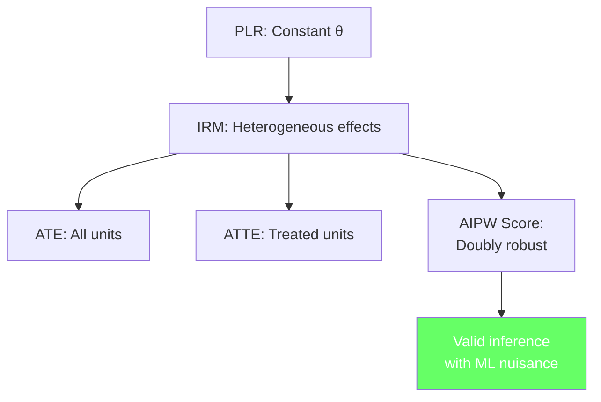

<!-- _class: lead -->

# Interactive Regression Models

## Module 6: Binary Treatments with DML
### Double/Debiased Machine Learning

<!-- Speaker notes: This deck extends DML to binary treatments using the Interactive Regression Model. We cover the AIPW score, propensity score estimation, ATE vs ATTE, and the doubleml.DoubleMLIRM implementation. The commodity example is sanctions impact on shipping freight rates. -->

---

## In Brief

PLR assumes a **constant** treatment effect. IRM allows effects to **vary** with covariates.

> **When to use IRM:** Binary treatment (yes/no) where you expect heterogeneous effects.

IRM estimates both ATE and ATTE using doubly robust AIPW scores.

<!-- Speaker notes: The PLR model from Module 05 works well for continuous treatments with constant effects. But when treatment is binary — like whether a shipping route is sanctioned — you want the effect to potentially vary across units. Some routes may be more affected than others based on their characteristics. The IRM handles this by modelling both the outcome function and the propensity score. -->

---

## PLR vs IRM

<div class="columns">
<div>

### PLR
- $Y = \theta D + g_0(X) + \epsilon$
- $\theta$ is **constant** for all $X$
- Continuous $D$
- Simpler estimation

</div>
<div>

### IRM
- $Y = g_0(D, X) + \epsilon$
- Effect varies with $X$
- **Binary** $D \in \{0, 1\}$
- ATE and ATTE
- Propensity score $m_0(X) = P(D=1|X)$

</div>
</div>

<!-- Speaker notes: The key difference is that IRM models the full outcome function g0(D,X) rather than assuming a linear-in-D structure. This means the treatment effect g0(1,X) minus g0(0,X) can vary with X. The IRM requires estimating the propensity score m0(X) as an additional nuisance function. The AIPW score combines the outcome model and propensity score in a doubly robust way. -->

---

## The AIPW Score (ATE)

$$\psi_{ATE} = \underbrace{g(1, X) - g(0, X)}_{\text{outcome model}} + \underbrace{\frac{D(Y - g(1,X))}{m(X)}}_{\text{treated correction}} - \underbrace{\frac{(1-D)(Y - g(0,X))}{1 - m(X)}}_{\text{control correction}} - \theta$$

**Doubly robust:** Consistent if EITHER $\hat{g}$ or $\hat{m}$ is correct.

<!-- Speaker notes: The AIPW score has three components. The first is the predicted treatment effect from the outcome model. The second and third are corrections that account for imperfect outcome modelling, weighted by the inverse propensity. The score is doubly robust: if either the outcome model or the propensity score is consistently estimated, the ATE is consistent. In DML, both are estimated with ML and cross-fitting, giving valid inference. -->

---

## Commodity Example: Sanctions on Freight Rates



**ATE:** Average effect across all routes
**ATTE:** Average effect on sanctioned routes specifically

<!-- Speaker notes: Sanctions affect different routes differently. A route through the Strait of Hormuz under sanctions sees a larger freight premium than a route in the Mediterranean, because of the strategic chokepoint. The ATE averages across all routes, while ATTE focuses on the routes that were actually sanctioned. ATTE is more relevant for policy evaluation: what was the actual impact on sanctioned routes? -->

---

## Code: IRM with `doubleml`

```python
from doubleml import DoubleMLIRM
from sklearn.ensemble import RandomForestRegressor, RandomForestClassifier

irm_ate = DoubleMLIRM(dml_data,
    ml_g=RandomForestRegressor(200),    # Outcome model
    ml_m=RandomForestClassifier(200),   # Propensity score
    score='ATE', n_folds=5,
    trimming_threshold=0.05)
irm_ate.fit()

irm_atte = DoubleMLIRM(dml_data,
    ml_g=RandomForestRegressor(200),
    ml_m=RandomForestClassifier(200),
    score='ATTE', n_folds=5)
irm_atte.fit()
```

<!-- Speaker notes: The DoubleMLIRM API is similar to DoubleMLPLR. The key differences are: ml_g is the outcome model (predicts Y from D and X), ml_m is the propensity score model (classifier, predicts D from X), and the score parameter chooses between ATE and ATTE. The trimming_threshold drops observations with extreme propensity scores to prevent numerical instability. Use RandomForestClassifier for ml_m since D is binary. -->

---

## Propensity Score Diagnostics

Good overlap is essential for IRM:

| Diagnostic | Good | Bad |
|-----------|------|-----|
| Overlap | Both groups span [0.1, 0.9] | Treated near 1, control near 0 |
| Balance | Covariates similar after weighting | Large imbalances remain |
| Trimming | < 5% observations dropped | > 20% dropped |

> ⚠️ If overlap is poor, consider PLR or bounds analysis instead.

<!-- Speaker notes: The propensity score overlap condition is crucial for IRM. If treated and untreated units have very different propensity scores (poor overlap), the inverse probability weights become extreme and the estimator is unstable. Diagnostic plots should show substantial overlap in propensity score distributions. If overlap is poor, the IRM may not be appropriate and you should consider alternative approaches like the PLR or partial identification bounds. -->

---

## Connections

<div class="columns">
<div>

### Builds On
- Module 05: PLR with `doubleml`
- Propensity score methods
- AIPW estimation

</div>
<div>

### Leads To
- Module 08: CATE heterogeneity
- Module 09: Production pipeline

</div>
</div>

<!-- Speaker notes: IRM extends PLR to binary treatments with heterogeneous effects. Module 08 takes this further by estimating individual-level conditional average treatment effects using econml. Module 09 incorporates IRM into the production pipeline with automated diagnostics for propensity score quality. -->

---

## Visual Summary



<!-- Speaker notes: IRM generalises PLR to binary treatments with heterogeneous effects. It estimates both ATE and ATTE using the doubly robust AIPW score. The propensity score is an additional nuisance function estimated with a classifier. Diagnostics for overlap and trimming are essential for reliable results. -->
