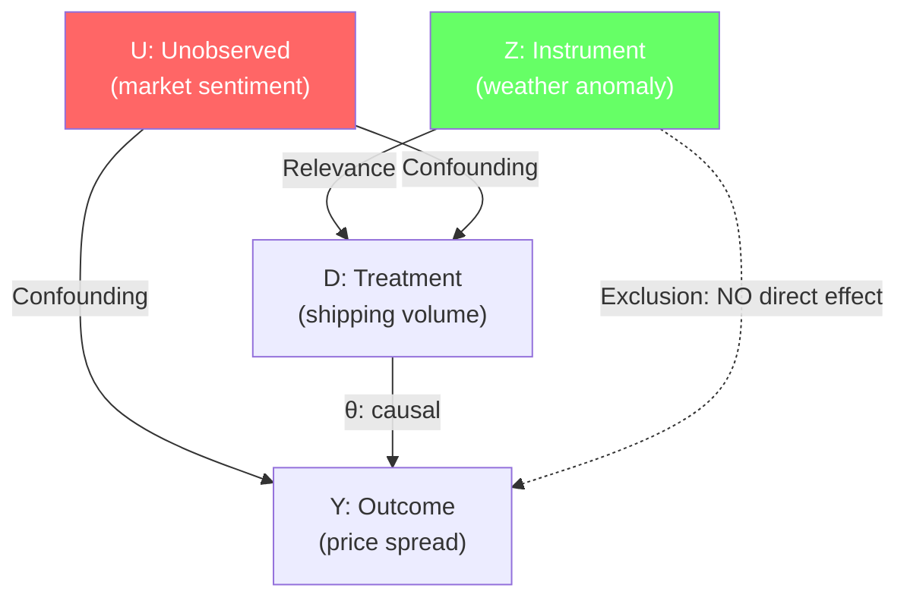
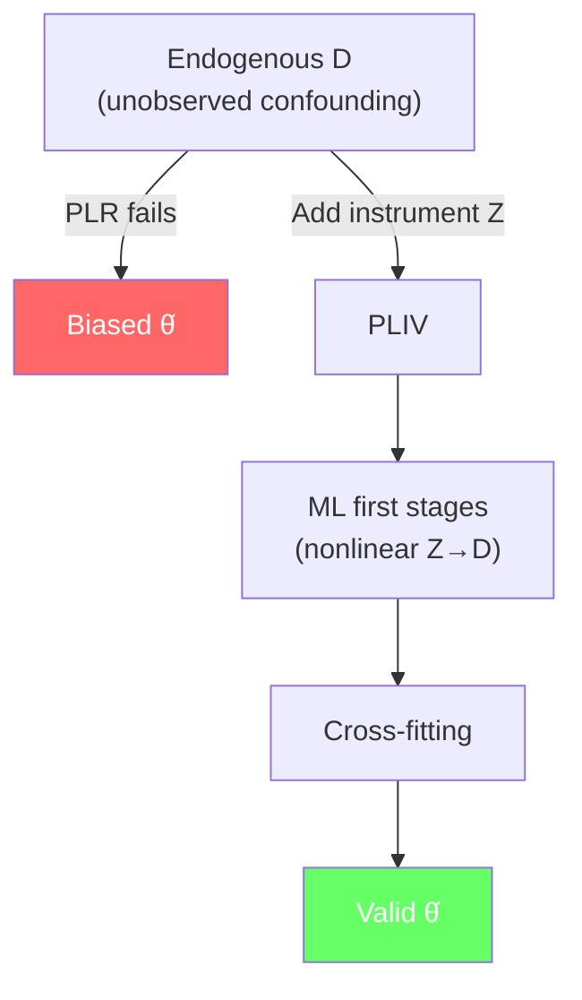

<!-- _class: lead -->

# Instrumental Variables with DML

## Module 7: PLIV for Endogenous Treatments
### Double/Debiased Machine Learning

<!-- Speaker notes: This deck covers the Partially Linear Instrumental Variables model. When treatment is endogenous (correlated with unobservable confounders), standard DML fails. PLIV uses an instrument that affects the outcome only through the treatment, with ML first stages replacing traditional linear 2SLS. -->

---

## In Brief

Standard DML assumes **all confounders are observed**. When unobservable confounders exist, use PLIV.

> **Key idea:** An instrument $Z$ that affects $D$ but not $Y$ directly identifies the causal effect even with unobserved confounding.

ML first stages handle nonlinear instrument-treatment relationships.

<!-- Speaker notes: The selection-on-observables assumption in Modules 02-06 requires that all confounders are in X. In many commodity markets, this is unrealistic — market sentiment, insider information, and private expectations are unobserved confounders. PLIV addresses this by using an instrument: a variable that affects the treatment but has no direct effect on the outcome. The classic example is weather as an instrument for agricultural supply. -->

---

## The IV DAG



<!-- Speaker notes: The DAG shows the three key elements. Z (weather) affects D (shipping volume) through relevance. U (market sentiment) confounds both D and Y. The exclusion restriction says Z does not directly affect Y — weather affects prices only through its effect on shipping volume. If these conditions hold, PLIV identifies the causal effect theta even though U is unobserved. -->

---

## PLIV Model

$$Y = \theta D + g_0(X) + \epsilon, \quad E[\epsilon | Z, X] = 0$$
$$D = r_0(X) + h_0(Z, X) + V$$

Three nuisance functions:
- $g_0(X)$: controls' effect on $Y$ (ml_l)
- $m_0(X)$: controls' effect on $D$ (ml_m)
- $r_0(X, Z)$: instrument + controls' effect on $D$ (ml_r)

<!-- Speaker notes: The PLIV model extends PLR with an instrument equation. The key difference from PLR is the exclusion restriction: epsilon is mean-independent of Z given X. This means Z only affects Y through D. The doubleml library estimates three nuisance functions: ml_l for the outcome, ml_m for the treatment as a function of controls only, and ml_r for the treatment as a function of controls and the instrument. -->

---

## Code: PLIV with `doubleml`

```python
from doubleml import DoubleMLPLIV

dml_data = DoubleMLData(df,
    y_col='price_spread',
    d_cols='shipping_volume',
    x_cols=control_columns,
    z_cols='weather_anomaly')    # Instrument!

pliv = DoubleMLPLIV(dml_data,
    ml_l=RandomForestRegressor(200),
    ml_m=RandomForestRegressor(200),
    ml_r=RandomForestRegressor(200),
    n_folds=5)
pliv.fit()
print(pliv.summary)
```

<!-- Speaker notes: The API adds z_cols for the instrument and ml_r for the first-stage relationship between instrument, controls, and treatment. The rest is identical to DoubleMLPLR. The fit method runs cross-fitting for all three nuisance functions and computes the orthogonal IV score. The standard error accounts for the IV estimation step. -->

---

## Instrument Strength Check

| Diagnostic | Formula | Threshold |
|-----------|---------|:---------:|
| First-stage partial $R^2$ | $\frac{R^2_{Z+X} - R^2_X}{1 - R^2_X}$ | > 0.05 |
| First-stage F-stat | Standard F-test on $Z$ | > 10 |
| CI width ratio | $\frac{CI_{PLIV}}{CI_{PLR}}$ | < 3 |

> Weak instruments → wide CIs, unreliable point estimates. Always check.

<!-- Speaker notes: The partial R-squared measures how much predictive power the instrument adds beyond the controls. Values above 0.05 suggest adequate strength. The classical rule of thumb is F greater than 10 for the first stage, but with ML first stages, partial R-squared is more appropriate. If the confidence interval from PLIV is much wider than from PLR, the instrument may be weak. -->

---

## OLS vs PLIV Comparison

| Method | Estimate | True = 0.50 | Issue |
|--------|:--------:|:-----------:|-------|
| OLS (no controls) | ~0.80 | Biased | Endogeneity |
| PLR (no instrument) | ~0.75 | Biased | U unobserved |
| **PLIV** | **~0.50** | **Correct** | Uses instrument |

> PLIV recovers the truth when OLS and PLR cannot.

<!-- Speaker notes: This comparison demonstrates why PLIV is necessary. OLS is biased because D is correlated with U. PLR is also biased because it cannot control for U since U is unobserved. PLIV uses the instrument Z to identify the causal effect despite the unobserved confounding. The instrument essentially provides exogenous variation in D that is uncorrelated with U, allowing identification. -->

---

## Connections

<div class="columns">
<div>

### Builds On
- Module 05: PLR with `doubleml`
- Classical 2SLS
- IV identification

</div>
<div>

### Leads To
- Module 09: Production pipeline
- Weak instrument diagnostics
- LATE interpretation

</div>
</div>

<!-- Speaker notes: PLIV extends the DML framework to handle endogeneity. It combines the flexibility of ML first stages with the identification power of instrumental variables. The next modules cover heterogeneous treatment effects and production pipelines, both of which can incorporate IV estimation. -->

---

## Visual Summary



<!-- Speaker notes: When treatment is endogenous, PLR is biased regardless of how good the ML models are — you cannot control for what you cannot observe. PLIV solves this by adding an instrument that provides exogenous variation. The ML first stages handle nonlinear relationships between the instrument and treatment, and cross-fitting prevents overfitting. -->
