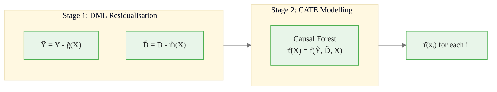
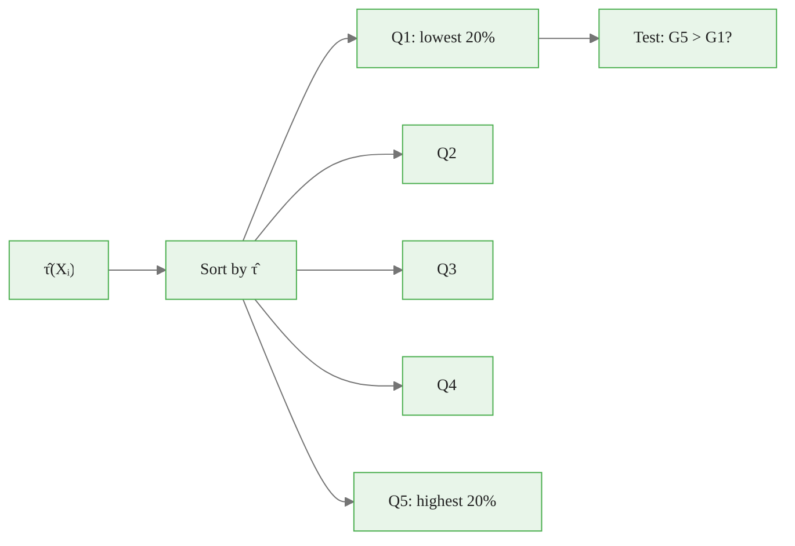
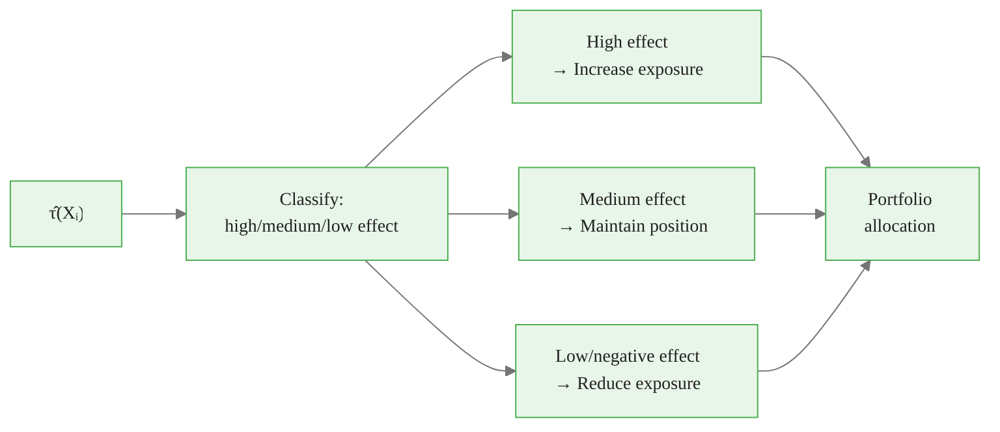
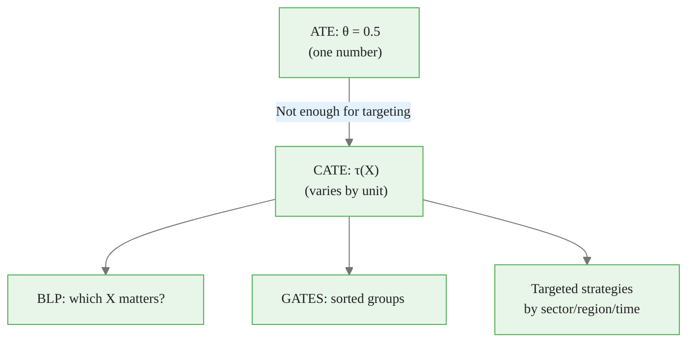

<!-- _class: lead -->

# Heterogeneous Treatment Effects

## Module 8: CATE with `econml`
### Double/Debiased Machine Learning

<!-- Speaker notes: This deck moves beyond average treatment effects to conditional average treatment effects — how treatment effects vary across individuals. We use Microsoft's econml library with the DML framework. The commodity example is heterogeneous effects of inventory surprises across commodity sectors. -->

---

## In Brief

ATE tells you the treatment **works on average**. CATE tells you **for whom** it works best.

> In commodity markets: which sectors, regions, or time periods are most affected?

`econml.dml.CausalForestDML` estimates $\tau(X) = E[Y(1) - Y(0) | X]$.

<!-- Speaker notes: The shift from ATE to CATE is one of the most valuable extensions in causal inference. An inventory surprise may have a large effect on energy futures but almost no effect on precious metals. Knowing this heterogeneity is essential for portfolio allocation and risk management. The econml library provides several CATE estimators built on the DML framework. -->

---

## From ATE to CATE

<div class="columns">
<div>

### ATE (Module 05)
- One number: $\theta = 0.5$
- Same for everyone
- Average across all units
- `doubleml.DoubleMLPLR`

</div>
<div>

### CATE (This module)
- Function: $\tau(X)$
- Varies by unit characteristics
- Energy: 1.2, Metals: 0.3
- `econml.CausalForestDML`

</div>
</div>

<!-- Speaker notes: The ATE from Modules 05-06 tells you the average effect. But if energy futures respond 4x more than metals to inventory surprises, knowing only the average is insufficient for trading decisions. CATE estimation recovers the full function tau(X), telling you how the effect varies with observable characteristics. This enables targeted strategies: increase energy exposure during surprise events, reduce metals exposure. -->

---

## CATE Estimation Pipeline



<!-- Speaker notes: The pipeline has two stages. Stage 1 is standard DML residualisation — remove the confounding using ML. Stage 2 models the residual-on-residual relationship as a function of X using a causal forest or other flexible model. The result is a CATE estimate for each observation, which you can then analyse by subgroup, plot, or use for targeting. -->

---

## Code: CausalForestDML

```python
from econml.dml import CausalForestDML
from sklearn.ensemble import GradientBoostingRegressor

cf_dml = CausalForestDML(
    model_y=GradientBoostingRegressor(200, max_depth=5),
    model_t=GradientBoostingRegressor(200, max_depth=5),
    n_estimators=200, random_state=42)

cf_dml.fit(Y, D, X=X, W=W)

# Individual-level CATE
cate_hat = cf_dml.effect(X)

# Confidence intervals
cate_low, cate_high = cf_dml.effect_interval(X, alpha=0.05)
```

<!-- Speaker notes: The CausalForestDML API takes model_y and model_t for the first-stage nuisance models, plus n_estimators for the causal forest. The fit method takes Y, D, X (effect modifiers), and optionally W (additional controls). The effect method returns point estimates, and effect_interval returns confidence intervals. X contains the variables that moderate the treatment effect, while W contains additional controls. -->

---

## Commodity Example: Inventory Surprises by Sector

| Sector | True CATE | Estimated CATE |
|--------|:---------:|:--------------:|
| Energy | 1.20 | ~1.18 |
| Metals | 0.30 | ~0.31 |
| Agriculture | -0.10 | ~-0.08 |

> Energy futures are **4x more sensitive** to inventory surprises than metals.

This insight drives sector allocation during inventory release events.

<!-- Speaker notes: The table shows that the causal forest correctly identifies the heterogeneity across sectors. Energy is highly sensitive to inventory surprises, metals moderately so, and agriculture barely responds. For a commodity trader, this means increasing energy exposure and reducing agriculture exposure when inventory surprises are expected. The magnitude difference (4x) is large enough to be economically significant. -->

---

## BLP and GATES Analysis

**BLP (Best Linear Projection):** Tests which covariates predict heterogeneity.

**GATES (Group Average Treatment Effects):** Sorts by estimated CATE, tests for monotonicity.



<!-- Speaker notes: BLP projects the CATE onto observable covariates and tests which ones significantly predict heterogeneity. GATES is a simpler diagnostic: sort observations by their estimated CATE, divide into quintiles, and compute the average effect in each group. If the groups show a clear monotone pattern (low to high), the CATE model is capturing real heterogeneity. If the groups are flat, there may be no meaningful heterogeneity. -->

<div class="callout-info">
Info: BLP (Best Linear Projection):
</div>

---

## CATE Estimator Comparison

| Estimator | CATE Form | Best For |
|-----------|-----------|----------|
| `LinearDML` | $\tau(X) = X\beta$ | Linear heterogeneity |
| `CausalForestDML` | $\tau(X) = f(X)$ | Nonlinear, many moderators |
| `DML` (generic) | Custom final model | Advanced users |

```python
# LinearDML: fast, interpretable
from econml.dml import LinearDML
ldml = LinearDML(model_y=gbm, model_t=gbm)
ldml.fit(Y, D, X=X, W=W)
print(ldml.summary())  # Coefficients on X
```

<!-- Speaker notes: Three main estimators in econml for CATE. LinearDML assumes CATE is a linear function of the effect modifiers — fast and interpretable, good when you have a few key moderators. CausalForestDML is fully nonparametric and handles arbitrary heterogeneity patterns. The generic DML class lets you plug in any final-stage model. Start with LinearDML for interpretability, then check with CausalForestDML whether nonlinear heterogeneity is present. -->

---

## From CATE to Trading Decisions



**Commodity application:** Before an inventory release:
- **Energy** (high CATE): overweight futures position
- **Metals** (moderate CATE): neutral position
- **Agriculture** (low CATE): underweight or hedge

<!-- Speaker notes: This is the practical payoff of CATE estimation for commodity traders. If you know that energy futures are 4x more sensitive to inventory surprises than metals, you can tilt your portfolio accordingly before scheduled releases. The CATE provides individual-level predictions, so you can even differentiate within sectors — some energy contracts may be more affected than others based on specific characteristics. This is targeted trading driven by causal inference rather than correlations. -->

---

## Sample Size Requirements for CATE

| Analysis | Minimum $n$ | Ideal $n$ | Notes |
|----------|:-----------:|:---------:|-------|
| ATE (Module 05) | 500 | 1,000+ | Single parameter |
| CATE (CausalForest) | 2,000 | 5,000+ | Function estimation |
| BLP | 1,000 | 3,000+ | Few parameters |
| GATES (5 groups) | 2,500 | 5,000+ | 500+ per group |

> CATE estimation is more data-hungry than ATE. With small samples, report ATE and check for heterogeneity using BLP before attempting CATE.

<!-- Speaker notes: CATE estimation requires substantially more data than ATE because you are estimating a function rather than a single number. The causal forest needs enough observations in each leaf to estimate local treatment effects reliably. With fewer than 2000 observations, CATE estimates tend to be noisy and GATES tests are underpowered. In commodity applications, this means you need several years of daily data or a large cross-section. If sample size is limited, start with ATE and use BLP to test for heterogeneity before investing in full CATE estimation. -->

<div class="callout-warning">
Warning: Searching for subgroups with large treatment effects is a multiple testing problem. Always use honest splitting (separate discovery and estimation samples).
</div>

---

## Connections

<div class="columns">
<div>

### Builds On
- Modules 05-06: ATE estimation
- Causal forests (Athey & Wager)
- `econml` library

</div>
<div>

### Leads To
- Module 09: Production pipeline
- Targeted trading strategies
- Policy evaluation by subgroup

</div>
</div>

<!-- Speaker notes: CATE estimation is the most actionable output of the DML framework for commodity traders. Knowing that energy is 4x more sensitive than metals to inventory surprises directly informs trading strategy. Module 09 wraps CATE estimation into a production pipeline with automated BLP/GATES reporting and visualisation. -->

<div class="callout-key">
Key Point: GATES (Group Average Treatment Effects) and CLAN (Classification Analysis) are the two primary tools for exploring treatment effect heterogeneity in the DML framework.
</div>

---

## Visual Summary



<!-- Speaker notes: The visual summary shows the progression from average effects to heterogeneous effects to targeted strategies. ATE is a single number. CATE is a function. BLP and GATES are diagnostics. The practical payoff is targeted trading strategies that exploit the heterogeneity. -->

<div class="callout-insight">
Insight: Heterogeneous treatment effects reveal WHO benefits most from an intervention. This is the difference between "the drug works on average" and "the drug works for patients over 60 with condition X."
</div>
