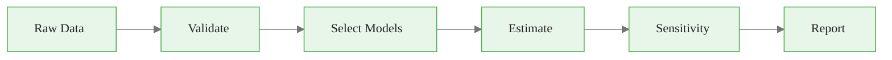
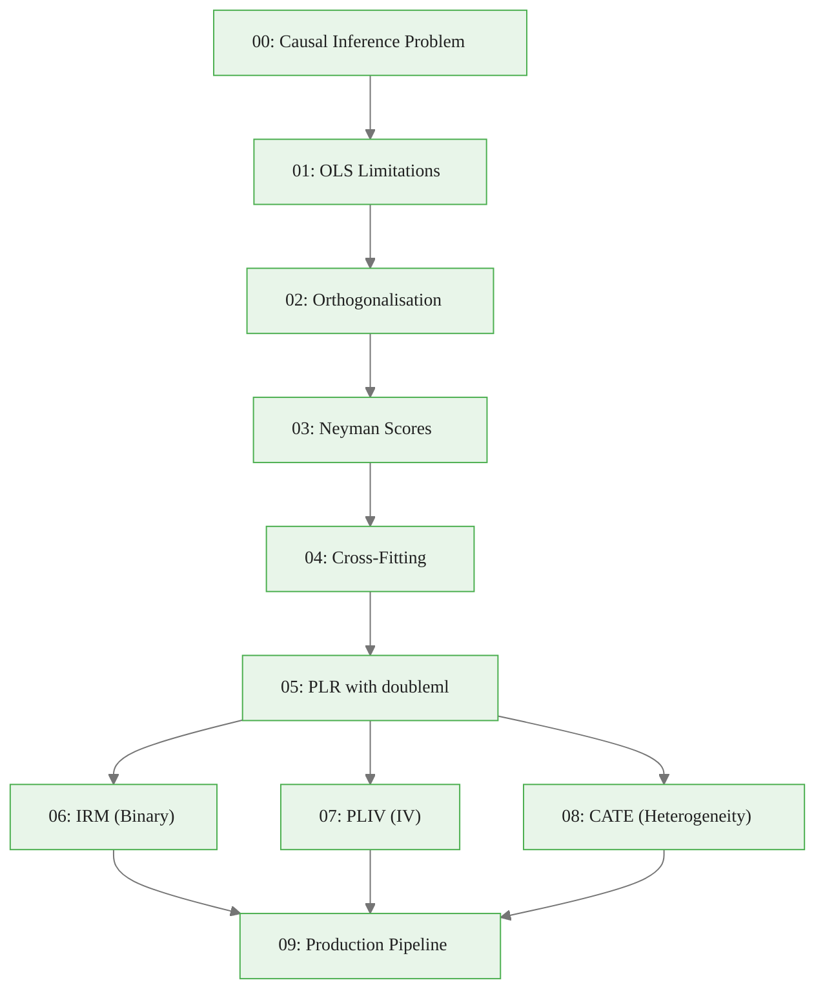

<!-- _class: lead -->

# Production DML Pipeline

## Module 9: From Notebooks to Deployment
### Double/Debiased Machine Learning

<!-- Speaker notes: This final deck covers building a production-ready DML pipeline. We go beyond the core estimator to cover data validation, nuisance model selection, sensitivity analysis, and reporting. The goal is code you can deploy in a trading system, not just run in a notebook. -->

---

## In Brief

A production pipeline needs **four layers** beyond the core estimator:

1. **Data validation** — catch problems before they corrupt results
2. **Model selection** — systematic comparison of nuisance models
3. **Sensitivity analysis** — how robust is the result?
4. **Reporting** — communicate to stakeholders

<!-- Speaker notes: Most DML tutorials stop after estimation. But in production, estimation is maybe 20% of the work. The other 80% is making sure the data is clean, the model is well-chosen, the result is robust, and the output is interpretable by people who do not know what an orthogonal score is. This module covers the full pipeline. -->

<div class="callout-info">
Info:  beyond the core estimator:

1. 
</div>

---

## Pipeline Architecture



Each stage has specific checks and outputs.

<!-- Speaker notes: The pipeline flows left to right. Validation catches data quality issues. Model selection compares nuisance model performance. Estimation runs the core DML algorithm. Sensitivity analysis checks robustness across specifications. Reporting produces interpretable output. Each stage can fail or warn, and the pipeline should handle these gracefully. -->

---

## Stage 1: Data Validation

| Check | Threshold | Action |
|-------|:---------:|--------|
| Missing values | Any | Drop or impute |
| $p/n$ ratio | > 0.5 | Warn: consider dim reduction |
| Treatment variation | $\sigma_D < 10^{-6}$ | Error: no variation |
| Binary prevalence | < 5% or > 95% | Warn: use IRM with trimming |
| Overlap (binary) | Max propensity > 0.95 | Warn: poor overlap |

<!-- Speaker notes: Validation is the first line of defence. Missing values are the most common issue — they should be handled before DML estimation. The p over n ratio determines whether OLS is feasible (low ratio) or ML is needed (high ratio). Treatment variation near zero means there is no causal variation to estimate. For binary treatments, extreme prevalence or poor overlap signals potential problems with the IRM estimator. -->

---

## Stage 2: Nuisance Model Selection

```python
candidates = {
    'lasso': LassoCV(cv=3),
    'rf': RandomForestRegressor(100),
    'gbm': GradientBoostingRegressor(100),
}

for name, model in candidates.items():
    r2_y = cross_val_score(model, X, Y, cv=3, scoring='r2')
    r2_d = cross_val_score(model, X, D, cv=3, scoring='r2')
    print(f"{name}: R²(Y)={r2_y.mean():.3f}, R²(D)={r2_d.mean():.3f}")
```

> Select the model with highest average cross-validated R² across both nuisance tasks.

<!-- Speaker notes: Model selection is automated using cross-validated R-squared. You evaluate each candidate on both prediction tasks (Y from X, D from X) and pick the one with the best average performance. In most commodity applications, gradient boosting wins, but Lasso can be competitive when the true DGP is sparse. The key is to compare systematically rather than guess. -->

---

## Stage 3: Sensitivity Analysis

Run DML with **all** nuisance models:

| Model | Estimate | SE | 95% CI |
|-------|:--------:|:--:|:------:|
| Lasso | -0.48 | 0.05 | [-0.58, -0.38] |
| RF | -0.50 | 0.04 | [-0.58, -0.42] |
| GBM | -0.50 | 0.04 | [-0.58, -0.42] |

> **Robust** if spread < average SE. **Sensitive** if spread > average SE.

<!-- Speaker notes: Sensitivity analysis is the most important diagnostic in production DML. If all nuisance models give similar treatment effects, you can be confident the result is not driven by a particular ML model choice. If the estimates diverge, the confounding structure matters and you need to investigate further. The rule of thumb is that the spread across specifications should be smaller than the average standard error. -->

---

## Stage 4: Reporting

```
DML Estimation Report
=====================
Model:     PLR with gbm nuisance
Data:      n=2000, p=50, K=5 folds
Estimate:  -0.50
95% CI:    [-0.58, -0.42]
P-value:   0.0000
Status:    Significant at 5%
Robust:    Yes (spread=0.02 < SE=0.04)
```

Include: estimate, CI, p-value, nuisance model, sensitivity flag, data dimensions.

<!-- Speaker notes: The report should be understandable by a stakeholder who does not know DML internals. Include the point estimate, confidence interval, significance, and a robustness flag. Log the nuisance model choice, data dimensions, and random seed for reproducibility. In a trading context, this report might feed into a decision engine that adjusts position sizes based on the estimated treatment effect and its uncertainty. -->

---

## Production Checklist

- [ ] Data validation passes (no missing, adequate $n/p$)
- [ ] Nuisance model selected via cross-validated R²
- [ ] Main estimate computed with cross-fitting
- [ ] Sensitivity analysis across specifications
- [ ] Results robust (spread < SE)
- [ ] Report generated with all metadata
- [ ] Random seed and library versions logged
- [ ] Pipeline tested on simulated data with known truth

<!-- Speaker notes: This checklist should be followed for every production DML analysis. Each item addresses a specific failure mode. Skipping validation risks garbage-in-garbage-out. Skipping model selection risks poor nuisance estimates. Skipping sensitivity analysis risks overconfidence. Skipping testing risks undetected bugs. In a production system, these checks can be automated as assertions in the pipeline code. -->

---

## Common Production Failures

| Failure Mode | Cause | Prevention |
|-------------|-------|------------|
| **Silent bias** | Missing confounder | Domain expert review |
| **Stale model** | Market regime change | Periodic re-estimation |
| **Data drift** | Feature distributions shift | Validation checks on new data |
| **Numerical instability** | Extreme propensity scores | Trimming, overlap checks |
| **Overfitting nuisance** | Too few folds | Use $K \geq 5$ |
| **Non-reproducible** | Missing seed/versions | Log everything |

> A production pipeline must anticipate failure modes, not just handle the happy path.

<!-- Speaker notes: This table catalogues the most common ways a production DML pipeline can fail. Silent bias from missing confounders is the most dangerous because everything looks correct but the estimate is wrong. Stale models fail when market regimes shift, which happens regularly in commodity markets. Data drift means the feature distributions change over time, which can degrade ML prediction quality. Each failure mode has a specific prevention strategy that should be built into the pipeline. -->

<div class="callout-insight">
Insight:  | Missing confounder | Domain expert review |
| 
</div>

---

## Commodity Production Example

Complete workflow for a trading desk:

```
Daily:   Validate incoming data (missing, outliers)
Weekly:  Re-estimate treatment effects with latest data
Monthly: Full sensitivity analysis + model reselection
         Compare to previous month's estimates
         Flag significant changes for review

Report:  "Carbon price increase of 1 EUR/tonne reduces
          coal generation share by 0.50pp [0.42, 0.58]
          Robust across Lasso/RF/GBM specifications.
          Based on n=2,400 weekly observations."
```

> Automate the pipeline so that estimation runs without manual intervention.

<!-- Speaker notes: This slide shows what a production DML pipeline looks like in a real commodity trading operation. The pipeline runs on a schedule: daily validation, weekly re-estimation, and monthly deep analysis. The report format is designed for stakeholders who do not know DML internals — they see the estimate, confidence interval, and robustness flag. The key principle is automation: the pipeline should run without manual intervention and flag anomalies for human review. This is achievable with the pipeline class from the guide and a scheduler like cron or Airflow. -->

---

## Connections

<div class="columns">
<div>

### Builds On
- All modules (00-08)
- Software engineering practices
- ML model evaluation

</div>
<div>

### Enables
- Automated causal inference
- Trading system integration
- Reproducible research

</div>
</div>

<!-- Speaker notes: This module wraps up the entire course. You have learned the theory (Modules 00-04), the practice (Modules 05-08), and now the production engineering (Module 09). The pipeline class from the guide is a starting point — extend it with IRM, PLIV, CATE, and your specific validation needs. The key principle is: automate everything, validate everything, and log everything. -->

<div class="callout-warning">
Warning: Changing the ML learner (e.g., switching from random forest to gradient boosting) can change the treatment effect estimate. Document and justify learner choices.
</div>

---

## Course Summary



<!-- Speaker notes: This diagram shows the complete course structure. Modules 00-04 build the theoretical foundation. Module 05 is the practical turning point with doubleml. Modules 06-08 extend to different models and estimands. Module 09 wraps everything into production code. The course takes you from understanding why OLS fails to deploying a production DML pipeline. -->

<div class="callout-key">
Key Point: A production DML pipeline must be reproducible -- pin ML model versions, random seeds, and cross-fitting fold assignments.
</div>
