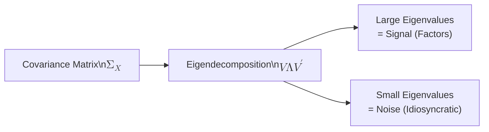
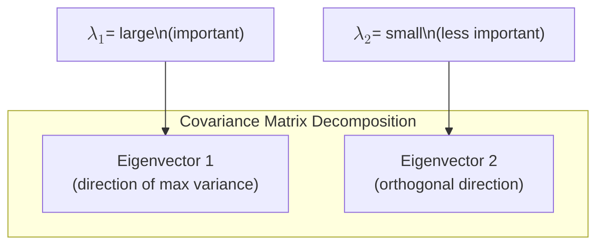
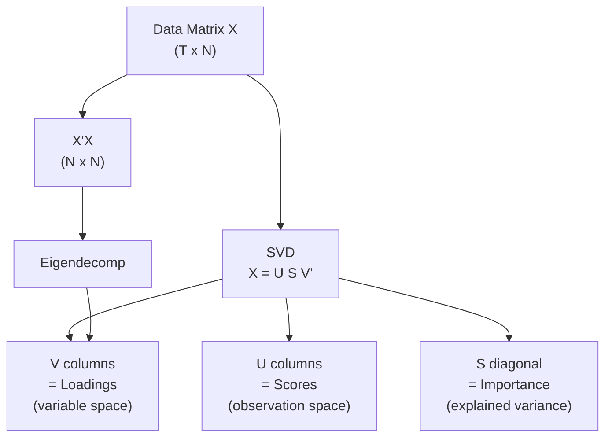
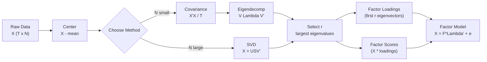

<!-- _class: lead -->

# Matrix Algebra Review for Factor Models

## Module 0: Foundations

**Key idea:** Factor models decompose covariance into signal + noise using eigendecomposition and SVD

<!-- Speaker notes: Welcome to Matrix Algebra Review for Factor Models. This deck is part of Module 00 Foundations. -->
---

# Why Matrix Algebra for Factor Models?

> Factor models rely heavily on matrix decompositions -- particularly eigendecomposition and SVD -- to extract latent structure from high-dimensional data.

The core operation: decomposing a covariance matrix to separate **signal** (common factors) from **noise** (idiosyncratic variation).



<!-- Speaker notes: Use this diagram to illustrate the overall flow. Trace through each step with the audience. -->
---

# 1. Eigendecomposition -- Formal Definition

For a square matrix $A \in \mathbb{R}^{n \times n}$, an eigenvalue-eigenvector pair $(\lambda, v)$ satisfies:

$$Av = \lambda v$$

- $\lambda$ is a scalar (eigenvalue)
- $v \neq 0$ is the eigenvector

<!-- Speaker notes: Explain the notation carefully. Connect each term to its intuitive meaning before moving on. -->
---

# Symmetric Matrix Decomposition (Spectral Theorem)

For symmetric matrices (like covariance matrices):

$$A = V \Lambda V'$$

| Symbol | Meaning |
|--------|---------|
| $V = [v_1, \ldots, v_n]$ | Orthogonal matrix ($V'V = VV' = I$) |
| $\Lambda = \text{diag}(\lambda_1, \ldots, \lambda_n)$ | Diagonal matrix of eigenvalues |

- Eigenvalues are **real**
- Eigenvectors are **orthogonal**

<!-- Speaker notes: Explain the notation carefully. Connect each term to its intuitive meaning before moving on. -->
---

# Eigendecomposition -- Intuition

Think of eigendecomposition as finding the **natural axes** of a transformation.

For a covariance matrix:
- **Eigenvectors** point in directions of maximum/minimum variance
- **Eigenvalues** measure the variance in each direction
- The **largest eigenvalues** capture the most important variation



<!-- Speaker notes: Use this diagram to illustrate the overall flow. Trace through each step with the audience. -->
---

# Code: Eigendecomposition

```python
import numpy as np

def eigendecomposition_symmetric(A):
    """Compute eigendecomposition of symmetric matrix."""
    # np.linalg.eigh is optimized for symmetric matrices
    eigenvalues, eigenvectors = np.linalg.eigh(A)

    # Sort in descending order (eigh returns ascending)
    idx = np.argsort(eigenvalues)[::-1]
    eigenvalues = eigenvalues[idx]
    eigenvectors = eigenvectors[:, idx]

    return eigenvalues, eigenvectors
```

> **Warning:** `np.linalg.eigh` returns ascending order -- always sort descending for PCA!

<!-- Speaker notes: Walk through this code step by step. Highlight the key lines and explain the output. -->
---

# Code: Eigendecomposition Example

```python
np.random.seed(42)
X = np.random.randn(100, 5)
cov_matrix = X.T @ X / 100

eigenvalues, eigenvectors = eigendecomposition_symmetric(cov_matrix)
print(f"Eigenvalues: {eigenvalues}")
print(f"Sum of eigenvalues (=trace): {eigenvalues.sum():.4f}")
print(f"Trace of cov matrix: {np.trace(cov_matrix):.4f}")
```

> 🔑 The sum of eigenvalues always equals the trace (total variance).

<!-- Speaker notes: Walk through this code step by step. Highlight the key lines and explain the output. -->
---

# Why Eigendecomposition Matters for Factor Models

The covariance matrix of observed data $X$ decomposes as:

$$\Sigma_X = \Lambda \Sigma_F \Lambda' + \Sigma_e$$

| Component | Meaning |
|-----------|---------|
| $\Lambda$ | Factor loadings |
| $\Sigma_F$ | Factor covariance |
| $\Sigma_e$ | Idiosyncratic covariance |

Eigendecomposition separates these components.

<!-- Speaker notes: Explain the notation carefully. Connect each term to its intuitive meaning before moving on. -->
---

<!-- _class: lead -->

# 2. Singular Value Decomposition (SVD)

<!-- Speaker notes: Welcome to 2. Singular Value Decomposition (SVD). This deck is part of Module 00 Foundations. -->
---

# SVD -- Formal Definition

For any matrix $X \in \mathbb{R}^{T \times N}$:

$$X = U \Sigma V'$$

| Matrix | Shape | Description |
|--------|-------|-------------|
| $U$ | $T \times T$ | Left singular vectors (orthonormal columns) |
| $\Sigma$ | $T \times N$ | Diagonal with singular values $\sigma_i \geq 0$ |
| $V$ | $N \times N$ | Right singular vectors (orthonormal columns) |

<!-- Speaker notes: Explain the notation carefully. Connect each term to its intuitive meaning before moving on. -->
---

# Reduced (Thin) SVD

For $T > N$, the reduced SVD is more efficient:

$$X = U_r \Sigma_r V_r'$$

| Matrix | Shape |
|--------|-------|
| $U_r$ | $T \times N$ |
| $\Sigma_r$ | $N \times N$ |
| $V_r$ | $N \times N$ |

<!-- Speaker notes: Explain the notation carefully. Connect each term to its intuitive meaning before moving on. -->
---

# SVD and Eigendecomposition Connection

<div class="columns">
<div>

**Connections:**

$$X'X = V \Sigma^2 V'$$
(eigendecomposition of Gram matrix)

$$XX' = U \Sigma^2 U'$$
(eigendecomposition of outer product)

**Singular values:**
$$\sigma_i = \sqrt{\lambda_i}$$
where $\lambda_i$ are eigenvalues of $X'X$

</div>
<div>



</div>
</div>

<!-- Speaker notes: Summarize the key takeaways and highlight how this topic connects to upcoming material. -->
---

# Code: SVD

```python
def svd_decomposition(X, n_components=None):
    """Compute SVD and optionally truncate to n_components."""
    U, S, Vt = np.linalg.svd(X, full_matrices=False)

    if n_components is not None:
        U = U[:, :n_components]
        S = S[:n_components]
        Vt = Vt[:n_components, :]

    return U, S, Vt

# Example: Extract 2 components
X_centered = X - X.mean(axis=0)
U, S, Vt = svd_decomposition(X_centered, n_components=2)
```

<!-- Speaker notes: Walk through this code step by step. Highlight the key lines and explain the output. -->
---

# Code: SVD Reconstruction

```python
# Verify reconstruction
X_reconstructed = U @ np.diag(S) @ Vt
reconstruction_error = np.linalg.norm(X_centered - X_reconstructed, 'fro')
print(f"Reconstruction error (rank-2): {reconstruction_error:.4f}")
```

> 🔑 Truncated SVD gives the **best** rank-$r$ approximation (Eckart-Young theorem).

<!-- Speaker notes: Walk through this code step by step. Highlight the key lines and explain the output. -->
---

# Why SVD for Factor Models?

For large panels ($N$ large), SVD of the data matrix is more efficient than eigendecomposition of the covariance matrix:

| Approach | Operation | Cost |
|----------|-----------|------|
| Eigendecomp of $\Sigma$ | Compute $N \times N$ covariance first | $O(TN^2 + N^3)$ |
| SVD of $X$ | Direct decomposition | $O(TN \min(T,N))$ |

- Avoids computing $N \times N$ covariance matrix
- Better numerical stability for ill-conditioned problems
- Direct path to PCA-based factor extraction

<!-- Speaker notes: Walk through the key rows of this comparison table. Highlight the most important distinctions. -->
---

<!-- _class: lead -->

# 3. Positive Definiteness

<!-- Speaker notes: Welcome to 3. Positive Definiteness. This deck is part of Module 00 Foundations. -->
---

# Positive Definiteness -- Definition

A symmetric matrix $A$ is:

- **Positive definite (PD):** $x'Ax > 0$ for all $x \neq 0$
- **Positive semi-definite (PSD):** $x'Ax \geq 0$ for all $x$

**Equivalent characterizations** for PD:

1. All eigenvalues are positive
2. All leading principal minors are positive
3. $A = B'B$ for some full-rank matrix $B$
4. Cholesky decomposition exists: $A = LL'$

<!-- Speaker notes: Cover the key points of Positive Definiteness -- Definition. Check for understanding before proceeding. -->
---

# Why Positive Definiteness Matters

Covariance matrices must be PSD (and typically PD in practice):

$$\text{Var}(a'X) = a'\Sigma a \geq 0$$

Variance can never be negative.

**For factor models:**

$$\Sigma_X = \Lambda\Lambda' + \Sigma_e \quad \text{must be PSD}$$

- Ensures well-defined probability distributions
- Required for maximum likelihood estimation

<!-- Speaker notes: Explain the notation carefully. Connect each term to its intuitive meaning before moving on. -->
---

# Code: Checking and Enforcing PD

<div class="columns">
<div>

**Check PD:**

```python
def check_positive_definite(A, tol=1e-10):
    eigenvalues = np.linalg.eigvalsh(A)
    min_eigenvalue = eigenvalues.min()
    is_pd = min_eigenvalue > tol
    return is_pd, min_eigenvalue
```

</div>
<div>

**Make PD:**

```python
def make_positive_definite(A,
                           min_eigenvalue=1e-6):
    eigenvalues, eigvecs = np.linalg.eigh(A)
    eigenvalues = np.maximum(
        eigenvalues, min_eigenvalue
    )
    return eigvecs @ np.diag(eigenvalues) \
           @ eigvecs.T
```

</div>
</div>

```python
A = np.array([[1, 0.9, 0.9], [0.9, 1, 0.9], [0.9, 0.9, 1]])
is_pd, min_eig = check_positive_definite(A)
print(f"Is PD: {is_pd}, min eigenvalue: {min_eig:.4f}")
```

<!-- Speaker notes: Walk through this code step by step. Highlight the key lines and explain the output. -->
---

<!-- _class: lead -->

# 4. Matrix Calculus Essentials

<!-- Speaker notes: Welcome to 4. Matrix Calculus Essentials. This deck is part of Module 00 Foundations. -->
---

# Key Derivatives for Optimization

Factor model estimation often requires gradients:

$$\frac{\partial}{\partial X} \text{tr}(AX) = A'$$

$$\frac{\partial}{\partial X} \text{tr}(X'AX) = (A + A')X$$

$$\frac{\partial}{\partial X} \log|X| = X^{-1}$$

**The Trace Trick:**

$$a'Xa = \text{tr}(a'Xa) = \text{tr}(Xaa')$$

> 🔑 The trace trick simplifies expected value calculations in factor models.

<!-- Speaker notes: Explain the notation carefully. Connect each term to its intuitive meaning before moving on. -->
---

<!-- _class: lead -->

# Common Pitfalls

<!-- Speaker notes: Welcome to Common Pitfalls. This deck is part of Module 00 Foundations. -->
---

# Pitfall 1: Confusing Eigenvalue Ordering

| Function | Default Order |
|----------|---------------|
| `np.linalg.eigh` | **Ascending** |
| PCA convention | **Descending** |

> Always explicitly sort after decomposition!

<!-- Speaker notes: Emphasize these common mistakes. Ask learners if they have encountered any of these in practice. -->
---

# Pitfall 2: Numerical Issues with Near-Singular Matrices

- Sample covariance can be **singular** if $T < N$
- Fix: Add small regularization $\Sigma + \epsilon I$
- Better: Use SVD instead of eigendecomposition for stability

# Pitfall 3: Sign Indeterminacy

- Eigenvectors are unique only up to sign: $v$ and $-v$ are both valid
- For consistency, enforce positive first element convention

<!-- Speaker notes: Emphasize these common mistakes. Ask learners if they have encountered any of these in practice. -->
---

# Factor Model Decomposition Pipeline



<!-- Speaker notes: Use this diagram to illustrate the overall flow. Trace through each step with the audience. -->
---

# Practice Problems

**Conceptual:**
1. If $A$ has eigenvalues $\{1, 2, 3\}$, what are eigenvalues of $A^2$? Of $A^{-1}$?
2. Why must the covariance matrix of any random vector be PSD?
3. How does the rank of $X$ relate to non-zero singular values?

**Implementation:**
4. Write a function to compute condition number using SVD
5. Implement low-rank approximation minimizing $\|X - \hat{X}\|_F$
6. Verify PCA via eigendecomposition of covariance equals SVD of data matrix

<!-- Speaker notes: Give learners 3-5 minutes to work through these practice problems before discussing solutions. -->
---

# Connections & Further Reading

**Builds on:** Undergraduate linear algebra
**Leads to:** PCA (next guide), Factor model estimation
**Related to:** Numerical linear algebra, optimization

**References:**
- Strang, G. (2016). *Introduction to Linear Algebra*, 5th ed. Ch. 6-7
- Golub & Van Loan (2013). *Matrix Computations*, 4th ed.
- Petersen & Pedersen (2012). *The Matrix Cookbook*

<!-- Speaker notes: Summarize the key takeaways and highlight how this topic connects to upcoming material. -->
---

<!-- _class: lead -->

# Summary

| Concept | Key Formula | Factor Model Role |
|---------|-------------|-------------------|
| Eigendecomp | $A = V\Lambda V'$ | Covariance decomposition |
| SVD | $X = U\Sigma V'$ | Efficient factor extraction |
| Positive Definiteness | $x'Ax > 0$ | Valid covariance matrices |
| Matrix Calculus | $\partial \log|X| / \partial X = X^{-1}$ | MLE optimization |

<!-- Speaker notes: Welcome to Summary. This deck is part of Module 00 Foundations. -->