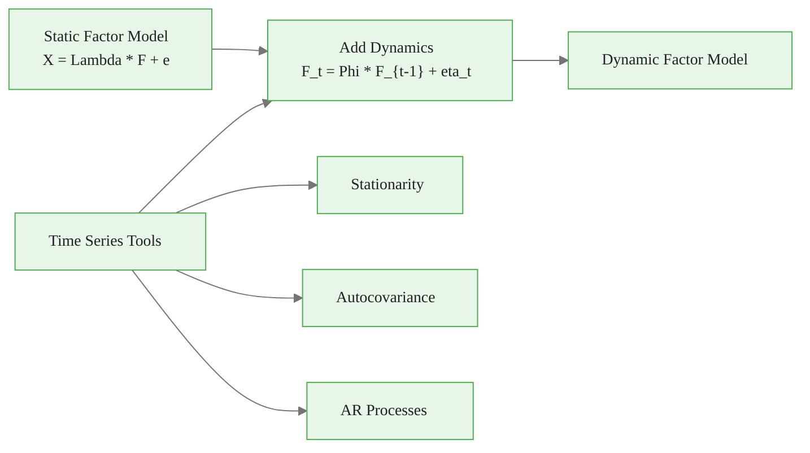
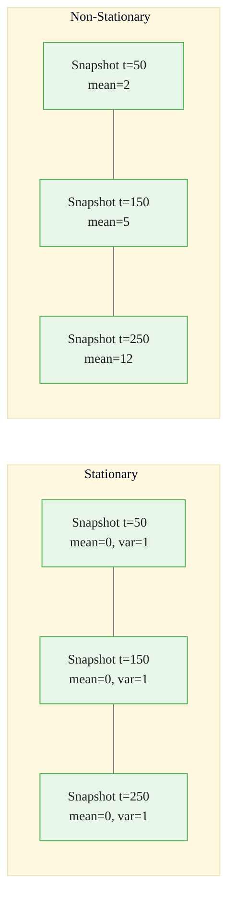
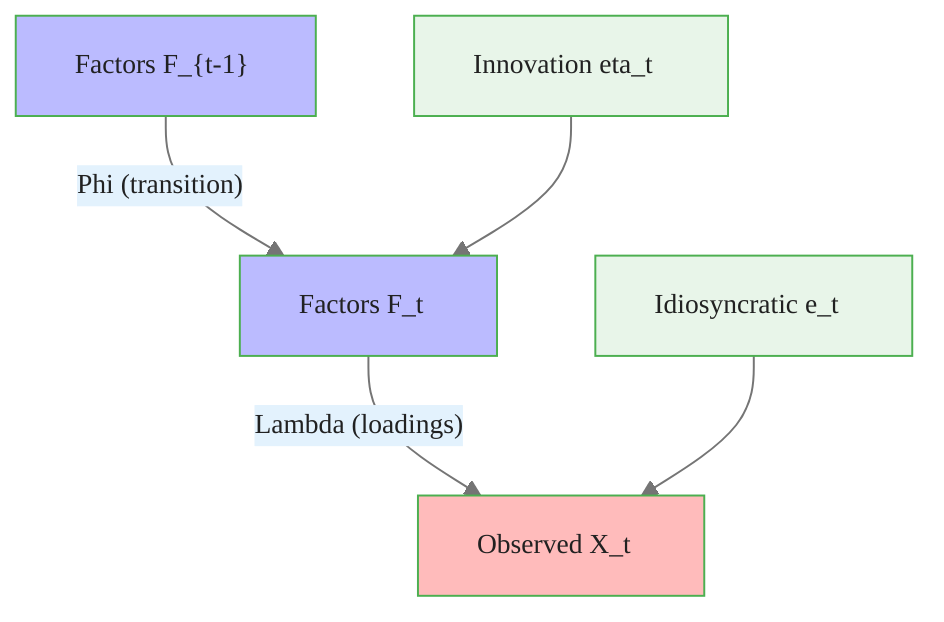
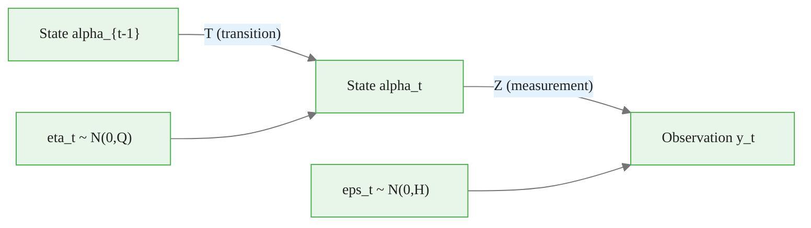
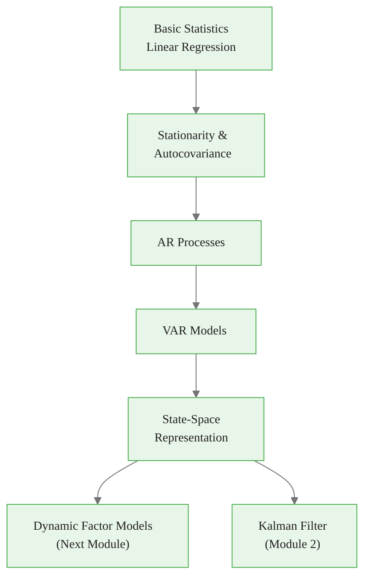

<!-- _class: lead -->

# Time Series Basics for Factor Models

## Module 0: Foundations

**Key idea:** Factor dynamics require stationarity, autocovariance structure, and AR processes

<!-- Speaker notes: Welcome to Time Series Basics for Factor Models. This deck is part of Module 00 Foundations. -->
---

# Why Time Series for Factor Models?

> Dynamic factor models extend static factors by allowing factors to evolve over time following autoregressive dynamics.

**Stationarity** ensures statistical properties remain constant over time, which is necessary for consistent estimation.



<div class="callout-key">

Key implementation detail -- study this pattern carefully.

</div>

<!-- Speaker notes: Use this diagram to illustrate the overall flow. Trace through each step with the audience. -->
---

<!-- _class: lead -->

# 1. Stationarity

<!-- Speaker notes: Welcome to 1. Stationarity. This deck is part of Module 00 Foundations. -->
---

# Strict vs Weak Stationarity

**Strictly stationary:** Joint distribution of $(y_{t_1}, \ldots, y_{t_k})$ equals that of $(y_{t_1+h}, \ldots, y_{t_k+h})$ for all $h$.

**Weakly (covariance) stationary** -- three conditions:

| Condition | Formula | Meaning |
|-----------|---------|---------|
| Constant mean | $E[y_t] = \mu$ | No trend |
| Constant variance | $\text{Var}(y_t) = \sigma^2 < \infty$ | No changing volatility |
| Lag-dependent covariance | $\text{Cov}(y_t, y_{t-h}) = \gamma(h)$ | Depends only on lag $h$ |

<!-- Speaker notes: Walk through the key rows of this comparison table. Highlight the most important distinctions. -->
---

# Stationarity -- Intuition

Imagine taking snapshots of your time series at different points. For a stationary series:

- Each snapshot has the same "shape" (distribution)
- The relationship between observations $h$ periods apart is always the same
- **No trend**, no changing volatility, no structural breaks



<div class="callout-insight">

This pattern recurs throughout the course. Understanding it deeply pays dividends later.

</div>

<!-- Speaker notes: Use this diagram to illustrate the overall flow. Trace through each step with the audience. -->
---

# Why Stationarity Matters for Factor Models

1. **Consistent estimation:** Sample moments converge to population moments
2. **Forecasting:** Past patterns are informative about future behavior
3. **Factor dynamics:** AR representation requires stationarity for stability

> If factors are non-stationary, the entire estimation framework breaks down.

<!-- Speaker notes: Cover the key points of Why Stationarity Matters for Factor Models. Check for understanding before proceeding. -->
---

# Testing for Stationarity

```python
import numpy as np
from statsmodels.tsa.stattools import adfuller, kpss

def test_stationarity(y, significance=0.05):
    """Test stationarity using ADF and KPSS tests."""
    # ADF: H0 = unit root (non-stationary)
    adf_stat, adf_pval, _, _, adf_crit, _ = adfuller(y, autolag='AIC')

    # KPSS: H0 = stationary
    kpss_stat, kpss_pval, _, kpss_crit = kpss(y, regression='c', nlags='auto')
```

<div class="callout-warning">

Watch for edge cases with this implementation in production use.

</div>

<!-- Speaker notes: Walk through the first part of this code implementation. The code continues on the next slide. -->
---

# Testing for Stationarity (continued)

```python

    results = {
        'ADF': {'statistic': adf_stat, 'p_value': adf_pval,
                'interpretation': 'Stationary' if adf_pval < significance
                                  else 'Non-stationary'},
        'KPSS': {'statistic': kpss_stat, 'p_value': kpss_pval,
                 'interpretation': 'Non-stationary' if kpss_pval < significance
                                   else 'Stationary'}
    }
    return results
```

<div class="callout-info">

This approach follows established best practices in the field.

</div>

<!-- Speaker notes: Continue walking through the implementation. Highlight the key output and how to verify correctness. -->
---

# Interpreting Stationarity Tests

| ADF Result | KPSS Result | Conclusion |
|------------|-------------|------------|
| Reject H0 | Fail to reject H0 | **Stationary** |
| Fail to reject H0 | Reject H0 | **Non-stationary** |
| Reject H0 | Reject H0 | Trend-stationary (investigate) |
| Fail to reject H0 | Fail to reject H0 | Inconclusive (need more data) |

```python
np.random.seed(42)
y_stationary = np.random.randn(200)               # White noise
y_random_walk = np.cumsum(np.random.randn(200))    # Random walk

print("Stationary series:", test_stationarity(y_stationary))
print("Random walk:", test_stationarity(y_random_walk))
```

<!-- Speaker notes: Walk through this code step by step. Highlight the key lines and explain the output. -->
---

<!-- _class: lead -->

# 2. Autocovariance and Autocorrelation

<!-- Speaker notes: Welcome to 2. Autocovariance and Autocorrelation. This deck is part of Module 00 Foundations. -->
---

# Definitions

**Autocovariance function** at lag $h$:

$$\gamma(h) = \text{Cov}(y_t, y_{t-h}) = E[(y_t - \mu)(y_{t-h} - \mu)]$$

**Autocorrelation function (ACF)** at lag $h$:

$$\rho(h) = \frac{\gamma(h)}{\gamma(0)} = \frac{\text{Cov}(y_t, y_{t-h})}{\text{Var}(y_t)}$$

**Properties:**
- $\gamma(0) = \text{Var}(y_t)$
- $\gamma(h) = \gamma(-h)$ (symmetry)
- $|\rho(h)| \leq 1$

<!-- Speaker notes: Explain the notation carefully. Connect each term to its intuitive meaning before moving on. -->
---

# Autocovariance -- Intuition

Measures how much knowing today's value tells you about values $h$ periods ago/ahead:

| $\gamma(h)$ | Interpretation |
|-------------|----------------|
| High positive | High values tend to follow high values |
| Negative | High values tend to follow low values |
| Zero | No linear relationship at lag $h$ |

<!-- Speaker notes: Walk through the key rows of this comparison table. Highlight the most important distinctions. -->
---

# Code: Sample Autocovariance

```python
def sample_autocovariance(y, max_lag=20):
    """Compute sample autocovariance function."""
    y = np.asarray(y)
    T = len(y)
    y_centered = y - y.mean()

    gamma = np.zeros(max_lag + 1)
    for h in range(max_lag + 1):
        gamma[h] = np.sum(y_centered[h:] * y_centered[:T-h]) / T
    return gamma

def sample_acf(y, max_lag=20):
    """Compute sample autocorrelation function."""
    gamma = sample_autocovariance(y, max_lag)
    return gamma / gamma[0]
```

<!-- Speaker notes: Walk through this code step by step. Highlight the key lines and explain the output. -->
---

# Code: ACF Example

```python
# Example: AR(1) process
phi = 0.8
T = 500
np.random.seed(42)
y = np.zeros(T)
for t in range(1, T):
    y[t] = phi * y[t-1] + np.random.randn()

acf = sample_acf(y, max_lag=15)
print("Sample ACF:", acf[:6].round(3))
print("Theoretical ACF for AR(1):", [phi**h for h in range(6)])
```

> 🔑 For AR(1), theoretical ACF is $\rho(h) = \phi^h$ -- geometric decay.

<!-- Speaker notes: Walk through this code step by step. Highlight the key lines and explain the output. -->
---

# Visualizing ACF and PACF

```python
import matplotlib.pyplot as plt
from statsmodels.graphics.tsaplots import plot_acf, plot_pacf

def plot_acf_pacf(y, lags=20, title=""):
    """Plot ACF and PACF side by side."""
    fig, axes = plt.subplots(1, 2, figsize=(12, 4))
    plot_acf(y, lags=lags, ax=axes[0], title=f'ACF - {title}')
    plot_pacf(y, lags=lags, ax=axes[1], title=f'PACF - {title}')
    plt.tight_layout()
    return fig

# Confidence bands at +/-1.96/sqrt(T) indicate significance at 5% level
```

<!-- Speaker notes: Walk through this code step by step. Highlight the key lines and explain the output. -->
---

<!-- _class: lead -->

# 3. Autoregressive (AR) Processes

<!-- Speaker notes: Welcome to 3. Autoregressive (AR) Processes. This deck is part of Module 00 Foundations. -->
---

# AR(1) Process

$$y_t = c + \phi y_{t-1} + \varepsilon_t, \quad \varepsilon_t \sim WN(0, \sigma^2)$$

**Stationarity condition:** $|\phi| < 1$

| Property | Formula |
|----------|---------|
| Mean | $E[y_t] = \mu = \frac{c}{1-\phi}$ |
| Variance | $\text{Var}(y_t) = \frac{\sigma^2}{1-\phi^2}$ |
| Autocovariance | $\gamma(h) = \phi^h \gamma(0)$ |
| ACF | $\rho(h) = \phi^h$ (geometric decay) |

<!-- Speaker notes: Explain the notation carefully. Connect each term to its intuitive meaning before moving on. -->
---

# AR(p) Process

$$y_t = c + \phi_1 y_{t-1} + \phi_2 y_{t-2} + \cdots + \phi_p y_{t-p} + \varepsilon_t$$

**Lag operator notation:**

$$(1 - \phi_1 L - \phi_2 L^2 - \cdots - \phi_p L^p) y_t = c + \varepsilon_t$$

**Stationarity condition:** All roots of the characteristic polynomial

$$1 - \phi_1 z - \cdots - \phi_p z^p = 0$$

lie **outside the unit circle**.

<!-- Speaker notes: Explain the notation carefully. Connect each term to its intuitive meaning before moving on. -->
---

# Code: Simulate AR(p)

```python
def simulate_ar(phi, c=0, sigma=1, T=100, burn=100, seed=None):
    """Simulate AR(p) process."""
    if seed is not None:
        np.random.seed(seed)

    phi = np.atleast_1d(phi)
    p = len(phi)

    # Check stationarity
    coeffs = np.r_[1, -phi]
    roots = np.roots(coeffs)
    if np.any(np.abs(roots) <= 1):
        raise ValueError(f"Non-stationary: roots at {roots}")
```

<!-- Speaker notes: Walk through the first part of this code implementation. The code continues on the next slide. -->
---

# Code: Simulate AR(p) (continued)

```python

    total_T = T + burn
    y = np.zeros(total_T)
    eps = np.random.randn(total_T) * sigma

    for t in range(p, total_T):
        y[t] = c + np.dot(phi, y[t-p:t][::-1]) + eps[t]

    return y[burn:]
```

<!-- Speaker notes: Continue walking through the implementation. Highlight the key output and how to verify correctness. -->
---

# Code: AR Estimation with Lag Selection

```python
from statsmodels.tsa.ar_model import AutoReg

def estimate_ar(y, max_lag=10, criterion='aic'):
    """Estimate AR model with automatic lag selection."""
    results = {}
    for p in range(1, max_lag + 1):
        model = AutoReg(y, lags=p, old_names=False)
        fit = model.fit()
        results[p] = {'aic': fit.aic, 'bic': fit.bic, 'model': fit}
```

<!-- Speaker notes: Walk through the first part of this code implementation. The code continues on the next slide. -->
---

# Code: AR Estimation with Lag Selection (continued)

<div class="code-window">
<div class="code-header">
<div class="dots"><span class="dot-red"></span><span class="dot-yellow"></span><span class="dot-green"></span></div>
<span class="filename">example.py</span>
</div>

```python

    if criterion == 'aic':
        best_p = min(results, key=lambda p: results[p]['aic'])
    else:
        best_p = min(results, key=lambda p: results[p]['bic'])

    return {'best_lag': best_p, 'best_model': results[best_p]['model']}
```

</div>

> Use BIC for consistent selection, AIC for better prediction.

<!-- Speaker notes: Continue walking through the implementation. Highlight the key output and how to verify correctness. -->
---

<!-- _class: lead -->

# 4. Vector Autoregressions (VAR)

<!-- Speaker notes: Welcome to 4. Vector Autoregressions (VAR). This deck is part of Module 00 Foundations. -->
---

# VAR Definition

For an $n$-dimensional vector $Y_t = (y_{1t}, \ldots, y_{nt})'$:

$$Y_t = c + \Phi_1 Y_{t-1} + \Phi_2 Y_{t-2} + \cdots + \Phi_p Y_{t-p} + u_t$$

where $\Phi_i$ are $n \times n$ coefficient matrices and $u_t \sim (0, \Sigma_u)$.

<!-- Speaker notes: Explain the notation carefully. Connect each term to its intuitive meaning before moving on. -->
---

# Why VAR Matters for Factor Models

Factor dynamics are modeled as VAR:

$$F_t = \Phi F_{t-1} + \eta_t$$



Essential for:
- Specifying factor dynamics
- Forecasting with factors
- Structural analysis (FAVAR)

<!-- Speaker notes: Use this diagram to illustrate the overall flow. Trace through each step with the audience. -->
---

# Code: VAR Estimation

<div class="code-window">
<div class="code-header">
<div class="dots"><span class="dot-red"></span><span class="dot-yellow"></span><span class="dot-green"></span></div>
<span class="filename">estimate_var.py</span>
</div>

```python
from statsmodels.tsa.api import VAR

def estimate_var(Y, max_lag=10, criterion='aic'):
    """Estimate VAR model with lag selection."""
    model = VAR(Y)
    results = model.fit(maxlags=max_lag, ic=criterion)
    return results

```

</div>

<!-- Speaker notes: Walk through the first part of this code implementation. The code continues on the next slide. -->
---

# Code: VAR Estimation (continued)

<div class="code-window">
<div class="code-header">
<div class="dots"><span class="dot-red"></span><span class="dot-yellow"></span><span class="dot-green"></span></div>
<span class="filename">example.py</span>
</div>

```python
# Example: Bivariate VAR
np.random.seed(42)
T, n = 200, 2
Phi_true = np.array([[0.5, 0.1], [0.2, 0.6]])
Y = np.zeros((T, n))
for t in range(1, T):
    Y[t] = Phi_true @ Y[t-1] + np.random.randn(n) * 0.5

var_results = estimate_var(Y, max_lag=5)
print(f"Selected lag order: {var_results.k_ar}")
print(f"Estimated Phi:\n{var_results.coefs[0].round(3)}")
```

</div>

<!-- Speaker notes: Continue walking through the implementation. Highlight the key output and how to verify correctness. -->
---

<!-- _class: lead -->

# 5. State-Space Representation

<!-- Speaker notes: Welcome to 5. State-Space Representation. This deck is part of Module 00 Foundations. -->
---

# General State-Space Form

**Measurement equation:**
$$y_t = Z \alpha_t + d + \varepsilon_t, \quad \varepsilon_t \sim N(0, H)$$

**Transition equation:**
$$\alpha_t = T \alpha_{t-1} + c + R\eta_t, \quad \eta_t \sim N(0, Q)$$

where $\alpha_t$ is the **unobserved state vector**.



<!-- Speaker notes: Use this diagram to illustrate the overall flow. Trace through each step with the audience. -->
---

# AR(p) as State-Space

An AR(2): $y_t = \phi_1 y_{t-1} + \phi_2 y_{t-2} + \varepsilon_t$ becomes:

$$\begin{bmatrix} y_t \\ y_{t-1} \end{bmatrix} = \begin{bmatrix} \phi_1 & \phi_2 \\ 1 & 0 \end{bmatrix} \begin{bmatrix} y_{t-1} \\ y_{t-2} \end{bmatrix} + \begin{bmatrix} 1 \\ 0 \end{bmatrix} \varepsilon_t$$

> 🔑 Any AR(p) can be written as a VAR(1) in state-space form via companion matrix.

<!-- Speaker notes: Explain the notation carefully. Connect each term to its intuitive meaning before moving on. -->
---

# Why State-Space for Factor Models

Dynamic factor models have natural state-space form:

| Component | State-Space Role | Equation |
|-----------|-----------------|----------|
| Factors $F_t$ | **State** | $F_t = \Phi F_{t-1} + \eta_t$ |
| Observed $X_t$ | **Measurement** | $X_t = \Lambda F_t + e_t$ |

This enables:
- **Kalman filter** for factor estimation
- **Maximum likelihood** via prediction error decomposition
- **Missing data** handled naturally

<!-- Speaker notes: Walk through the key rows of this comparison table. Highlight the most important distinctions. -->
---

<!-- _class: lead -->

# Common Pitfalls

<!-- Speaker notes: Welcome to Common Pitfalls. This deck is part of Module 00 Foundations. -->
---

# Pitfalls to Avoid

| Pitfall | Problem | Solution |
|---------|---------|----------|
| Ignoring non-stationarity | Spurious regression, inconsistent estimates | Test for unit roots; difference or detrend |
| Overfitting AR lag order | Too many lags reduce forecast accuracy | Use information criteria (AIC/BIC) |
| Confusing ACF and PACF | Wrong model identification | ACF = cumulative; PACF = conditional |

**ACF vs PACF for model identification:**
- AR(p): PACF cuts off after lag $p$; ACF decays gradually
- MA(q): ACF cuts off after lag $q$; PACF decays gradually

<!-- Speaker notes: Emphasize these common mistakes. Ask learners if they have encountered any of these in practice. -->
---

# Practice Problems

**Conceptual:**
1. Show AR(1) with $|\phi| < 1$ is stationary by computing $E[y_t]$ and $\text{Var}(y_t)$
2. Derive the ACF of MA(1): $y_t = \varepsilon_t + \theta\varepsilon_{t-1}$
3. Why does PACF of AR(p) cut off after lag $p$?

**Implementation:**
4. Simulate AR(1) with $\phi = 0.9$, plot ACF vs theoretical
5. Download monthly industrial production from FRED, test stationarity
6. Estimate VAR(1) for two related series, compute impulse responses

<!-- Speaker notes: Give learners 3-5 minutes to work through these practice problems before discussing solutions. -->
---

# Connections & Summary



**References:**
- Hamilton (1994). *Time Series Analysis*. Ch. 2-3, 10-11
- Luetkepohl (2005). *New Introduction to Multiple Time Series Analysis*
- Shumway & Stoffer (2017). *Time Series Analysis and Its Applications*

<!-- Speaker notes: Summarize the key takeaways and highlight how this topic connects to upcoming material. -->