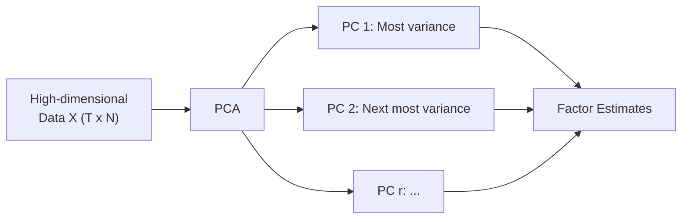
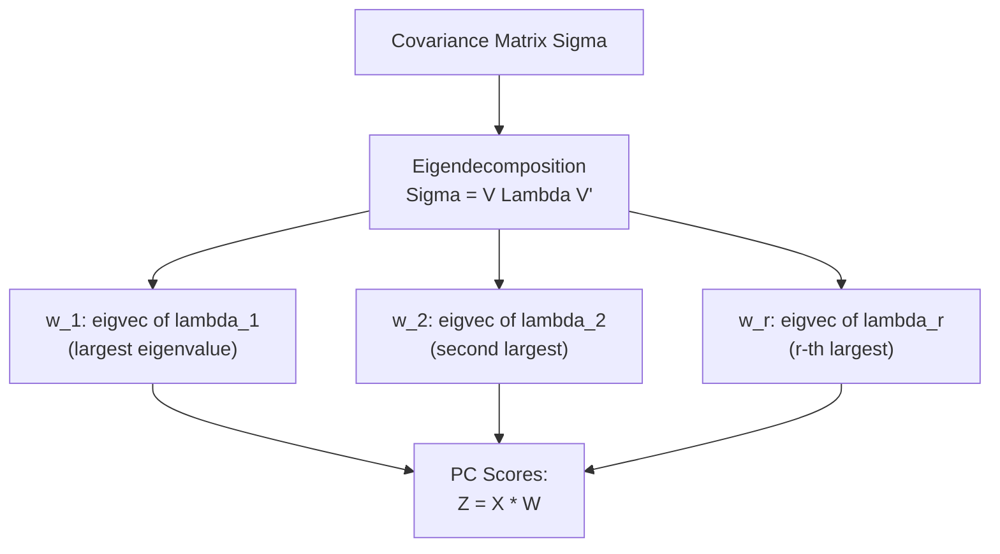
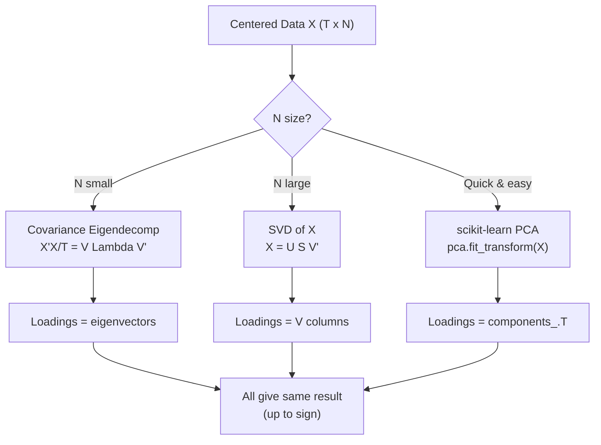
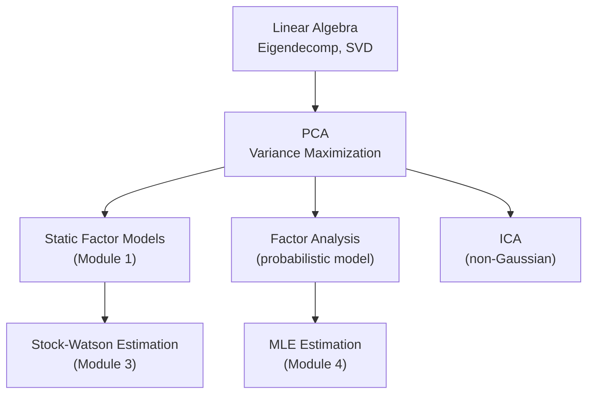

<!-- _class: lead -->

# Principal Component Analysis Refresher

## Module 0: Foundations

**Key idea:** PCA finds orthogonal directions maximizing variance -- the workhorse for factor extraction

<!-- Speaker notes: Welcome to Principal Component Analysis Refresher. This deck is part of Module 00 Foundations. -->
---

# Why PCA for Factor Models?

> PCA answers: "What are the most important directions of variation in my data?"

- First PC captures the **most variance**
- Second PC captures the most remaining variance **orthogonal to the first**
- In factor models, these directions approximate the **latent factors** driving co-movement



<!-- Speaker notes: Use this diagram to illustrate the overall flow. Trace through each step with the audience. -->
---

<!-- _class: lead -->

# 1. The PCA Problem

<!-- Speaker notes: Welcome to 1. The PCA Problem. This deck is part of Module 00 Foundations. -->
---

# Setup and Objective

**Given:** Data matrix $X \in \mathbb{R}^{T \times N}$ (centered: $\bar{X} = 0$)

**Objective:** Find direction $w_1 \in \mathbb{R}^N$ (unit vector) maximizing variance of projections:

$$\max_{w_1: \|w_1\|=1} \text{Var}(Xw_1) = \max_{w_1: \|w_1\|=1} w_1' \Sigma w_1$$

where $\Sigma = \frac{1}{T}X'X$ is the sample covariance matrix.

<!-- Speaker notes: Explain the notation carefully. Connect each term to its intuitive meaning before moving on. -->
---

# Solution via Lagrangian

$$\mathcal{L} = w_1'\Sigma w_1 - \lambda(w_1'w_1 - 1)$$

First-order condition:

$$\frac{\partial \mathcal{L}}{\partial w_1} = 2\Sigma w_1 - 2\lambda w_1 = 0$$

$$\Sigma w_1 = \lambda w_1$$

> 🔑 The first PC loading is the **eigenvector** of $\Sigma$ with the **largest eigenvalue**.

<!-- Speaker notes: Explain the notation carefully. Connect each term to its intuitive meaning before moving on. -->
---

# Subsequent Components

The $k$-th PC maximizes variance subject to orthogonality:

$$\max_{w_k: \|w_k\|=1, \; w_k \perp w_1,\ldots,w_{k-1}} w_k' \Sigma w_k$$

**Solution:** Eigenvector corresponding to the $k$-th largest eigenvalue.



<!-- Speaker notes: Use this diagram to illustrate the overall flow. Trace through each step with the audience. -->
---

<!-- _class: lead -->

# 2. Equivalent Formulations

<!-- Speaker notes: Welcome to 2. Equivalent Formulations. This deck is part of Module 00 Foundations. -->
---

# Minimum Reconstruction Error

PCA also solves: find rank-$r$ approximation $\hat{X}$ minimizing squared error:

$$\min_{\hat{X}: \text{rank}(\hat{X}) \leq r} \|X - \hat{X}\|_F^2$$

**Solution:** $\hat{X} = X V_r V_r'$ where $V_r$ contains the first $r$ eigenvectors.

> Two views of the same problem: **maximize variance** captured = **minimize reconstruction** error.

<!-- Speaker notes: Explain the notation carefully. Connect each term to its intuitive meaning before moving on. -->
---

# PCA via SVD

For centered $X = U \Sigma V'$:

| Component | SVD | PCA Interpretation |
|-----------|-----|-------------------|
| Columns of $V$ | Right singular vectors | **PC loadings** |
| $XV = U\Sigma$ | Scaled left singular vectors | **PC scores** |
| $\sigma_i^2 / T$ | Squared singular values / T | **Eigenvalues of covariance** |

<!-- Speaker notes: Walk through the key rows of this comparison table. Highlight the most important distinctions. -->
---

# PCA Intuition -- Data Cloud

Imagine a cloud of data points in high-dimensional space:

| Element | Meaning |
|---------|---------|
| **First PC** | Direction through the cloud with most spread |
| **Second PC** | Perpendicular direction with next most spread |
| **Scores** | Coordinates of each point in the new PC basis |
| **Loadings** | How each original variable contributes to each PC |

<!-- Speaker notes: Walk through the key rows of this comparison table. Highlight the most important distinctions. -->
---

<!-- _class: lead -->

# 3. Implementation

<!-- Speaker notes: Welcome to 3. Implementation. This deck is part of Module 00 Foundations. -->
---

# Method 1: Via Covariance Eigendecomposition

```python
import numpy as np

def pca_via_covariance(X, n_components=None):
    """PCA via eigendecomposition of covariance matrix."""
    T, N = X.shape
    X_centered = X - X.mean(axis=0)

    # Compute covariance matrix
    cov_matrix = X_centered.T @ X_centered / T

    # Eigendecomposition
    eigenvalues, eigenvectors = np.linalg.eigh(cov_matrix)
```

<!-- Speaker notes: Walk through the first part of this code implementation. The code continues on the next slide. -->
---

# Method 1: Via Covariance Eigendecomposition (continued)

```python

    # Sort descending
    idx = np.argsort(eigenvalues)[::-1]
    eigenvalues = eigenvalues[idx]
    eigenvectors = eigenvectors[:, idx]

    if n_components is not None:
        eigenvalues = eigenvalues[:n_components]
        eigenvectors = eigenvectors[:, :n_components]

    scores = X_centered @ eigenvectors
    return scores, eigenvectors, eigenvalues
```

<!-- Speaker notes: Continue walking through the implementation. Highlight the key output and how to verify correctness. -->
---

# Method 2: Via SVD (Recommended for Large N)

```python
def pca_via_svd(X, n_components=None):
    """PCA via SVD -- avoids N x N covariance matrix."""
    T, N = X.shape
    X_centered = X - X.mean(axis=0)

    U, S, Vt = np.linalg.svd(X_centered, full_matrices=False)

    eigenvalues = S**2 / T
    loadings = Vt.T
    scores = U * S  # Equivalent to X @ loadings
```

<!-- Speaker notes: Walk through the first part of this code implementation. The code continues on the next slide. -->
---

# Method 2: Via SVD (Recommended for Large N) (continued)

```python

    if n_components is not None:
        scores = scores[:, :n_components]
        loadings = loadings[:, :n_components]
        eigenvalues = eigenvalues[:n_components]

    return scores, loadings, eigenvalues
```

<!-- Speaker notes: Continue walking through the implementation. Highlight the key output and how to verify correctness. -->
---

# Method 3: Using scikit-learn

```python
from sklearn.decomposition import PCA

def pca_sklearn(X, n_components=None):
    """PCA using scikit-learn."""
    pca = PCA(n_components=n_components)
    scores = pca.fit_transform(X)
    loadings = pca.components_.T  # sklearn stores loadings as rows
    eigenvalues = pca.explained_variance_
    return scores, loadings, eigenvalues, pca
```

> Note: `pca.components_` stores loadings as **rows**, not columns -- transpose for standard convention.

<!-- Speaker notes: Walk through this code step by step. Highlight the key lines and explain the output. -->
---

# PCA Method Comparison



<!-- Speaker notes: Use this diagram to illustrate the overall flow. Trace through each step with the audience. -->
---

<!-- _class: lead -->

# 4. Choosing the Number of Components

<!-- Speaker notes: Welcome to 4. Choosing the Number of Components. This deck is part of Module 00 Foundations. -->
---

# Scree Plot

```python
import matplotlib.pyplot as plt

def scree_plot(eigenvalues, title="Scree Plot"):
    """Plot eigenvalues to help choose number of components."""
    n = len(eigenvalues)
    cumulative_var = np.cumsum(eigenvalues) / eigenvalues.sum()

    fig, axes = plt.subplots(1, 2, figsize=(12, 4))
```

<!-- Speaker notes: Walk through the first part of this code implementation. The code continues on the next slide. -->
---

# Scree Plot (continued)

```python

    axes[0].bar(range(1, n+1), eigenvalues, alpha=0.7)
    axes[0].plot(range(1, n+1), eigenvalues, 'ro-')
    axes[0].set_xlabel('Component')
    axes[0].set_ylabel('Eigenvalue')

    axes[1].plot(range(1, n+1), cumulative_var, 'bo-')
    axes[1].axhline(y=0.9, color='r', linestyle='--', label='90%')
    axes[1].set_xlabel('Number of Components')
    axes[1].set_ylabel('Cumulative Variance Explained')
    axes[1].legend()
    plt.tight_layout()
```

<!-- Speaker notes: Continue walking through the implementation. Highlight the key output and how to verify correctness. -->
---

# Component Selection Methods

| Method | Rule | Best For |
|--------|------|----------|
| Scree plot | Look for "elbow" | Visual inspection |
| Kaiser criterion | Eigenvalues > 1 | Correlation-matrix PCA |
| Variance threshold | Explain target % (e.g. 90%) | Practical applications |
| Bai-Ng criteria | Balance fit + complexity | Large-panel factor models |

```python
def variance_explained(eigenvalues, threshold=0.9):
    """Find components explaining threshold proportion of variance."""
    total_var = eigenvalues.sum()
    cumulative = np.cumsum(eigenvalues) / total_var
    n_components = np.searchsorted(cumulative, threshold) + 1
    return n_components, cumulative
```

<!-- Speaker notes: Walk through this code step by step. Highlight the key lines and explain the output. -->
---

<!-- _class: lead -->

# 5. Interpretation

<!-- Speaker notes: Welcome to 5. Interpretation. This deck is part of Module 00 Foundations. -->
---

# Loading Interpretation

Each loading $v_{jk}$ tells us how variable $j$ loads on component $k$:

| Loading Value | Interpretation |
|---------------|----------------|
| Large positive | Variable moves **with** the component |
| Large negative | Variable moves **opposite** to the component |
| Near zero | Variable **unrelated** to the component |

<!-- Speaker notes: Walk through the key rows of this comparison table. Highlight the most important distinctions. -->
---

# Code: Interpret Loadings

```python
def interpret_loadings(loadings, variable_names, n_top=5):
    """Display top-loading variables for each component."""
    n_components = loadings.shape[1]

    for k in range(n_components):
        print(f"\n=== Component {k+1} ===")
        sorted_idx = np.argsort(np.abs(loadings[:, k]))[::-1]
```

<!-- Speaker notes: Walk through the first part of this code implementation. The code continues on the next slide. -->
---

# Code: Interpret Loadings (continued)

```python

        print("Top positive loaders:")
        for i in sorted_idx[:n_top]:
            if loadings[i, k] > 0:
                print(f"  {variable_names[i]}: {loadings[i, k]:.3f}")

        print("Top negative loaders:")
        for i in sorted_idx[:n_top]:
            if loadings[i, k] < 0:
                print(f"  {variable_names[i]}: {loadings[i, k]:.3f}")
```

<!-- Speaker notes: Continue walking through the implementation. Highlight the key output and how to verify correctness. -->
---

# Rotation for Interpretability

PC loadings can be rotated without changing fit:

| Rotation | Type | Purpose |
|----------|------|---------|
| **Varimax** | Orthogonal | Maximize variance of squared loadings |
| **Promax** | Oblique | Allow correlated components |

```python
def varimax_rotation(loadings, max_iter=100, tol=1e-6):
    """Varimax rotation for interpretable loadings."""
    n_vars, n_factors = loadings.shape
    rotated = loadings.copy()
```

<!-- Speaker notes: Walk through the first part of this code implementation. The code continues on the next slide. -->
---

# Rotation for Interpretability (continued)

```python

    for _ in range(max_iter):
        for i in range(n_factors):
            for j in range(i+1, n_factors):
                x, y = rotated[:, i], rotated[:, j]
                u, v = x**2 - y**2, 2 * x * y
                num = 2*np.sum(u*v) - (2/n_vars)*np.sum(u)*np.sum(v)
                den = np.sum(u**2-v**2) - (1/n_vars)*(np.sum(u)**2-np.sum(v)**2)
                angle = 0.25 * np.arctan2(num, den)
                c, s = np.cos(angle), np.sin(angle)
                rotated[:,[i,j]] = rotated[:,[i,j]] @ np.array([[c,s],[-s,c]])
    return rotated
```

<!-- Speaker notes: Continue walking through the implementation. Highlight the key output and how to verify correctness. -->
---

<!-- _class: lead -->

# 6. PCA vs Factor Analysis

<!-- Speaker notes: Welcome to 6. PCA vs Factor Analysis. This deck is part of Module 00 Foundations. -->
---

# Key Differences

| Aspect | PCA | Factor Analysis |
|--------|-----|-----------------|
| **Goal** | Dimension reduction | Model latent structure |
| **Model** | None (just transformation) | $X = \Lambda F + e$ |
| **Uniqueness** | None (no idiosyncratic) | Explicit idiosyncratic variance |
| **Loadings** | Eigenvectors | Estimated parameters |
| **Number of factors** | Rank of data | Model selection problem |

<!-- Speaker notes: Walk through the key rows of this comparison table. Highlight the most important distinctions. -->
---

# When PCA and FA Are Similar

For large $N$ with strong factors, PCA estimates converge to true factor loadings (up to rotation).

> 🔑 This is the basis for the **Stock-Watson approach** covered in Module 3.

```python
from sklearn.decomposition import PCA, FactorAnalysis

# Generate factor model data
np.random.seed(42)
T, N, r = 200, 20, 3
F_true = np.random.randn(T, r)
Lambda_true = np.random.randn(N, r)
e = np.random.randn(T, N) * 0.5
X = F_true @ Lambda_true.T + e
```

<!-- Speaker notes: Walk through this code step by step. Highlight the key lines and explain the output. -->
---

# Code: PCA vs Factor Analysis Comparison

```python
# PCA
pca = PCA(n_components=r)
scores_pca = pca.fit_transform(X)
loadings_pca = pca.components_.T

# Factor Analysis
fa = FactorAnalysis(n_components=r, random_state=42)
scores_fa = fa.fit_transform(X)
loadings_fa = fa.components_.T

print(f"PCA variance explained: {pca.explained_variance_ratio_.sum():.3f}")
print(f"FA noise variance: {fa.noise_variance_.mean():.3f}")
```

<!-- Speaker notes: Walk through this code step by step. Highlight the key lines and explain the output. -->
---

<!-- _class: lead -->

# Common Pitfalls

<!-- Speaker notes: Welcome to Common Pitfalls. This deck is part of Module 00 Foundations. -->
---

# Pitfalls to Avoid

| Pitfall | Problem | Fix |
|---------|---------|-----|
| Forgetting to center/standardize | Misleading results | Standardize when variables have different units |
| Sign ambiguity | Non-reproducible results | Enforce positive first element convention |
| Too many components | No dimension reduction | Cross-validate or use information criteria |
| Ignoring loadings | Black-box scores | Always examine what components represent |

<!-- Speaker notes: Emphasize these common mistakes. Ask learners if they have encountered any of these in practice. -->
---

# Practice Problems

**Conceptual:**
1. Prove PC scores are uncorrelated: $\text{Cov}(z_i, z_j) = 0$ for $i \neq j$
2. Show total variance is preserved: $\sum_i \text{Var}(z_i) = \sum_j \text{Var}(x_j)$
3. Why does standardizing variables before PCA change results?

**Implementation:**
4. Implement PCA from scratch using power iteration
5. Extract PCs from 10 stock returns -- interpret the first component
6. Compare PCA loadings with/without standardization

<!-- Speaker notes: Give learners 3-5 minutes to work through these practice problems before discussing solutions. -->
---

# Connections & Summary



| Concept | Role in Factor Models |
|---------|----------------------|
| PCA loadings | Approximate factor loadings (large N) |
| PCA scores | Approximate factor estimates |
| Scree plot | Determine number of factors |
| Rotation | Improve interpretability |

**References:**
- Jolliffe (2002). *Principal Component Analysis*
- Shlens (2014). "A Tutorial on PCA." arXiv:1404.1100
- Tipping & Bishop (1999). "Probabilistic PCA." JRSS-B

<!-- Speaker notes: Summarize the key takeaways and highlight how this topic connects to upcoming material. -->