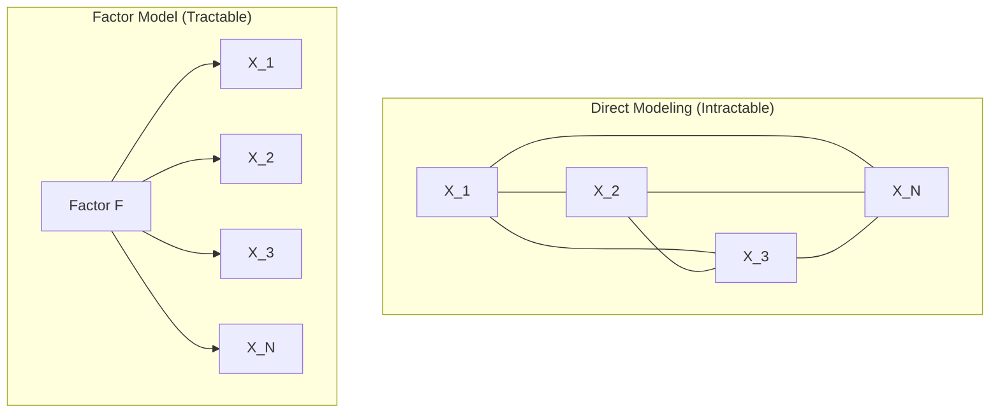
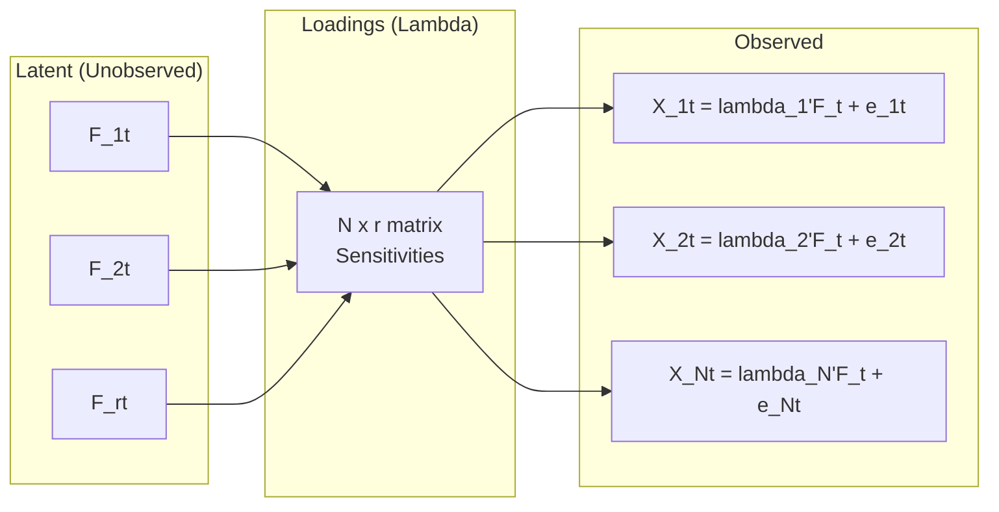
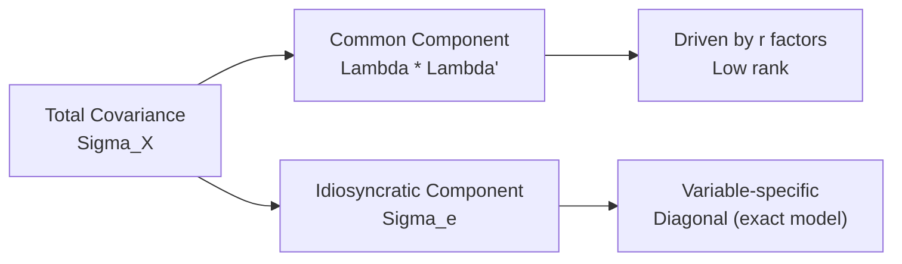
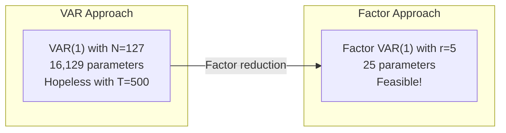
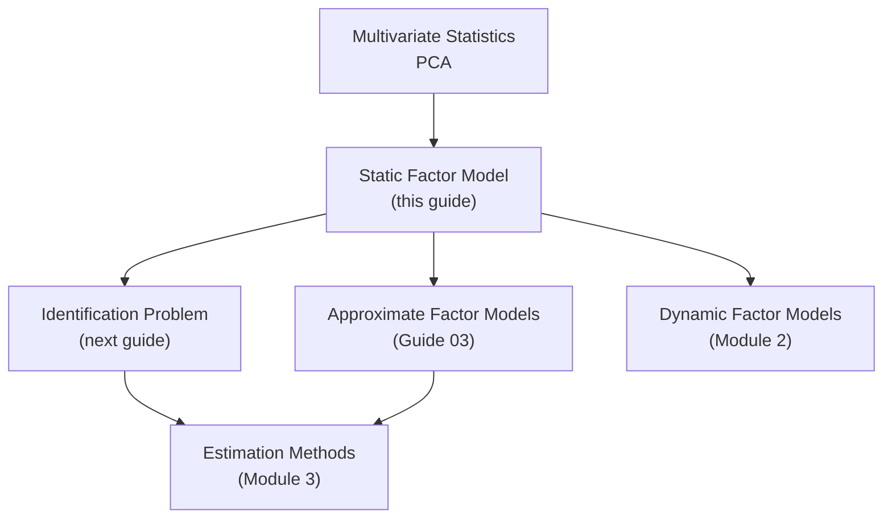

<!-- _class: lead -->

# The Static Factor Model
## Specification and Assumptions

### Module 1: Static Factors

**Key idea:** A few latent factors drive the co-movement of many observed variables

<!-- Speaker notes: Welcome to The Static Factor Model. This deck is part of Module 01 Static Factors. -->
---

# Why Factor Models?

> When many variables co-move, there's likely a common cause. Factor models formalize this: instead of modeling $N$ series with $N(N-1)/2$ pairwise correlations, we model $r \ll N$ factors.



<!-- Speaker notes: Use this diagram to illustrate the overall flow. Trace through each step with the audience. -->
---

<!-- _class: lead -->

# 1. Model Specification

<!-- Speaker notes: Welcome to 1. Model Specification. This deck is part of Module 01 Static Factors. -->
---

# Scalar Form

For variable $i$ at time $t$:

$$X_{it} = \lambda_{i1}F_{1t} + \lambda_{i2}F_{2t} + \cdots + \lambda_{ir}F_{rt} + e_{it}$$

| Symbol | Meaning |
|--------|---------|
| $X_{it}$ | Observed value of variable $i$ at time $t$ |
| $F_{jt}$ | Value of factor $j$ at time $t$ (unobserved) |
| $\lambda_{ij}$ | Loading of variable $i$ on factor $j$ (sensitivity) |
| $e_{it}$ | Idiosyncratic error for variable $i$ at time $t$ |
| $r$ | Number of factors (typically 1--10) |

<!-- Speaker notes: Explain the notation carefully. Connect each term to its intuitive meaning before moving on. -->
---

# Matrix Form (Cross-Section)

For all $N$ variables at time $t$:

$$X_t = \Lambda F_t + e_t$$

| Matrix | Dimensions | Description |
|--------|-----------|-------------|
| $X_t$ | $N \times 1$ | Observed variables |
| $\Lambda$ | $N \times r$ | Loading matrix |
| $F_t$ | $r \times 1$ | Latent factors |
| $e_t$ | $N \times 1$ | Idiosyncratic errors |

<!-- Speaker notes: Explain the notation carefully. Connect each term to its intuitive meaning before moving on. -->
---

# Matrix Form (Full Panel)

Stacking all time periods:

$$X = F\Lambda' + e$$

| Matrix | Dimensions | Description |
|--------|-----------|-------------|
| $X$ | $T \times N$ | Observations x variables |
| $F$ | $T \times r$ | Observations x factors |
| $\Lambda$ | $N \times r$ | Variables x factors |
| $e$ | $T \times N$ | Idiosyncratic errors |

<!-- Speaker notes: Explain the notation carefully. Connect each term to its intuitive meaning before moving on. -->
---

# Visual: Factor Model Data Flow



<!-- Speaker notes: Continue walking through the implementation. Highlight the key output and how to verify correctness. -->
---

<!-- _class: lead -->

# 2. Standard Assumptions

<!-- Speaker notes: Welcome to 2. Standard Assumptions. This deck is part of Module 01 Static Factors. -->
---

# Assumption 1: Factor Structure

$$E[e_t | F_t] = 0$$

Idiosyncratic errors are **uncorrelated with factors**.

> 🔑 Factors capture ALL common variation. Idiosyncratic terms are variable-specific.

<!-- Speaker notes: Explain the notation carefully. Connect each term to its intuitive meaning before moving on. -->
---

# Assumptions 2-4

**Assumption 2: Factor Moments**
$$E[F_t] = 0, \quad E[F_tF_t'] = \Sigma_F$$

Often normalized to $\Sigma_F = I_r$.

**Assumption 3: Idiosyncratic Moments**
$$E[e_t] = 0, \quad E[e_te_t'] = \Sigma_e$$

| Model Type | $\Sigma_e$ Structure |
|------------|---------------------|
| **Exact** | $\text{diag}(\psi_1^2, \ldots, \psi_N^2)$ |
| **Approximate** | Off-diagonal elements allowed (weak) |

**Assumption 4: Independence Over Time** (static models)
$$E[F_tF_s'] = 0, \quad E[e_te_s'] = 0 \quad \text{for } t \neq s$$

<!-- Speaker notes: Explain the notation carefully. Connect each term to its intuitive meaning before moving on. -->
---

<!-- _class: lead -->

# 3. Implied Covariance Structure

<!-- Speaker notes: Welcome to 3. Implied Covariance Structure. This deck is part of Module 01 Static Factors. -->
---

# Population Covariance Decomposition

Taking the variance of $X_t = \Lambda F_t + e_t$:

$$\Sigma_X = \Lambda \Sigma_F \Lambda' + \Sigma_e$$

With normalized factors ($\Sigma_F = I_r$):

$$\boxed{\Sigma_X = \Lambda\Lambda' + \Sigma_e}$$



<!-- Speaker notes: Use this diagram to illustrate the overall flow. Trace through each step with the audience. -->
---

# Variance Decomposition

For variable $i$:

$$\text{Var}(X_{it}) = \underbrace{\sum_{j=1}^r \lambda_{ij}^2 \sigma_{F_j}^2}_{\text{Common variance}} + \underbrace{\psi_i^2}_{\text{Idiosyncratic variance}}$$

**Communality** -- proportion from common factors:

$$h_i^2 = \frac{\sum_j \lambda_{ij}^2 \sigma_{F_j}^2}{\text{Var}(X_{it})}$$

**Covariance between variables** (exact model):

$$\text{Cov}(X_{it}, X_{jt}) = \lambda_i' \Sigma_F \lambda_j$$

> All covariance comes from common factors in exact models.

<!-- Speaker notes: Explain the notation carefully. Connect each term to its intuitive meaning before moving on. -->
---

<!-- _class: lead -->

# 4. Example: Two-Factor Model

<!-- Speaker notes: Welcome to 4. Example: Two-Factor Model. This deck is part of Module 01 Static Factors. -->
---

# Two-Factor Specification

$N = 4$ variables, $r = 2$ factors:

$$\begin{bmatrix} X_{1t} \\ X_{2t} \\ X_{3t} \\ X_{4t} \end{bmatrix} = \begin{bmatrix} \lambda_{11} & \lambda_{12} \\ \lambda_{21} & \lambda_{22} \\ \lambda_{31} & \lambda_{32} \\ \lambda_{41} & \lambda_{42} \end{bmatrix} \begin{bmatrix} F_{1t} \\ F_{2t} \end{bmatrix} + \begin{bmatrix} e_{1t} \\ e_{2t} \\ e_{3t} \\ e_{4t} \end{bmatrix}$$

<!-- Speaker notes: Explain the notation carefully. Connect each term to its intuitive meaning before moving on. -->
---

# Economic Interpretation

| Variable | $F_1$ (Real Activity) | $F_2$ (Nominal) |
|----------|:----:|:----:|
| Industrial Production | **0.9** | 0.1 |
| Employment | **0.8** | 0.2 |
| CPI Inflation | 0.2 | **0.9** |
| Interest Rate | 0.5 | 0.6 |

- IP and Employment load heavily on real activity
- CPI loads heavily on the nominal factor
- Interest rate responds to both

<!-- Speaker notes: Walk through the key rows of this comparison table. Highlight the most important distinctions. -->
---

# Code: Simulating the Two-Factor Model

```python
import numpy as np

np.random.seed(42)
T, N, r = 200, 4, 2

Lambda_true = np.array([
    [0.9, 0.1],   # IP: high on real, low on nominal
    [0.8, 0.2],   # Employment: high on real
    [0.2, 0.9],   # CPI: high on nominal
    [0.5, 0.6],   # Interest rate: both
])
```

<!-- Speaker notes: Walk through the first part of this code implementation. The code continues on the next slide. -->
---

# Code: Simulating the Two-Factor Model (continued)

```python

F_true = np.random.randn(T, r)
psi = np.array([0.3, 0.3, 0.4, 0.3])
e = np.random.randn(T, N) * psi
X = F_true @ Lambda_true.T + e

cov_implied = Lambda_true @ Lambda_true.T + np.diag(psi**2)
print("Implied covariance:\n", cov_implied.round(2))
```

<!-- Speaker notes: Continue walking through the implementation. Highlight the key output and how to verify correctness. -->
---

<!-- _class: lead -->

# 5. Dimensionality and Parameters

<!-- Speaker notes: Welcome to 5. Dimensionality and Parameters. This deck is part of Module 01 Static Factors. -->
---

# Parameter Counting

| Component | Count |
|-----------|-------|
| Loadings | $N \times r$ |
| Factor covariance | $r(r+1)/2$ |
| Idiosyncratic variances | $N$ |
| **Total parameters** | $Nr + r(r+1)/2 + N$ |
| **Observables** (covariance elements) | $N(N+1)/2$ |

**Identification requirement:** Parameters $\leq$ Observables

<!-- Speaker notes: Walk through the key rows of this comparison table. Highlight the most important distinctions. -->
---

# Example: FRED-MD ($N = 127$)

| $r$ (factors) | Parameters | Covariance Elements | Identified? |
|:---:|:---:|:---:|:---:|
| 1 | 256 | 8,128 | Yes |
| 5 | 650 | 8,128 | Yes |
| 10 | 1,452 | 8,128 | Yes |
| ~62 | ~8,128 | 8,128 | Boundary |

> In practice, 3--8 factors are typical for macroeconomic panels.

<!-- Speaker notes: Walk through the key rows of this comparison table. Highlight the most important distinctions. -->
---

<!-- _class: lead -->

# 6. Why Factor Models?

<!-- Speaker notes: Welcome to 6. Why Factor Models?. This deck is part of Module 01 Static Factors. -->
---

# The Curse of Dimensionality



**Forecast aggregation:** Instead of choosing among $N$ predictors:

$$\hat{y}_{t+h} = \alpha + \beta' \hat{F}_t$$

Uses all $N$ variables through $r$ factors.

<!-- Speaker notes: Use this diagram to illustrate the overall flow. Trace through each step with the audience. -->
---

# Structural Interpretation

Factors can represent economic concepts:

| Factor | Variables Loading Heavily |
|--------|--------------------------|
| Real activity | GDP, employment, production |
| Inflation | CPI, PPI, wages |
| Financial conditions | Spreads, rates, volatility |
| Credit | Lending, money supply |

> Enables structural analysis without committing to specific observables.

<!-- Speaker notes: Walk through the key rows of this comparison table. Highlight the most important distinctions. -->
---

<!-- _class: lead -->

# Common Pitfalls

<!-- Speaker notes: Welcome to Common Pitfalls. This deck is part of Module 01 Static Factors. -->
---

# Pitfalls to Avoid

| Pitfall | Issue | Solution |
|---------|-------|----------|
| Confusing factors and PCs | Factors are latent; PCs are deterministic transforms | Under conditions, PCs estimate factors |
| Ignoring identification | Factors only identified up to rotation | Impose normalization constraints |
| Over-interpreting weak factors | May be noise, not signal | Focus on strong, robust factors |

<!-- Speaker notes: Emphasize these common mistakes. Ask learners if they have encountered any of these in practice. -->
---

# Practice Problems

**Conceptual:**
1. How does the factor model reduce parameters for $N$ correlated variables?
2. If all $\psi_i = 0$, what does this imply about the data?
3. Why might macroeconomic variables have a factor structure?

**Implementation:**
4. Simulate a 3-factor model with $N = 20$. Verify the covariance structure.
5. Compute and plot communalities for each variable.

<!-- Speaker notes: Give learners 3-5 minutes to work through these practice problems before discussing solutions. -->
---

# Connections & Summary



**References:**
- Lawley & Maxwell (1971). *Factor Analysis as a Statistical Method*
- Anderson (2003). *Multivariate Statistical Analysis*, Ch. 14
- Bai & Ng (2008). "Large Dimensional Factor Analysis"

<!-- Speaker notes: Summarize the key takeaways and highlight how this topic connects to upcoming material. -->