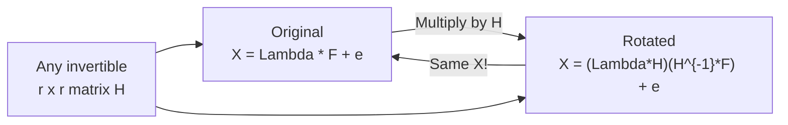
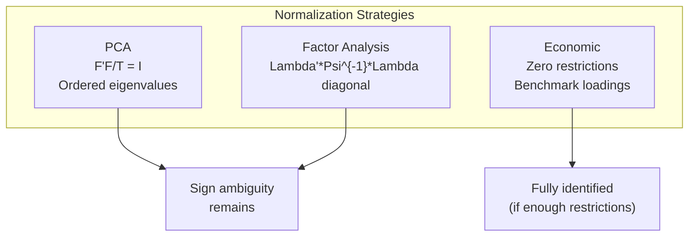
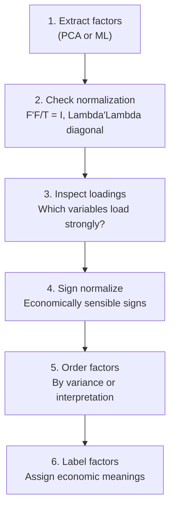

<!-- _class: lead -->

# The Factor Model Identification Problem

## Module 1: Static Factors

**Key idea:** Factors and loadings are only identified up to rotation -- normalization constraints are required

<!-- Speaker notes: Welcome to The Factor Model Identification Problem. This deck is part of Module 01 Static Factors. -->
---

# The Core Problem

> If you multiply factors by a matrix $H$ and loadings by $H^{-1}$, you get a different but statistically indistinguishable model.

This is **rotational indeterminacy**: infinitely many equally valid factor representations exist.



<!-- Speaker notes: Use this diagram to illustrate the overall flow. Trace through each step with the audience. -->
---

<!-- _class: lead -->

# 1. The Fundamental Identification Problem

<!-- Speaker notes: Welcome to 1. The Fundamental Identification Problem. This deck is part of Module 01 Static Factors. -->
---

# Observable Equivalence

The static factor model: $X_t = \Lambda F_t + e_t$

For any invertible $r \times r$ matrix $H$, define:

$$\tilde{F}_t = H^{-1}F_t, \quad \tilde{\Lambda} = \Lambda H$$

Then:

$$X_t = \Lambda F_t = \Lambda(HH^{-1})F_t = (\Lambda H)(H^{-1}F_t) = \tilde{\Lambda}\tilde{F}_t$$

> 🔑 Identical observables, completely different factors and loadings!

<!-- Speaker notes: Explain the notation carefully. Connect each term to its intuitive meaning before moving on. -->
---

# Implications of Indeterminacy

| Type | Description |
|------|-------------|
| **Rotations** | Factors can be rotated in factor space |
| **Scaling** | Multiply factor $j$ by $c$, divide loadings by $c$ |
| **Ordering** | Permute factor order freely |
| **Signs** | $v$ and $-v$ both valid |

**All produce the same $X$.**

<!-- Speaker notes: Walk through the key rows of this comparison table. Highlight the most important distinctions. -->
---

<!-- _class: lead -->

# 2. Standard Normalization Constraints

<!-- Speaker notes: Welcome to 2. Standard Normalization Constraints. This deck is part of Module 01 Static Factors. -->
---

# Constraint Set 1: PCA Normalization

**C1.1: Orthonormal factors**
$$\frac{1}{T}F'F = I_r$$

Factors have unit variance and are uncorrelated.

**C1.2: Diagonal loading matrix**
$$\Lambda'\Lambda = D$$

where $D$ is diagonal with $d_1 \geq d_2 \geq \cdots \geq d_r \geq 0$.

> Orders factors by variance explained and makes loadings orthogonal. Identifies uniquely **up to sign flips**.

<!-- Speaker notes: Explain the notation carefully. Connect each term to its intuitive meaning before moving on. -->
---

# Constraint Set 2: Factor Analysis Normalization

**C2.1: Factor covariance**
$$E[F_tF_t'] = I_r$$

**C2.2: Loading constraints**
$$\Lambda'\Psi^{-1}\Lambda = \text{diagonal}$$

where $\Psi = \text{diag}(\psi_1^2, \ldots, \psi_N^2)$.

> Gives maximum likelihood estimates under normality.

<!-- Speaker notes: Explain the notation carefully. Connect each term to its intuitive meaning before moving on. -->
---

# Constraint Set 3: Economic Identification

For structural interpretation:

**C3.1: Benchmark variable loadings**
$$\lambda_{ij} = 1 \text{ for selected } (i,j) \text{ pairs}$$

**C3.2: Zero restrictions**
$$\lambda_{ij} = 0 \text{ for economically justified pairs}$$

Example: "Real activity" factor loads on GDP but not on inflation.



<!-- Speaker notes: Use this diagram to illustrate the overall flow. Trace through each step with the audience. -->
---

<!-- _class: lead -->

# 3. Degrees of Freedom Analysis

<!-- Speaker notes: Welcome to 3. Degrees of Freedom Analysis. This deck is part of Module 01 Static Factors. -->
---

# Parameter Counting

**Unrestricted model:**
- Loadings: $N \times r$
- Factor covariance: $r(r+1)/2$
- Idiosyncratic: $N$
- **Total:** $Nr + r(r+1)/2 + N$

**Rotation matrix $H$ has $r^2$ degrees of freedom.**

To eliminate $H$, we need $r^2$ constraints.

<!-- Speaker notes: Cover the key points of Parameter Counting. Check for understanding before proceeding. -->
---

# Constraint Schemes Compared

| Normalization | Constraints | Remaining Ambiguity |
|---------------|:-----------:|---------------------|
| None | 0 | Complete rotational freedom |
| Orthogonal factors | $r(r-1)/2$ | Rotation + scale + order |
| PCA ($F'F/T = I$) | $r(r+1)/2$ | Sign flips only |
| PCA + ordered eigenvalues | $r(r+1)/2$ | Sign flips only |
| Structural zeros | Case-dependent | Depends on pattern |

<!-- Speaker notes: Walk through the key rows of this comparison table. Highlight the most important distinctions. -->
---

<!-- _class: lead -->

# 4. Practical Implications

<!-- Speaker notes: Welcome to 4. Practical Implications. This deck is part of Module 01 Static Factors. -->
---

# Sign Indeterminacy in Practice

Even with PCA normalization:

$$X = \Lambda F = (-\Lambda)(-F)$$

**Software inconsistency:** Different programs may flip signs differently!

**Solution:** Post-estimation sign normalization based on economic logic.

<!-- Speaker notes: Give learners 3-5 minutes to work through these practice problems before discussing solutions. -->
---

# Rotation Invariance of Fit

The implied covariance is rotation-invariant:

$$\Sigma_X = \Lambda\Lambda' + \Sigma_e = \tilde{\Lambda}\tilde{\Lambda}' + \Sigma_e$$

| Invariant (doesn't change) | Not invariant (changes with rotation) |
|:---:|:---:|
| $R^2$ | Individual factor interpretation |
| Likelihood | Loading pattern |
| Forecast accuracy | Factor time series |
| Covariance fit | Factor correlations with observables |

<!-- Speaker notes: Explain the notation carefully. Connect each term to its intuitive meaning before moving on. -->
---

# Interpretation Requires Constraints

<div class="columns">
<div>

**Without normalization:**
- Cannot interpret factor as "real activity"
- Cannot compare loadings across studies
- Cannot track factors over time

</div>
<div>

**With normalization:**
- Factors have economic meaning
- Results are reproducible
- Time series of factors are coherent

</div>
</div>

<!-- Speaker notes: Cover the key points of Interpretation Requires Constraints. Check for understanding before proceeding. -->
---

<!-- _class: lead -->

# 5. Code Implementation

<!-- Speaker notes: Welcome to 5. Code Implementation. This deck is part of Module 01 Static Factors. -->
---

# Demonstrating Rotational Indeterminacy

```python
import numpy as np

np.random.seed(42)
T, N, r = 200, 10, 2
F_true = np.random.randn(T, r)
Lambda_true = np.random.randn(N, r)
e = np.random.randn(T, N) * 0.3
X = F_true @ Lambda_true.T + e
```

<!-- Speaker notes: Walk through the first part of this code implementation. The code continues on the next slide. -->
---

# Demonstrating Rotational Indeterminacy (continued)

```python

# Apply 45-degree rotation
theta = np.pi / 4
H = np.array([[np.cos(theta), -np.sin(theta)],
              [np.sin(theta),  np.cos(theta)]])

F_rotated = F_true @ H.T
Lambda_rotated = Lambda_true @ H
```

<!-- Speaker notes: Continue walking through the implementation. Highlight the key output and how to verify correctness. -->
---

# Verifying Observable Equivalence

```python
X_original = F_true @ Lambda_true.T
X_rotated = F_rotated @ Lambda_rotated.T

print("Reconstruction error (original):",
      np.linalg.norm(X - X_original - e))
print("Reconstruction error (rotated):",
      np.linalg.norm(X - X_rotated - e))
# Both essentially zero!

print("\nFactors are completely different, but X is identical!")
```

> 🔑 Same data, different factor representations -- this is the identification problem in action.

<!-- Speaker notes: Walk through this code step by step. Highlight the key lines and explain the output. -->
---

# Implementing PCA Normalization

```python
def pca_normalization(X, r):
    """Extract factors with PCA normalization.
    Constraints: F'F/T = I_r, Lambda'Lambda diagonal."""
    T, N = X.shape
    X_centered = X - X.mean(axis=0)
    Sigma = X_centered.T @ X_centered / T

    eigenvalues, eigenvectors = np.linalg.eigh(Sigma)
    idx = eigenvalues.argsort()[::-1]
    eigenvalues = eigenvalues[idx]
    eigenvectors = eigenvectors[:, idx]
```

<!-- Speaker notes: Walk through the first part of this code implementation. The code continues on the next slide. -->
---

# Implementing PCA Normalization (continued)

```python

    Lambda = eigenvectors[:, :r] * np.sqrt(eigenvalues[:r])
    F = X_centered @ eigenvectors[:, :r] / np.sqrt(eigenvalues[:r])

    # Verify: F'F/T should be I_r
    print(f"F'F/T - I (should be ~0):\n{(F.T @ F/T - np.eye(r)).round(6)}")
    return F, Lambda
```

<!-- Speaker notes: Continue walking through the implementation. Highlight the key output and how to verify correctness. -->
---

# Sign Normalization

```python
def sign_normalize(F, Lambda, reference_variables):
    """Normalize signs: each factor loads positively on its reference."""
    F_norm = F.copy()
    Lambda_norm = Lambda.copy()

    for j, var_idx in enumerate(reference_variables):
        if Lambda_norm[var_idx, j] < 0:
            F_norm[:, j] *= -1
            Lambda_norm[:, j] *= -1
```

<!-- Speaker notes: Walk through the first part of this code implementation. The code continues on the next slide. -->
---

# Sign Normalization (continued)

```python

    return F_norm, Lambda_norm

# Force Factor 1 positive on variable 0, Factor 2 on variable 5
F_signed, Lambda_signed = sign_normalize(
    F_hat, Lambda_hat, reference_variables=[0, 5]
)
```

<!-- Speaker notes: Continue walking through the implementation. Highlight the key output and how to verify correctness. -->
---

<!-- _class: lead -->

# 6. Identification in Practice

<!-- Speaker notes: Welcome to 6. Identification in Practice. This deck is part of Module 01 Static Factors. -->
---

# Step-by-Step Strategy



<!-- Speaker notes: Use this diagram to illustrate the overall flow. Trace through each step with the audience. -->
---

# Example: Macro Factor Identification

```python
variable_names = ["GDP", "Employment", "Hours", "Investment",
                  "CPI", "PPI", "Wages", "FFR",
                  "Housing Starts", "Retail Sales"]

for j in range(r):
    print(f"\n=== Factor {j+1} ===")
    sorted_idx = np.argsort(np.abs(Lambda_signed[:, j]))[::-1]
    for i in sorted_idx[:5]:
        print(f"  {variable_names[i]}: {Lambda_signed[i, j]:.3f}")

# Factor 1: GDP, Employment, Hours, Investment -> "Real Activity"
# Factor 2: CPI, PPI, Wages -> "Inflation"
```

<!-- Speaker notes: Walk through this code step by step. Highlight the key lines and explain the output. -->
---

<!-- _class: lead -->

# Common Pitfalls

<!-- Speaker notes: Welcome to Common Pitfalls. This deck is part of Module 01 Static Factors. -->
---

# Pitfalls to Avoid

| Pitfall | Problem | Solution |
|---------|---------|----------|
| Ignoring sign ambiguity | Interpretation changes when signs flip | Apply post-estimation sign normalization |
| Comparing across studies | Different normalizations give different factors | Use same variables and scheme |
| Over-interpreting order | PCA orders by variance, not importance | Economic interpretation from loadings |
| Assuming uniqueness | Treating estimates as "the" factors | Focus on rotation-invariant predictions |

<!-- Speaker notes: Emphasize these common mistakes. Ask learners if they have encountered any of these in practice. -->
---

# Practice Problems

**Conceptual:**
1. Why does $X = \Lambda F = \tilde{\Lambda}\tilde{F}$ not violate model assumptions?
2. How many free parameters does an invertible $r \times r$ matrix have?
3. Why might factors look different across subperiods?

**Mathematical:**
4. Prove $\Sigma_X = \Lambda\Lambda' + \Sigma_e$ is rotation-invariant
5. Show PCA normalization imposes $r(r+1)/2$ constraints

<!-- Speaker notes: Give learners 3-5 minutes to work through these practice problems before discussing solutions. -->
---

# Connections & Summary

| Concept | Key Point |
|---------|-----------|
| Rotational indeterminacy | $\Lambda F = (\Lambda H)(H^{-1}F)$ |
| PCA normalization | $F'F/T = I$, $\Lambda'\Lambda$ diagonal |
| Sign ambiguity | Always remains; fix with reference variables |
| Economic identification | Zero restrictions for structural meaning |

**Builds on:** Factor model specification (Guide 01)
**Leads to:** Approximate factor models (Guide 03), Estimation (Module 3)

**References:**
- Lawley & Maxwell (1971). Ch. 4: Identification and rotation
- Bai & Ng (2008). Section 2.2: Identification
- Stock & Watson (2016). "Dynamic Factor Models"

<!-- Speaker notes: Summarize the key takeaways and highlight how this topic connects to upcoming material. -->