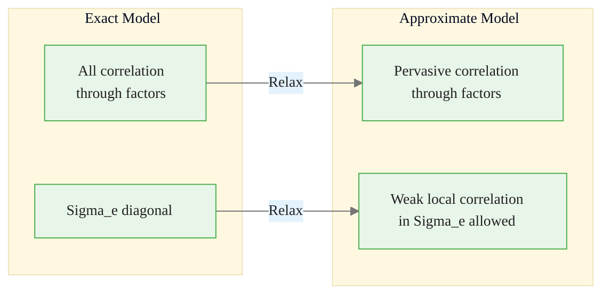
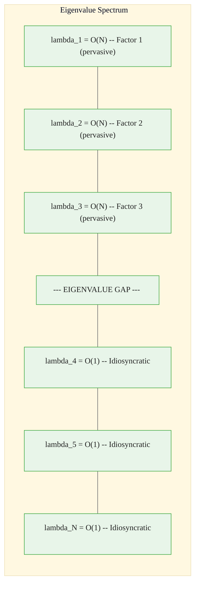
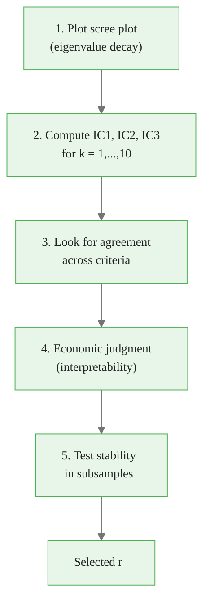
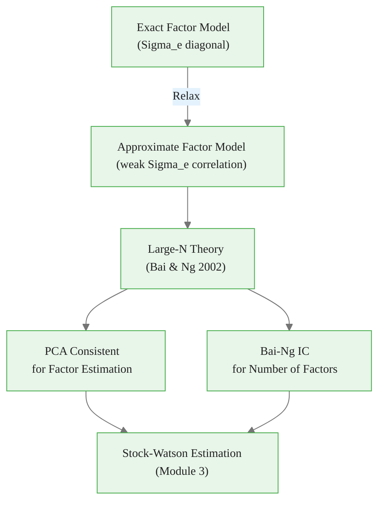

<!-- _class: lead -->

# Approximate Factor Models and Large-N Theory

## Module 1: Static Factors

**Key idea:** Allow weak idiosyncratic correlation -- PCA remains consistent as $N \to \infty$

<!-- Speaker notes: Welcome to Approximate Factor Models and Large-N Theory. This deck is part of Module 01 Static Factors. -->
---

# Why "Approximate"?

> In exact factor models, ALL correlation comes through factors. But real data has local correlations that aren't purely factor-driven.

Approximate factor models: factors capture **pervasive** covariation, while **weak local dependencies** are allowed but don't dominate.



<div class="callout-key">

Key implementation detail -- study this pattern carefully.

</div>

<!-- Speaker notes: Use this diagram to illustrate the overall flow. Trace through each step with the audience. -->
---

<!-- _class: lead -->

# 1. Exact vs. Approximate Factor Models

<!-- Speaker notes: Welcome to 1. Exact vs. Approximate Factor Models. This deck is part of Module 01 Static Factors. -->
---

# Side-by-Side Comparison

| Aspect | Exact Model | Approximate Model |
|--------|:-----------:|:-----------------:|
| Idiosyncratic correlation | None ($\Sigma_e$ diagonal) | Weak (bounded) |
| Cross-sectional dependence | Only through factors | Factors + weak local |
| Large-N asymptotics | Not required | Essential |
| Real-world fit | Too restrictive | Realistic |
| Estimation | ML under normality | PCA robust |

<!-- Speaker notes: Walk through the key rows of this comparison table. Highlight the most important distinctions. -->
---

# Exact Model

$$X_{it} = \lambda_i' F_t + e_{it}$$

**Strict assumption:** $E[e_{it}e_{jt}] = 0$ for all $i \neq j$

$$\Sigma_e = \text{diag}(\psi_1^2, \ldots, \psi_N^2)$$

# Approximate Model

**Relaxed assumption:** $|E[e_{it}e_{jt}]| < M < \infty$

$$\Sigma_e \text{ can have off-diagonal elements, but they are weak}$$

<!-- Speaker notes: Explain the notation carefully. Connect each term to its intuitive meaning before moving on. -->
---

<!-- _class: lead -->

# 2. Chamberlain-Rothschild Framework

<!-- Speaker notes: Welcome to 2. Chamberlain-Rothschild Framework. This deck is part of Module 01 Static Factors. -->
---

# Pervasive vs. Non-Pervasive Variation

**Definition (Chamberlain & Rothschild, 1983):**

A factor $F_t$ is **pervasive** if it affects a non-negligible fraction of variables as $N \to \infty$:

$$\lim_{N \to \infty} \frac{1}{N}\sum_{i=1}^N \lambda_{ij}^2 = c_j > 0$$

> 🔑 The factor explains variance proportional to $N$, not just a fixed number of variables.

<!-- Speaker notes: Explain the notation carefully. Connect each term to its intuitive meaning before moving on. -->
---

# Asymptotic Eigenvalue Behavior

Under approximate factor model with $r$ pervasive factors:

| Eigenvalues | Growth Rate | Interpretation |
|-------------|:-----------:|----------------|
| Top $r$ eigenvalues of $\Sigma_X$ | $O(N)$ | Unbounded -- factor-driven |
| Remaining eigenvalues | $O(1)$ | Bounded -- idiosyncratic |

This **eigenvalue separation** allows identifying $r$ even with correlated errors.

<!-- Speaker notes: Walk through the key rows of this comparison table. Highlight the most important distinctions. -->
---

# Eigenvalue Spectrum Visualization



<div class="callout-insight">

This pattern recurs throughout the course. Understanding it deeply pays dividends later.

</div>

> As $N \to \infty$: the gap widens, making factors identifiable.

<!-- Speaker notes: Use this diagram to illustrate the overall flow. Trace through each step with the audience. -->
---

<!-- _class: lead -->

# 3. Large-N Consistency Theory

<!-- Speaker notes: Welcome to 3. Large-N Consistency Theory. This deck is part of Module 01 Static Factors. -->
---

# Bai & Ng (2002) Result

**Theorem (Simplified):** Under regularity conditions:

1. Bounded factor loadings: $\|\lambda_i\| < M$
2. Bounded idiosyncratic variance: $\psi_i^2 < M$
3. Weak dependence in $e_{it}$ (specific mixing conditions)
4. $T, N \to \infty$ jointly

Then PCA estimates of factor space are consistent:

$$\frac{1}{T}\|\hat{F} - HF\|^2 \to 0 \quad \text{in probability}$$

where $H$ is some rotation matrix.

<!-- Speaker notes: Explain the notation carefully. Connect each term to its intuitive meaning before moving on. -->
---

# What "Weak Dependence" Means

**Condition 1:** Bounded correlations
$$|E[e_{it}e_{jt}]| < M \quad \text{for all } i,j$$

**Condition 2:** Summability
$$\sum_{j=1}^N |E[e_{it}e_{jt}]| < MN^\alpha \quad \text{for some } \alpha < 1$$

| Example | Allowed? |
|---------|:--------:|
| Regional correlations (CA and OR unemployment) | Yes |
| Industry clustering (tech stock correlations) | Yes |
| Global systematic correlation (all corr = 0.5) | **No** |

<!-- Speaker notes: Explain the notation carefully. Connect each term to its intuitive meaning before moving on. -->
---

# Consistency Intuition

**Idiosyncratic contribution (bounded):**
$$\frac{1}{N}\sum_{i=1}^N e_{it}^2 \to \text{bounded variance}$$

**Factor contribution (growing):**
$$\frac{1}{N}\sum_{i=1}^N (\lambda_i'F_t)^2 \to F_t'\Sigma_\lambda F_t$$

**Signal-to-noise ratio improves:**

$$\text{SNR} \sim \frac{N \cdot \text{factor variance}}{\text{idiosyncratic variance}} \to \infty$$

> 🔑 More variables = better factor estimation!

<!-- Speaker notes: Explain the notation carefully. Connect each term to its intuitive meaning before moving on. -->
---

<!-- _class: lead -->

# 4. Determining the Number of Factors

<!-- Speaker notes: Welcome to 4. Determining the Number of Factors. This deck is part of Module 01 Static Factors. -->
---

# Bai-Ng Information Criteria

Standard AIC/BIC fail because $N$ is not fixed. Modified criteria:

$$IC_p(k) = \log V(k) + k \cdot g(N, T)$$

| Criterion | Penalty $g(N,T)$ |
|-----------|-------------------|
| IC1 | $\frac{N+T}{NT}\log\left(\frac{NT}{N+T}\right)$ |
| IC2 | $\frac{N+T}{NT}\log(C_{NT}^2)$ where $C_{NT} = \min(\sqrt{N}, \sqrt{T})$ |
| IC3 | $\frac{\log(C_{NT}^2)}{C_{NT}^2}$ |

Choose: $\hat{r} = \arg\min_k IC_p(k)$

<!-- Speaker notes: Explain the notation carefully. Connect each term to its intuitive meaning before moving on. -->
---

# Practical Factor Number Selection



<div class="callout-warning">

Watch for edge cases with this implementation in production use.

</div>

> Rule of thumb for macro panels: **3--8 factors** typically sufficient.

<!-- Speaker notes: Use this diagram to illustrate the overall flow. Trace through each step with the audience. -->
---

# Code: Bai-Ng Information Criteria

```python
def bai_ng_ic(X, k_max=10):
    """Compute Bai-Ng IC for number of factors."""
    T, N = X.shape
    X_centered = X - X.mean(axis=0)
    Sigma = X_centered.T @ X_centered / T
    eigenvalues, eigenvectors = np.linalg.eigh(Sigma)
    idx = eigenvalues.argsort()[::-1]
    eigenvalues, eigenvectors = eigenvalues[idx], eigenvectors[:, idx]

    C_NT = min(np.sqrt(N), np.sqrt(T))
    results = {}
```

<div class="callout-info">

This approach follows established best practices in the field.

</div>

<!-- Speaker notes: Walk through the first part of this code implementation. The code continues on the next slide. -->
---

# Code: Bai-Ng Information Criteria (continued)

```python

    for k in range(k_max + 1):
        if k == 0:
            V_k = np.trace(Sigma) / N
        else:
            Lambda_k = eigenvectors[:, :k] * np.sqrt(eigenvalues[:k])
            F_k = X_centered @ eigenvectors[:, :k] / np.sqrt(eigenvalues[:k])
            residuals = X_centered - F_k @ Lambda_k.T
            V_k = np.sum(residuals**2) / (T * N)

        g1 = ((N+T)/(N*T)) * np.log((N*T)/(N+T))
        results[k] = np.log(V_k) + k * g1

    return min(results, key=results.get)
```

<!-- Speaker notes: Continue walking through the implementation. Highlight the key output and how to verify correctness. -->
---

<!-- _class: lead -->

# 5. Simulation and Diagnostics

<!-- Speaker notes: Welcome to 5. Simulation and Diagnostics. This deck is part of Module 01 Static Factors. -->
---

# Simulating Approximate Factor Model

```python
def simulate_approximate_factor_model(T, N, r, local_corr=0.3):
    """Simulate with weak idiosyncratic correlation."""
    F_true = np.random.randn(T, r)
    Lambda_true = np.random.uniform(0.5, 1.5, size=(N, r))

    # Correlated idiosyncratic errors (local neighbor correlation)
    e = np.random.randn(T, N)
    for t in range(T):
        for i in range(1, N):
            e[t, i] += local_corr * e[t, i-1]
    e *= 0.5
```

<!-- Speaker notes: Walk through the first part of this code implementation. The code continues on the next slide. -->
---

# Simulating Approximate Factor Model (continued)

<div class="code-window">
<div class="code-header">
<div class="dots"><span class="dot-red"></span><span class="dot-yellow"></span><span class="dot-green"></span></div>
<span class="filename">example.py</span>
</div>

```python

    X = F_true @ Lambda_true.T + e
    return X, F_true, Lambda_true

T, N, r = 200, 100, 3
X, F_true, Lambda_true = simulate_approximate_factor_model(T, N, r)
```

</div>

<!-- Speaker notes: Continue walking through the implementation. Highlight the key output and how to verify correctness. -->
---

# Weak Dependence Diagnostics

<div class="code-window">
<div class="code-header">
<div class="dots"><span class="dot-red"></span><span class="dot-yellow"></span><span class="dot-green"></span></div>
<span class="filename">check_weak_dependence.py</span>
</div>

```python
def check_weak_dependence(X, r=3, threshold=0.3):
    """Check if residuals satisfy weak dependence."""
    T, N = X.shape
    X_c = X - X.mean(axis=0)
    Sigma = X_c.T @ X_c / T
    evals, evecs = np.linalg.eigh(Sigma)
    idx = evals.argsort()[::-1]
    evecs = evecs[:, idx]
```

</div>

<!-- Speaker notes: Walk through the first part of this code implementation. The code continues on the next slide. -->
---

# Weak Dependence Diagnostics (continued)

<div class="code-window">
<div class="code-header">
<div class="dots"><span class="dot-red"></span><span class="dot-yellow"></span><span class="dot-green"></span></div>
<span class="filename">example.py</span>
</div>

```python

    Lambda = evecs[:, :r] * np.sqrt(evals[idx][:r])
    F = X_c @ evecs[:, :r] / np.sqrt(evals[idx][:r])
    residuals = X_c - F @ Lambda.T

    res_corr = np.corrcoef(residuals.T)
    off_diag = res_corr[~np.eye(N, dtype=bool)]

    print(f"Max |correlation|: {np.max(np.abs(off_diag)):.3f}")
    print(f"Mean |correlation|: {np.mean(np.abs(off_diag)):.3f}")
    print(f"% above {threshold}: {np.mean(np.abs(off_diag)>threshold)*100:.1f}%")
```

</div>

<!-- Speaker notes: Continue walking through the implementation. Highlight the key output and how to verify correctness. -->
---

<!-- _class: lead -->

# 6. When Approximate Models Matter

<!-- Speaker notes: Welcome to 6. When Approximate Models Matter. This deck is part of Module 01 Static Factors. -->
---

# Real-World Applications

| Dataset | $N$ | Why Approximate? |
|---------|:---:|------------------|
| FRED-MD | 127 | Local correlations in IP subcategories |
| Large stock panels | 500+ | Industry clustering effects |
| International macro | 50-200 | Regional spillovers, trade linkages |

**When exact models suffice:**
- Small curated panels ($N < 20$)
- Simulated DSGE data
- Variables designed with factor structure

<!-- Speaker notes: Walk through the key rows of this comparison table. Highlight the most important distinctions. -->
---

<!-- _class: lead -->

# Common Pitfalls

<!-- Speaker notes: Welcome to Common Pitfalls. This deck is part of Module 01 Static Factors. -->
---

# Pitfalls to Avoid

| Pitfall | Issue | Fix |
|---------|-------|-----|
| Treating approximate as exact | ML with diagonal $\Sigma_e$ on approx data | Use PCA (robust to weak dependence) |
| Ignoring $N$ requirement | Large-N theory with $N = 30$ | Need $N \geq 50$, prefer $N > 100$ |
| Over-extracting factors | Capturing idiosyncratic correlations | Use IC + stability tests |
| Confusing weak/strong dependence | Allowing arbitrary correlation | Check residual correlations |

<!-- Speaker notes: Emphasize these common mistakes. Ask learners if they have encountered any of these in practice. -->
---

# Practice Problems

**Conceptual:**
1. Why does the exact model restriction often fail in practice?
2. How does eigenvalue separation enable identification with correlated errors?
3. What does "pervasive" mean economically?

**Implementation:**
4. Simulate with $N=200$ and local correlation; verify PCA recovers factors
5. Compare IC1, IC2, IC3 -- do they agree?

<!-- Speaker notes: Give learners 3-5 minutes to work through these practice problems before discussing solutions. -->
---

# Connections & Summary



| Key Result | Implication |
|------------|-------------|
| Eigenvalue separation | Factors identifiable despite correlated errors |
| PCA consistency | Works even with approximate structure |
| Bai-Ng IC | Consistent number-of-factors selection |
| SNR grows with $N$ | More variables = better estimation |

**References:**
- Chamberlain & Rothschild (1983). *Econometrica*
- Bai & Ng (2002). *Econometrica*
- Stock & Watson (2002). *JASA*

<!-- Speaker notes: Summarize the key takeaways and highlight how this topic connects to upcoming material. -->