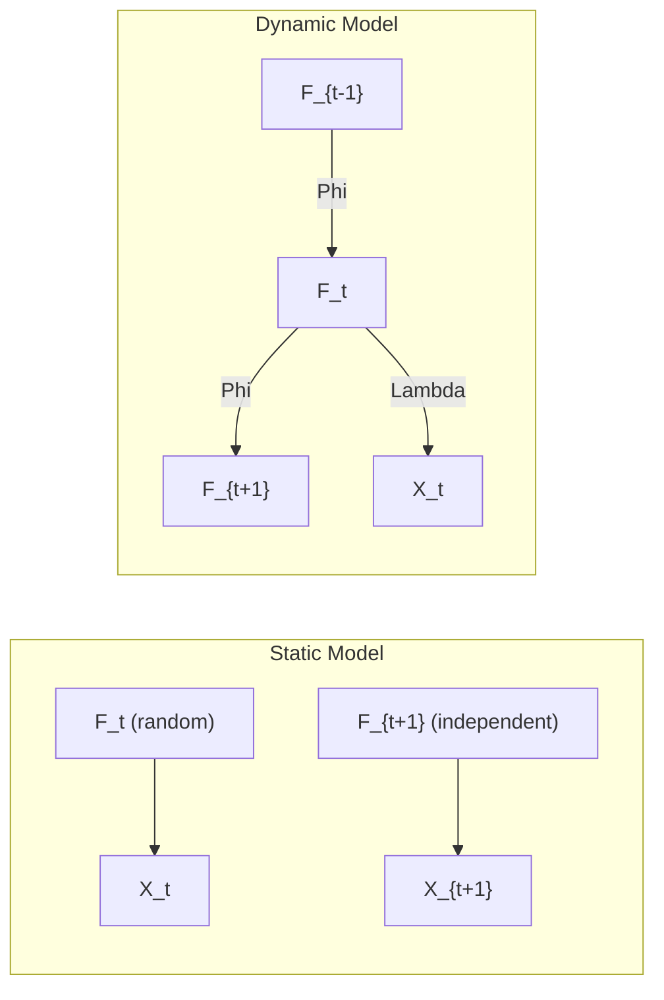
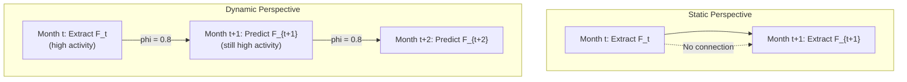
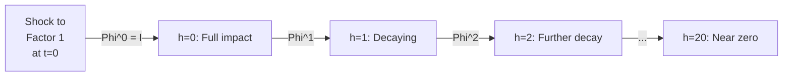
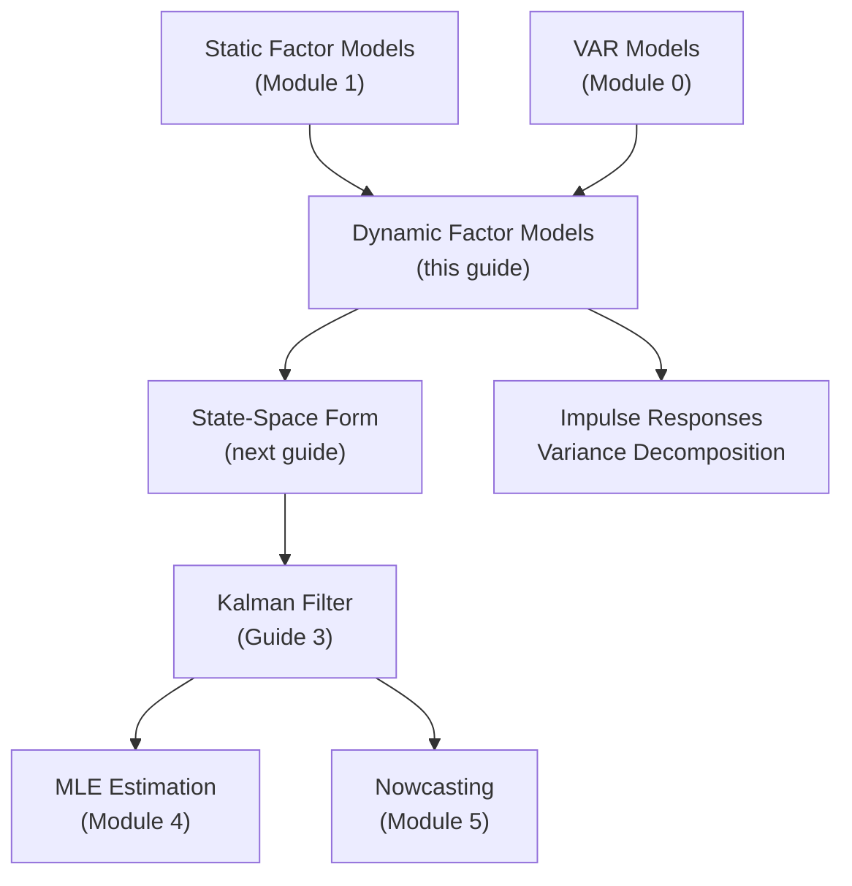

<!-- _class: lead -->

# From Static to Dynamic Factor Models

## Module 2: Dynamic Factors

**Key idea:** Allow factors to evolve over time via autoregressive dynamics

<!-- Speaker notes: Welcome to From Static to Dynamic Factor Models. This deck is part of Module 02 Dynamic Factors. -->
---

# Why Add Dynamics?

> Real-world factors don't jump randomly -- they evolve smoothly with persistence. A recession today predicts weaker activity tomorrow.



<!-- Speaker notes: Use this diagram to illustrate the overall flow. Trace through each step with the audience. -->
---

# Three Capabilities from Dynamics

| Capability | Static Model | Dynamic Model |
|------------|:---:|:---:|
| Better factor estimation | Cross-section only | + time series info |
| Forecasting | Cannot forecast factors | Propagate VAR forward |
| Structural interpretation | No impulse responses | Shock propagation analysis |

<!-- Speaker notes: Walk through the key rows of this comparison table. Highlight the most important distinctions. -->
---

<!-- _class: lead -->

# 1. Formal Definition

<!-- Speaker notes: Welcome to 1. Formal Definition. This deck is part of Module 02 Dynamic Factors. -->
---

# Static vs Dynamic Factor Model

**Static Factor Model:**

$$X_t = \Lambda F_t + e_t$$

Factors $F_t$ are independent draws over time.

**Dynamic Factor Model:**

$$X_t = \Lambda F_t + e_t, \quad e_t \sim N(0, \Sigma_e)$$
$$F_t = \Phi_1 F_{t-1} + \Phi_2 F_{t-2} + \cdots + \Phi_p F_{t-p} + \eta_t, \quad \eta_t \sim N(0, Q)$$

> 🔑 The key addition: factors follow a **vector autoregression** (VAR).

<!-- Speaker notes: Explain the notation carefully. Connect each term to its intuitive meaning before moving on. -->
---

# What the VAR Captures

For the simplest case ($p = 1$, $r = 2$):

$$\begin{bmatrix} F_{1t} \\ F_{2t} \end{bmatrix} = \begin{bmatrix} \phi_{11} & \phi_{12} \\ \phi_{21} & \phi_{22} \end{bmatrix} \begin{bmatrix} F_{1,t-1} \\ F_{2,t-1} \end{bmatrix} + \begin{bmatrix} \eta_{1t} \\ \eta_{2t} \end{bmatrix}$$

| Parameter | Meaning |
|-----------|---------|
| $\phi_{11}$ | Persistence of factor 1 |
| $\phi_{22}$ | Persistence of factor 2 |
| $\phi_{12}$ | Lagged factor 2 $\to$ current factor 1 |
| $\phi_{21}$ | Lagged factor 1 $\to$ current factor 2 |

**Stationarity:** $|\lambda_i(\Phi_1)| < 1$ for all $i$

<!-- Speaker notes: Explain the notation carefully. Connect each term to its intuitive meaning before moving on. -->
---

<!-- _class: lead -->

# 2. Intuition

<!-- Speaker notes: Welcome to 2. Intuition. This deck is part of Module 02 Dynamic Factors. -->
---

# The Elevator Pitch

Think of factors as economic **currents** pushing variables around.

<div class="columns">
<div>

**Static model:**
- Random gusts with no memory
- Ocean instantly calms after a storm

</div>
<div>

**Dynamic model:**
- Strong currents persist
- High activity today predicts high activity tomorrow

</div>
</div>

> $F_{t+1} \approx \phi F_t + \text{shock}$

<!-- Speaker notes: Cover the key points of The Elevator Pitch. Check for understanding before proceeding. -->
---

# Static vs Dynamic: GDP Example



<!-- Speaker notes: Use this diagram to illustrate the overall flow. Trace through each step with the audience. -->
---

<!-- _class: lead -->

# 3. Covariance Implications

<!-- Speaker notes: Welcome to 3. Covariance Implications. This deck is part of Module 02 Dynamic Factors. -->
---

# Autocovariance Structure

**Static model:** No autocovariance
$$\text{Cov}(X_t, X_{t-h}) = 0 \quad \text{for } h > 0$$

**Dynamic model:** Rich autocovariance
$$\text{Cov}(X_t, X_{t-h}) = \Lambda \Gamma_F(h) \Lambda'$$

where $\Gamma_F(h) = \text{Cov}(F_t, F_{t-h})$ is determined by the VAR dynamics.

> Dynamics create temporal dependence in observables through factor persistence.

<!-- Speaker notes: Explain the notation carefully. Connect each term to its intuitive meaning before moving on. -->
---

# Spectral Representation

Dynamic factor models have **frequency-specific** factor loadings:

$$S_X(\omega) = \Lambda(\omega) \Lambda(\omega)^* + S_e(\omega)$$

where $\Lambda(\omega) = \Lambda \Phi(e^{-i\omega})^{-1}$

> Factors can explain different amounts of variance at different frequencies (business cycle vs. high-frequency noise).

<!-- Speaker notes: Explain the notation carefully. Connect each term to its intuitive meaning before moving on. -->
---

<!-- _class: lead -->

# 4. Companion Form for VAR(p)

<!-- Speaker notes: Welcome to 4. Companion Form for VAR(p). This deck is part of Module 02 Dynamic Factors. -->
---

# Converting VAR(p) to VAR(1)

**Original VAR(2):**
$$F_t = \Phi_1 F_{t-1} + \Phi_2 F_{t-2} + \eta_t$$

**Companion form:** Define $\alpha_t = [F_t', F_{t-1}']'$

$$\begin{bmatrix} F_t \\ F_{t-1} \end{bmatrix} = \begin{bmatrix} \Phi_1 & \Phi_2 \\ I_r & 0 \end{bmatrix} \begin{bmatrix} F_{t-1} \\ F_{t-2} \end{bmatrix} + \begin{bmatrix} \eta_t \\ 0 \end{bmatrix}$$

**Measurement equation:**
$$X_t = \begin{bmatrix} \Lambda & 0 \end{bmatrix} \alpha_t + e_t$$

> Any VAR(p) becomes VAR(1) in augmented state of dimension $rp$.

<!-- Speaker notes: Explain the notation carefully. Connect each term to its intuitive meaning before moving on. -->
---

<!-- _class: lead -->

# 5. Code Implementation

<!-- Speaker notes: Welcome to 5. Code Implementation. This deck is part of Module 02 Dynamic Factors. -->
---

# Simulating a Dynamic Factor Model

```python
import numpy as np
from scipy.linalg import solve_discrete_lyapunov

np.random.seed(42)
T, N, r, p = 300, 20, 2, 1

# Factor loadings
Lambda = np.random.randn(N, r)
Lambda[:10, 0] = np.abs(Lambda[:10, 0]) * 1.5   # Group 1 on factor 1
Lambda[10:, 1] = np.abs(Lambda[10:, 1]) * 1.5   # Group 2 on factor 2
```

<!-- Speaker notes: Walk through the first part of this code implementation. The code continues on the next slide. -->
---

# Simulating a Dynamic Factor Model (continued)

```python

# VAR(1) dynamics
Phi = np.array([[0.7, 0.1],    # Persistent, slight cross-effect
                [0.2, 0.6]])

# Check stationarity
eigenvalues = np.linalg.eigvals(Phi)
print(f"Max modulus: {np.max(np.abs(eigenvalues)):.3f}")
assert np.max(np.abs(eigenvalues)) < 1, "Not stationary!"
```

<!-- Speaker notes: Continue walking through the implementation. Highlight the key output and how to verify correctness. -->
---

# Simulating Factors and Data

```python
Q = np.eye(r)
Sigma_e = np.diag(np.random.uniform(0.2, 0.5, N))

# Unconditional covariance (for initialization)
Sigma_F = solve_discrete_lyapunov(Phi, Q)

# Simulate with burn-in
burn_in = 100
F = np.zeros((T + burn_in, r))
F[0] = np.random.multivariate_normal(np.zeros(r), Sigma_F)
```

<!-- Speaker notes: Walk through the first part of this code implementation. The code continues on the next slide. -->
---

# Simulating Factors and Data (continued)

```python

for t in range(1, T + burn_in):
    eta = np.random.multivariate_normal(np.zeros(r), Q)
    F[t] = Phi @ F[t-1] + eta

F = F[burn_in:]
e = np.random.multivariate_normal(np.zeros(N), Sigma_e, T)
X = F @ Lambda.T + e
```

<!-- Speaker notes: Continue walking through the implementation. Highlight the key output and how to verify correctness. -->
---

# Static vs Dynamic Estimation Comparison

```python
from sklearn.decomposition import PCA
from scipy.linalg import orthogonal_procrustes

# Static PCA estimation (ignores dynamics)
pca = PCA(n_components=r)
F_static = pca.fit_transform(X)

# Align via Procrustes rotation
R, _ = orthogonal_procrustes(F_static, F)
F_static_aligned = F_static @ R

# Compare
for i in range(r):
    corr = np.corrcoef(F[:, i], F_static_aligned[:, i])[0, 1]
    print(f"Correlation (True vs PCA) Factor {i+1}: {corr:.3f}")
```

> PCA provides reasonable estimates even ignoring dynamics, but **Kalman filter** (next guide) improves by exploiting time-series structure.

<!-- Speaker notes: Walk through this code step by step. Highlight the key lines and explain the output. -->
---

<!-- _class: lead -->

# 6. Impulse Response Analysis

<!-- Speaker notes: Welcome to 6. Impulse Response Analysis. This deck is part of Module 02 Dynamic Factors. -->
---

# Impulse Response Functions

**IRF:** Effect of a one-unit shock to factor $j$ at time $t$ on factor $k$ at time $t+h$:

$$\text{IRF}_k(h, j) = \frac{\partial F_{k,t+h}}{\partial \eta_{jt}}$$

For VAR(1): $\frac{\partial F_{t+h}}{\partial \eta_t} = \Phi^h$

```python
def compute_irf(Phi, horizons=20):
    """Compute IRF for VAR(1)."""
    r = Phi.shape[0]
    irf = np.zeros((horizons + 1, r, r))
    irf[0] = np.eye(r)
    for h in range(1, horizons + 1):
        irf[h] = Phi @ irf[h-1]
    return irf
```

<!-- Speaker notes: Walk through this code step by step. Highlight the key lines and explain the output. -->
---

# IRF Interpretation



| Analysis | What It Shows |
|----------|---------------|
| Impulse responses | How shocks propagate through factors |
| Variance decomposition | Which factors drive variation at different horizons |
| Persistence | How long shocks affect the economy |

<!-- Speaker notes: Use this diagram to illustrate the overall flow. Trace through each step with the audience. -->
---

<!-- _class: lead -->

# Common Pitfalls

<!-- Speaker notes: Welcome to Common Pitfalls. This deck is part of Module 02 Dynamic Factors. -->
---

# Pitfalls to Avoid

| Pitfall | Problem | Solution |
|---------|---------|----------|
| Non-stationary dynamics | Factors explode | Check eigenvalues of $\Phi$ |
| Overparameterization | $r^2 p$ transition params | Keep $p$ small (1-2) |
| Ignoring identification | Dynamics don't eliminate rotation problem | Still need loading constraints |
| Bad initialization | $F_0 = 0$ biases early estimates | Use stationary distribution or diffuse init |

<!-- Speaker notes: Emphasize these common mistakes. Ask learners if they have encountered any of these in practice. -->
---

# Practice Problems

**Conceptual:**
1. Why can't a static factor model forecast factors?
2. If $\Phi = 0.9I$, what happens to forecast uncertainty as horizon increases?
3. What does $\phi_{12} > 0$ mean economically?

**Mathematical:**
4. For $\Phi = \begin{bmatrix} 0.8 & \alpha \\ 0 & 0.6 \end{bmatrix}$, find max $\alpha$ for stationarity
5. Show $\Gamma_F(h) = \Phi^h \Sigma_F$ for VAR(1)

<!-- Speaker notes: Give learners 3-5 minutes to work through these practice problems before discussing solutions. -->
---

# Connections & Summary



**References:**
- Stock & Watson (2016). "Dynamic Factor Models." *Handbook of Macroeconomics*
- Hamilton (1994). *Time Series Analysis*. Ch. 13
- Forni et al. (2000). "The Generalized Dynamic-Factor Model." *REStat*

<!-- Speaker notes: Summarize the key takeaways and highlight how this topic connects to upcoming material. -->