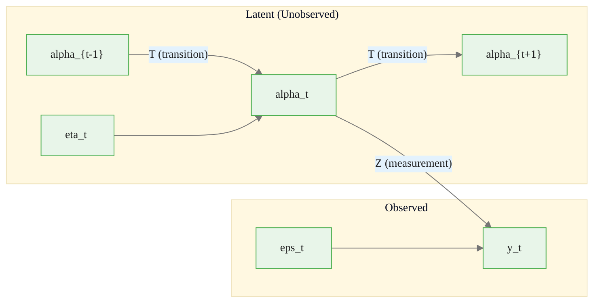
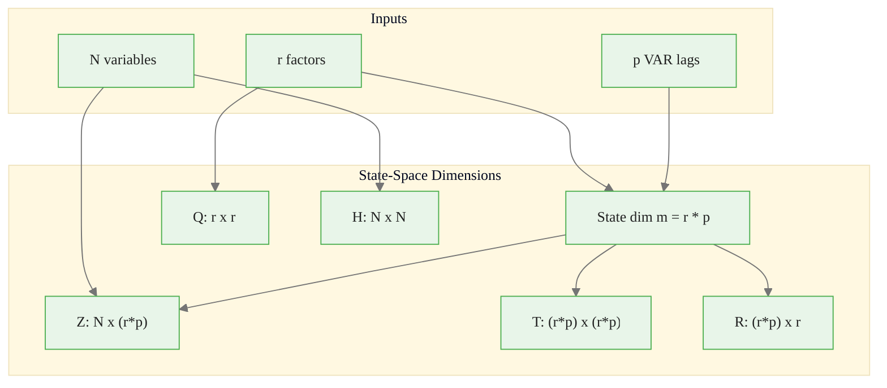
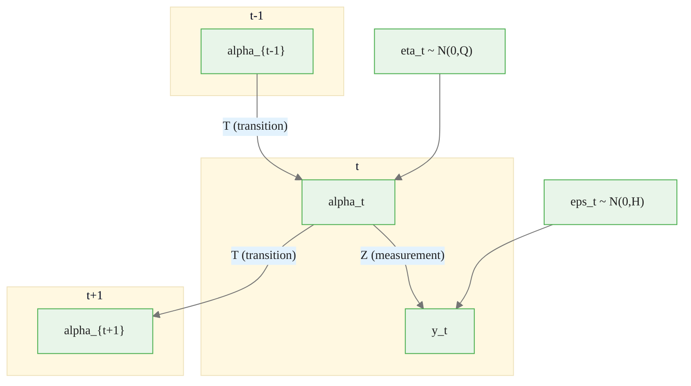
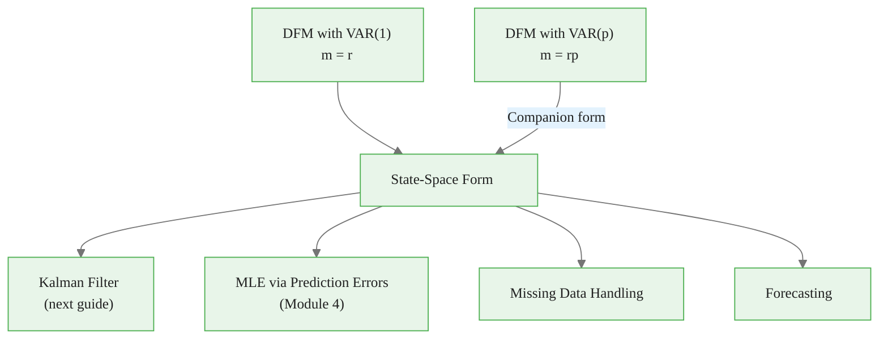

<!-- _class: lead -->

# State-Space Representation of Dynamic Factor Models

## Module 2: Dynamic Factors

**Key idea:** Express DFM as measurement + transition equations -- the gateway to Kalman filtering

<!-- Speaker notes: Welcome to State-Space Representation of Dynamic Factor Models. This deck is part of Module 02 Dynamic Factors. -->
---

# Why State-Space?

> Every DFM can be written in state-space form, which separates **what we observe** from **what we don't**.



<div class="callout-key">

Key implementation detail -- study this pattern carefully.

</div>

Enables: Kalman filter, missing data handling, likelihood computation, forecasting

<!-- Speaker notes: Use this diagram to illustrate the overall flow. Trace through each step with the audience. -->
---

<!-- _class: lead -->

# 1. Generic State-Space Model

<!-- Speaker notes: Welcome to 1. Generic State-Space Model. This deck is part of Module 02 Dynamic Factors. -->
---

# Mathematical Definition

**Measurement equation:**
$$y_t = Z \alpha_t + d + \epsilon_t, \quad \epsilon_t \sim N(0, H)$$

**Transition equation:**
$$\alpha_t = T \alpha_{t-1} + c + R\eta_t, \quad \eta_t \sim N(0, Q)$$

**Initial state:**
$$\alpha_1 \sim N(a_1, P_1)$$

<!-- Speaker notes: Explain the notation carefully. Connect each term to its intuitive meaning before moving on. -->
---

# State-Space Components

| Symbol | Dimension | Meaning |
|--------|-----------|---------|
| $y_t$ | $N \times 1$ | Observed variables |
| $\alpha_t$ | $m \times 1$ | Latent state vector |
| $Z$ | $N \times m$ | Measurement matrix (loadings) |
| $H$ | $N \times N$ | Measurement error covariance |
| $T$ | $m \times m$ | Transition matrix (dynamics) |
| $R$ | $m \times q$ | Selection matrix |
| $Q$ | $q \times q$ | Innovation covariance |

<!-- Speaker notes: Walk through the key rows of this comparison table. Highlight the most important distinctions. -->
---

# Key Assumptions

1. **Gaussian innovations:** $\epsilon_t$ and $\eta_t$ normally distributed
2. **Time invariance:** $Z, T, H, Q, R$ do not depend on $t$
3. **Independence:** $\text{Cov}(\epsilon_t, \eta_s) = 0$ for all $t, s$
4. **Serial independence:** No autocorrelation in innovations

**What the state-space enables:**

| Task | Description |
|------|-------------|
| Filtering | Estimate $\alpha_t$ given $y_1, \ldots, y_t$ |
| Smoothing | Estimate $\alpha_t$ given $y_1, \ldots, y_T$ |
| Forecasting | Predict $y_{t+h}$ and $\alpha_{t+h}$ |

<!-- Speaker notes: Walk through the key rows of this comparison table. Highlight the most important distinctions. -->
---

<!-- _class: lead -->

# 2. DFM as State-Space: VAR(1)

<!-- Speaker notes: Welcome to 2. DFM as State-Space: VAR(1). This deck is part of Module 02 Dynamic Factors. -->
---

# Mapping DFM to State-Space

**DFM:**
$$X_t = \Lambda F_t + e_t, \quad F_t = \Phi F_{t-1} + \eta_t$$

**State-space mapping:**

| DFM | State-Space | Symbol |
|-----|-------------|--------|
| Observables $X_t$ | $y_t$ | Measurements |
| Factors $F_t$ | $\alpha_t$ | State |
| Loadings $\Lambda$ | $Z$ | Measurement matrix |
| Idiosyncratic $\Sigma_e$ | $H$ | Measurement error cov |
| VAR coefficients $\Phi$ | $T$ | Transition matrix |
| Innovation cov $Q$ | $Q$ | Innovation covariance |

State dimension: $m = r$ (number of factors)

<!-- Speaker notes: Explain the notation carefully. Connect each term to its intuitive meaning before moving on. -->
---

<!-- _class: lead -->

# 3. DFM as State-Space: VAR(p) -- Companion Form

<!-- Speaker notes: Welcome to 3. DFM as State-Space: VAR(p) -- Companion Form. This deck is part of Module 02 Dynamic Factors. -->
---

# The Challenge

For VAR(p):
$$F_t = \Phi_1 F_{t-1} + \Phi_2 F_{t-2} + \cdots + \Phi_p F_{t-p} + \eta_t$$

This depends on $p$ lags, not just $\alpha_{t-1}$.

**Solution:** Augment the state vector to include lags.

$$\alpha_t = \begin{bmatrix} F_t \\ F_{t-1} \\ \vdots \\ F_{t-p+1} \end{bmatrix} \quad \text{dimension: } m = rp$$

<!-- Speaker notes: Explain the notation carefully. Connect each term to its intuitive meaning before moving on. -->
---

# Companion Form Matrices

**Transition:**

$$\underbrace{\begin{bmatrix} F_t \\ F_{t-1} \\ \vdots \\ F_{t-p+1} \end{bmatrix}}_{\alpha_t} = \underbrace{\begin{bmatrix} \Phi_1 & \Phi_2 & \cdots & \Phi_p \\ I_r & 0 & \cdots & 0 \\ \vdots & \ddots & & \vdots \\ 0 & \cdots & I_r & 0 \end{bmatrix}}_{T} \underbrace{\begin{bmatrix} F_{t-1} \\ F_{t-2} \\ \vdots \\ F_{t-p} \end{bmatrix}}_{\alpha_{t-1}} + \underbrace{\begin{bmatrix} I_r \\ 0 \\ \vdots \\ 0 \end{bmatrix}}_{R} \eta_t$$

**Measurement:**

$$X_t = \underbrace{\begin{bmatrix} \Lambda & 0 & \cdots & 0 \end{bmatrix}}_{Z} \alpha_t + e_t$$

> Only current factors (first $r$ elements) load on observables.

<!-- Speaker notes: Explain the notation carefully. Connect each term to its intuitive meaning before moving on. -->
---

# Companion Form: Dimension Summary



<div class="callout-insight">

This pattern recurs throughout the course. Understanding it deeply pays dividends later.

</div>

<!-- Speaker notes: Continue walking through the implementation. Highlight the key output and how to verify correctness. -->
---

# Example: VAR(2) with $r = 2$

State: $\alpha_t = [F_{1t}, F_{2t}, F_{1,t-1}, F_{2,t-1}]'$ (dim $m = 4$)

$$Z = \begin{bmatrix} \lambda_{11} & \lambda_{12} & 0 & 0 \\ \vdots & \vdots & \vdots & \vdots \\ \lambda_{N1} & \lambda_{N2} & 0 & 0 \end{bmatrix}$$

$$T = \begin{bmatrix} \Phi_1 & \Phi_2 \\ I_2 & 0 \end{bmatrix}, \quad R = \begin{bmatrix} I_2 \\ 0 \end{bmatrix}$$

<!-- Speaker notes: Explain the notation carefully. Connect each term to its intuitive meaning before moving on. -->
---

<!-- _class: lead -->

# 4. Code Implementation

<!-- Speaker notes: Welcome to 4. Code Implementation. This deck is part of Module 02 Dynamic Factors. -->
---

# Converting DFM to State-Space

```python
import numpy as np

def dfm_to_statespace(Lambda, Phi_list, Sigma_e, Q):
    """Convert DFM to state-space representation."""
    N, r = Lambda.shape
    p = len(Phi_list)
    m = r * p

    # Measurement matrix Z
    Z = np.zeros((N, m))
    Z[:, :r] = Lambda

    # Measurement error covariance H
    H = np.diag(Sigma_e) if Sigma_e.ndim == 1 else Sigma_e
```

<div class="callout-warning">

Watch for edge cases with this implementation in production use.

</div>

<!-- Speaker notes: Walk through the first part of this code implementation. The code continues on the next slide. -->
---

# Converting DFM to State-Space (continued)

```python

    # Companion transition matrix T
    T = np.zeros((m, m))
    T[:r, :] = np.column_stack(Phi_list)
    for i in range(p - 1):
        T[r*(i+1):r*(i+2), r*i:r*(i+1)] = np.eye(r)

    # Selection matrix R
    R = np.zeros((m, r))
    R[:r, :] = np.eye(r)

    return Z, H, T, R, Q
```

<div class="callout-info">

This approach follows established best practices in the field.

</div>

<!-- Speaker notes: Continue walking through the implementation. Highlight the key output and how to verify correctness. -->
---

# Simulating from State-Space

<div class="code-window">
<div class="code-header">
<div class="dots"><span class="dot-red"></span><span class="dot-yellow"></span><span class="dot-green"></span></div>
<span class="filename">simulate_statespace.py</span>
</div>

```python
def simulate_statespace(Z, H, T, R, Q, T_periods):
    """Simulate data from state-space model."""
    N, m = Z.shape
    r = Q.shape[0]

    from scipy.linalg import solve_discrete_lyapunov
    Sigma_alpha = solve_discrete_lyapunov(T, R @ Q @ R.T)

    alpha = np.zeros((T_periods, m))
    y = np.zeros((T_periods, N))
    alpha[0] = np.random.multivariate_normal(np.zeros(m), Sigma_alpha)
```

</div>

<!-- Speaker notes: Walk through the first part of this code implementation. The code continues on the next slide. -->
---

# Simulating from State-Space (continued)

<div class="code-window">
<div class="code-header">
<div class="dots"><span class="dot-red"></span><span class="dot-yellow"></span><span class="dot-green"></span></div>
<span class="filename">example.py</span>
</div>

```python

    for t in range(T_periods):
        epsilon = np.random.multivariate_normal(np.zeros(N), H)
        y[t] = Z @ alpha[t] + epsilon
        if t < T_periods - 1:
            eta = np.random.multivariate_normal(np.zeros(r), Q)
            alpha[t+1] = T @ alpha[t] + R @ eta

    return y, alpha
```

</div>

<!-- Speaker notes: Continue walking through the implementation. Highlight the key output and how to verify correctness. -->
---

<!-- _class: lead -->

# 5. Special Cases and Extensions

<!-- Speaker notes: Welcome to 5. Special Cases and Extensions. This deck is part of Module 02 Dynamic Factors. -->
---

# Extensions of the Basic Framework

| Extension | Modification |
|-----------|-------------|
| **Approximate factor model** | $H = \Sigma_e$ non-diagonal |
| **Exogenous variables** | $X_t = \Lambda F_t + \Gamma W_t + e_t$ |
| **Time-varying parameters** | $Z_t, T_t$ change over time |
| **Missing observations** | Remove rows from $Z, H$ at time $t$ |

**Missing data handling:**

<div class="code-window">
<div class="code-header">
<div class="dots"><span class="dot-red"></span><span class="dot-yellow"></span><span class="dot-green"></span></div>
<span class="filename">example.py</span>
</div>

```python
y_sim[50:60, 3] = np.nan     # Variable 3 missing
y_sim[100:110, [5, 7]] = np.nan  # Variables 5, 7 missing
# Kalman filter skips these in update step
```

</div>

> State-space framework handles missing data **naturally** -- no imputation needed.

<!-- Speaker notes: Walk through this code step by step. Highlight the key lines and explain the output. -->
---

<!-- _class: lead -->

# 6. Identifiability

<!-- Speaker notes: Welcome to 6. Identifiability. This deck is part of Module 02 Dynamic Factors. -->
---

# The Rotation Problem Persists

For any invertible $r \times r$ matrix $G$:

$$X_t = \Lambda F_t + e_t = (\Lambda G)(G^{-1}F_t) + e_t$$

**Standard normalizations:**

| Option | Constraint | Free Parameters |
|--------|-----------|-----------------|
| Loading restrictions | First $r \times r$ block lower triangular | $\Lambda, Q$ free |
| Factor variance | $Q = I$ | $\Lambda$ free (up to sign) |
| Mixed (Stock-Watson) | $\text{diag}(Q) = 1$ | Ordering identifies $\Lambda$ |

> Different normalizations give different numerical answers -- must be consistent.

<!-- Speaker notes: Explain the notation carefully. Connect each term to its intuitive meaning before moving on. -->
---

# Information Flow in State-Space



1. **Markov property:** $\alpha_t$ depends only on $\alpha_{t-1}$ and $\eta_t$
2. **Measurement:** $y_t$ depends only on $\alpha_t$ and $\epsilon_t$
3. **Filtering:** Estimate $\alpha_t$ from past observations
4. **Smoothing:** Improve using future observations

<!-- Speaker notes: Continue walking through the implementation. Highlight the key output and how to verify correctness. -->
---

<!-- _class: lead -->

# Common Pitfalls

<!-- Speaker notes: Welcome to Common Pitfalls. This deck is part of Module 02 Dynamic Factors. -->
---

# Pitfalls to Avoid

| Pitfall | Fix |
|---------|-----|
| Dimension mismatch in companion form | State dim is $rp$, not $r$ |
| Identity matrices in wrong position | Check companion structure carefully |
| Lagged factors loading on observables | $Z$ must have zeros after first $r$ columns |
| Wrong selection matrix $R$ | $R$ is $rp \times r$, not identity |
| Non-stationary initialization | Use Lyapunov solution or diffuse init |

Always verify: `Z.shape[1] == T.shape[0] == T.shape[1] == R.shape[0]`

<!-- Speaker notes: Emphasize these common mistakes. Ask learners if they have encountered any of these in practice. -->
---

# Practice Problems

**Conceptual:**
1. Why include lagged factors in state vector for VAR(p)?
2. Why do state-space models handle missing data naturally?
3. If you rotate factors by $G$, how do $Z$ and $T$ change?

**Implementation:**
4. Build state-space for $N = 15$, $r = 3$, VAR(3)
5. Simulate 500 periods; verify autocovariances match
6. Simulate with 20% missing values; show factor estimates converge

<!-- Speaker notes: Give learners 3-5 minutes to work through these practice problems before discussing solutions. -->
---

# Connections & Summary



| Key Result | Detail |
|------------|--------|
| VAR(1) mapping | Direct: $\alpha_t = F_t$, $Z = \Lambda$, $T = \Phi$ |
| VAR(p) companion | Augmented state $m = rp$, identity shift blocks |
| Missing data | Remove rows from $Z, H$ at missing times |

**References:**
- Durbin & Koopman (2012). *Time Series Analysis by State Space Methods*
- Harvey (1989). *Forecasting, Structural Time Series Models and the Kalman Filter*
- Hamilton (1994). *Time Series Analysis*. Ch. 13

<!-- Speaker notes: Summarize the key takeaways and highlight how this topic connects to upcoming material. -->