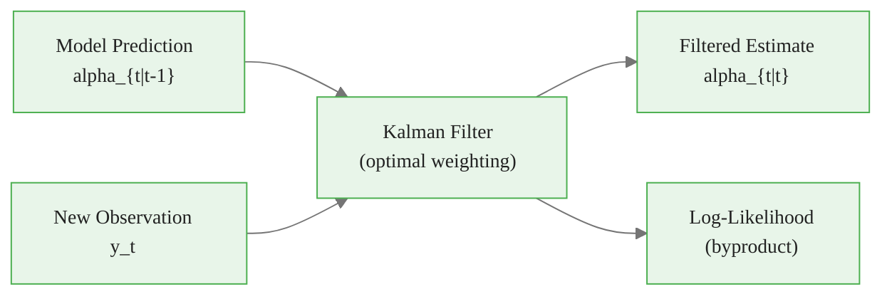
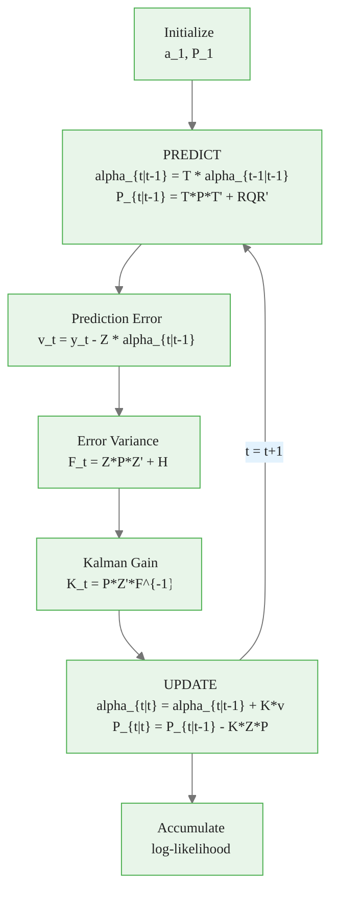
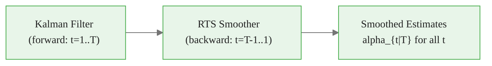
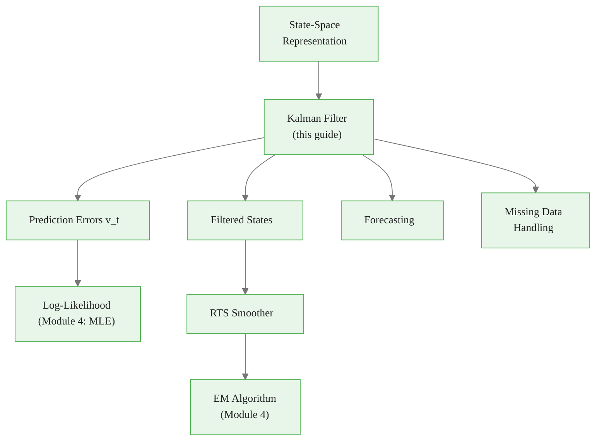

<!-- _class: lead -->

# Kalman Filter: Derivation and Intuition

## Module 2: Dynamic Factors

**Key idea:** Optimally combine model predictions with new observations using Bayesian updating

<!-- Speaker notes: Welcome to Kalman Filter: Derivation and Intuition. This deck is part of Module 02 Dynamic Factors. -->
---

# What Is the Kalman Filter?

> The Kalman filter is Bayesian updating in action. At each step, combine *where the model predicts the state should be* with *where observations suggest it is*.



<div class="callout-key">

Key implementation detail -- study this pattern carefully.

</div>

Provably **optimal** under Gaussian assumptions.

<!-- Speaker notes: Use this diagram to illustrate the overall flow. Trace through each step with the audience. -->
---

<!-- _class: lead -->

# 1. The Filtering Problem

<!-- Speaker notes: Welcome to 1. The Filtering Problem. This deck is part of Module 02 Dynamic Factors. -->
---

# Setup and Goal

**State-space model:**

$$y_t = Z\alpha_t + \epsilon_t, \quad \epsilon_t \sim N(0, H)$$
$$\alpha_t = T\alpha_{t-1} + R\eta_t, \quad \eta_t \sim N(0, Q)$$

**Goal:** Compute $\hat{\alpha}_{t|t} = E[\alpha_t | y_1, \ldots, y_t]$

<!-- Speaker notes: Explain the notation carefully. Connect each term to its intuitive meaning before moving on. -->
---

# Information Sets

| Notation | Based On | Use Case |
|----------|----------|----------|
| $\hat{\alpha}_{t\|t-1}$ | $y_1, \ldots, y_{t-1}$ | Prediction (before seeing $y_t$) |
| $\hat{\alpha}_{t\|t}$ | $y_1, \ldots, y_t$ | Filtering (real-time) |
| $\hat{\alpha}_{t\|T}$ | $y_1, \ldots, y_T$ | Smoothing (retrospective) |

> 🔑 Key relationship: $P_{t|T} \leq P_{t|t} \leq P_{t|t-1}$ -- more data reduces uncertainty.

<!-- Speaker notes: Walk through the key rows of this comparison table. Highlight the most important distinctions. -->
---

<!-- _class: lead -->

# 2. Kalman Filter Recursions

<!-- Speaker notes: Welcome to 2. Kalman Filter Recursions. This deck is part of Module 02 Dynamic Factors. -->
---

# The Algorithm: Prediction Step

**Initialize:** $\hat{\alpha}_{1|0} = a_1, \quad P_{1|0} = P_1$

**For each $t = 1, 2, \ldots, T$:**

**Prediction (propagate dynamics):**

$$\hat{\alpha}_{t|t-1} = T\hat{\alpha}_{t-1|t-1}$$
$$P_{t|t-1} = TP_{t-1|t-1}T' + RQR'$$

> "Where do I expect the state to be based on its dynamics?"
> Uncertainty **increases** (add $RQR'$) due to state innovations.

<!-- Speaker notes: Explain the notation carefully. Connect each term to its intuitive meaning before moving on. -->
---

# The Algorithm: Update Step

**Prediction error:**
$$v_t = y_t - Z\hat{\alpha}_{t|t-1}$$

**Prediction error variance:**
$$F_t = ZP_{t|t-1}Z' + H$$

**Kalman gain:**
$$K_t = P_{t|t-1}Z'F_t^{-1}$$

**State update:**
$$\hat{\alpha}_{t|t} = \hat{\alpha}_{t|t-1} + K_tv_t$$

**Variance update:**
$$P_{t|t} = P_{t|t-1} - K_tZP_{t|t-1}$$

<!-- Speaker notes: Explain the notation carefully. Connect each term to its intuitive meaning before moving on. -->
---

# Kalman Filter Flow



<div class="callout-insight">

This pattern recurs throughout the course. Understanding it deeply pays dividends later.

</div>

<!-- Speaker notes: Use this diagram to illustrate the overall flow. Trace through each step with the audience. -->
---

# Intuition for Each Step

| Step | Question | Answer |
|------|----------|--------|
| Prediction | Where should state be? | Propagate via dynamics |
| Prediction error $v_t$ | How far off? | Observation minus prediction |
| Kalman gain $K_t$ | Trust observation or prediction? | Weighted by uncertainties |
| State update | What's the best estimate? | Bayesian posterior mean |
| Variance update | How uncertain now? | Always decreases |

<!-- Speaker notes: Walk through the key rows of this comparison table. Highlight the most important distinctions. -->
---

# The Kalman Gain: Key Intuition

$$K_t = P_{t|t-1}Z'F_t^{-1}$$

<div class="columns">
<div>

**$K_t \approx 0$ (trust prediction):**
- Large $H$ (noisy observations)
- Small $P_{t|t-1}$ (confident prediction)

</div>
<div>

**$K_t$ large (trust observation):**
- Small $H$ (precise observations)
- Large $P_{t|t-1}$ (uncertain prediction)

</div>
</div>

> The Kalman gain is the **optimal weight** between prior belief and new evidence.

<!-- Speaker notes: Explain the notation carefully. Connect each term to its intuitive meaning before moving on. -->
---

<!-- _class: lead -->

# 3. Derivation from First Principles

<!-- Speaker notes: Welcome to 3. Derivation from First Principles. This deck is part of Module 02 Dynamic Factors. -->
---

# Prediction Step (Straightforward)

From transition: $\alpha_t = T\alpha_{t-1} + R\eta_t$

$$E[\alpha_t | y_1, \ldots, y_{t-1}] = T\hat{\alpha}_{t-1|t-1}$$

since $E[\eta_t] = 0$ and $\eta_t$ is independent of past.

$$P_{t|t-1} = T P_{t-1|t-1} T' + RQR'$$

by independence of $\eta_t$ from past estimation errors.

<!-- Speaker notes: Explain the notation carefully. Connect each term to its intuitive meaning before moving on. -->
---

# Update Step (The Heart)

**Joint distribution** conditional on $y_1, \ldots, y_{t-1}$:

$$\begin{bmatrix} \alpha_t \\ y_t \end{bmatrix} \sim N\left(\begin{bmatrix} \hat{\alpha}_{t|t-1} \\ Z\hat{\alpha}_{t|t-1} \end{bmatrix}, \begin{bmatrix} P_{t|t-1} & P_{t|t-1}Z' \\ ZP_{t|t-1} & F_t \end{bmatrix}\right)$$

**By multivariate normal conditioning:**

$$\hat{\alpha}_{t|t} = \hat{\alpha}_{t|t-1} + P_{t|t-1}Z'F_t^{-1}(y_t - Z\hat{\alpha}_{t|t-1})$$
$$P_{t|t} = P_{t|t-1} - P_{t|t-1}Z'F_t^{-1}ZP_{t|t-1}$$

> This is just **Bayesian updating** for Gaussian distributions!

<!-- Speaker notes: Explain the notation carefully. Connect each term to its intuitive meaning before moving on. -->
---

<!-- _class: lead -->

# 4. Log-Likelihood Computation

<!-- Speaker notes: Welcome to 4. Log-Likelihood Computation. This deck is part of Module 02 Dynamic Factors. -->
---

# Prediction Error Decomposition

The Kalman filter produces the likelihood **as a byproduct!**

Prediction errors are the **innovations** of the data:

$$v_t | y_1, \ldots, y_{t-1} \sim N(0, F_t)$$

**Log-likelihood:**

$$\log L(\theta) = -\frac{NT}{2}\log(2\pi) - \frac{1}{2}\sum_{t=1}^T\left[\log|F_t| + v_t'F_t^{-1}v_t\right]$$

> Accumulate $v_t$ and $F_t$ during filtering -- no extra computation needed.

<!-- Speaker notes: Explain the notation carefully. Connect each term to its intuitive meaning before moving on. -->
---

<!-- _class: lead -->

# 5. Code Implementation

<!-- Speaker notes: Welcome to 5. Code Implementation. This deck is part of Module 02 Dynamic Factors. -->
---

# Kalman Filter (Complete)

```python
import numpy as np
from numpy.linalg import inv, slogdet

def kalman_filter(y, Z, H, T, R, Q, a1, P1):
    """Kalman filter for state-space model."""
    T_periods, N = y.shape
    m = Z.shape[1]
```

<div class="callout-warning">

Watch for edge cases with this implementation in production use.

</div>

<!-- Speaker notes: Walk through the first part of this code implementation. The code continues on the next slide. -->
---

# Kalman Filter (Complete) (continued)

```python

    alpha_pred = np.zeros((T_periods, m))
    alpha_filt = np.zeros((T_periods, m))
    P_pred = np.zeros((T_periods, m, m))
    P_filt = np.zeros((T_periods, m, m))
    v = np.zeros((T_periods, N))
    loglik = 0.0

    a_f, P_f = a1.copy(), P1.copy()
```

<div class="callout-info">

This approach follows established best practices in the field.

</div>

<!-- Speaker notes: Continue walking through the implementation. Highlight the key output and how to verify correctness. -->
---

# Kalman Filter (Loop)

```python
for t in range(T_periods):
        # PREDICT
        a_p = T @ a_f
        P_p = T @ P_f @ T.T + R @ Q @ R.T
        alpha_pred[t], P_pred[t] = a_p, P_p

        if np.any(np.isnan(y[t])):
            a_f, P_f = a_p, P_p  # Skip update
        else:
```

<!-- Speaker notes: Walk through the first part of this code implementation. The code continues on the next slide. -->
---

# Kalman Filter (Loop) (continued)

```python
            # UPDATE
            v_t = y[t] - Z @ a_p
            F_t = Z @ P_p @ Z.T + H
            K_t = P_p @ Z.T @ inv(F_t)
            a_f = a_p + K_t @ v_t
            P_f = P_p - K_t @ Z @ P_p
            v[t] = v_t
            sign, logdet = slogdet(F_t)
            loglik += -0.5 * (N*np.log(2*np.pi) + logdet
                              + v_t @ inv(F_t) @ v_t)

        alpha_filt[t], P_filt[t] = a_f, P_f

    return {'alpha_filtered': alpha_filt, 'P_filtered': P_filt,
            'alpha_predicted': alpha_pred, 'P_predicted': P_pred,
            'v': v, 'loglik': loglik}
```

<!-- Speaker notes: Continue walking through the implementation. Highlight the key output and how to verify correctness. -->
---

<!-- _class: lead -->

# 6. Kalman Smoother

<!-- Speaker notes: Welcome to 6. Kalman Smoother. This deck is part of Module 02 Dynamic Factors. -->
---

# Why Smoothing?

- **Filtered:** $\hat{\alpha}_{t|t}$ uses data up to time $t$
- **Smoothed:** $\hat{\alpha}_{t|T}$ uses **all** data $y_1, \ldots, y_T$

> Smoothing improves estimates, especially for middle time periods.

$$\text{Var}(\alpha_t | y_1, \ldots, y_T) \leq \text{Var}(\alpha_t | y_1, \ldots, y_t)$$

<!-- Speaker notes: Explain the notation carefully. Connect each term to its intuitive meaning before moving on. -->
---

# RTS Smoother Recursions

After running Kalman filter forward, run smoother **backward** ($t = T-1, \ldots, 1$):

$$J_t = P_{t|t} T' P_{t+1|t}^{-1}$$
$$\hat{\alpha}_{t|T} = \hat{\alpha}_{t|t} + J_t(\hat{\alpha}_{t+1|T} - \hat{\alpha}_{t+1|t})$$
$$P_{t|T} = P_{t|t} + J_t(P_{t+1|T} - P_{t+1|t})J_t'$$

> $J_t$ propagates corrections from future data backward to time $t$.



<!-- Speaker notes: Use this diagram to illustrate the overall flow. Trace through each step with the audience. -->
---

# Code: RTS Smoother

```python
def kalman_smoother(result_filter, T_mat):
    """Rauch-Tung-Striebel smoother."""
    T_periods, m = result_filter['alpha_filtered'].shape
    alpha_sm = np.zeros((T_periods, m))
    P_sm = np.zeros((T_periods, m, m))

    alpha_sm[-1] = result_filter['alpha_filtered'][-1]
    P_sm[-1] = result_filter['P_filtered'][-1]
```

<!-- Speaker notes: Walk through the first part of this code implementation. The code continues on the next slide. -->
---

# Code: RTS Smoother (continued)

<div class="code-window">
<div class="code-header">
<div class="dots"><span class="dot-red"></span><span class="dot-yellow"></span><span class="dot-green"></span></div>
<span class="filename">example.py</span>
</div>

```python

    for t in range(T_periods-2, -1, -1):
        P_pred = result_filter['P_predicted'][t+1]
        J = result_filter['P_filtered'][t] @ T_mat.T @ inv(P_pred)
        alpha_sm[t] = (result_filter['alpha_filtered'][t]
                       + J @ (alpha_sm[t+1] - result_filter['alpha_predicted'][t+1]))
        P_sm[t] = (result_filter['P_filtered'][t]
                   + J @ (P_sm[t+1] - P_pred) @ J.T)

    return alpha_sm, P_sm
```

</div>

<!-- Speaker notes: Continue walking through the implementation. Highlight the key output and how to verify correctness. -->
---

<!-- _class: lead -->

# 7. Advanced Topics

<!-- Speaker notes: Welcome to 7. Advanced Topics. This deck is part of Module 02 Dynamic Factors. -->
---

# Steady-State Kalman Filter

If stationary with no missing data, $P_{t|t-1}$ converges to $\bar{P}$:

$$\bar{P} = T\bar{P}T' + RQR' - T\bar{P}Z'(Z\bar{P}Z' + H)^{-1}Z\bar{P}T'$$

| Benefit | When to Use |
|---------|-------------|
| Constant Kalman gain $\bar{K}$ | Long time series ($T > 100$) |
| No $P_t$ updates needed | No missing data |
| Computationally faster | Time-invariant system |

<!-- Speaker notes: Explain the notation carefully. Connect each term to its intuitive meaning before moving on. -->
---

# Missing Data Handling

State-space handles missing data **naturally**:

1. At time $t$, identify missing indices in $y_t$
2. Remove corresponding rows from $Z$, $H$
3. Run update step with reduced observation
4. Prediction step unchanged

<div class="code-window">
<div class="code-header">
<div class="dots"><span class="dot-red"></span><span class="dot-yellow"></span><span class="dot-green"></span></div>
<span class="filename">example.py</span>
</div>

```python
y_missing = y.copy()
y_missing[50:60, 3] = np.nan
y_missing[100:110, [5, 7]] = np.nan
# Kalman filter handles automatically
result = kalman_filter(y_missing, Z, H, T, R, Q, a1, P1)
```

</div>

<!-- Speaker notes: Walk through this code step by step. Highlight the key lines and explain the output. -->
---

# Forecasting from Kalman Filter

**h-step ahead:**

$$\hat{\alpha}_{T+h|T} = T^h \hat{\alpha}_{T|T}$$
$$\hat{y}_{T+h|T} = Z\hat{\alpha}_{T+h|T}$$

**Forecast variance:**

$$P_{T+h|T} = T^hP_{T|T}(T^h)' + \sum_{j=0}^{h-1}T^jRQR'(T^j)'$$

<div class="code-window">
<div class="code-header">
<div class="dots"><span class="dot-red"></span><span class="dot-yellow"></span><span class="dot-green"></span></div>
<span class="filename">forecast.py</span>
</div>

```python
def forecast(result, Z, T, R, Q, horizons):
    alpha_h = result['alpha_filtered'][-1]
    P_h = result['P_filtered'][-1]
    forecasts = []
    for h in range(horizons):
        alpha_h = T @ alpha_h
        P_h = T @ P_h @ T.T + R @ Q @ R.T
        forecasts.append(Z @ alpha_h)
    return np.array(forecasts)
```

</div>

<!-- Speaker notes: Walk through this code step by step. Highlight the key lines and explain the output. -->
---

<!-- _class: lead -->

# Common Pitfalls

<!-- Speaker notes: Welcome to Common Pitfalls. This deck is part of Module 02 Dynamic Factors. -->
---

# Pitfalls to Avoid

| Pitfall | Problem | Solution |
|---------|---------|----------|
| $P_{t\|t}$ not symmetric/PD | Rounding errors | Use Joseph form update |
| Bad initialization | $P_1 = 0$ or $P_1 = I$ | Lyapunov solution or diffuse ($\kappa = 10^7$) |
| Singular $F_t$ | Perfect collinearity | Use pseudo-inverse + regularization |
| Using filtered for EM | EM E-step needs smoothed | Always smooth for parameter estimation |
| Deleting missing data | Loses information | Let Kalman filter handle NaNs |

<!-- Speaker notes: Emphasize these common mistakes. Ask learners if they have encountered any of these in practice. -->
---

# Joseph Form for Numerical Stability

Standard update (can lose symmetry):
$$P_{t|t} = P_{t|t-1} - K_t Z P_{t|t-1}$$

**Joseph form** (always symmetric):
$$P_{t|t} = (I - K_tZ)P_{t|t-1}(I - K_tZ)' + K_tHK_t'$$

> Use Joseph form in production code to avoid numerical issues.

<!-- Speaker notes: Explain the notation carefully. Connect each term to its intuitive meaning before moving on. -->
---

# Practice Problems

**Conceptual:**
1. Why does $P_{t|t} < P_{t|t-1}$ always hold?
2. When would $K_t = 0$? What does it mean?
3. For which time periods does smoothing help most?

**Mathematical:**
4. Derive the Joseph form from the standard form
5. For scalar case ($m = 1$), solve for steady-state $\bar{P}$

<!-- Speaker notes: Give learners 3-5 minutes to work through these practice problems before discussing solutions. -->
---

# Connections & Summary



| Algorithm | Direction | Uses |
|-----------|-----------|------|
| Kalman filter | Forward | Real-time estimation, likelihood |
| RTS smoother | Backward | Best estimates, EM algorithm |
| Forecasting | Forward from $T$ | Prediction with uncertainty |

**References:**
- Kalman (1960). "A New Approach to Linear Filtering and Prediction Problems"
- Durbin & Koopman (2012). *Time Series Analysis by State Space Methods*
- Harvey (1989). *Forecasting, Structural Time Series Models and the Kalman Filter*

<!-- Speaker notes: Summarize the key takeaways and highlight how this topic connects to upcoming material. -->