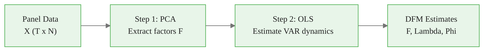
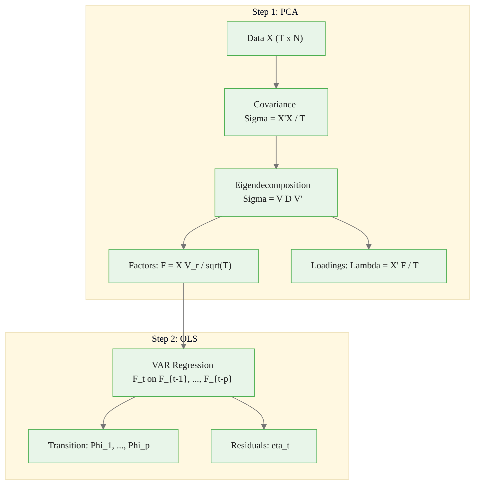
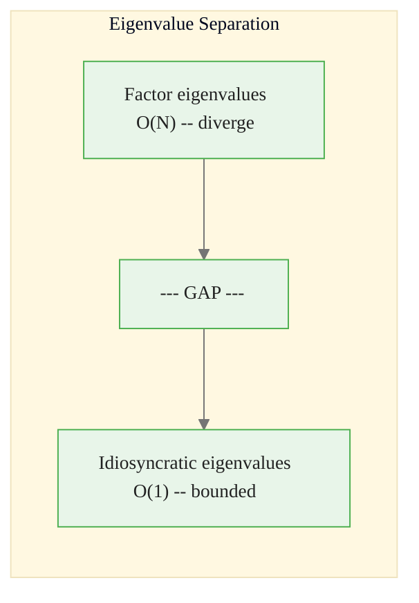
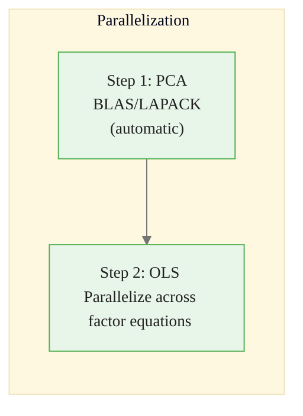
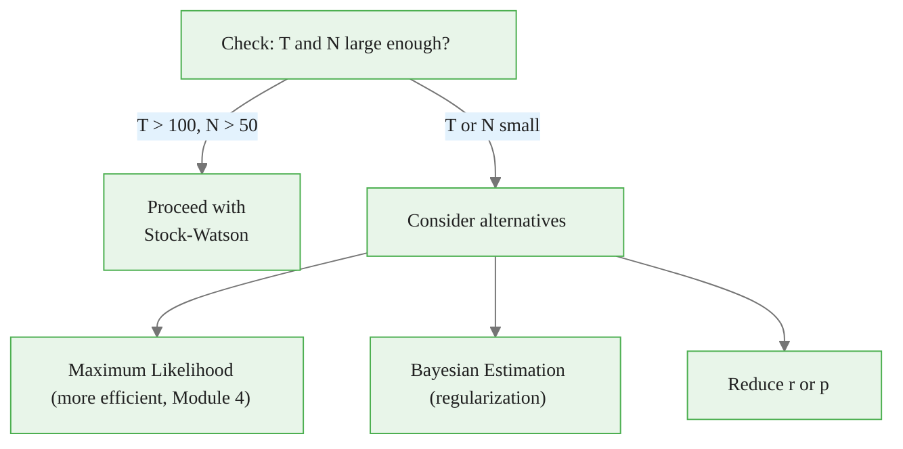
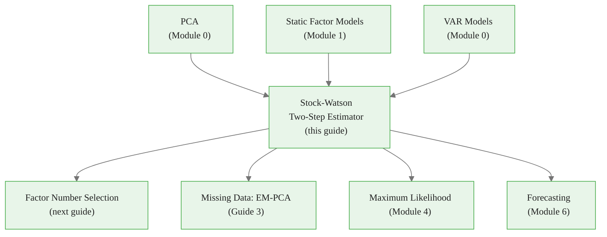

<!-- _class: lead -->

# Stock-Watson Two-Step Estimator

## Module 3: Estimation via PCA

**Key idea:** Extract factors via PCA, then estimate dynamics via OLS -- simple, fast, and consistent

<!-- Speaker notes: Welcome to Stock-Watson Two-Step Estimator. This deck is part of Module 03 Estimation Pca. -->
---

# Why Two Steps?

> Joint estimation of factors and dynamics requires iterative optimization. Two-step estimation decomposes the problem into two simple, closed-form solutions.



<div class="callout-key">

Key implementation detail -- study this pattern carefully.

</div>

| Method | Computation | Starting Values | Consistency |
|--------|:-----------:|:---------------:|:-----------:|
| Two-step PCA | Eigendecomp + OLS | Not needed | Yes (large N, T) |
| Joint MLE | Iterative optimization | Required | Yes |
| Kalman filter | State-space recursions | Required | Yes |

<!-- Speaker notes: Use this diagram to illustrate the overall flow. Trace through each step with the audience. -->
---

<!-- _class: lead -->

# 1. The Algorithm

<!-- Speaker notes: Welcome to 1. The Algorithm. This deck is part of Module 03 Estimation Pca. -->
---

# Step 1: Extract Factors via PCA

**Model:** $X_{it} = \lambda_i' F_t + e_{it}$

**Solve eigenproblem:**
$$\hat{\Sigma}_X = \frac{1}{T} X'X = V D V'$$

**Factor estimates:**
$$\hat{F} = X V_r / \sqrt{T}$$

**Loading estimates:**
$$\hat{\Lambda} = X' \hat{F} / T$$

where $V_r = [v_1, \ldots, v_r]$ are eigenvectors for the $r$ largest eigenvalues.

> **Normalization:** $\hat{F}'\hat{F}/T = I_r$ -- factors have unit variance and are uncorrelated.

<!-- Speaker notes: Explain the notation carefully. Connect each term to its intuitive meaning before moving on. -->
---

# Step 2: Estimate Factor Dynamics

Given factor estimates $\hat{F}_t$ from Step 1, run OLS:

$$\hat{F}_t = \hat{\Phi}_1 \hat{F}_{t-1} + \cdots + \hat{\Phi}_p \hat{F}_{t-p} + \hat{\eta}_t$$

for $t = p+1, \ldots, T$.



<div class="callout-insight">

This pattern recurs throughout the course. Understanding it deeply pays dividends later.

</div>

<!-- Speaker notes: Use this diagram to illustrate the overall flow. Trace through each step with the audience. -->
---

# Geometric Interpretation

The $N$-dimensional data cloud lies approximately in an $r$-dimensional subspace.

PCA finds this subspace by:
1. Computing the sample covariance ellipsoid
2. Finding its principal axes (eigenvectors)
3. Projecting data onto the top $r$ axes

The projections are the factor estimates $\hat{F}_t$.

> **Analogy:** A 3D data cloud shaped like a pancake is effectively 2D. PCA finds the plane of the pancake.

<!-- Speaker notes: Cover the key points of Geometric Interpretation. Check for understanding before proceeding. -->
---

<!-- _class: lead -->

# 2. Asymptotic Theory

<!-- Speaker notes: Welcome to 2. Asymptotic Theory. This deck is part of Module 03 Estimation Pca. -->
---

# Consistency Result

Under regularity conditions, as $N, T \to \infty$ with $\sqrt{T}/N \to 0$:

$$\|\hat{F}_t - H F_t\| = O_p\left(\min\left(N^{-1/2}, T^{-1/2}\right)\right)$$

| Property | Detail |
|----------|--------|
| **Consistency** | Estimation error vanishes asymptotically |
| **Rotation** | Factors estimated up to rotation $H$ |
| **Rate** | $\min(\sqrt{N}, \sqrt{T})$ -- faster than single time series |
| **Key requirement** | Both $N$ and $T$ large |

<!-- Speaker notes: Explain the notation carefully. Connect each term to its intuitive meaning before moving on. -->
---

# Why PCA Estimates Factors

**Population covariance:**
$$\Sigma_X = \Lambda \Sigma_F \Lambda' + \Sigma_e$$



<div class="callout-warning">

Watch for edge cases with this implementation in production use.

</div>

**Signal-to-noise ratio:**
$$\text{SNR} \sim \frac{N \cdot \text{factor variance}}{\text{idiosyncratic variance}} \to \infty$$

> More variables = better factor estimation. This is why PCA works for factor models with large $N$.

<!-- Speaker notes: Use this diagram to illustrate the overall flow. Trace through each step with the audience. -->
---

# Variance Decomposition

**Total variance explained by $r$ factors:**
$$R^2 = \frac{\sum_{j=1}^r d_j}{\sum_{j=1}^N d_j}$$

**Per-variable $R^2$:**
$$R_i^2 = \frac{\sum_{j=1}^r \hat{\lambda}_{ij}^2}{\text{Var}(X_i)}$$

For standardized data, $\text{Var}(X_i) = 1$, so $R_i^2 = \|\hat{\lambda}_i\|^2$.

<!-- Speaker notes: Explain the notation carefully. Connect each term to its intuitive meaning before moving on. -->
---

<!-- _class: lead -->

# 3. Code Implementation

<!-- Speaker notes: Welcome to 3. Code Implementation. This deck is part of Module 03 Estimation Pca. -->
---

# StockWatsonEstimator Class

```python
import numpy as np
from numpy.linalg import eigh, lstsq

class StockWatsonEstimator:
    def __init__(self, n_factors, factor_lags=1, standardize=True):
        self.r = n_factors
        self.p = factor_lags
        self.standardize = standardize

    def fit(self, X):
        X = np.asarray(X)
        T, N = X.shape
```

<div class="callout-info">

This approach follows established best practices in the field.

</div>

<!-- Speaker notes: Walk through the first part of this code implementation. The code continues on the next slide. -->
---

# StockWatsonEstimator Class (continued)

```python
        # Step 0: Standardize
        if self.standardize:
            self.mean_ = np.mean(X, axis=0)
            self.std_ = np.std(X, axis=0, ddof=1)
            self.std_[self.std_ < 1e-10] = 1.0
            X_std = (X - self.mean_) / self.std_
        else:
            X_std = X.copy()
        # Step 1: PCA
        self._extract_factors_pca(X_std)
        # Step 2: OLS VAR
        self._estimate_factor_var()
        return self
```

<!-- Speaker notes: Continue walking through the implementation. Highlight the key output and how to verify correctness. -->
---

# PCA Factor Extraction

```python
def _extract_factors_pca(self, X):
    T, N = X.shape
    Sigma_X = X.T @ X / T               # N x N covariance
    eigenvalues, eigenvectors = eigh(Sigma_X)

    idx = np.argsort(eigenvalues)[::-1]  # Descending order
    eigenvalues = eigenvalues[idx]
    eigenvectors = eigenvectors[:, idx]
    self.eigenvalues = eigenvalues

    V_r = eigenvectors[:, :self.r]       # Top r eigenvectors
    self.F_hat = X @ V_r / np.sqrt(T)    # T x r factors
    self.Lambda_hat = X.T @ self.F_hat / T  # N x r loadings
```

> **Verify normalization:** `np.allclose(F_hat.T @ F_hat / T, np.eye(r))`

<!-- Speaker notes: Walk through this code step by step. Highlight the key lines and explain the output. -->
---

# OLS VAR Estimation

```python
def _estimate_factor_var(self):
    T, r = self.F_hat.shape
    p = self.p

    Y = self.F_hat[p:, :]  # (T-p) x r
    X_lags = np.column_stack([
        self.F_hat[p-lag-1:-lag-1, :] for lag in range(p)
    ])  # (T-p) x (r*p)
    X_reg = np.column_stack([np.ones(T - p), X_lags])

    Phi_stacked, _, _, _ = lstsq(X_reg, Y, rcond=None)
    self.intercept_ = Phi_stacked[0, :]
    self.Phi_hat = Phi_stacked[1:, :].T.reshape(r, r, p)
    self.factor_residuals_ = Y - X_reg @ Phi_stacked
    self.residual_cov_ = np.cov(self.factor_residuals_.T)
```

<!-- Speaker notes: Walk through this code step by step. Highlight the key lines and explain the output. -->
---

# Forecasting and Transform

```python
def forecast(self, h=1):
    """Forecast factors h periods ahead."""
    r, p = self.F_hat.shape[1], self.p
    F_forecast = np.zeros((h, r))
    F_history = self.F_hat[-p:, :].copy()

    for t in range(h):
        F_t = self.intercept_.copy()
        for lag in range(p):
            if t - lag < 0:
```

<!-- Speaker notes: Walk through the first part of this code implementation. The code continues on the next slide. -->
---

# Forecasting and Transform (continued)

<div class="code-window">
<div class="code-header">
<div class="dots"><span class="dot-red"></span><span class="dot-yellow"></span><span class="dot-green"></span></div>
<span class="filename">transform.py</span>
</div>

```python
                F_t += self.Phi_hat[:, :, lag] @ F_history[p+t-lag-1, :]
            else:
                F_t += self.Phi_hat[:, :, lag] @ F_forecast[t-lag-1, :]
        F_forecast[t, :] = F_t
    return F_forecast

def transform(self, X):
    """Project new data onto factor space."""
    X_std = (X - self.mean_) / self.std_
    return X_std @ np.linalg.pinv(self.Lambda_hat.T)
```

</div>

<!-- Speaker notes: Continue walking through the implementation. Highlight the key output and how to verify correctness. -->
---

# Demonstration

<div class="code-window">
<div class="code-header">
<div class="dots"><span class="dot-red"></span><span class="dot-yellow"></span><span class="dot-green"></span></div>
<span class="filename">example.py</span>
</div>

```python
model = StockWatsonEstimator(n_factors=3, factor_lags=2, standardize=True)
model.fit(X)

# Variance explained
var_ratios = model.explained_variance_ratio()
# Factor 1: 45.3%, Factor 2: 18.7%, Factor 3: 12.4%

# Procrustes alignment to true factors
from scipy.linalg import orthogonal_procrustes
H, _ = orthogonal_procrustes(model.F_hat, F_true)
F_aligned = model.F_hat @ H
# Correlations: 0.987, 0.971, 0.963
```

</div>

<!-- Speaker notes: Walk through this code step by step. Highlight the key lines and explain the output. -->
---

<!-- _class: lead -->

# 4. Computational Considerations

<!-- Speaker notes: Welcome to 4. Computational Considerations. This deck is part of Module 03 Estimation Pca. -->
---

# Speed and Memory

For $N = 127$, $T = 500$, $r = 5$:

| Method | Time | Speedup |
|--------|------|:-------:|
| PCA (numpy) | 0.05s | 1x |
| PCA (sklearn) | 0.08s | 0.6x |
| EM-MLE | 30s | 600x slower |
| Kalman filter | 12s | 240x slower |

**Memory:**
- PCA: $O(N^2)$ for covariance matrix
- For $N > 10{,}000$: Use randomized PCA



<!-- Speaker notes: Use this diagram to illustrate the overall flow. Trace through each step with the audience. -->
---

# Using with scikit-learn

<div class="code-window">
<div class="code-header">
<div class="dots"><span class="dot-red"></span><span class="dot-yellow"></span><span class="dot-green"></span></div>
<span class="filename">example.py</span>
</div>

```python
from sklearn.decomposition import PCA
from sklearn.preprocessing import StandardScaler

# Step 1: sklearn PCA
scaler = StandardScaler()
X_scaled = scaler.fit_transform(X)
pca = PCA(n_components=3)
F_hat_sklearn = pca.fit_transform(X_scaled)

# Step 2: Manual VAR estimation on F_hat_sklearn
# (Same OLS procedure as our implementation)
```

</div>

> sklearn PCA gives equivalent results -- choice is a matter of ecosystem preference.

<!-- Speaker notes: Walk through this code step by step. Highlight the key lines and explain the output. -->
---

<!-- _class: lead -->

# 5. Common Pitfalls

<!-- Speaker notes: Welcome to 5. Common Pitfalls. This deck is part of Module 03 Estimation Pca. -->
---

# Pitfalls to Avoid

| Pitfall | Problem | Solution |
|---------|---------|----------|
| Not standardizing | Variables with large variance dominate PCA | Always standardize to unit variance |
| Wrong normalization | $F = XV_r$ instead of $F = XV_r/\sqrt{T}$ | Verify $F'F/T = I_r$ |
| Ignoring rotation | Comparing factors across software | Use Procrustes alignment |
| Covariance vs correlation | `np.cov(X.T)` vs `np.corrcoef(X.T)` | Use correlation PCA (standardize first) |
| Too many factors | Captures idiosyncratic noise | Use Bai-Ng IC (next guide) |
| Small sample | $T = 50$ leads to overfitting | Need $T > 100$, $N > 50$ |

<!-- Speaker notes: Emphasize these common mistakes. Ask learners if they have encountered any of these in practice. -->
---

# Sample Size Requirements

**Rule of thumb:**
- Minimum: $T > 10 \times r \times p$
- Comfortable: $T > 100$, $N > 50$



<!-- Speaker notes: Use this diagram to illustrate the overall flow. Trace through each step with the audience. -->
---

# Practice Problems

**Conceptual:**
1. Why not estimate factors and dynamics jointly? What computational advantage does two-step provide?
2. Show that $\tilde{F}_t = H^{-1}F_t$ and $\tilde{\Lambda} = \Lambda H$ give the same $X_t$
3. Explain why factor estimates improve as $N$ increases, even with fixed $T$

**Mathematical:**
4. Derive $\hat{\Lambda} = X'\hat{F}/T = \sqrt{T} V_r D_r$
5. Write factor VAR(2) in companion form as VAR(1)
6. Derive 1-step-ahead forecast variance for VAR(p)

<!-- Speaker notes: Give learners 3-5 minutes to work through these practice problems before discussing solutions. -->
---

# Connections & Summary



| Key Result | Detail |
|------------|--------|
| Two-step algorithm | PCA + OLS VAR |
| Consistency | $\min(\sqrt{N}, \sqrt{T})$ rate |
| Computational cost | 100-600x faster than ML |
| Limitation | Rotation indeterminacy remains |

**References:**
- Stock & Watson (2002). "Forecasting Using Principal Components." *JASA*
- Bai (2003). "Inferential Theory for Factor Models." *Econometrica*

<!-- Speaker notes: Summarize the key takeaways and highlight how this topic connects to upcoming material. -->