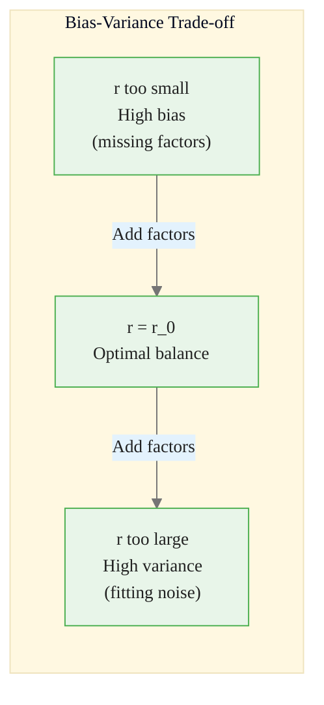
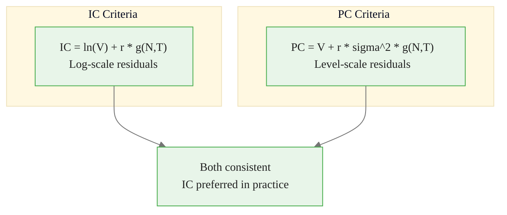
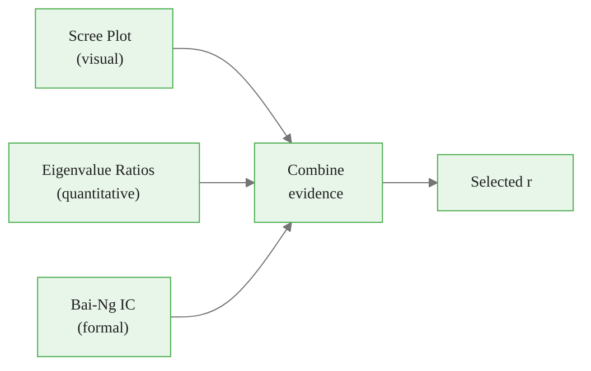
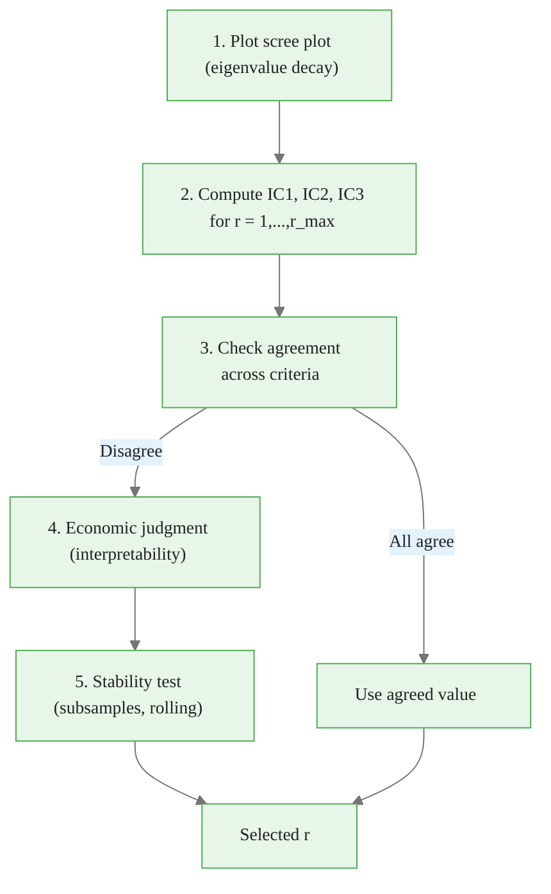
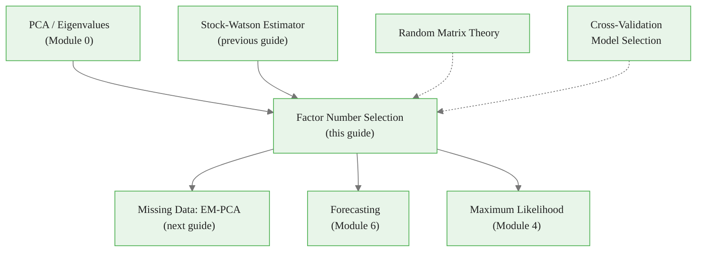

<!-- _class: lead -->

# Factor Number Selection

## Module 3: Estimation via PCA

**Key idea:** Use information criteria calibrated to large-N-large-T asymptotics to choose the number of factors

<!-- Speaker notes: Welcome to Factor Number Selection. This deck is part of Module 03 Estimation Pca. -->
---

# The Selection Problem

> Too few factors underfit common variation; too many overfit idiosyncratic noise. Information criteria formalize the fit-complexity trade-off.



<div class="callout-key">

Key implementation detail -- study this pattern carefully.

</div>

| Choice | Consequence |
|--------|------------|
| $r < r_0$ | Missing common variation, biased estimates |
| $r = r_0$ | Captures all common variation, minimal noise |
| $r > r_0$ | Overfits idiosyncratic correlations |

<!-- Speaker notes: Use this diagram to illustrate the overall flow. Trace through each step with the audience. -->
---

<!-- _class: lead -->

# 1. Bai-Ng Information Criteria

<!-- Speaker notes: Welcome to 1. Bai-Ng Information Criteria. This deck is part of Module 03 Estimation Pca. -->
---

# The IC Framework

**Minimize:**
$$IC(r) = \ln[V(r)] + r \cdot g(N, T)$$

where:
- $V(r) = \frac{1}{NT}\sum_{i,t} \hat{e}_{it}^2(r)$ -- residual variance with $r$ factors
- $g(N,T)$ -- penalty for model complexity

**Equivalently (standardized data):**
$$V(r) = 1 - \frac{1}{N}\sum_{j=1}^r d_j$$

where $d_j$ are eigenvalues of sample covariance.

<!-- Speaker notes: Explain the notation carefully. Connect each term to its intuitive meaning before moving on. -->
---

# Three Penalty Functions

**IC1 (Balanced):**
$$IC_1(r) = \ln[V(r)] + r \left(\frac{N+T}{NT}\right) \ln\left(\frac{NT}{N+T}\right)$$

**IC2 (Aggressive -- selects more factors):**
$$IC_2(r) = \ln[V(r)] + r \left(\frac{N+T}{NT}\right) \ln(C_{NT}^2)$$

**IC3 (Conservative -- selects fewer factors):**
$$IC_3(r) = \ln[V(r)] + r \frac{\ln(C_{NT}^2)}{C_{NT}^2}$$

where $C_{NT} = \min(\sqrt{N}, \sqrt{T})$.

**Selection rule:** $\hat{r} = \arg\min_{r \in \{0, 1, \ldots, r_{\max}\}} IC(r)$

<!-- Speaker notes: Explain the notation carefully. Connect each term to its intuitive meaning before moving on. -->
---

# Why Standard AIC/BIC Fail

<div class="columns">
<div>

**AIC/BIC assume:**
- Fixed dimension $N$ as $T \to \infty$
- All parameters explicitly estimated
- Standard asymptotic regime

</div>
<div>

**Factor models have:**
- $N, T \to \infty$ jointly
- Factors converge at $\sqrt{\min(N,T)}$ rate
- Large-$N$ asymptotic regime

</div>
</div>

| Criterion | Factor model behavior |
|-----------|----------------------|
| AIC | Overselects (penalty too weak) |
| BIC | Underselects (wrong dimension count) |
| Bai-Ng IC | Consistent (calibrated to joint asymptotics) |

<!-- Speaker notes: Walk through the key rows of this comparison table. Highlight the most important distinctions. -->
---

# Penalty Strength Comparison

For large $N, T$ with $N/T \to c$:

| Criterion | Penalty growth | Typical behavior |
|-----------|:-------------:|-----------------|
| IC1 | $r \ln(NT) / NT$ | Balanced -- good default |
| IC2 | $r \ln(N) / NT$ | Weaker -- selects more factors |
| IC3 | $r \ln(N) / N$ | Stronger -- selects fewer factors |

> **Asymptotic consistency:** All three select true $r_0$ with probability $\to 1$ as $N, T \to \infty$.

<!-- Speaker notes: Walk through the key rows of this comparison table. Highlight the most important distinctions. -->
---

# PC Criteria (Alternative Formulation)

**Bai-Ng also propose:**
$$PC_p(r) = V(r) + r \hat{\sigma}^2 g(N, T)$$

where $\hat{\sigma}^2$ estimates idiosyncratic variance.



<div class="callout-insight">

This pattern recurs throughout the course. Understanding it deeply pays dividends later.

</div>

<!-- Speaker notes: Use this diagram to illustrate the overall flow. Trace through each step with the audience. -->
---

<!-- _class: lead -->

# 2. Visual Diagnostics

<!-- Speaker notes: Welcome to 2. Visual Diagnostics. This deck is part of Module 03 Estimation Pca. -->
---

# Scree Plot

Plot eigenvalues in descending order. Look for an "elbow":

```
Eigenvalue
    |
  5 |*
    |
  4 |*
    |
  3 | *
    |    *
  2 |     *_______________  <-- "Elbow" at r = 5
  1 |        *  *  *  *  *  *
    |
  0 +---------------------------
        1  2  3  4  5  6  7  8  9  10
                 Factor number
```

> Factors before the elbow capture common variation; after the elbow, they capture noise. The elbow is often ambiguous -- IC criteria formalize this intuition.

<!-- Speaker notes: Walk through the key rows of this comparison table. Highlight the most important distinctions. -->
---

# Eigenvalue Ratio Test

Compare consecutive eigenvalue ratios:

$$\text{ratio}_r = \frac{d_r}{d_{r+1}}$$

A large ratio at position $r$ suggests $r$ strong factors.

**Onatski (2010) refinement:** Compare second differences:
$$(d_r - d_{r+1}) \quad \text{vs.} \quad (d_{r+1} - d_{r+2})$$

to distinguish signal from random matrix noise.



<div class="callout-warning">

Watch for edge cases with this implementation in production use.

</div>

<!-- Speaker notes: Use this diagram to illustrate the overall flow. Trace through each step with the audience. -->
---

<!-- _class: lead -->

# 3. Asymptotic Theory

<!-- Speaker notes: Welcome to 3. Asymptotic Theory. This deck is part of Module 03 Estimation Pca. -->
---

# Consistency Theorem

**Theorem (Bai-Ng 2002):** Under regularity conditions:

$$P(\hat{r} = r_0) \to 1 \quad \text{as } N, T \to \infty$$

**Key conditions:**
1. $N, T \to \infty$ with $T/N \to c \in (0, \infty)$
2. Factor eigenvalues diverge: $d_j \sim O(N)$ for $j \leq r_0$
3. Idiosyncratic eigenvalues bounded: $d_j = O(1)$ for $j > r_0$
4. Penalty: $g(N,T) \to 0$ but $\min(N,T) \cdot g(N,T) \to \infty$

<!-- Speaker notes: Explain the notation carefully. Connect each term to its intuitive meaning before moving on. -->
---

# Why Penalties Work

<div class="columns">
<div>

**Overfitting ($r > r_0$):**
- Residual decrease $\approx 0$ (capturing noise)
- Penalty increase $\to \infty$
- Net: $IC(r) > IC(r_0)$

</div>
<div>

**Underfitting ($r < r_0$):**
- Residual increase $\approx C > 0$ (missing factors)
- Penalty decrease $\to 0$ (negligible)
- Net: $IC(r) > IC(r_0)$

</div>
</div>

> The penalty must be in a "Goldilocks zone": large enough to prevent overfitting, small enough not to cause underfitting.

<!-- Speaker notes: Cover the key points of Why Penalties Work. Check for understanding before proceeding. -->
---

<!-- _class: lead -->

# 4. Code Implementation

<!-- Speaker notes: Welcome to 4. Code Implementation. This deck is part of Module 03 Estimation Pca. -->
---

# FactorNumberSelector Class

```python
import numpy as np
from numpy.linalg import eigh

class FactorNumberSelector:
    def __init__(self, r_max=10, standardize=True):
        self.r_max = r_max
        self.standardize = standardize

```

<div class="callout-info">

This approach follows established best practices in the field.

</div>

<!-- Speaker notes: Walk through the first part of this code implementation. The code continues on the next slide. -->
---

# FactorNumberSelector Class (continued)

```python
    def fit(self, X):
        X = np.asarray(X)
        T, N = X.shape
        if self.standardize:
            X = (X - X.mean(axis=0)) / X.std(axis=0, ddof=1)
        Sigma_X = X.T @ X / T
        eigenvalues, _ = eigh(Sigma_X)
        self.eigenvalues_ = np.sort(eigenvalues)[::-1]
        self.V_r_ = self._compute_residual_variance(self.eigenvalues_, N)
        self.ic_values_ = self._compute_ic(T, N)
        self.pc_values_ = self._compute_pc(T, N)
        return self
```

<!-- Speaker notes: Continue walking through the implementation. Highlight the key output and how to verify correctness. -->
---

# IC Computation

```python
def _compute_ic(self, T, N):
    NT = N * T
    C_NT = min(np.sqrt(N), np.sqrt(T))
    ic = {'IC1': np.zeros(self.r_max+1),
          'IC2': np.zeros(self.r_max+1),
          'IC3': np.zeros(self.r_max+1)}

    for r in range(self.r_max + 1):
        log_V = np.log(max(self.V_r_[r], 1e-12))
```

<!-- Speaker notes: Walk through the first part of this code implementation. The code continues on the next slide. -->
---

# IC Computation (continued)

<div class="code-window">
<div class="code-header">
<div class="dots"><span class="dot-red"></span><span class="dot-yellow"></span><span class="dot-green"></span></div>
<span class="filename">select_ic.py</span>
</div>

```python
        # IC1
        ic['IC1'][r] = log_V + r*((N+T)/NT)*np.log(NT/(N+T))
        # IC2
        ic['IC2'][r] = log_V + r*((N+T)/NT)*np.log(C_NT**2)
        # IC3
        ic['IC3'][r] = log_V + r*np.log(C_NT**2)/(C_NT**2)
    return ic

def select_ic(self, criterion='IC1'):
    return np.argmin(self.ic_values_[criterion])
```

</div>

<!-- Speaker notes: Continue walking through the implementation. Highlight the key output and how to verify correctness. -->
---

# Eigenvalue Ratio Method

<div class="code-window">
<div class="code-header">
<div class="dots"><span class="dot-red"></span><span class="dot-yellow"></span><span class="dot-green"></span></div>
<span class="filename">select_eigenvalue_ratio.py</span>
</div>

```python
def select_eigenvalue_ratio(self, threshold=2.0):
    """Select r where d_r / d_{r+1} > threshold."""
    ratios = self.eigenvalues_[:-1] / self.eigenvalues_[1:]
    significant = np.where(ratios > threshold)[0]
    if len(significant) == 0:
        return 1  # At least one factor
    return significant[0] + 1
```

</div>

<!-- Speaker notes: Walk through this code step by step. Highlight the key lines and explain the output. -->
---

# Demonstration

<div class="code-window">
<div class="code-header">
<div class="dots"><span class="dot-red"></span><span class="dot-yellow"></span><span class="dot-green"></span></div>
<span class="filename">example.py</span>
</div>

```python
selector = FactorNumberSelector(r_max=12, standardize=True)
selector.fit(X)
selector.summary()
```

</div>

```
FACTOR NUMBER SELECTION SUMMARY
================================================
Information Criteria (IC):
  IC1: r =  4  (balanced)
  IC2: r =  5  (more factors)
  IC3: r =  3  (fewer factors)

Eigenvalue-Based:
  Ratio > 2.0: r = 4

True value: r = 4
```

<!-- Speaker notes: Walk through this code step by step. Highlight the key lines and explain the output. -->
---

<!-- _class: lead -->

# 5. Practical Recommendations

<!-- Speaker notes: Welcome to 5. Practical Recommendations. This deck is part of Module 03 Estimation Pca. -->
---

# Decision Process



> **Rule of thumb for macro panels:** 3-8 factors typically sufficient.

<!-- Speaker notes: Use this diagram to illustrate the overall flow. Trace through each step with the audience. -->
---

# When Criteria Disagree

| Scenario | Recommendation |
|----------|---------------|
| IC1 = IC2 = IC3 | Use agreed value |
| IC2 > IC1 > IC3 | Use IC1 (balanced) |
| All different | Prioritize economic interpretability |
| Small sample ($T < 100$) | Use IC3 (conservative) or cross-validation |
| Forecasting application | Cross-validate on forecast RMSE |

<div class="columns">
<div>

**IC3 (conservative) when:**
- Small sample
- Risk of overfitting
- Want parsimony

</div>
<div>

**IC2 (aggressive) when:**
- Large sample
- Complex factor structure
- Want completeness

</div>
</div>

<!-- Speaker notes: Walk through the key rows of this comparison table. Highlight the most important distinctions. -->
---

<!-- _class: lead -->

# 6. Common Pitfalls

<!-- Speaker notes: Welcome to 6. Common Pitfalls. This deck is part of Module 03 Estimation Pca. -->
---

# Pitfalls to Avoid

| Pitfall | Problem | Solution |
|---------|---------|----------|
| Selecting $r$ without criteria | Defaulting to $r = 3$ | Always run IC + scree |
| Trusting single criterion | IC1, IC2, IC3 can disagree | Report all three |
| Ignoring economic meaning | IC selects $r = 7$ but only 3 interpretable | Combine statistical + economic criteria |
| Small sample bias | IC overselects with $T = 50$ | Use IC3 or cross-validation |
| Mixing I(1) and I(0) | PCA finds common trend as "factor" | Transform to stationarity first |

<!-- Speaker notes: Emphasize these common mistakes. Ask learners if they have encountered any of these in practice. -->
---

# Practice Problems

**Conceptual:**
1. Why does the penalty need to grow with $(N, T)$ for consistency, unlike BIC?
2. When would IC2 select more factors than IC3? Give an example.
3. IC1 selects $r = 8$, IC3 selects $r = 4$. Which do you use for forecasting?

**Mathematical:**
4. Show $V(r) = 1 - \frac{1}{N}\sum_{j=1}^r d_j$ for standardized data
5. Verify IC3 penalty $\to 0$ but $C_{NT}^2 \cdot \text{penalty} \to \infty$

**Implementation:**
6. Simulation study: fraction of times each IC correctly selects $r_0 = 5$ for varying $(N, T)$
7. Apply to FRED-MD: how much do criteria agree?

<!-- Speaker notes: Give learners 3-5 minutes to work through these practice problems before discussing solutions. -->
---

# Connections & Summary



| Key Result | Detail |
|------------|--------|
| Bai-Ng IC criteria | Consistent for $r_0$ as $N, T \to \infty$ |
| Three variants | IC1 (balanced), IC2 (aggressive), IC3 (conservative) |
| Visual diagnostics | Scree plot + eigenvalue ratios |
| Practical advice | Report multiple criteria, verify interpretability |

**References:**
- Bai & Ng (2002). "Determining the Number of Factors." *Econometrica*
- Onatski (2010). "Determining the Number of Factors from Eigenvalues." *REStat*
- Ahn & Horenstein (2013). "Eigenvalue Ratio Test." *Econometrica*

<!-- Speaker notes: Summarize the key takeaways and highlight how this topic connects to upcoming material. -->