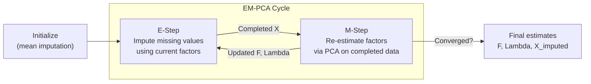
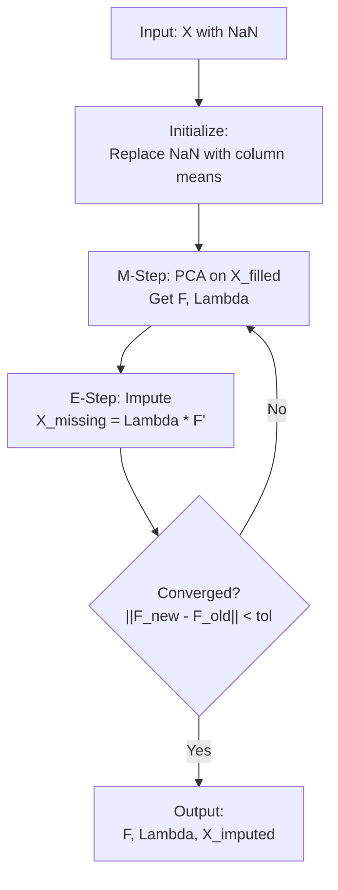
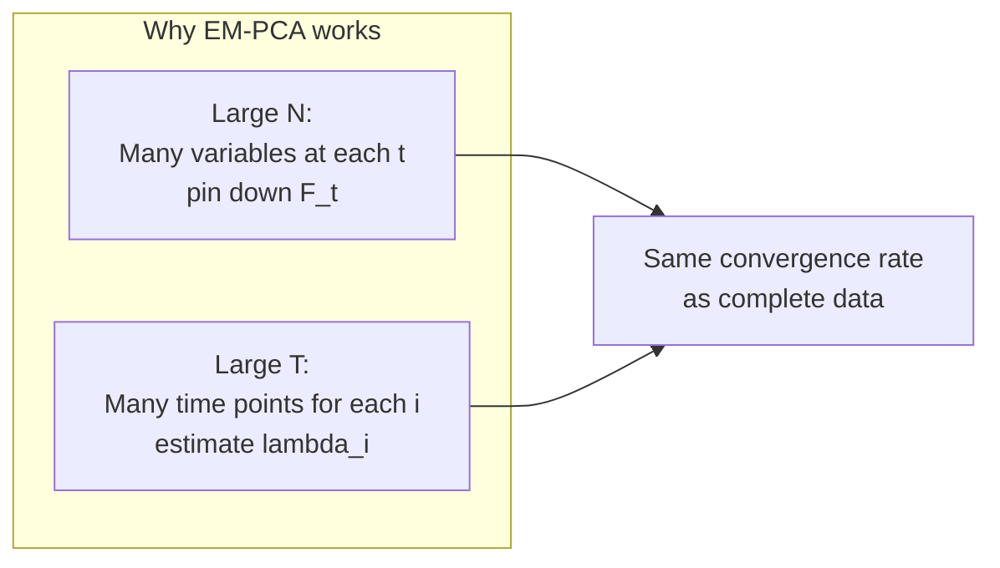
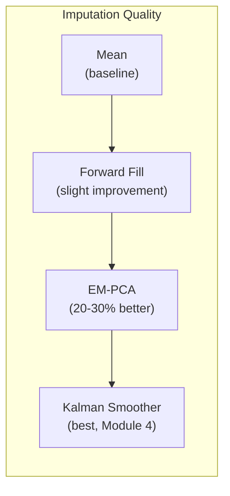
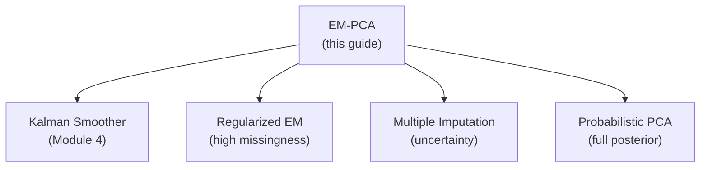
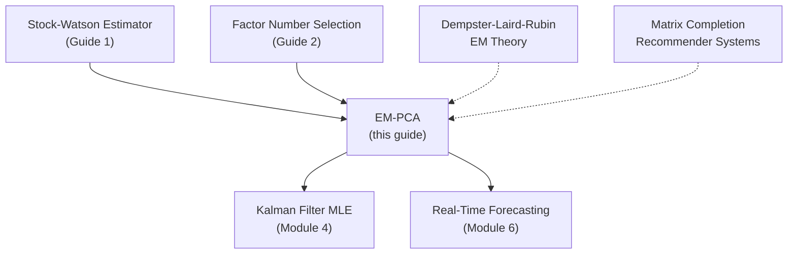

<!-- _class: lead -->

# Missing Data Handling: EM-PCA Algorithm

## Module 3: Estimation via PCA

**Key idea:** Iteratively impute missing values using factor estimates, then re-estimate factors on completed data

<!-- Speaker notes: Welcome to Missing Data Handling: EM-PCA Algorithm. This deck is part of Module 03 Estimation Pca. -->
---

# The Missing Data Challenge

> Economic datasets commonly have missing observations due to publication lags, survey non-response, or ragged edges. EM-PCA leverages cross-sectional information to fill gaps.



<!-- Speaker notes: Use this diagram to illustrate the overall flow. Trace through each step with the audience. -->
---

# Why Not Simpler Methods?

| Method | Uses cross-section | Uses time series | Preserves covariance |
|--------|:-:|:-:|:-:|
| Listwise deletion | No (loses observations) | No | No |
| Mean imputation | No | No | No (attenuates) |
| Forward fill | No | Partially | No |
| **EM-PCA** | **Yes** | **Yes** | **Yes** |

> EM-PCA typically achieves **20-30% lower RMSE** than mean imputation.

<!-- Speaker notes: Walk through the key rows of this comparison table. Highlight the most important distinctions. -->
---

<!-- _class: lead -->

# 1. The EM-PCA Algorithm

<!-- Speaker notes: Welcome to 1. The EM-PCA Algorithm. This deck is part of Module 03 Estimation Pca. -->
---

# Notation

- $X$ is $T \times N$ with some entries missing (NaN)
- $\Omega = \{(i,t) : X_{it} \text{ observed}\}$ -- observed indices
- $\Omega^c = \{(i,t) : X_{it} \text{ missing}\}$ -- missing indices

**Goal:** Estimate factors $F$ and loadings $\Lambda$ using only observed entries.

<!-- Speaker notes: Cover the key points of Notation. Check for understanding before proceeding. -->
---

# E-Step: Impute Missing Values

Given current estimates $\hat{F}^{(k)}$ and $\hat{\Lambda}^{(k)}$:

$$\hat{X}_{it}^{(k+1)} = \begin{cases}
X_{it} & \text{if } (i,t) \in \Omega \\
(\hat{\lambda}_i^{(k)})' \hat{F}_t^{(k)} & \text{if } (i,t) \in \Omega^c
\end{cases}$$

> Replace missing values with fitted values from the factor model. Observed values are **never modified**.

<!-- Speaker notes: Explain the notation carefully. Connect each term to its intuitive meaning before moving on. -->
---

# M-Step: Re-estimate Factors

Apply standard PCA to the completed data $\hat{X}^{(k+1)}$:

1. Compute covariance: $\hat{\Sigma}^{(k+1)} = (\hat{X}^{(k+1)})' \hat{X}^{(k+1)} / T$
2. Eigendecomposition: $\hat{\Sigma}^{(k+1)} = V D V'$
3. Update factors: $\hat{F}^{(k+1)} = \hat{X}^{(k+1)} V_r / \sqrt{T}$
4. Update loadings: $\hat{\Lambda}^{(k+1)} = (\hat{X}^{(k+1)})' \hat{F}^{(k+1)} / T$

**Iterate** until convergence:
$$\frac{\|\hat{F}^{(k+1)} - \hat{F}^{(k)}\|_F}{\|\hat{F}^{(k)}\|_F} < \epsilon$$

Typical tolerance: $\epsilon = 10^{-4}$ to $10^{-6}$.

<!-- Speaker notes: Explain the notation carefully. Connect each term to its intuitive meaning before moving on. -->
---

# Complete Algorithm Flow



<!-- Speaker notes: Use this diagram to illustrate the overall flow. Trace through each step with the audience. -->
---

# Initialization Strategies

| Method | Description | Recommendation |
|--------|-------------|:-:|
| Mean imputation | Replace NaN with column mean | Default (simple, works well) |
| Complete-case PCA | Use only rows with no missing | Better if few complete rows |
| Pairwise covariance | Use available pairwise covariances | Handles structured missingness |

<!-- Speaker notes: Walk through the key rows of this comparison table. Highlight the most important distinctions. -->
---

<!-- _class: lead -->

# 2. Missing Data Mechanisms

<!-- Speaker notes: Welcome to 2. Missing Data Mechanisms. This deck is part of Module 03 Estimation Pca. -->
---

# Three Types of Missingness

<div class="columns">
<div>

**MCAR** (Missing Completely at Random):
$$P(\text{miss} | X) = P(\text{miss})$$
Example: Random sensor failure

**MAR** (Missing at Random):
$$P(\text{miss} | X_{\text{obs}}, X_{\text{miss}}) = P(\text{miss} | X_{\text{obs}})$$
Example: Newer series have fewer observations

</div>
<div>

**MNAR** (Missing Not at Random):
$$P(\text{miss}) \text{ depends on } X_{\text{miss}}$$
Example: Low GDP growth not reported

</div>
</div>

| Mechanism | EM-PCA valid? | Action |
|-----------|:------------:|--------|
| MCAR | Yes | Proceed |
| MAR | Yes | Proceed |
| MNAR | **No** (biased) | Model missingness mechanism |

<!-- Speaker notes: Explain the notation carefully. Connect each term to its intuitive meaning before moving on. -->
---

<!-- _class: lead -->

# 3. Mathematical Properties

<!-- Speaker notes: Welcome to 3. Mathematical Properties. This deck is part of Module 03 Estimation Pca. -->
---

# Convergence Guarantee

**Theorem (Dempster-Laird-Rubin 1977):** EM increases the likelihood at each iteration and converges to a stationary point.

**Convergence rate:** Typically linear (geometric).

| Property | Behavior |
|----------|----------|
| Monotone likelihood | $L(\theta^{(k+1)}) \geq L(\theta^{(k)})$ |
| Speed | More missing data $\to$ slower |
| Local optima | Possible; use good initialization |
| Typical iterations | 15-50 for 10-30% missing |

<!-- Speaker notes: Walk through the key rows of this comparison table. Highlight the most important distinctions. -->
---

# Asymptotic Theory

Under MAR and large $N, T$:

$$\|\hat{F}_t^{EM} - H F_t\| = O_p\left(\min\left(N^{-1/2}, T^{-1/2}\right)\right)$$

**Same rate as complete-data PCA!**



> The key requirement: missingness proportion does not grow too fast with $N, T$.

<!-- Speaker notes: Use this diagram to illustrate the overall flow. Trace through each step with the audience. -->
---

<!-- _class: lead -->

# 4. Code Implementation

<!-- Speaker notes: Welcome to 4. Code Implementation. This deck is part of Module 03 Estimation Pca. -->
---

# EMPCA Class

```python
import numpy as np
from numpy.linalg import eigh

class EMPCA:
    def __init__(self, n_factors, max_iter=100, tol=1e-5,
                 standardize=True, verbose=True):
        self.r = n_factors
        self.max_iter = max_iter
        self.tol = tol
        self.standardize = standardize
        self.verbose = verbose
```

<!-- Speaker notes: Walk through the first part of this code implementation. The code continues on the next slide. -->
---

# EMPCA Class (continued)

```python

    def fit(self, X_incomplete):
        X = np.asarray(X_incomplete, dtype=float)
        T, N = X.shape
        self.missing_mask = np.isnan(X)
        if self.standardize:
            self.mean_ = np.nanmean(X, axis=0)
            self.std_ = np.nanstd(X, axis=0, ddof=1)
            self.std_[self.std_ < 1e-10] = 1.0
            X = (X - self.mean_) / self.std_
        X_filled = self._initialize(X)
        # ... EM loop follows
```

<!-- Speaker notes: Continue walking through the implementation. Highlight the key output and how to verify correctness. -->
---

# EM Loop

```python
for iteration in range(self.max_iter):
            # M-step: PCA on filled data
            F_new, Lambda_new = self._pca_step(X_filled)

            # E-step: Impute missing values
            X_fitted = F_new @ Lambda_new.T
            X_filled = X.copy()
            X_filled[self.missing_mask] = X_fitted[self.missing_mask]

```

<!-- Speaker notes: Walk through the first part of this code implementation. The code continues on the next slide. -->
---

# EM Loop (continued)

```python
            # Check convergence
            if iteration > 0:
                change = (np.linalg.norm(F_new - self.F_hat, 'fro')
                         / np.linalg.norm(self.F_hat, 'fro'))
                if change < self.tol:
                    break

            self.F_hat = F_new
            self.Lambda_hat = Lambda_new
```

<!-- Speaker notes: Continue walking through the implementation. Highlight the key output and how to verify correctness. -->
---

# PCA Step and Scoring

```python
def _pca_step(self, X_filled):
    T, N = X_filled.shape
    Sigma_X = X_filled.T @ X_filled / T
    eigenvalues, eigenvectors = eigh(Sigma_X)
    idx = np.argsort(eigenvalues)[::-1]
    V_r = eigenvectors[:, idx[:self.r]]
    F_hat = X_filled @ V_r / np.sqrt(T)
    Lambda_hat = X_filled.T @ F_hat / T
    return F_hat, Lambda_hat

def score(self, X_true, X_incomplete):
    """RMSE on missing entries (for validation)."""
    missing = np.isnan(X_incomplete)
    errors = (self.X_imputed - X_true)[missing]
    return np.sqrt(np.mean(errors**2))
```

<!-- Speaker notes: Walk through this code step by step. Highlight the key lines and explain the output. -->
---

<!-- _class: lead -->

# 5. Comparison of Methods

<!-- Speaker notes: Welcome to 5. Comparison of Methods. This deck is part of Module 03 Estimation Pca. -->
---

# Imputation Method Comparison

```python
results = compare_imputation_methods(X_true, missing_pct=0.20, r=3)
```

| Method | RMSE | vs. Mean |
|--------|:----:|:--------:|
| Mean imputation | 0.5189 | baseline |
| Forward fill | 0.5124 | 1.3% better |
| **EM-PCA** | **0.3956** | **23.8% better** |
| Listwise deletion | N/A | Only 2% of rows complete |



<!-- Speaker notes: Walk through this code step by step. Highlight the key lines and explain the output. -->
---

# Effect of Missing Percentage

| Missing % | Mean RMSE | EM-PCA RMSE | Improvement | Iterations |
|:---------:|:---------:|:-----------:|:-----------:|:----------:|
| 10% | 0.5234 | 0.3821 | 27.0% | 18 |
| 20% | 0.5189 | 0.3956 | 23.8% | 24 |
| 30% | 0.5298 | 0.4123 | 22.2% | 31 |

> EM-PCA maintains strong advantage even at 30% missingness, though convergence slows.

<!-- Speaker notes: Walk through the key rows of this comparison table. Highlight the most important distinctions. -->
---

<!-- _class: lead -->

# 6. Extensions

<!-- Speaker notes: Welcome to 6. Extensions. This deck is part of Module 03 Estimation Pca. -->
---

# Beyond Basic EM-PCA

| Extension | Description |
|-----------|------------|
| **Kalman smoother** | State-space approach; handles time series structure properly |
| **Regularized EM-PCA** | Add penalty $\lambda\|\Lambda\|_F^2$ for high missingness |
| **Probabilistic PCA** | Full probabilistic model with uncertainty quantification |
| **Robust EM-PCA** | Replace squared error with Huber loss for outliers |
| **Multiple imputation** | Generate $M$ plausible datasets for uncertainty |



<!-- Speaker notes: Use this diagram to illustrate the overall flow. Trace through each step with the audience. -->
---

<!-- _class: lead -->

# 7. Common Pitfalls

<!-- Speaker notes: Welcome to 7. Common Pitfalls. This deck is part of Module 03 Estimation Pca. -->
---

# Pitfalls to Avoid

| Pitfall | Problem | Solution |
|---------|---------|----------|
| Not checking MAR | MNAR causes bias | Plot missingness vs. observed values |
| Wrong $r$ for imputation | Overfitting noise | Use IC criteria on complete-case data first |
| Treating imputed as observed | Ignoring uncertainty | Use multiple imputation or report sensitivity |
| Ignoring temporal structure | EM-PCA treats $t$ as exchangeable | Use Kalman smoother for time series |
| High missingness (>50%) | Slow convergence, poor optima | Better initialization, more iterations |

<!-- Speaker notes: Emphasize these common mistakes. Ask learners if they have encountered any of these in practice. -->
---

# Practice Problems

**Conceptual:**
1. Give examples of MAR and MNAR in economic data. Which is more problematic?
2. Why does EM converge more slowly with more missing data?
3. How is EM-PCA related to matrix completion?

**Mathematical:**
4. Derive the E-step conditional expectation under Gaussian errors
5. Show $\text{Var}(\hat{F}_t^{EM}) \geq \text{Var}(\hat{F}_t^{\text{complete}})$

**Implementation:**
6. Modify EM-PCA for multiple imputation ($M = 5$ datasets)
7. Compare EM-PCA to Kalman smoother on simulated data with ragged edges

<!-- Speaker notes: Give learners 3-5 minutes to work through these practice problems before discussing solutions. -->
---

# Connections & Summary



| Key Result | Detail |
|------------|--------|
| Algorithm | E-step (impute) + M-step (PCA), iterate |
| Consistency | Same rate as complete-data PCA under MAR |
| Advantage | 20-30% RMSE improvement over mean imputation |
| Limitation | Point estimates only; ignores temporal structure |

**References:**
- Stock & Watson (2002). "Macroeconomic Forecasting Using Diffusion Indexes." *JBES*
- Bai & Ng (2008). "Large Dimensional Factor Analysis." *Foundations and Trends*
- Dempster, Laird & Rubin (1977). "Maximum Likelihood from Incomplete Data via EM." *JRSS-B*

<!-- Speaker notes: Summarize the key takeaways and highlight how this topic connects to upcoming material. -->