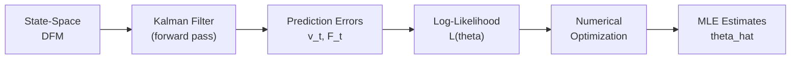
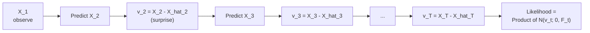
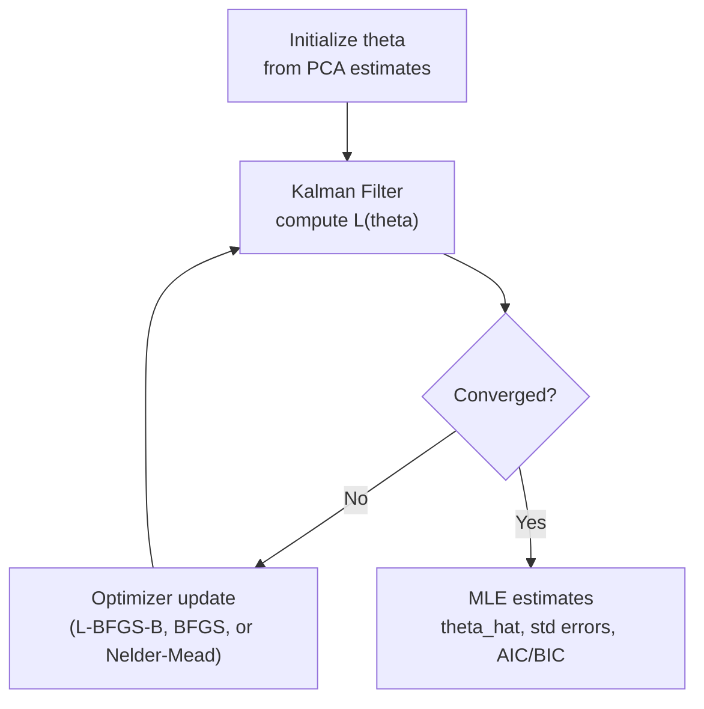
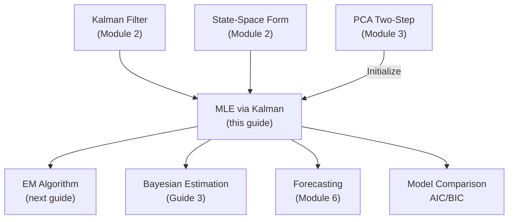

<!-- _class: lead -->

# Maximum Likelihood Estimation via Kalman Filter

## Module 4: Estimation via ML

**Key idea:** Use the Kalman filter to compute the exact likelihood via prediction error decomposition, then maximize numerically

<!-- Speaker notes: Welcome to Maximum Likelihood Estimation via Kalman Filter. This deck is part of Module 04 Estimation Ml. -->
---

# Why MLE?

> PCA is fast but gives no standard errors and ignores dynamics during factor extraction. MLE jointly estimates all parameters with proper statistical inference.



| Method | Standard Errors | Efficiency | Computation |
|--------|:-:|:-:|:-:|
| PCA two-step | No | Lower | Fast |
| MLE via Kalman | Yes | Optimal | Slower |

<!-- Speaker notes: Use this diagram to illustrate the overall flow. Trace through each step with the audience. -->
---

<!-- _class: lead -->

# 1. Prediction Error Decomposition

<!-- Speaker notes: Welcome to 1. Prediction Error Decomposition. This deck is part of Module 04 Estimation Ml. -->
---

# The Key Identity

The likelihood factors into one-step-ahead predictive densities:

$$p(X_1, \ldots, X_T | \theta) = p(X_1|\theta) \prod_{t=2}^T p(X_t | X_1, \ldots, X_{t-1}, \theta)$$

Each term is Gaussian:
$$X_t | X_{1:t-1}, \theta \sim N(Z\hat{\alpha}_{t|t-1}, F_t)$$

> This is exactly what the Kalman filter computes!

<!-- Speaker notes: Explain the notation carefully. Connect each term to its intuitive meaning before moving on. -->
---

# Log-Likelihood Function

$$\log L(\theta) = -\frac{TN}{2}\log(2\pi) - \frac{1}{2}\sum_{t=1}^T \left[\log|F_t| + v_t' F_t^{-1} v_t\right]$$

| Component | Formula | Meaning |
|-----------|---------|---------|
| Prediction error | $v_t = X_t - Z\hat{\alpha}_{t\|t-1}$ | Surprise: actual minus expected |
| Error variance | $F_t = ZP_{t\|t-1}Z' + H$ | Uncertainty of prediction |
| Normalized error | $v_t'F_t^{-1}v_t$ | Mahalanobis distance |

> The likelihood measures: "How surprised is the model by the data?"

<!-- Speaker notes: Explain the notation carefully. Connect each term to its intuitive meaning before moving on. -->
---

# Intuition: Sequential Prediction



At each step:
1. **Predict** $X_t$ from past data and current parameters
2. **Compare** actual observation to prediction
3. **Evaluate** how surprising the error is given uncertainty
4. **Accumulate** into total likelihood

<!-- Speaker notes: Use this diagram to illustrate the overall flow. Trace through each step with the audience. -->
---

<!-- _class: lead -->

# 2. The Full Algorithm

<!-- Speaker notes: Welcome to 2. The Full Algorithm. This deck is part of Module 04 Estimation Ml. -->
---

# Step 1: State-Space Representation

Convert DFM to state-space form. For $r$ factors, $p$ lags:

$$\alpha_t = [F_t', F_{t-1}', \ldots, F_{t-p+1}']' \quad \text{(dim } rp \text{)}$$

$$Z = [\Lambda, 0, \ldots, 0]_{N \times rp}$$

$$T = \begin{bmatrix} \Phi_1 & \Phi_2 & \cdots & \Phi_p \\ I_r & 0 & \cdots & 0 \\ \vdots & \ddots & & \vdots \\ 0 & \cdots & I_r & 0 \end{bmatrix}_{rp \times rp}$$

$$R = [I_r, 0, \ldots, 0]'_{rp \times r}, \quad Q = \Sigma_\eta, \quad H = \text{diag}(\sigma_{e_1}^2, \ldots, \sigma_{e_N}^2)$$

<!-- Speaker notes: Explain the notation carefully. Connect each term to its intuitive meaning before moving on. -->
---

# Step 2: Kalman Filter Recursions

**Initialize:** $\hat{\alpha}_{0|0} = 0$, $P_{0|0}$ from Lyapunov equation

**For $t = 1, \ldots, T$:**

**Predict:**
$$\hat{\alpha}_{t|t-1} = T\hat{\alpha}_{t-1|t-1}, \quad P_{t|t-1} = TP_{t-1|t-1}T' + RQR'$$

**Prediction error:**
$$v_t = X_t - Z\hat{\alpha}_{t|t-1}, \quad F_t = ZP_{t|t-1}Z' + H$$

**Update:**
$$K_t = P_{t|t-1}Z'F_t^{-1}, \quad \hat{\alpha}_{t|t} = \hat{\alpha}_{t|t-1} + K_tv_t$$
$$P_{t|t} = P_{t|t-1} - K_tF_tK_t'$$

<!-- Speaker notes: Explain the notation carefully. Connect each term to its intuitive meaning before moving on. -->
---

# Step 3: Accumulate Likelihood

```python
loglik = -0.5 * T * N * np.log(2 * np.pi)
for t in range(T):
    L = cholesky(F_t, lower=True)          # Numerical stability
    log_det = 2 * np.sum(np.log(np.diag(L)))
    w = solve_triangular(L, v_t, lower=True)
    loglik += -0.5 * (log_det + w @ w)
```

> Use Cholesky decomposition to avoid direct matrix inversion.

<!-- Speaker notes: Walk through this code step by step. Highlight the key lines and explain the output. -->
---

# Step 4: Maximize

$$\hat{\theta}_{MLE} = \arg\max_\theta \log L(\theta)$$



<!-- Speaker notes: Use this diagram to illustrate the overall flow. Trace through each step with the audience. -->
---

<!-- _class: lead -->

# 3. Identification Constraints

<!-- Speaker notes: Welcome to 3. Identification Constraints. This deck is part of Module 04 Estimation Ml. -->
---

# Ensuring Identifiability

Without constraints, the likelihood is invariant to rotations.

**Standard restrictions:**

| Constraint | Description |
|-----------|------------|
| Lower triangular $\Lambda_{1:r}$ | First $r$ rows of loadings are lower triangular |
| Positive diagonal | $\Lambda_{ii} > 0$ for $i = 1, \ldots, r$ |
| Factor scale | $Q = I_r$ or $\text{diag}(Q) = 1$ |
| Factor ordering | Order by variance explained |

```python
def constrain_parameters(params, N, r, p):
    # Lower triangular loadings with positive diagonal
    Lambda = np.zeros((N, r))
    for i in range(r):
        for j in range(i+1):
            if i == j:
                Lambda[i,j] = np.exp(params[idx])  # Positive
            else:
                Lambda[i,j] = params[idx]
    # ... remaining rows unrestricted
```

<!-- Speaker notes: Walk through this code step by step. Highlight the key lines and explain the output. -->
---

<!-- _class: lead -->

# 4. Code Implementation

<!-- Speaker notes: Welcome to 4. Code Implementation. This deck is part of Module 04 Estimation Ml. -->
---

# Likelihood Function

```python
def kalman_filter_likelihood(params, X, constrain_fn):
    T_obs, N = X.shape
    Z, T_mat, R, Q, H = constrain_fn(params)
    rp = T_mat.shape[0]

    # Initialize from Lyapunov equation
    I_rp2 = np.eye(rp**2)
    T_kron = np.kron(T_mat, T_mat)
    vec_P0 = solve(I_rp2 - T_kron, (R @ Q @ R.T).ravel())
    P_pred = vec_P0.reshape(rp, rp)
    alpha_pred = np.zeros(rp)
    loglik = -0.5 * T_obs * N * np.log(2 * np.pi)
```

<!-- Speaker notes: Walk through the first part of this code implementation. The code continues on the next slide. -->
---

# Likelihood Function (continued)

```python

    for t in range(T_obs):
        v = X[t] - Z @ alpha_pred
        F = Z @ P_pred @ Z.T + H
        L = cholesky(F, lower=True)
        loglik += -0.5 * (2*np.sum(np.log(np.diag(L)))
                         + solve_triangular(L, v, lower=True) @ ...)
        # ... Kalman update ...
    return -loglik  # Negative for minimization
```

<!-- Speaker notes: Continue walking through the implementation. Highlight the key output and how to verify correctness. -->
---

# Full Estimation Pipeline

```python
def estimate_dfm_mle(X, r=2, p=1):
    # Initialize from PCA
    pca = PCA(n_components=r)
    F_init = pca.fit_transform(X)
    Lambda_init = pca.components_.T

    # Initialize VAR from OLS on PCA factors
    var_model = VAR(F_init)
    var_result = var_model.fit(p)

```

<!-- Speaker notes: Walk through the first part of this code implementation. The code continues on the next slide. -->
---

# Full Estimation Pipeline (continued)

```python
    # Pack initial parameters
    params_init = pack_params(Lambda_init, var_result, X)

    # Optimize
    result = minimize(
        lambda p: kalman_filter_likelihood(p, X, constrain_fn),
        params_init, method='L-BFGS-B',
        options={'maxiter': 500}
    )
    return unpack_results(result, N, r, p)
```

> Always initialize from PCA -- usually close to global optimum.

<!-- Speaker notes: Continue walking through the implementation. Highlight the key output and how to verify correctness. -->
---

<!-- _class: lead -->

# 5. Common Pitfalls

<!-- Speaker notes: Welcome to 5. Common Pitfalls. This deck is part of Module 04 Estimation Ml. -->
---

# Pitfalls to Avoid

| Pitfall | Problem | Solution |
|---------|---------|----------|
| Numerical instability | $F_t$ ill-conditioned | Cholesky decomposition + regularization |
| Non-stationarity | $P_{0\|0}$ undefined | Diffuse initialization ($\kappa = 10^7$) |
| No identification | Likelihood rotation-invariant | Lower triangular loadings + $Q = I_r$ |
| Local optima | Non-convex surface | Initialize from PCA; try multiple starts |
| Gradient computation | Analytical gradient complex | Use numerical finite differences |

<!-- Speaker notes: Emphasize these common mistakes. Ask learners if they have encountered any of these in practice. -->
---

# MLE vs. PCA: When to Use What

<div class="columns">
<div>

**Use PCA when:**
- $N$ and $T$ both large
- Speed is critical
- Standard errors not needed
- Exploratory analysis

</div>
<div>

**Use MLE when:**
- Need standard errors
- $N$ moderate ($< 50$)
- Want optimal efficiency
- Model comparison (AIC/BIC)

</div>
</div>

<!-- Speaker notes: Cover the key points of MLE vs. PCA: When to Use What. Check for understanding before proceeding. -->
---

# Practice Problems

**Conceptual:**
1. Why does the prediction error decomposition avoid integrating over all factor paths?
2. What happens to the likelihood if $H = 0$ (no measurement error)?

**Mathematical:**
3. Derive $\frac{\partial \log L}{\partial \Lambda}$ for a single observation
4. Show the log-likelihood simplifies to OLS when factors are known

**Implementation:**
5. Modify the code to handle missing data by skipping NaN observations
6. Compare ML and PCA estimates for different $T/N$ ratios

<!-- Speaker notes: Give learners 3-5 minutes to work through these practice problems before discussing solutions. -->
---

# Connections & Summary



| Key Result | Detail |
|------------|--------|
| Prediction error decomposition | Transforms intractable integral to sequential computation |
| Kalman filter byproduct | $v_t$ and $F_t$ give exact log-likelihood |
| Identification | Lower triangular loadings + $Q = I_r$ |
| Initialization | PCA estimates as starting values |

**References:**
- Durbin & Koopman (2012). *Time Series Analysis by State Space Methods*, Ch. 7
- Harvey (1989). *Forecasting, Structural Time Series Models and the Kalman Filter*
- Doz, Giannone & Reichlin (2012). "Quasi-MLE for Large DFMs." *REStat*

<!-- Speaker notes: Summarize the key takeaways and highlight how this topic connects to upcoming material. -->