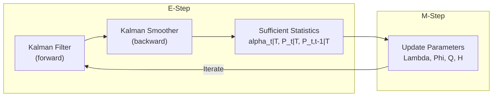
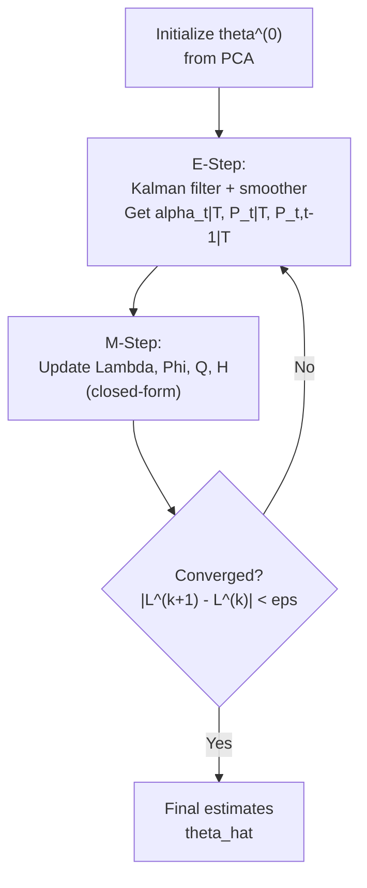
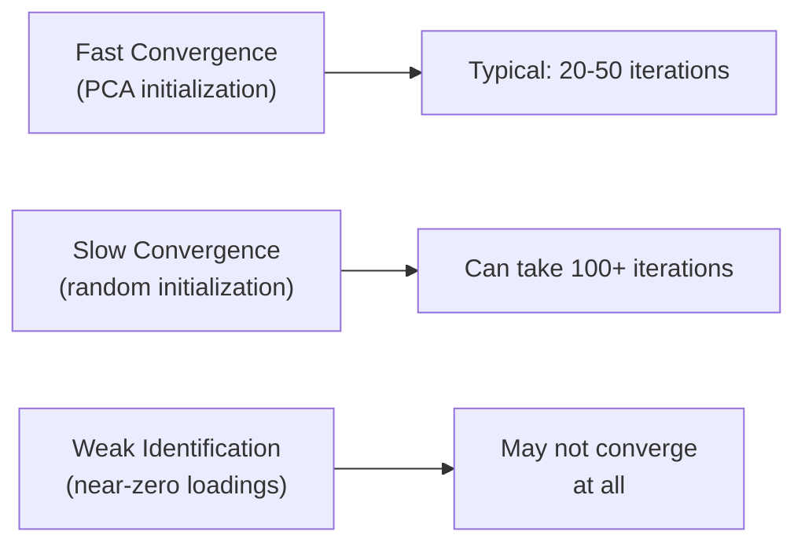
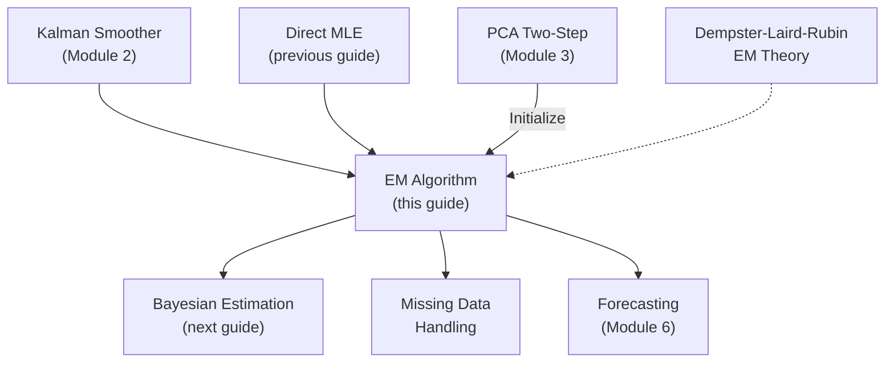

<!-- _class: lead -->

# EM Algorithm for Dynamic Factor Models

## Module 4: Estimation via ML

**Key idea:** Treat latent factors as missing data, alternate between computing expected sufficient statistics (E-step) and updating parameters (M-step)

<!-- Speaker notes: Welcome to EM Algorithm for Dynamic Factor Models. This deck is part of Module 04 Estimation Ml. -->
---

# Why EM?

> Direct likelihood maximization requires nonlinear optimization with many parameters. EM decomposes the problem: if we knew the factors, estimation would be trivial regression.



| Property | Direct MLE | EM |
|----------|:---------:|:--:|
| Each iteration | Nonlinear optimization | Closed-form updates |
| Guaranteed improvement | No | Yes (monotone likelihood) |
| Speed per iteration | Fast | Slower (filter + smoother) |
| Convergence | Quadratic (near optimum) | Linear |

<!-- Speaker notes: Use this diagram to illustrate the overall flow. Trace through each step with the audience. -->
---

<!-- _class: lead -->

# 1. The EM Framework

<!-- Speaker notes: Welcome to 1. The EM Framework. This deck is part of Module 04 Estimation Ml. -->
---

# Complete-Data Likelihood

If factors $\alpha_{1:T}$ were observed, the likelihood decomposes:

$$\log L_c = \underbrace{\log p(\alpha_1)}_{\text{initial state}} + \underbrace{\sum_{t=2}^T \log p(\alpha_t | \alpha_{t-1})}_{\text{transitions}} + \underbrace{\sum_{t=1}^T \log p(X_t | \alpha_t)}_{\text{measurements}}$$

Each term is Gaussian -- maximization gives **closed-form** OLS-like updates.

> The problem: $\alpha_t$ is latent. EM's solution: replace $\alpha_t$ with conditional expectations.

<!-- Speaker notes: Explain the notation carefully. Connect each term to its intuitive meaning before moving on. -->
---

# E-Step and M-Step

**E-Step:** Compute $Q(\theta | \theta^{(k)}) = E[\log L_c(\theta) | X_{1:T}, \theta^{(k)}]$

This requires:
1. Smoothed states: $\hat{\alpha}_{t|T} = E[\alpha_t | X_{1:T}, \theta^{(k)}]$
2. Smoothed covariances: $P_{t|T} = \text{Var}[\alpha_t | X_{1:T}, \theta^{(k)}]$
3. Lag-one covariances: $P_{t,t-1|T} = \text{Cov}[\alpha_t, \alpha_{t-1} | X_{1:T}, \theta^{(k)}]$

> All computed by the **Kalman smoother** (one forward + one backward pass).

**M-Step:** $\theta^{(k+1)} = \arg\max_\theta Q(\theta | \theta^{(k)})$

> Closed-form updates for each parameter block.

<!-- Speaker notes: Cover the key points of E-Step and M-Step. Check for understanding before proceeding. -->
---

# Monotone Convergence

**Theorem:** $\log L(\theta^{(k+1)}) \geq \log L(\theta^{(k)})$ at every iteration.



<!-- Speaker notes: Use this diagram to illustrate the overall flow. Trace through each step with the audience. -->
---

<!-- _class: lead -->

# 2. Sufficient Statistics

<!-- Speaker notes: Welcome to 2. Sufficient Statistics. This deck is part of Module 04 Estimation Ml. -->
---

# What the E-Step Computes

The Kalman smoother provides three key quantities:

| Statistic | Formula | Used for |
|-----------|---------|----------|
| Smoothed state | $\hat{\alpha}_{t\|T}$ | All M-step updates |
| Smoothed covariance | $P_{t\|T}$ | Corrects for factor uncertainty |
| Lag-one covariance | $P_{t,t-1\|T}$ | Transition matrix update |

**Aggregated sufficient statistics:**

$$S_{11} = \sum_{t=1}^T [\hat{\alpha}_{t|T}\hat{\alpha}_{t|T}' + P_{t|T}]$$
$$S_{10} = \sum_{t=2}^T [\hat{\alpha}_{t|T}\hat{\alpha}_{t-1|T}' + P_{t,t-1|T}]$$
$$S_{00} = \sum_{t=1}^{T-1} [\hat{\alpha}_{t|T}\hat{\alpha}_{t|T}' + P_{t|T}]$$

<!-- Speaker notes: Explain the notation carefully. Connect each term to its intuitive meaning before moving on. -->
---

# Why $P_{t|T}$ Matters

> Without $P_{t|T}$, the M-step would use $\hat{\alpha}_{t|T}\hat{\alpha}_{t|T}'$ as if the factors were known exactly. The $P_{t|T}$ correction accounts for estimation uncertainty.

<div class="columns">
<div>

**Ignoring uncertainty** (wrong):
$$\hat{\Lambda} = \left(\sum_t X_t\hat{\alpha}_{t|T}'\right)\left(\sum_t \hat{\alpha}_{t|T}\hat{\alpha}_{t|T}'\right)^{-1}$$

</div>
<div>

**With uncertainty** (correct):
$$\hat{\Lambda} = \left(\sum_t X_t\hat{\alpha}_{t|T}'\right)\left(\sum_t [\hat{\alpha}_{t|T}\hat{\alpha}_{t|T}' + P_{t|T}]\right)^{-1}$$

</div>
</div>

> With known factors ($P_{t|T} = 0$), the M-step reduces to standard OLS.

<!-- Speaker notes: Explain the notation carefully. Connect each term to its intuitive meaning before moving on. -->
---

<!-- _class: lead -->

# 3. M-Step Updates

<!-- Speaker notes: Welcome to 3. M-Step Updates. This deck is part of Module 04 Estimation Ml. -->
---

# Loading Matrix $Z$

$$Z^{(k+1)} = \left(\sum_{t=1}^T X_t \hat{\alpha}_{t|T}'\right) \left(\sum_{t=1}^T [\hat{\alpha}_{t|T}\hat{\alpha}_{t|T}' + P_{t|T}]\right)^{-1}$$

With identification constraints (lower triangular first $r$ rows):
- Update only free elements
- Keep constrained elements fixed

<!-- Speaker notes: Explain the notation carefully. Connect each term to its intuitive meaning before moving on. -->
---

# Transition Matrix and Covariances

**Transition $T$:**
$$T^{(k+1)} = S_{10}' \cdot S_{00}^{-1}$$

**Innovation covariance $Q$:**
$$RQ^{(k+1)}R' = \frac{1}{T-1}\left[S_{11} - T^{(k+1)}S_{10}' - S_{10}T^{(k+1)'} + T^{(k+1)}S_{00}T^{(k+1)'}\right]$$

Often constrained: $Q = I_r$ for identification.

**Measurement error $H$ (diagonal):**
$$h_i^{(k+1)} = \frac{1}{T}\sum_{t=1}^T \left[X_{it}^2 - 2X_{it}Z_i^{(k+1)}\hat{\alpha}_{t|T} + Z_i^{(k+1)}(\hat{\alpha}_{t|T}\hat{\alpha}_{t|T}' + P_{t|T})Z_i^{(k+1)'}\right]$$

<!-- Speaker notes: Explain the notation carefully. Connect each term to its intuitive meaning before moving on. -->
---

<!-- _class: lead -->

# 4. Code Implementation

<!-- Speaker notes: Welcome to 4. Code Implementation. This deck is part of Module 04 Estimation Ml. -->
---

# EMDynamicFactorModel Class

```python
class EMDynamicFactorModel:
    def __init__(self, n_factors, n_lags=1):
        self.r = n_factors
        self.p = n_lags
        self.rp = n_factors * n_lags

    def fit(self, X, max_iter=100, tol=1e-6):
        self.initialize_from_pca(X)
        loglik_hist = []

        for iteration in range(max_iter):
```

<!-- Speaker notes: Walk through the first part of this code implementation. The code continues on the next slide. -->
---

# EMDynamicFactorModel Class (continued)

```python
            # E-step: Kalman filter + smoother
            _, alpha_filt, _, P_filt, _, _, _, loglik = \
                self.kalman_filter(X)
            alpha_smooth, P_smooth, P_smooth_lag = \
                self.kalman_smoother(...)
            loglik_hist.append(loglik)

            # Check convergence
            if iteration > 0:
                if abs(loglik_hist[-1] - loglik_hist[-2]) < tol:
                    break

            # M-step: Update parameters
            self.m_step(X, alpha_smooth, P_smooth, P_smooth_lag)
        return self
```

<!-- Speaker notes: Continue walking through the implementation. Highlight the key output and how to verify correctness. -->
---

# M-Step Implementation

```python
def m_step(self, X, alpha_smooth, P_smooth, P_smooth_lag):
    T, N = X.shape

    # Sufficient statistics
    S_11 = sum(np.outer(alpha_smooth[t], alpha_smooth[t]) + P_smooth[t]
               for t in range(T))
    S_10 = sum(np.outer(alpha_smooth[t], alpha_smooth[t-1]) + P_smooth_lag[t]
               for t in range(1, T))
    S_00 = sum(np.outer(alpha_smooth[t], alpha_smooth[t]) + P_smooth[t]
               for t in range(T-1))
```

<!-- Speaker notes: Walk through the first part of this code implementation. The code continues on the next slide. -->
---

# M-Step Implementation (continued)

```python

    # Update Z (loadings)
    X_alpha = sum(np.outer(X[t], alpha_smooth[t]) for t in range(T))
    Z_new = X_alpha @ solve(S_11, np.eye(self.rp))

    # Update T (transition)
    T_new = S_10.T @ solve(S_00, np.eye(self.rp))

    # Update H (diagonal measurement error)
    for i in range(N):
        H_new[i,i] = residual_variance(X, Z_new, alpha_smooth, P_smooth, i)
```

<!-- Speaker notes: Continue walking through the implementation. Highlight the key output and how to verify correctness. -->
---

# Extracting Smoothed Factors

```python
def smooth_factors(self, X):
    """Extract smoothed factors after fitting."""
    _, alpha_filt, _, P_filt, _, _, _, loglik = self.kalman_filter(X)
    alpha_smooth, P_smooth, _ = self.kalman_smoother(...)

    # Factors are first r components of state
    F_smooth = alpha_smooth[:, :self.r]
    return F_smooth, P_smooth
```

<!-- Speaker notes: Walk through this code step by step. Highlight the key lines and explain the output. -->
---

<!-- _class: lead -->

# 5. Convergence and Diagnostics

<!-- Speaker notes: Welcome to 5. Convergence and Diagnostics. This deck is part of Module 04 Estimation Ml. -->
---

# Convergence Criteria

| Criterion | Formula | Typical threshold |
|-----------|---------|:-:|
| Relative likelihood change | $\frac{\|\log L^{(k+1)} - \log L^{(k)}\|}{\max(1, \|\log L^{(k)}\|)}$ | $10^{-6}$ |
| Parameter change | $\|\theta^{(k+1)} - \theta^{(k)}\|$ | $10^{-4}$ |
| Maximum iterations | $k > k_{\max}$ | 100-500 |



<!-- Speaker notes: Use this diagram to illustrate the overall flow. Trace through each step with the audience. -->
---

# EM vs. Direct MLE

<div class="columns">
<div>

**EM Advantages:**
- Monotone likelihood increase
- No line search needed
- Handles constraints naturally
- Stable near boundary
- Good for missing data

</div>
<div>

**EM Disadvantages:**
- Linear convergence (slow)
- No standard errors directly
- Can get stuck near saddle points
- Each iteration is expensive (filter + smoother)

</div>
</div>

> **Practical strategy:** Use EM for 20-50 iterations, then switch to quasi-Newton for final precision.

<!-- Speaker notes: Cover the key points of EM vs. Direct MLE. Check for understanding before proceeding. -->
---

<!-- _class: lead -->

# 6. Common Pitfalls

<!-- Speaker notes: Welcome to 6. Common Pitfalls. This deck is part of Module 04 Estimation Ml. -->
---

# Pitfalls to Avoid

| Pitfall | Problem | Solution |
|---------|---------|----------|
| Slow convergence | Linear rate, 100+ iterations | Initialize from PCA; use accelerated EM |
| Boundary issues | Variances become negative or near-zero | Constrain $\sigma^2 \geq 10^{-6}$ |
| Identification violations | EM doesn't respect constraints | Enforce in M-step (zero out, rescale) |
| Local maxima | EM finds local, not global, maximum | Multiple starts; PCA usually near global |
| Missing $P_{t\|T}$ correction | Biased parameter estimates | Always include covariance correction |

<!-- Speaker notes: Emphasize these common mistakes. Ask learners if they have encountered any of these in practice. -->
---

# Practice Problems

**Conceptual:**
1. Why does EM guarantee non-decreasing likelihood at each iteration?
2. Explain the role of $P_{t|T}$ in the M-step
3. How would you modify EM to handle missing observations in $X_t$?

**Mathematical:**
4. Derive the M-step update for $\Lambda$ from first principles
5. Show that with known factors ($P_{t|T} = 0$), M-step reduces to OLS
6. Prove EM converges to a stationary point

<!-- Speaker notes: Give learners 3-5 minutes to work through these practice problems before discussing solutions. -->
---

# Connections & Summary



| Key Result | Detail |
|------------|--------|
| E-step | Kalman filter + smoother for sufficient statistics |
| M-step | Closed-form updates for $\Lambda, \Phi, Q, H$ |
| Convergence | Monotone likelihood; linear rate |
| Key correction | $P_{t\|T}$ accounts for factor uncertainty |

**References:**
- Shumway & Stoffer (1982). "EM for Time Series." *J. Time Series Analysis*
- Durbin & Koopman (2012). *Time Series Analysis by State Space Methods*, Ch. 7
- Banbura & Modugno (2014). "MLE with Missing Data." *J. Applied Econometrics*

<!-- Speaker notes: Summarize the key takeaways and highlight how this topic connects to upcoming material. -->