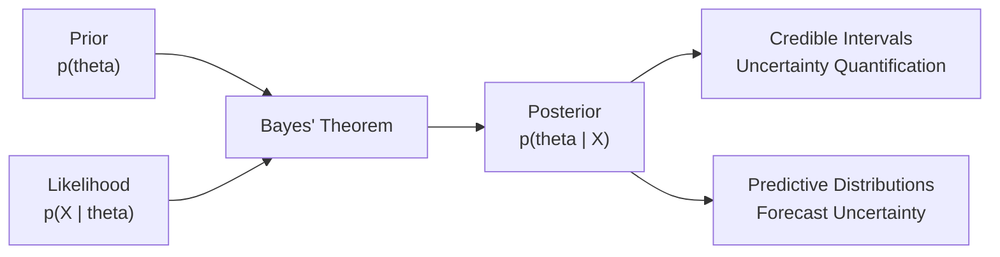
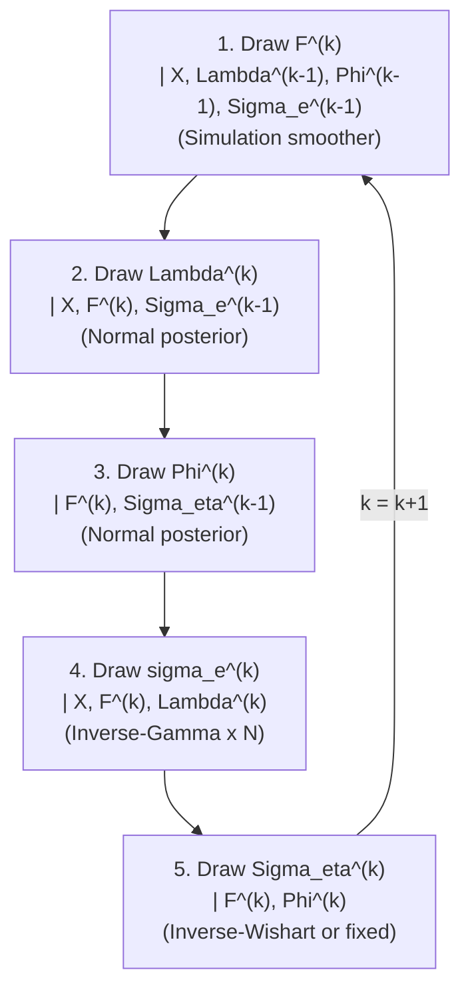
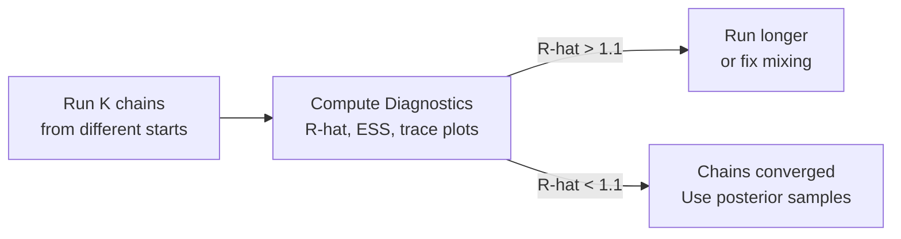
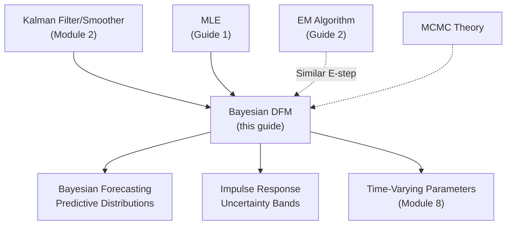

<!-- _class: lead -->

# Bayesian Estimation for Dynamic Factor Models

## Module 4: Estimation via ML

**Key idea:** Treat parameters as random variables with prior distributions, sample from the posterior via Gibbs sampler for full uncertainty quantification

<!-- Speaker notes: Welcome to Bayesian Estimation for Dynamic Factor Models. This deck is part of Module 04 Estimation Ml. -->
---

# Why Bayesian?

> MLE gives point estimates. Bayesian estimation gives entire distributions -- "the loading is between 0.6 and 1.0 with 95% probability."



| Feature | MLE | Bayesian |
|---------|:---:|:--------:|
| Output | Point estimate $\hat{\theta}$ | Distribution $p(\theta\|X)$ |
| Uncertainty | Asymptotic std errors | Exact posterior intervals |
| Regularization | None (implicit) | Via priors |
| Identification | Hard constraints | Soft priors |

<!-- Speaker notes: Use this diagram to illustrate the overall flow. Trace through each step with the audience. -->
---

<!-- _class: lead -->

# 1. Bayesian Framework

<!-- Speaker notes: Welcome to 1. Bayesian Framework. This deck is part of Module 04 Estimation Ml. -->
---

# Bayes' Theorem for DFM

**Prior:** $p(\theta) = p(\Lambda) \cdot p(\Phi) \cdot p(\Sigma_\eta) \cdot p(\Sigma_e)$

**Likelihood:** $p(X_{1:T} | \theta) = \int p(X | F, \theta) p(F | \theta) dF$

**Posterior:**
$$p(\theta | X) \propto p(X | \theta) \cdot p(\theta)$$

**Joint posterior (including factors):**
$$p(\theta, F_{1:T} | X_{1:T}) \propto p(X | F, \theta) \cdot p(F | \theta) \cdot p(\theta)$$

> Direct sampling from the posterior is intractable. Solution: **Gibbs sampler**.

<!-- Speaker notes: Explain the notation carefully. Connect each term to its intuitive meaning before moving on. -->
---

# Standard Priors

| Parameter | Prior | Typical Choice |
|-----------|-------|---------------|
| Loadings $\lambda_j$ | $N(\mu_\lambda, \Sigma_\lambda)$ | $N(0, 10I_r)$ -- diffuse |
| Dynamics $\phi_i$ | $N(\mu_\phi, \Sigma_\phi)$ | $N(0.5, 0.5^2 I_{rp})$ -- weakly persistent |
| Idiosyncratic $\sigma_{e_i}^2$ | $IG(a_e, b_e)$ | $IG(2, 1)$ -- weakly informative |
| Innovation $\Sigma_\eta$ | $IW(\nu, S)$ or fixed | Fixed at $I_r$ for identification |

> Priors regularize estimates (like ridge regression) and prevent overfitting.

<!-- Speaker notes: Walk through the key rows of this comparison table. Highlight the most important distinctions. -->
---

<!-- _class: lead -->

# 2. The Gibbs Sampler

<!-- Speaker notes: Welcome to 2. The Gibbs Sampler. This deck is part of Module 04 Estimation Ml. -->
---

# Iterative Conditional Sampling

**Iteration $k$:**



After burn-in, samples $\{\theta^{(k)}\}$ converge to draws from $p(\theta | X)$.

<!-- Speaker notes: Use this diagram to illustrate the overall flow. Trace through each step with the audience. -->
---

# Step 1: Draw Factors (Simulation Smoother)

Given parameters, draw $F_{1:T}$ from $p(F | X, \theta)$:

1. Run Kalman filter forward: get $\hat{F}_{t|t}, P_{t|t}$
2. Sample $\tilde{F}_T \sim N(\hat{F}_{T|T}, P_{T|T})$
3. For $t = T-1, \ldots, 1$ (backward):
   - $J_t = P_{t|t}\Phi'P_{t+1|t}^{-1}$
   - $\hat{F}_{t|t+1} = \hat{F}_{t|t} + J_t(\tilde{F}_{t+1} - \Phi\hat{F}_{t|t})$
   - $P_{t|t+1} = P_{t|t} - J_tP_{t+1|t}J_t'$
   - Sample $\tilde{F}_t \sim N(\hat{F}_{t|t+1}, P_{t|t+1})$

> This is the Durbin-Koopman (2002) simulation smoother.

<!-- Speaker notes: Cover the key points of Step 1: Draw Factors (Simulation Smoother). Check for understanding before proceeding. -->
---

# Step 2: Draw Loadings

Given $F$ and $\Sigma_e$, draw each column $\lambda_j$ of $\Lambda$:

$$X_t^{(j)} = \lambda_j F_t + e_t^{(j)}, \quad e_t^{(j)} \sim N(0, \sigma_{e_j}^2)$$

This is Bayesian linear regression with conjugate prior:

**Prior:** $\lambda_j \sim N(\mu_0, \Sigma_0)$

**Posterior:**
$$\lambda_j | X, F \sim N(\tilde{\mu}_j, \tilde{\Sigma}_j)$$

$$\tilde{\Sigma}_j = \left(\Sigma_0^{-1} + \frac{1}{\sigma_{e_j}^2}\sum_t F_t F_t'\right)^{-1}$$
$$\tilde{\mu}_j = \tilde{\Sigma}_j\left(\Sigma_0^{-1}\mu_0 + \frac{1}{\sigma_{e_j}^2}\sum_t X_t^{(j)} F_t\right)$$

<!-- Speaker notes: Explain the notation carefully. Connect each term to its intuitive meaning before moving on. -->
---

# Steps 3-5: Remaining Draws

**Step 3: Dynamics** $\phi_i | F, \Sigma_\eta$ -- same Bayesian regression structure:
$$F_{it} = \phi_i [F_{t-1}', \ldots, F_{t-p}']' + \eta_{it}$$

**Step 4: Idiosyncratic variances** $\sigma_{e_i}^2 | X, F, \Lambda$:
$$\sigma_{e_i}^2 \sim IG\left(a_0 + T/2, \; b_0 + \frac{1}{2}\sum_t (X_t^{(i)} - \lambda_i'F_t)^2\right)$$

**Step 5: Innovation covariance** $\Sigma_\eta | F, \Phi$:
$$\Sigma_\eta \sim IW\left(\nu_0 + (T-p), \; S_0 + \sum_t (F_t - \Phi F_{t-1})(F_t - \Phi F_{t-1})'\right)$$

Often **fixed** at $\Sigma_\eta = I_r$ for identification.

<!-- Speaker notes: Explain the notation carefully. Connect each term to its intuitive meaning before moving on. -->
---

<!-- _class: lead -->

# 3. Code Implementation

<!-- Speaker notes: Welcome to 3. Code Implementation. This deck is part of Module 04 Estimation Ml. -->
---

# BayesianDFM Class

```python
from scipy.stats import invgamma, invwishart, multivariate_normal

class BayesianDFM:
    def __init__(self, n_factors, n_lags=1):
        self.r = n_factors
        self.p = n_lags

    def fit(self, X, n_iter=10000, burn_in=5000, thin=5):
        self.initialize_priors(N)
        Lambda, Phi, sigma_e, F = self.initialize_from_pca(X)
        Sigma_e = np.diag(sigma_e)
```

<!-- Speaker notes: Walk through the first part of this code implementation. The code continues on the next slide. -->
---

# BayesianDFM Class (continued)

```python

        n_saved = (n_iter - burn_in) // thin
        samples = {'Lambda': np.zeros((n_saved, N, self.r)),
                   'Phi': np.zeros((n_saved, self.r, self.r)),
                   'sigma_e': np.zeros((n_saved, N)),
                   'F': np.zeros((n_saved, T, self.r))}
        # ... Gibbs loop ...
```

<!-- Speaker notes: Continue walking through the implementation. Highlight the key output and how to verify correctness. -->
---

# Gibbs Loop

```python
save_idx = 0
        for iteration in range(n_iter):
            # 1. Draw factors via simulation smoother
            F = self.simulation_smoother(X, Lambda, Phi, Sigma_e)

            # 2. Draw loadings (column-wise normal)
            Lambda = self.draw_loadings(X, F, Sigma_e)

            # 3. Draw dynamics (row-wise normal)
            Phi = self.draw_dynamics(F)
```

<!-- Speaker notes: Walk through the first part of this code implementation. The code continues on the next slide. -->
---

# Gibbs Loop (continued)

```python

            # 4. Draw idiosyncratic variances (inverse-gamma)
            Sigma_e = self.draw_sigma_e(X, F, Lambda)

            # Save after burn-in with thinning
            if iteration >= burn_in and (iteration - burn_in) % thin == 0:
                samples['Lambda'][save_idx] = Lambda
                samples['Phi'][save_idx] = Phi
                samples['F'][save_idx] = F
                save_idx += 1
```

<!-- Speaker notes: Continue walking through the implementation. Highlight the key output and how to verify correctness. -->
---

# Posterior Inference

```python
# Posterior means
Lambda_mean = samples['Lambda'].mean(axis=0)
Phi_mean = samples['Phi'].mean(axis=0)

# 95% credible intervals
Phi_lower = np.percentile(samples['Phi'], 2.5, axis=0)
Phi_upper = np.percentile(samples['Phi'], 97.5, axis=0)

print(f"Phi[0,0]: {Phi_mean[0,0]:.3f}")
print(f"  95% CI: [{Phi_lower[0,0]:.3f}, {Phi_upper[0,0]:.3f}]")
```

> Unlike MLE confidence intervals, Bayesian credible intervals have a direct probability interpretation.

<!-- Speaker notes: Walk through this code step by step. Highlight the key lines and explain the output. -->
---

<!-- _class: lead -->

# 4. MCMC Diagnostics

<!-- Speaker notes: Welcome to 4. MCMC Diagnostics. This deck is part of Module 04 Estimation Ml. -->
---

# Checking Convergence

| Diagnostic | What it checks | Target |
|-----------|---------------|--------|
| Trace plot | Visual mixing | No trends, good exploration |
| Gelman-Rubin $\hat{R}$ | Between-chain vs within-chain variance | $\hat{R} < 1.1$ |
| Effective sample size | Autocorrelation in chain | ESS > 100-400 |
| Geweke test | Stationarity of mean | $p > 0.05$ |



<!-- Speaker notes: Use this diagram to illustrate the overall flow. Trace through each step with the audience. -->
---

<!-- _class: lead -->

# 5. Prior Sensitivity

<!-- Speaker notes: Welcome to 5. Prior Sensitivity. This deck is part of Module 04 Estimation Ml. -->
---

# Effect of Prior Tightness

<div class="columns">
<div>

**Diffuse prior** ($\tau^2 = 10$):
- Little shrinkage
- Posterior $\approx$ MLE
- Large uncertainty

</div>
<div>

**Tight prior** ($\tau^2 = 0.1$):
- Strong shrinkage toward prior mean
- Regularized estimates
- Small uncertainty (may be overconfident)

</div>
</div>

| Prior choice | When to use |
|-------------|------------|
| Diffuse ($\tau^2 = 10$) | Large sample, let data speak |
| Moderate ($\tau^2 = 1$) | Default reasonable choice |
| Tight ($\tau^2 = 0.1$) | Small sample, strong prior beliefs |
| Stationarity prior | Truncate draws with eigenvalues > 1 |

<!-- Speaker notes: Walk through the key rows of this comparison table. Highlight the most important distinctions. -->
---

<!-- _class: lead -->

# 6. Common Pitfalls

<!-- Speaker notes: Welcome to 6. Common Pitfalls. This deck is part of Module 04 Estimation Ml. -->
---

# Pitfalls to Avoid

| Pitfall | Problem | Solution |
|---------|---------|----------|
| Poor mixing | Chain gets stuck | Informative priors, reparameterize |
| Label switching | Factors swap across iterations | Fix $\Sigma_\eta = I_r$; post-process signs |
| Non-convergence | $\hat{R} > 1.1$ | Run longer; improve initialization |
| Improper priors | Non-integrable posterior | Use proper priors ($\tau^2 < \infty$) |
| Ignoring burn-in | Include transient draws | Discard first 5000+ iterations |

<!-- Speaker notes: Emphasize these common mistakes. Ask learners if they have encountered any of these in practice. -->
---

# Bayesian vs. MLE vs. PCA

| Feature | PCA | MLE | Bayesian |
|---------|:---:|:---:|:--------:|
| Speed | Fastest | Medium | Slowest |
| Standard errors | No | Asymptotic | Exact posterior |
| Regularization | None | None | Via priors |
| Missing data | EM-PCA | Kalman | Natural |
| Small sample | Poor | Overfits | Priors help |
| Computation | Eigendecomp | Optimization | MCMC (10K+ draws) |

<!-- Speaker notes: Walk through the key rows of this comparison table. Highlight the most important distinctions. -->
---

# Practice Problems

**Conceptual:**
1. Why do Bayesian credible intervals differ from frequentist confidence intervals?
2. How do priors help with identification vs. hard constraints?
3. Why does the Gibbs sampler converge to the joint posterior?

**Mathematical:**
4. Derive the conditional posterior for $\lambda_i$ from Bayes' theorem
5. Show that with flat priors, posterior mean equals MLE
6. Derive the inverse-Wishart posterior for $\Sigma_\eta$

**Implementation:**
7. Implement trace plots, Geweke test, effective sample size
8. Run multiple chains and compute Gelman-Rubin $\hat{R}$

<!-- Speaker notes: Give learners 3-5 minutes to work through these practice problems before discussing solutions. -->
---

# Connections & Summary



| Key Result | Detail |
|------------|--------|
| Gibbs sampler | Iteratively draw $F, \Lambda, \Phi, \Sigma_e, \Sigma_\eta$ |
| Simulation smoother | Draw factors from $p(F\|X, \theta)$ |
| Conjugate updates | Normal, inverse-Gamma, inverse-Wishart posteriors |
| Full uncertainty | Credible intervals for all parameters and factors |

**References:**
- Carter & Kohn (1994). "Gibbs Sampling for State Space Models." *Biometrika*
- Durbin & Koopman (2002). "Efficient Simulation Smoother." *Biometrika*
- Kim & Nelson (1999). *State-Space Models with Regime Switching*, Ch. 6

<!-- Speaker notes: Summarize the key takeaways and highlight how this topic connects to upcoming material. -->