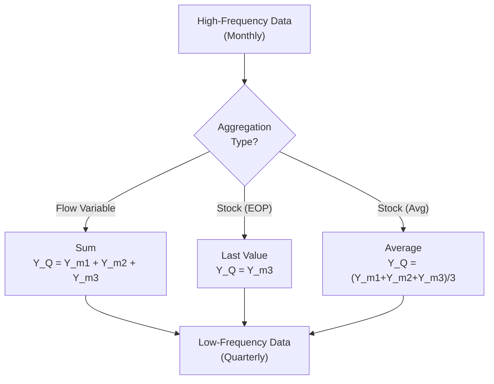
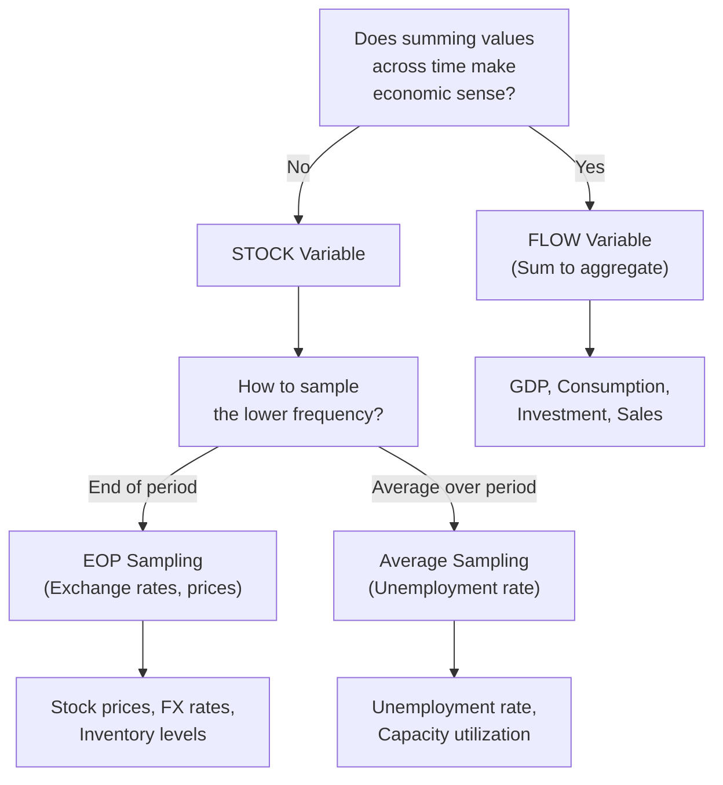
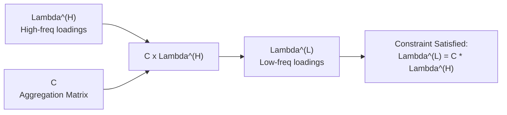
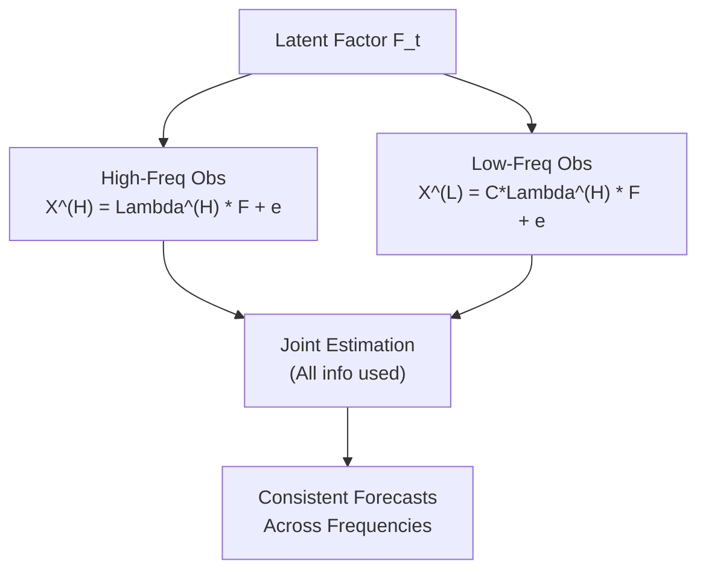
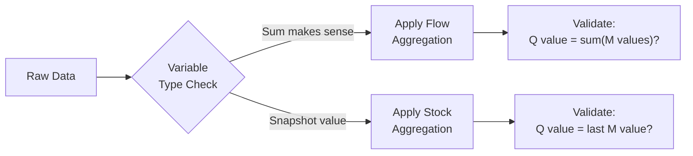
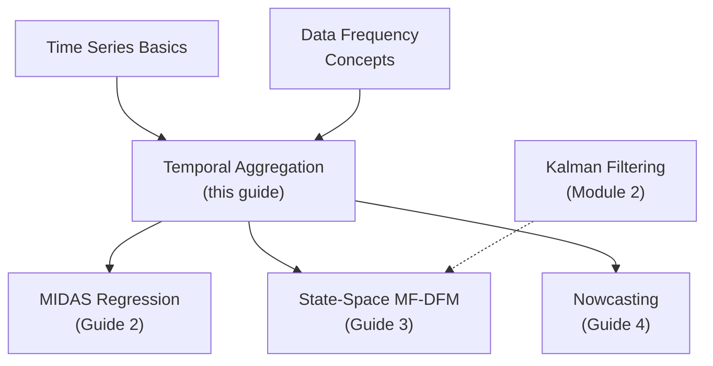

<!-- _class: lead -->

# Temporal Aggregation in Mixed-Frequency Models

## Module 5: Mixed Frequency

**Key idea:** Flow variables sum over periods; stock variables reflect point-in-time values. Aggregation constraints preserve consistency across frequencies.

<!-- Speaker notes: Welcome to Temporal Aggregation in Mixed-Frequency Models. This deck is part of Module 05 Mixed Frequency. -->
---

# Why Temporal Aggregation Matters

> Ignoring aggregation rules leads to misspecified models and biased forecasts.



<!-- Speaker notes: Use this diagram to illustrate the overall flow. Trace through each step with the audience. -->
---

<!-- _class: lead -->

# 1. Stock vs Flow Variables

<!-- Speaker notes: Welcome to 1. Stock vs Flow Variables. This deck is part of Module 05 Mixed Frequency. -->
---

# Formal Definitions

**Flow Variables**: Quantities measured over a period that can be summed across time.
- Examples: GDP, consumption, investment, sales
- $Y_t^Q = Y_{3t-2}^M + Y_{3t-1}^M + Y_{3t}^M$

**Stock Variables**: Quantities measured at a point in time.
- Examples: Unemployment rate, inventory levels, money supply
- $Y_t^Q = Y_{3t}^M$ (end-of-period sampling)

> **Bathtub analogy:** Flow = water flowing in per minute (additive). Stock = water level at a moment (snapshot).

<!-- Speaker notes: Cover the key points of Formal Definitions. Check for understanding before proceeding. -->
---

# Mathematical Framework

For $m$ high-frequency periods in one low-frequency period:

**Flow Aggregation:**
$$Y_t^{(L)} = \sum_{j=1}^{m} Y_{mt-(m-j)}^{(H)}$$

**Stock Aggregation (End-of-Period):**
$$Y_t^{(L)} = Y_{mt}^{(H)}$$

**Stock Aggregation (Average):**
$$Y_t^{(L)} = \frac{1}{m} \sum_{j=1}^{m} Y_{mt-(m-j)}^{(H)}$$

where $(H)$ = high frequency, $(L)$ = low frequency.

<!-- Speaker notes: Explain the notation carefully. Connect each term to its intuitive meaning before moving on. -->
---

# Variable Classification Decision Tree



<!-- Speaker notes: Use this diagram to illustrate the overall flow. Trace through each step with the audience. -->
---

# Code: Aggregation Functions

```python
import numpy as np
import pandas as pd

def aggregate_flow(monthly_data, freq='Q'):
    """Flow variables: sum within periods."""
    return monthly_data.resample(freq).sum()

def aggregate_stock_eop(monthly_data, freq='Q'):
    """Stock variables: last value in period."""
    return monthly_data.resample(freq).last()
```

<!-- Speaker notes: Walk through the first part of this code implementation. The code continues on the next slide. -->
---

# Code: Aggregation Functions (continued)

```python

def aggregate_stock_average(monthly_data, freq='Q'):
    """Stock variables: average over period."""
    return monthly_data.resample(freq).mean()

# GDP (flow) -> sum to quarterly
quarterly_gdp = aggregate_flow(monthly_gdp)
# Unemployment (stock) -> end-of-period or average
quarterly_unemp = aggregate_stock_eop(monthly_unemp)
```

<!-- Speaker notes: Continue walking through the implementation. Highlight the key output and how to verify correctness. -->
---

<!-- _class: lead -->

# 2. Aggregation Constraints

<!-- Speaker notes: Welcome to 2. Aggregation Constraints. This deck is part of Module 05 Mixed Frequency. -->
---

# Constraint Matrices

When modeling mixed-frequency data with factors, aggregation constraints ensure consistency:

$$\Lambda^{(L)} = C \Lambda^{(H)}$$

where $C$ is an aggregation matrix encoding the temporal relationship.



<!-- Speaker notes: Use this diagram to illustrate the overall flow. Trace through each step with the audience. -->
---

# Flow vs Stock Constraint Matrices

**Flow** (monthly-to-quarterly, $m=3$):

$$C_{\text{flow}} = \begin{bmatrix}
1 & 1 & 1 & 0 & 0 & 0 & \cdots \\
0 & 0 & 0 & 1 & 1 & 1 & \cdots \\
\vdots & \vdots & \vdots & \vdots & \vdots & \vdots & \ddots
\end{bmatrix}$$

**Stock (EOP):**

$$C_{\text{stock}} = \begin{bmatrix}
0 & 0 & 1 & 0 & 0 & 0 & \cdots \\
0 & 0 & 0 & 0 & 0 & 1 & \cdots \\
\vdots & \vdots & \vdots & \vdots & \vdots & \vdots & \ddots
\end{bmatrix}$$

Each row of $C_{\text{flow}}$ sums 3 months; each row of $C_{\text{stock}}$ selects last month.

<!-- Speaker notes: Explain the notation carefully. Connect each term to its intuitive meaning before moving on. -->
---

# Code: Aggregation Matrix Construction

```python
def create_aggregation_matrix(n_high, n_low, m, agg_type='flow'):
    C = np.zeros((n_low, n_high))
    if agg_type == 'flow':
        for i in range(n_low):
            start_idx = i * m
            end_idx = min(start_idx + m, n_high)
            C[i, start_idx:end_idx] = 1
    elif agg_type == 'stock_eop':
        for i in range(n_low):
            idx = min((i + 1) * m - 1, n_high - 1)
            C[i, idx] = 1
```

<!-- Speaker notes: Walk through the first part of this code implementation. The code continues on the next slide. -->
---

# Code: Aggregation Matrix Construction (continued)

```python
    elif agg_type == 'stock_avg':
        for i in range(n_low):
            start_idx = i * m
            end_idx = min(start_idx + m, n_high)
            n_periods = end_idx - start_idx
            C[i, start_idx:end_idx] = 1 / n_periods
    return C

# Verify: monthly [1..12] -> Q1 flow = 1+2+3 = 6
monthly_values = np.arange(1, 13)
C_flow = create_aggregation_matrix(12, 4, m=3, agg_type='flow')
print(C_flow @ monthly_values)  # [6, 15, 24, 33]
```

<!-- Speaker notes: Continue walking through the implementation. Highlight the key output and how to verify correctness. -->
---

<!-- _class: lead -->

# 3. Constrained Factor Models

<!-- Speaker notes: Welcome to 3. Constrained Factor Models. This deck is part of Module 05 Mixed Frequency. -->
---

# Mixed-Frequency Factor Model with Constraints

**High-frequency observation:**
$$X_t^{(H)} = \Lambda^{(H)} F_t + e_t^{(H)}$$

**Low-frequency observation (constrained):**
$$X_t^{(L)} = C \Lambda^{(H)} F_t + e_t^{(L)} = \Lambda^{(L)} F_t + e_t^{(L)}$$



<!-- Speaker notes: Use this diagram to illustrate the overall flow. Trace through each step with the audience. -->
---

# Why Constraints Matter

<div class="columns">
<div>

**Without Constraints:**
- Low-freq loadings estimated independently
- Inconsistent with high-freq structure
- Poor out-of-sample forecasts
- Wasted information

</div>
<div>

**With Constraints:**
- Parameters tied across frequencies
- Efficient use of all information
- Theoretically consistent forecasts
- Better parameter estimates

</div>
</div>

| Approach | Parameters | Consistency | Forecast Quality |
|----------|:----------:|:-----------:|:----------------:|
| Unconstrained | $N_H r + N_L r$ | No | Lower |
| Constrained | $N_H r$ only | Yes | Higher |

<!-- Speaker notes: Walk through the key rows of this comparison table. Highlight the most important distinctions. -->
---

# ConstrainedMixedFrequencyDFM Class

```python
class ConstrainedMixedFrequencyDFM:
    def __init__(self, n_factors, agg_type='flow', m=3):
        self.n_factors = n_factors
        self.agg_type = agg_type
        self.m = m

    def fit(self, X_high, X_low, n_iter=100):
        T_high, N_high = X_high.shape
        T_low, N_low = X_low.shape
        self.C = create_aggregation_matrix(
            T_high, T_low, self.m, self.agg_type
        )
```

<!-- Speaker notes: Walk through the first part of this code implementation. The code continues on the next slide. -->
---

# ConstrainedMixedFrequencyDFM Class (continued)

```python
        # Initialize from PCA on high-frequency data
        pca = PCA(n_components=self.n_factors)
        F_init = pca.fit_transform(X_high)
        self.Lambda_H = pca.components_.T
        # Low-freq loadings derived, NOT estimated separately
        self.Lambda_L = self.C @ self.Lambda_H
        # EM iterations with constraint enforcement...
        return self
```

<!-- Speaker notes: Continue walking through the implementation. Highlight the key output and how to verify correctness. -->
---

<!-- _class: lead -->

# 4. Common Pitfalls

<!-- Speaker notes: Welcome to 4. Common Pitfalls. This deck is part of Module 05 Mixed Frequency. -->
---

# Pitfalls to Avoid

| Pitfall | Problem | Solution |
|---------|---------|----------|
| Misidentifying variable type | Summing stock variables (rates) | Ask: "Does summing make sense?" |
| Ignoring skip-sampled data | Only using quarterly obs | Incorporate all high-freq info |
| Inconsistent timing | Mixing EOP and average sampling | Document and enforce conventions |
| Neglecting uneven periods | Assuming equal month lengths | Use date-aware pandas operations |



<!-- Speaker notes: Emphasize these common mistakes. Ask learners if they have encountered any of these in practice. -->
---

# Practice Problems

**Conceptual:**
1. Why would summing stock variables (like unemployment rates) across months produce meaningless results?
2. A quarterly model divides quarterly GDP by 3 to get monthly. What aggregation type is assumed? Is it correct?
3. Daily stock prices + monthly trading volume: how to aggregate each to quarterly?

**Implementation:**
4. Implement `check_aggregation_consistency(monthly, quarterly, agg_type)`
5. Visualize flow vs stock aggregation for seasonal time series
6. Extend `create_aggregation_matrix` to handle ragged edges

**Extension:**
7. Derive $\text{Var}(e_t^{(L)})$ under flow aggregation if $\text{Var}(e_t^{(H)}) = \sigma^2$
8. Research Chow-Lin and Denton temporal disaggregation methods

<!-- Speaker notes: Give learners 3-5 minutes to work through these practice problems before discussing solutions. -->
---

# Connections & Summary



| Key Result | Detail |
|------------|--------|
| Flow vs Stock | Sum vs sample at end of period |
| Constraint matrix $C$ | Encodes temporal aggregation rule |
| $\Lambda^{(L)} = C \Lambda^{(H)}$ | Ensures cross-frequency consistency |
| Efficiency gains | Constrained models use all available information |

**References:** Mariano & Murasawa (2003), Banbura & Modugno (2014), Ghysels et al. (2004), Silvestrini & Veredas (2008)

<!-- Speaker notes: Summarize the key takeaways and highlight how this topic connects to upcoming material. -->