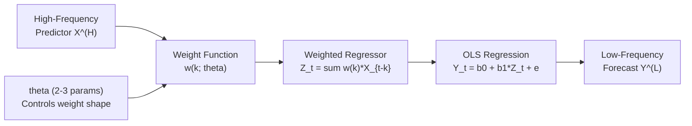
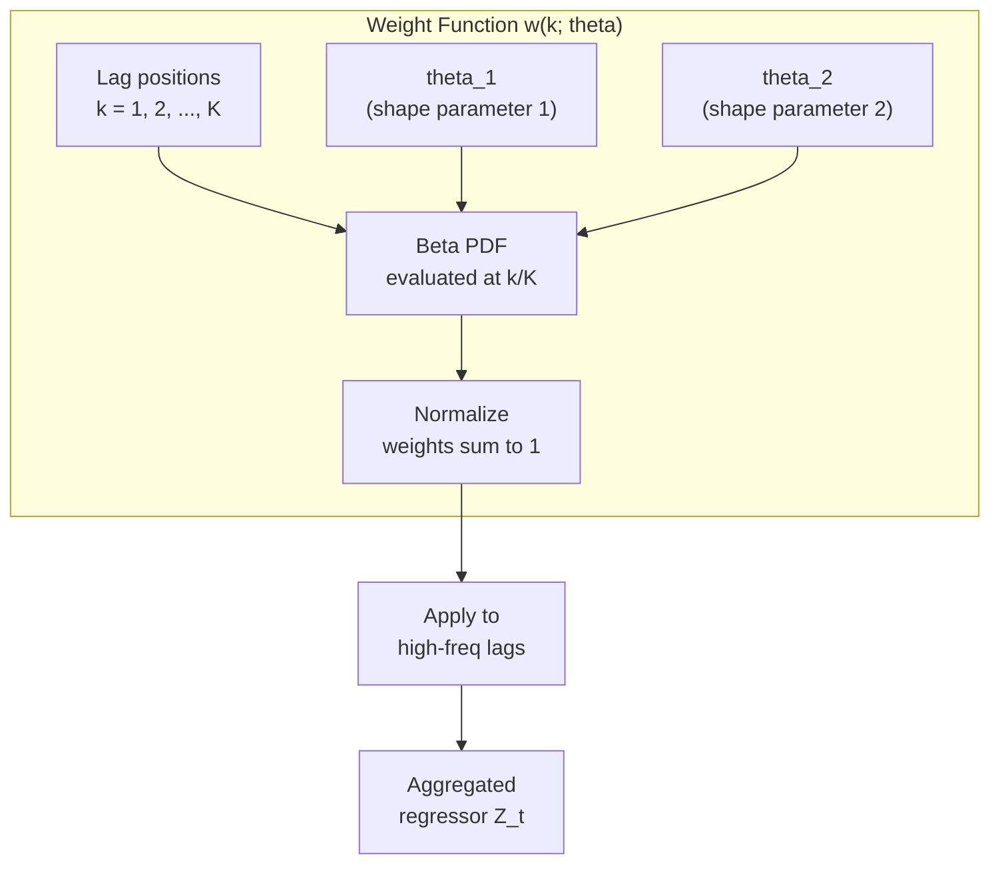
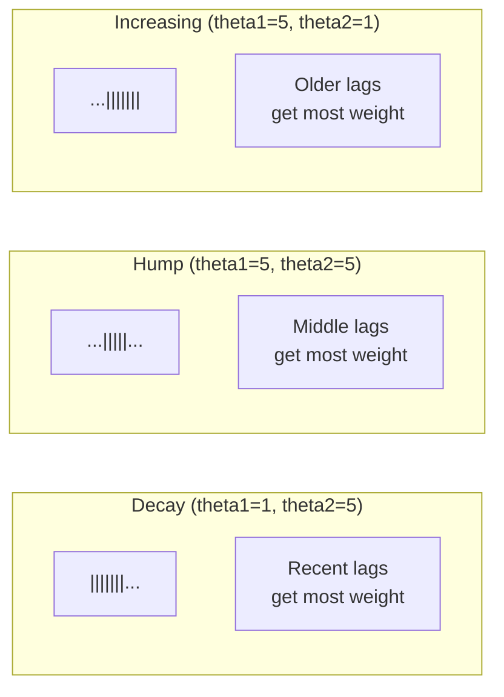
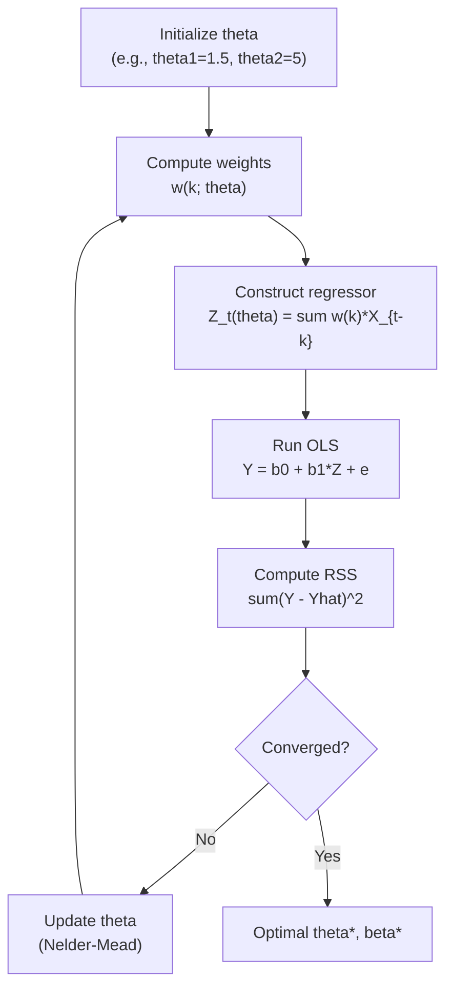
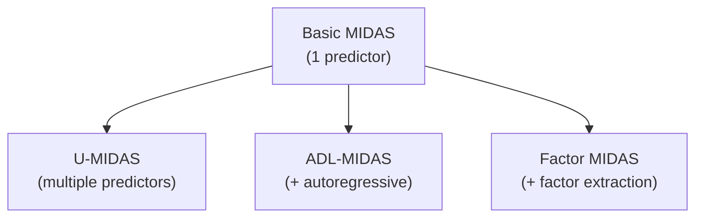
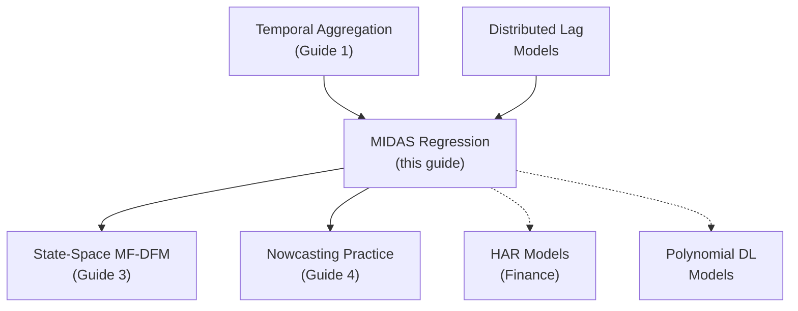

<!-- _class: lead -->

# MIDAS Regression: Mixed Data Sampling

## Module 5: Mixed Frequency

**Key idea:** Replace hundreds of lag coefficients with 2-3 hyperparameters controlling a smooth weighting function for parsimonious mixed-frequency forecasting.

<!-- Speaker notes: Welcome to MIDAS Regression: Mixed Data Sampling. This deck is part of Module 05 Mixed Frequency. -->
---

# The MIDAS Innovation

> Standard distributed lag: 60 parameters for 60 daily lags. MIDAS: 3 parameters for the same information.



| Approach | Parameters | Flexibility | Overfitting Risk |
|----------|:----------:|:-----------:|:----------------:|
| Unrestricted DL | $K \times m$ | Maximum | High |
| Geometric decay | 1 | Low | Low |
| MIDAS (Beta) | 2-3 | High | Low |

<!-- Speaker notes: Use this diagram to illustrate the overall flow. Trace through each step with the audience. -->
---

<!-- _class: lead -->

# 1. The MIDAS Framework

<!-- Speaker notes: Welcome to 1. The MIDAS Framework. This deck is part of Module 05 Mixed Frequency. -->
---

# Basic MIDAS Setup

**Predict** low-frequency $Y_t^{(L)}$ **using** high-frequency $X_s^{(H)}$:

$$Y_t^{(L)} = \beta_0 + \beta_1 B(L; \theta) X_t^{(H)} + \varepsilon_t$$

where $B(L; \theta) = \sum_{k=1}^{K} w(k; \theta) L^{k-1}$

**The Challenge:** Standard DL model needs $K \times m$ parameters:

$$Y_t = \beta_0 + \sum_{k=0}^{K-1} \sum_{j=1}^{m} \beta_{k,j} X_{t-k,j}^{(H)} + \varepsilon_t$$

**The Solution:** Parametric weight function $w(k; \theta)$ with small $\theta$

> MIDAS weights act as a "decay function" -- recent observations get higher weight, smoothly decaying via 2-3 hyperparameters.

<!-- Speaker notes: Explain the notation carefully. Connect each term to its intuitive meaning before moving on. -->
---

# How MIDAS Weights Work



<!-- Speaker notes: Use this diagram to illustrate the overall flow. Trace through each step with the audience. -->
---

<!-- _class: lead -->

# 2. Weighting Functions

<!-- Speaker notes: Welcome to 2. Weighting Functions. This deck is part of Module 05 Mixed Frequency. -->
---

# Beta Weighting Function

The most popular MIDAS weighting scheme uses the Beta distribution:

$$w(k; \theta_1, \theta_2) = \frac{f\left(\frac{k}{K}; \theta_1, \theta_2\right)}{\sum_{j=1}^{K} f\left(\frac{j}{K}; \theta_1, \theta_2\right)}$$

where $f(x; \theta_1, \theta_2) = \frac{x^{\theta_1 - 1}(1-x)^{\theta_2 - 1}}{B(\theta_1, \theta_2)}$

| $\theta_1$ | $\theta_2$ | Shape | Interpretation |
|:-----------:|:-----------:|:-----:|----------------|
| $< 1$ | $> 1$ | Monotone decreasing | Recent lags dominate |
| $> 1$ | $> 1$ | Hump-shaped | Middle lags important |
| $> 1$ | $< 1$ | Monotone increasing | Older lags dominate |
| $= 1$ | $= 1$ | Flat (uniform) | All lags equal |

<!-- Speaker notes: Explain the notation carefully. Connect each term to its intuitive meaning before moving on. -->
---

# Beta Weight Patterns



```python
def midas_beta_weights(K, theta1, theta2, normalize=True):
    from scipy.stats import beta as beta_dist
    x = np.linspace(1/K, 1, K)
    weights = beta_dist.pdf(x, theta1, theta2)
    if normalize:
        weights = weights / weights.sum()
    return weights

# Exponential decay pattern
w_decay = midas_beta_weights(20, theta1=1, theta2=5)
# Hump-shaped pattern
w_hump = midas_beta_weights(20, theta1=5, theta2=5)
```

<!-- Speaker notes: Walk through this code step by step. Highlight the key lines and explain the output. -->
---

# Exponential Almon Lag Weights

Alternative specification using exponential of polynomial:

$$w(k; \theta) = \frac{\exp\left(\theta_1 k + \theta_2 k^2 + \ldots\right)}{\sum_{j=1}^{K} \exp\left(\theta_1 j + \theta_2 j^2 + \ldots\right)}$$

```python
def midas_almon_weights(K, theta, normalize=True):
    theta = np.atleast_1d(theta)
    lags = np.arange(1, K + 1)
    polynomial = sum(t * lags**i for i, t in enumerate(theta, start=1))
    weights = np.exp(polynomial)
    if normalize:
        weights = weights / weights.sum()
    return weights

# Linear decay
w_almon = midas_almon_weights(20, theta=[-0.1])
# Quadratic hump
w_almon_hump = midas_almon_weights(20, theta=[-0.05, 0.005])
```

<!-- Speaker notes: Walk through this code step by step. Highlight the key lines and explain the output. -->
---

<!-- _class: lead -->

# 3. MIDAS Estimation

<!-- Speaker notes: Welcome to 3. MIDAS Estimation. This deck is part of Module 05 Mixed Frequency. -->
---

# Nonlinear Least Squares

MIDAS is **nonlinear** in $\theta$ but linear in $\beta_0, \beta_1$:

$$Y_t = \beta_0 + \beta_1 \sum_{k=1}^{K} w(k; \theta) X_{t-(k-1)/m}^{(H)} + \varepsilon_t$$



<!-- Speaker notes: Use this diagram to illustrate the overall flow. Trace through each step with the audience. -->
---

# MIDASRegression Class

```python
class MIDASRegression:
    def __init__(self, K, weight_function='beta', m=3):
        self.K = K
        self.weight_function = weight_function
        self.m = m

```

<!-- Speaker notes: Walk through the first part of this code implementation. The code continues on the next slide. -->
---

# MIDASRegression Class (continued)

```python
    def fit(self, Y_low, X_high, theta_init=None):
        if theta_init is None:
            theta_init = [1.5, 5.0] if self.weight_function == 'beta' \
                         else [-0.1]
        result = minimize(
            self._objective, theta_init,
            args=(Y_low, X_high), method='Nelder-Mead'
        )
        self.theta_opt = result.x
        self.weights_opt = midas_beta_weights(self.K, *self.theta_opt)
        # Compute optimal beta via OLS
        Z = self._construct_weighted_regressor(X_high, self.theta_opt)
        X_ols = np.column_stack([np.ones(len(Z)), Z])
        self.beta_opt = np.linalg.lstsq(X_ols, Y_low, rcond=None)[0]
        return self
```

<!-- Speaker notes: Continue walking through the implementation. Highlight the key output and how to verify correctness. -->
---

<!-- _class: lead -->

# 4. Extensions

<!-- Speaker notes: Welcome to 4. Extensions. This deck is part of Module 05 Mixed Frequency. -->
---

# MIDAS Variants

<div class="columns">
<div>

**U-MIDAS (Unrestricted)**
$$Y_t = \beta_0 + \beta_1 B(L; \theta_1) X_t^{(1)} + \beta_2 B(L; \theta_2) X_t^{(2)} + \varepsilon_t$$

Multiple predictors with different weight functions.

**ADL-MIDAS (Autoregressive)**
$$Y_t = \alpha Y_{t-1} + \beta_0 + \beta_1 B(L; \theta) X_t^{(H)} + \varepsilon_t$$

Captures target persistence.

</div>
<div>

**MIDAS with Factors**
$$Y_t = \beta_0 + \beta_1 B(L; \theta) \hat{F}_t + \varepsilon_t$$

Factors from many high-freq predictors, then MIDAS weighting.



</div>
</div>

<!-- Speaker notes: Use this diagram to illustrate the overall flow. Trace through each step with the audience. -->
---

# Common Pitfalls

| Pitfall | Symptom | Solution |
|---------|---------|----------|
| Too few lags ($K$ too small) | Poor fit, residual autocorrelation | $K \geq 2m$ (at least 2 low-freq periods) |
| Optimization failure | Unstable estimates, boundary solutions | Multiple initializations, constraints |
| Temporal misalignment | Systematic forecast errors | Carefully align dates, account for pub lags |
| Unrestricted lags | Overfitting | Use MIDAS weights for smoothness |

<!-- Speaker notes: Emphasize these common mistakes. Ask learners if they have encountered any of these in practice. -->
---

# Practice Problems

**Conceptual:**
1. Why is MIDAS nonlinear in parameters? Implications for inference?
2. Compare beta weights ($\theta_1=1, \theta_2=5$) to geometric decay. When is each preferable?
3. Forecasting quarterly GDP with daily stock returns: how to choose $K$?

**Implementation:**
4. Implement standard errors for MIDAS parameters via the delta method
5. "MIDAS race": compare beta, Almon, and unrestricted on real data
6. Extend `MIDASRegression` to handle multiple predictors

**Extension:**
7. Derive the relationship between MIDAS weights and state-space representation
8. Implement MIDAS-QR (quantile regression) to forecast distributions

<!-- Speaker notes: Give learners 3-5 minutes to work through these practice problems before discussing solutions. -->
---

# Connections & Summary



| Key Result | Detail |
|------------|--------|
| Parsimony | 2-3 hyperparameters replace $K \times m$ lag coefficients |
| Beta weights | Flexible, smooth lag patterns via Beta distribution |
| NLS estimation | Optimize theta, then OLS for beta |
| Extensions | U-MIDAS, ADL-MIDAS, Factor-MIDAS |

**References:** Ghysels, Santa-Clara & Valkanov (2006), Ghysels, Sinko & Valkanov (2007), Andreou, Ghysels & Kourtellos (2013), Foroni, Marcellino & Schumacher (2015)

<!-- Speaker notes: Summarize the key takeaways and highlight how this topic connects to upcoming material. -->