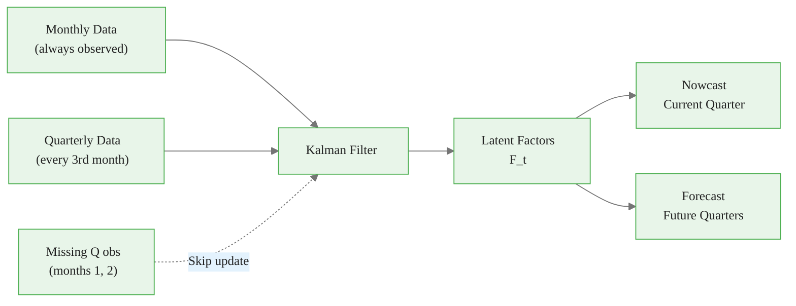
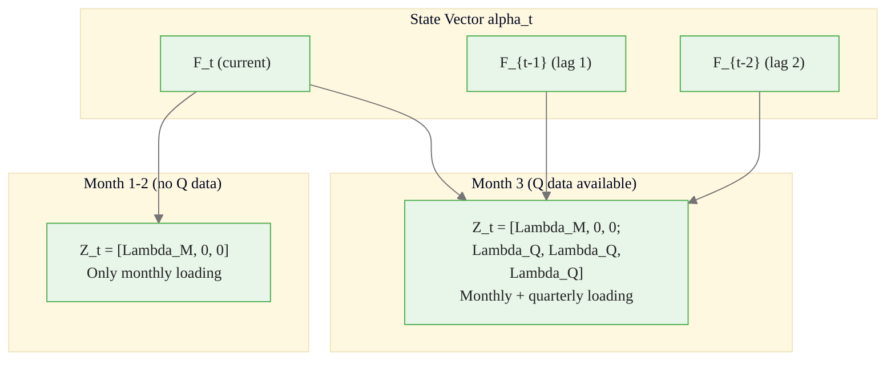
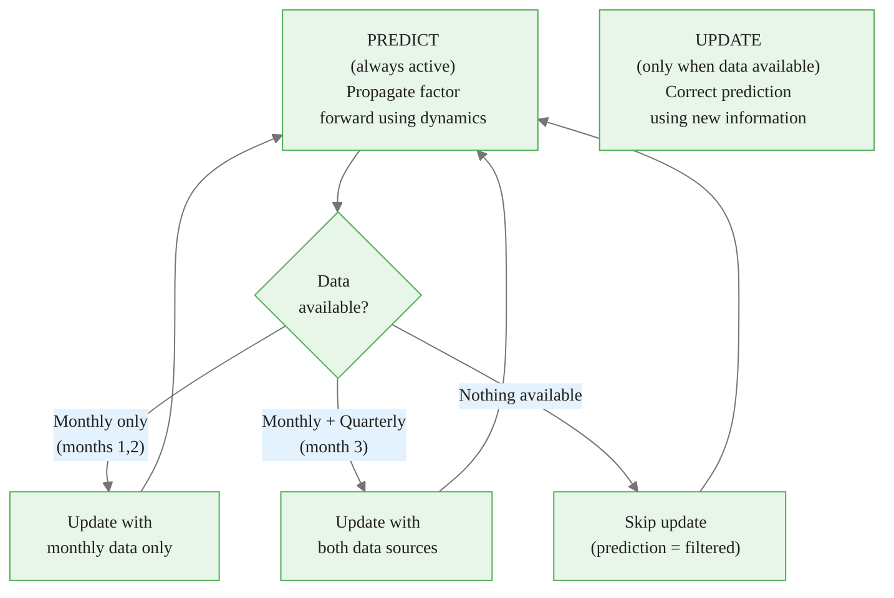
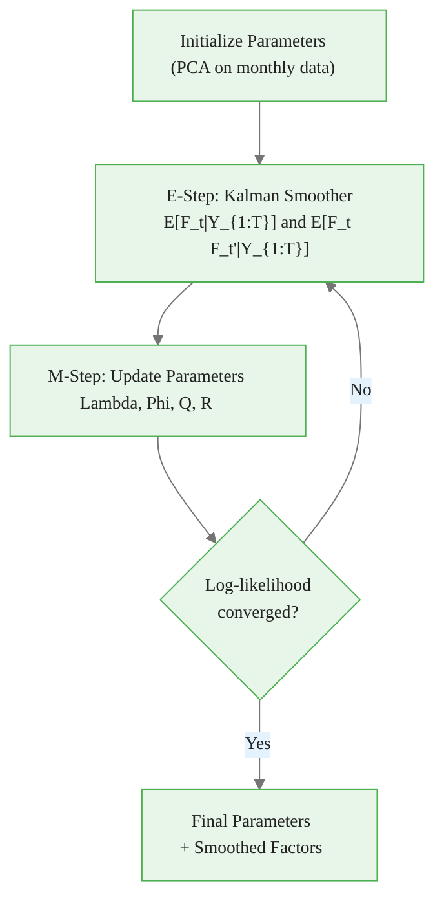
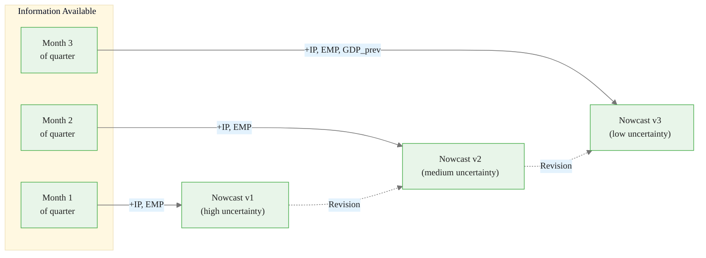
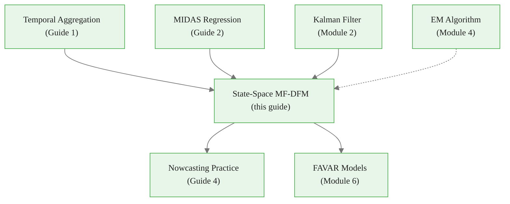

<!-- _class: lead -->

# State-Space Mixed-Frequency DFMs

## Module 5: Mixed Frequency

**Key idea:** Treat low-frequency observations as "missing data" in non-release months. The Kalman filter handles this automatically, seamlessly integrating all available information.

<!-- Speaker notes: Welcome to State-Space Mixed-Frequency DFMs. This deck is part of Module 05 Mixed Frequency. -->
---

# The Unified Framework

> The Kalman filter naturally handles mixed frequencies by skipping the update step when observations are missing.



<div class="callout-key">

Key implementation detail -- study this pattern carefully.

</div>

<!-- Speaker notes: Use this diagram to illustrate the overall flow. Trace through each step with the audience. -->
---

<!-- _class: lead -->

# 1. State-Space Representation

<!-- Speaker notes: Welcome to 1. State-Space Representation. This deck is part of Module 05 Mixed Frequency. -->
---

# Factor Dynamics and Observations

**State Equation (Factor VAR):**
$$F_t = \Phi_1 F_{t-1} + \Phi_2 F_{t-2} + \ldots + \Phi_p F_{t-p} + \eta_t, \quad \eta_t \sim N(0, Q)$$

**Monthly observations:**
$$X_t^{(M)} = \Lambda^{(M)} F_t + e_t^{(M)}$$

**Quarterly flow observations:**
$$X_t^{(Q)} = \Lambda^{(Q)} (F_t + F_{t-1} + F_{t-2}) + e_t^{(Q)}$$

**Quarterly stock observations:**
$$X_t^{(Q)} = \Lambda^{(Q)} F_t + e_t^{(Q)}$$

> Quarterly observation available only every 3rd month; otherwise treated as missing.

<!-- Speaker notes: Explain the notation carefully. Connect each term to its intuitive meaning before moving on. -->
---

# Compact State-Space Form

**State:** $\alpha_{t+1} = T \alpha_t + R \eta_t$

**Observation:** $Y_t = Z_t \alpha_t + \varepsilon_t$ (note: $Z_t$ is **time-varying**)



<div class="callout-insight">

This pattern recurs throughout the course. Understanding it deeply pays dividends later.

</div>

<!-- Speaker notes: Continue walking through the implementation. Highlight the key output and how to verify correctness. -->
---

<!-- _class: lead -->

# 2. Handling Mixed Frequencies

<!-- Speaker notes: Welcome to 2. Handling Mixed Frequencies. This deck is part of Module 05 Mixed Frequency. -->
---

# The Ragged Edge Problem

In real-time forecasting, data availability is uneven:

```
Month:    Jan  Feb  Mar  Apr  May  Jun
Monthly:   X    X    X    X    X    X   (available)
Quarterly: -    -    Q1   -    -    ?   (Q2 pending)
```

**Solution:** The Kalman filter operates in two modes:



<div class="callout-warning">

Watch for edge cases with this implementation in production use.

</div>

<!-- Speaker notes: Use this diagram to illustrate the overall flow. Trace through each step with the audience. -->
---

# Dynamic Observation Matrix

**Months 1, 2 (within quarter):**
$$Z_t = \begin{bmatrix} \Lambda^{(M)} \\ 0 \end{bmatrix}, \quad Y_t = \begin{bmatrix} X_t^{(M)} \\ \cdot \end{bmatrix}$$

**Month 3 (end of quarter):**
$$Z_t = \begin{bmatrix} \Lambda^{(M)} \\ \Lambda^{(Q)} \end{bmatrix}, \quad Y_t = \begin{bmatrix} X_t^{(M)} \\ X_t^{(Q)} \end{bmatrix}$$

The dot ($\cdot$) = missing observation. Kalman filter skips update for that row.

> When quarterly data arrives, we get a larger "information gain" because it provides new signal not available in the monthly data.

<!-- Speaker notes: Explain the notation carefully. Connect each term to its intuitive meaning before moving on. -->
---

<!-- _class: lead -->

# 3. Concrete Example

<!-- Speaker notes: Welcome to 3. Concrete Example. This deck is part of Module 05 Mixed Frequency. -->
---

# Example: 2 Monthly + 1 Quarterly Variable

**Monthly:** IP, Employment | **Quarterly:** GDP (flow)

**State vector** (with lags for flow aggregation):
$$\alpha_t = \begin{bmatrix} F_t \\ F_{t-1} \\ F_{t-2} \end{bmatrix}$$

**State transition:**
$$\begin{bmatrix} F_{t+1} \\ F_t \\ F_{t-1} \end{bmatrix} = \begin{bmatrix} \phi & 0 & 0 \\ 1 & 0 & 0 \\ 0 & 1 & 0 \end{bmatrix} \begin{bmatrix} F_t \\ F_{t-1} \\ F_{t-2} \end{bmatrix} + \begin{bmatrix} \eta_{t+1} \\ 0 \\ 0 \end{bmatrix}$$

<!-- Speaker notes: Explain the notation carefully. Connect each term to its intuitive meaning before moving on. -->
---

# Observation Equations by Month

**Months 1, 2 (only monthly data):**
$$\begin{bmatrix} X_t^{IP} \\ X_t^{EMP} \end{bmatrix} = \begin{bmatrix} \lambda_{IP} & 0 & 0 \\ \lambda_{EMP} & 0 & 0 \end{bmatrix} \begin{bmatrix} F_t \\ F_{t-1} \\ F_{t-2} \end{bmatrix} + \begin{bmatrix} e_t^{IP} \\ e_t^{EMP} \end{bmatrix}$$

**Month 3 (monthly + quarterly GDP):**
$$\begin{bmatrix} X_t^{IP} \\ X_t^{EMP} \\ X_t^{GDP} \end{bmatrix} = \begin{bmatrix} \lambda_{IP} & 0 & 0 \\ \lambda_{EMP} & 0 & 0 \\ \lambda_{GDP} & \lambda_{GDP} & \lambda_{GDP} \end{bmatrix} \begin{bmatrix} F_t \\ F_{t-1} \\ F_{t-2} \end{bmatrix} + \begin{bmatrix} e_t^{IP} \\ e_t^{EMP} \\ e_t^{GDP} \end{bmatrix}$$

> The third row sums factors across 3 months (flow aggregation constraint).

<!-- Speaker notes: Explain the notation carefully. Connect each term to its intuitive meaning before moving on. -->
---

# MixedFrequencyDFM Class

```python
class MixedFrequencyDFM:
    def __init__(self, n_factors=1, factor_order=1):
        self.n_factors = n_factors
        self.state_dim = 3 * n_factors  # current + 2 lags

    def _build_state_space(self, lambda_m, lambda_q, phi,
                           sigma_eta, sigma_m, sigma_q):
        # State transition: AR(1) + lag structure
        self.T = np.zeros((self.state_dim, self.state_dim))
        self.T[0, 0] = phi   # AR dynamics
        self.T[1, 0] = 1     # F_{t-1} = F_t (lagged)
        self.T[2, 1] = 1     # F_{t-2} = F_{t-1} (lagged)
```

<div class="callout-info">

This approach follows established best practices in the field.

</div>

<!-- Speaker notes: Walk through the first part of this code implementation. The code continues on the next slide. -->
---

# MixedFrequencyDFM Class (continued)

```python

        # Monthly: only current factor
        self.Z_monthly = np.zeros((len(lambda_m), self.state_dim))
        self.Z_monthly[:, 0] = lambda_m

        # Quarterly: sum of current + 2 lags (flow)
        self.Z_quarterly = np.zeros((len(lambda_q), self.state_dim))
        self.Z_quarterly[:, 0] = lambda_q  # F_t
        self.Z_quarterly[:, 1] = lambda_q  # F_{t-1}
        self.Z_quarterly[:, 2] = lambda_q  # F_{t-2}
```

<!-- Speaker notes: Continue walking through the implementation. Highlight the key output and how to verify correctness. -->
---

# Kalman Filter with Mixed Frequency

```python
def kalman_filter(self, data_monthly, data_quarterly, quarterly_periods):
    for t in range(T):
        # Select observation matrix based on data availability
        if quarterly_periods[t]:
            y_t = np.concatenate([data_monthly[t], data_quarterly[t]])
            Z_t = np.vstack([self.Z_monthly, self.Z_quarterly])
            H_t = linalg.block_diag(self.H_monthly, self.H_quarterly)
        else:
            y_t = data_monthly[t]
            Z_t = self.Z_monthly
            H_t = self.H_monthly
```

<!-- Speaker notes: Walk through the first part of this code implementation. The code continues on the next slide. -->
---

# Kalman Filter with Mixed Frequency (continued)

<div class="code-window">
<div class="code-header">
<div class="dots"><span class="dot-red"></span><span class="dot-yellow"></span><span class="dot-green"></span></div>
<span class="filename">example.py</span>
</div>

```python

        # Remove NaN observations
        valid = ~np.isnan(y_t)
        y_t, Z_t, H_t = y_t[valid], Z_t[valid,:], H_t[np.ix_(valid,valid)]

        # Standard Kalman update (if any data available)
        v_t = y_t - Z_t @ state_pred          # Innovation
        F_t = Z_t @ P_pred @ Z_t.T + H_t      # Innovation variance
        K_t = P_pred @ Z_t.T @ inv(F_t)        # Kalman gain
        state_filt = state_pred + K_t @ v_t     # Filtered state
```

</div>

<!-- Speaker notes: Continue walking through the implementation. Highlight the key output and how to verify correctness. -->
---

<!-- _class: lead -->

# 4. ML Estimation via EM

<!-- Speaker notes: Welcome to 4. ML Estimation via EM. This deck is part of Module 05 Mixed Frequency. -->
---

# EM Algorithm for Mixed-Frequency DFM



**Aggregation constraint** $\Lambda^{(Q)} = C \Lambda^{(H)}$ can be:
1. **Imposed** in M-step (constrained regression)
2. **Tested** against unrestricted estimates
3. **Relaxed** if data strongly reject

<!-- Speaker notes: Use this diagram to illustrate the overall flow. Trace through each step with the audience. -->
---

<!-- _class: lead -->

# 5. Nowcasting with Ragged Edge

<!-- Speaker notes: Welcome to 5. Nowcasting with Ragged Edge. This deck is part of Module 05 Mixed Frequency. -->
---

# The Nowcasting Problem

**Goal:** Estimate current quarter GDP before all data is available.



**Nowcast Decomposition:**
$$\hat{Y}_t^{Q|t+j} = E[Y_t^Q | X_{1:t+j}^M, X_{1:t-1}^Q]$$

where $j \in \{1, 2, 3\}$ = months into quarter.

<!-- Speaker notes: Use this diagram to illustrate the overall flow. Trace through each step with the audience. -->
---

# Real-Time Nowcasting Code

<div class="code-window">
<div class="code-header">
<div class="dots"><span class="dot-red"></span><span class="dot-yellow"></span><span class="dot-green"></span></div>
<span class="filename">nowcast_with_ragged_edge.py</span>
</div>

```python
def nowcast_with_ragged_edge(model, historical_monthly,
                              historical_quarterly,
                              new_monthly_data, quarter_to_nowcast):
    # Combine historical and new data
    data_m = np.vstack([historical_monthly, new_monthly_data])
    data_q = np.vstack([
        historical_quarterly,
        np.full((len(new_monthly_data), 1), np.nan)
    ])
    # New months don't have quarterly data
    quarterly_periods = np.zeros(len(data_m), dtype=bool)
    quarterly_periods[2::3] = True
    quarterly_periods[len(historical_monthly):] = False
```

</div>

<!-- Speaker notes: Walk through the first part of this code implementation. The code continues on the next slide. -->
---

# Real-Time Nowcasting Code (continued)

<div class="code-window">
<div class="code-header">
<div class="dots"><span class="dot-red"></span><span class="dot-yellow"></span><span class="dot-green"></span></div>
<span class="filename">example.py</span>
</div>

```python

    # Run Kalman filter
    state_filtered, state_cov, _ = model.kalman_filter(
        data_m, data_q, quarterly_periods
    )
    # Nowcast = lambda_Q * (F_t + F_{t-1} + F_{t-2})
    idx = quarter_to_nowcast * 3 + 2
    factor_sum = state_filtered[idx-2:idx+1, 0].sum()
    return model.Z_quarterly[0, 0] * factor_sum
```

</div>

<!-- Speaker notes: Continue walking through the implementation. Highlight the key output and how to verify correctness. -->
---

# Common Pitfalls

| Pitfall | Problem | Solution |
|---------|---------|----------|
| Insufficient state lags | Can't accommodate flow aggregation | State needs $m-1$ lags for $m$-freq ratio |
| Misaligned timing | Systematic nowcast bias | Document publication timing carefully |
| Ignoring pub lags | Overly optimistic backtests | Model vintage structure |
| No uncertainty | Overconfident nowcasts | Report prediction standard errors |

<!-- Speaker notes: Emphasize these common mistakes. Ask learners if they have encountered any of these in practice. -->
---

# Practice Problems

**Conceptual:**
1. Why does the Kalman filter naturally handle mixed-frequency data?
2. How does state dimension change for flow vs stock quarterly variables?
3. Is nowcast uncertainty higher at quarter start or end? Why?

**Implementation:**
4. Extend the code for multiple factors with different VAR orders
5. Implement the Kalman smoother (backward pass)
6. Create a "vintage" dataset generator mimicking real-time data

**Extension:**
7. Derive the exact nowcast variance accounting for parameter uncertainty
8. Compare state-space MF-DFM to MIDAS: when is each preferable?

<!-- Speaker notes: Give learners 3-5 minutes to work through these practice problems before discussing solutions. -->
---

# Connections & Summary



| Key Result | Detail |
|------------|--------|
| Time-varying $Z_t$ | Observation matrix changes based on data availability |
| State with lags | $\alpha_t = [F_t, F_{t-1}, F_{t-2}]'$ for flow aggregation |
| Missing data | Kalman filter skips update; uses prediction only |
| Nowcast improves | Uncertainty decreases as more monthly data arrives |

**References:** Mariano & Murasawa (2003), Banbura & Modugno (2014), Giannone, Reichlin & Small (2008), Banbura et al. (2013)

<!-- Speaker notes: Summarize the key takeaways and highlight how this topic connects to upcoming material. -->