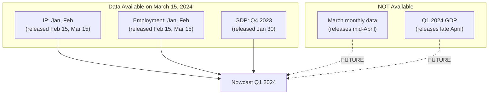
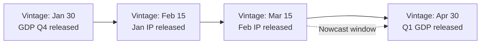
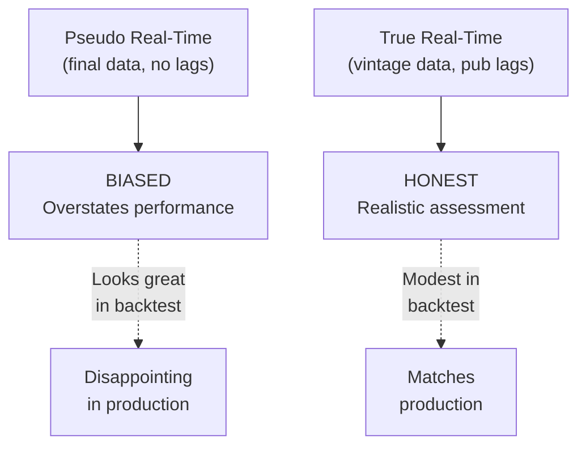
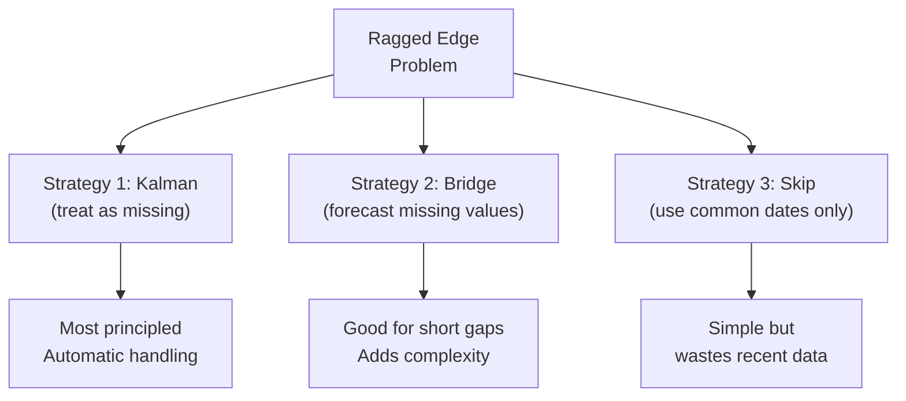
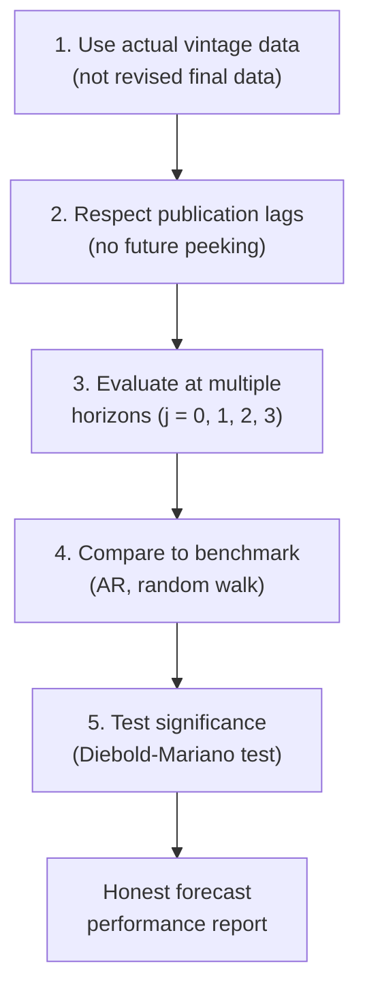
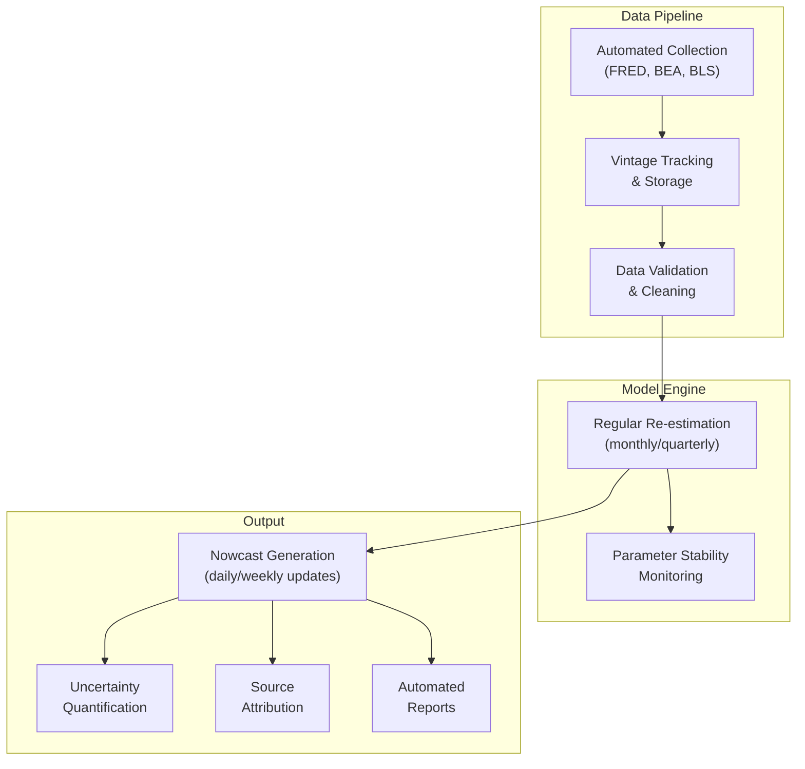
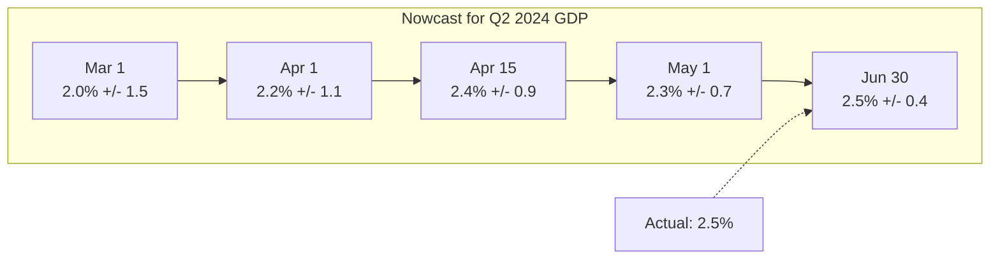
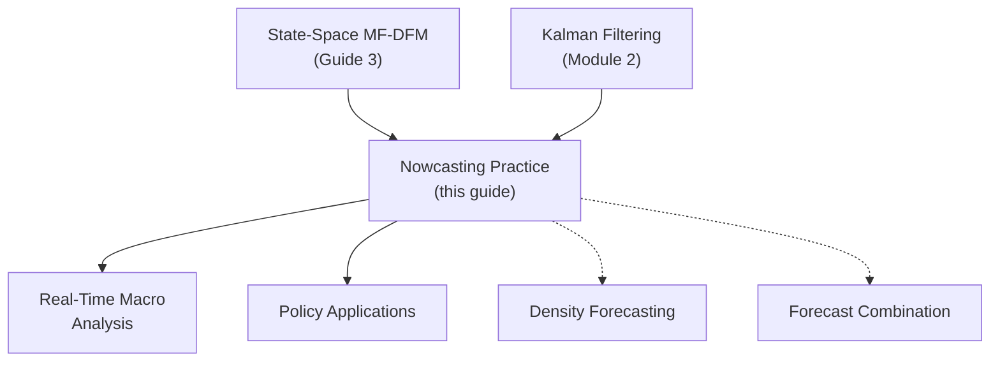

<!-- _class: lead -->

# Nowcasting Practice: Real-Time Evaluation

## Module 5: Mixed Frequency

**Key idea:** The fundamental challenge is data management -- tracking what was actually available at each forecast origin, accounting for publication lags and revisions. Ignoring this overstates true forecast performance.

<!-- Speaker notes: Welcome to Nowcasting Practice: Real-Time Evaluation. This deck is part of Module 05 Mixed Frequency. -->
---

# The Real-Time Data Challenge



> **Real-time constraint:** Can only use data published before the forecast date.

<!-- Speaker notes: Use this diagram to illustrate the overall flow. Trace through each step with the audience. -->
---

<!-- _class: lead -->

# 1. Data Vintages and Revisions

<!-- Speaker notes: Welcome to 1. Data Vintages and Revisions. This deck is part of Module 05 Mixed Frequency. -->
---

# Vintage Control

**Data Vintage:** The dataset available at a specific point in time.

| Issue | Example | Impact |
|-------|---------|--------|
| Publication lags | GDP for Q1 released in April | Can't use Q1 GDP to nowcast Q1 |
| Revisions | Initial release revised later | First estimate != final |
| Different schedules | Monthly vs quarterly vs annual | Ragged edge |
| Ragged edge | Some series more current | Unbalanced information |



<!-- Speaker notes: Use this diagram to illustrate the overall flow. Trace through each step with the audience. -->
---

# Pseudo vs True Real-Time Evaluation

<div class="columns">
<div>

**Pseudo Out-of-Sample (WRONG):**
- Use final revised data
- Ignore publication lags
- Results: Overly optimistic

</div>
<div>

**True Real-Time (CORRECT):**
- Use vintage available at forecast origin
- Respect publication calendars
- Results: Realistic accuracy

</div>
</div>



<!-- Speaker notes: Use this diagram to illustrate the overall flow. Trace through each step with the audience. -->
---

# VintageDataManager Class

```python
class VintageDataManager:
    def __init__(self):
        self.vintages = {}
        self.publication_lags = {}

    def add_series(self, series_name, data, publication_lag_days):
        self.publication_lags[series_name] = publication_lag_days
        for vintage_date, vintage_data in data.groupby('vintage_date'):
            if vintage_date not in self.vintages:
                self.vintages[vintage_date] = {}
            self.vintages[vintage_date][series_name] = vintage_data
```

<!-- Speaker notes: Walk through the first part of this code implementation. The code continues on the next slide. -->
---

# VintageDataManager Class (continued)

```python

    def get_vintage(self, as_of_date, series_name):
        """Get data available as of specific date."""
        available = [v for v in self.vintages.keys() if v <= as_of_date]
        latest = max(available)
        vintage = self.vintages[latest].get(series_name, pd.DataFrame())
        pub_lag = self.publication_lags[series_name]
        return vintage[
            vintage['reference_date'] + timedelta(days=pub_lag) <= as_of_date
        ].set_index('reference_date')['value']
```

<!-- Speaker notes: Continue walking through the implementation. Highlight the key output and how to verify correctness. -->
---

<!-- _class: lead -->

# 2. Ragged-Edge Handling

<!-- Speaker notes: Welcome to 2. Ragged-Edge Handling. This deck is part of Module 05 Mixed Frequency. -->
---

# The Ragged Edge

At any point, different series have different "last available" dates:

```
Series          Frequency    Last Available (Mar 15)
-----------------------------------------------------
Stock Prices    Daily        March 14, 2024
IP              Monthly      February 2024
Employment      Monthly      February 2024
GDP             Quarterly    Q4 2023
```



<!-- Speaker notes: Use this diagram to illustrate the overall flow. Trace through each step with the audience. -->
---

# RaggedEdgeDataset Class

```python
class RaggedEdgeDataset:
    def __init__(self, monthly_data, quarterly_data):
        self.monthly_data = monthly_data
        self.quarterly_data = quarterly_data

    def get_aligned_data(self, as_of_date, align_method='kalman'):
        monthly_available = self.monthly_data[
            self.monthly_data.index <= as_of_date]
        quarterly_available = self.quarterly_data[
            self.quarterly_data.index <= as_of_date]

        if align_method == 'kalman':
```

<!-- Speaker notes: Walk through the first part of this code implementation. The code continues on the next slide. -->
---

# RaggedEdgeDataset Class (continued)

```python
            # Keep all data; Kalman handles missing automatically
            return {'monthly': monthly_available,
                    'quarterly': quarterly_available,
                    'method': 'kalman'}
        elif align_method == 'skip':
            # Use only common dates (wastes recent data)
            common = quarterly_available.index[-1]
            return {'monthly': monthly_available.loc[:common],
                    'quarterly': quarterly_available,
                    'method': 'skip'}
```

<!-- Speaker notes: Continue walking through the implementation. Highlight the key output and how to verify correctness. -->
---

<!-- _class: lead -->

# 3. Forecast Evaluation

<!-- Speaker notes: Welcome to 3. Forecast Evaluation. This deck is part of Module 05 Mixed Frequency. -->
---

# Root Mean Squared Forecast Error (RMSFE)

$$\text{RMSFE}_j = \sqrt{\frac{1}{T} \sum_{t=1}^{T} \left(Y_t - \hat{Y}_{t|t+j}\right)^2}$$

| Horizon $j$ | Meaning | Info Used |
|:------------:|---------|-----------|
| $j = 3$ | Forecast from previous quarter end | 0 current-quarter months |
| $j = 2$ | Nowcast after 1 month | 1 month of current quarter |
| $j = 1$ | Nowcast after 2 months | 2 months of current quarter |
| $j = 0$ | Nowcast at quarter end | All 3 months |

> RMSFE should **decrease** as $j$ decreases (more information available).

<!-- Speaker notes: Explain the notation carefully. Connect each term to its intuitive meaning before moving on. -->
---

# Evaluation Best Practices



<!-- Speaker notes: Give learners 3-5 minutes to work through these practice problems before discussing solutions. -->
---

# Diebold-Mariano Test

Compare forecast accuracy of two models:

```python
def diebold_mariano_test(errors1, errors2):
    """Test for equal forecast accuracy."""
    d = errors1**2 - errors2**2  # Loss differential
    d_mean = d.mean()
    d_var = d.var(ddof=1)
    T = len(d)
    dm_stat = d_mean / np.sqrt(d_var / T)
    p_value = 2 * (1 - stats.t.cdf(np.abs(dm_stat), df=T-1))
    return dm_stat, p_value

# Example
rmsfe1 = compute_rmsfe_simple(forecasts_model1, actuals)
rmsfe2 = compute_rmsfe_simple(forecasts_model2, actuals)
dm_stat, p_val = diebold_mariano_test(errors1, errors2)
# p_val < 0.05 -> significant difference
```

<!-- Speaker notes: Walk through this code step by step. Highlight the key lines and explain the output. -->
---

# RealTimeBacktest Class

```python
class RealTimeBacktest:
    def __init__(self, model, vintage_manager):
        self.model = model
        self.vintage_manager = vintage_manager

    def run_backtest(self, target_quarters, forecast_dates_per_quarter):
        results = []
        for quarter in target_quarters:
            actual = self._get_actual(quarter)
            for forecast_date in forecast_dates_per_quarter[quarter]:
```

<!-- Speaker notes: Walk through the first part of this code implementation. The code continues on the next slide. -->
---

# RealTimeBacktest Class (continued)

```python
                data = self.vintage_manager.get_vintage(forecast_date, 'all')
                self.model.fit(data)
                nowcast = self.model.predict(quarter)
                results.append({
                    'target_quarter': quarter,
                    'forecast_date': forecast_date,
                    'nowcast': nowcast, 'actual': actual,
                    'error': nowcast - actual
                })
        return pd.DataFrame(results)
```

<!-- Speaker notes: Continue walking through the implementation. Highlight the key output and how to verify correctness. -->
---

<!-- _class: lead -->

# 4. Operational Nowcasting

<!-- Speaker notes: Welcome to 4. Operational Nowcasting. This deck is part of Module 05 Mixed Frequency. -->
---

# Production System Components



<!-- Speaker notes: Continue walking through the implementation. Highlight the key output and how to verify correctness. -->
---

# Nowcast Evolution

**Show how nowcast for fixed target evolves as more data arrives:**



```python
class NowcastTracker:
    def __init__(self, target_quarter):
        self.target_quarter = target_quarter
        self.nowcast_history = []

    def add_nowcast(self, as_of_date, nowcast_value, nowcast_se):
        self.nowcast_history.append({
            'date': as_of_date, 'nowcast': nowcast_value, 'se': nowcast_se
        })
```

<!-- Speaker notes: Walk through this code step by step. Highlight the key lines and explain the output. -->
---

# Benchmark Models

Always compare to simple benchmarks:

| Benchmark | Formula | When It Wins |
|-----------|---------|-------------|
| AR Model | $\hat{Y}_t = \alpha + \phi Y_{t-1}$ | Persistent series |
| Random Walk | $\hat{Y}_t = Y_{t-1}$ | Unit root series |
| Blue Chip Consensus | Average of professional forecasters | Stable environments |
| Previous Release | Last quarter's growth rate | Low-volatility periods |

> A DFM nowcast must beat these benchmarks to justify its complexity.

<!-- Speaker notes: Walk through the key rows of this comparison table. Highlight the most important distinctions. -->
---

<!-- _class: lead -->

# 5. Practical Considerations

<!-- Speaker notes: Welcome to 5. Practical Considerations. This deck is part of Module 05 Mixed Frequency. -->
---

# Model Specification Choices

<div class="columns">
<div>

**Factor Count:**
- Information criteria (AIC, BIC)
- Cross-validation on backtests
- Typically 3-6 factors for macro

**Variable Selection:**
- Major indicators (IP, employment)
- Survey data (ISM, consumer conf)
- Financial (yields, spreads)
- Avoid redundant series

</div>
<div>

**Warning Signs:**
- Large revisions between nowcasts
- Unstable parameters across re-estimations
- Systematic backtest bias
- Nowcast outside plausible range

**Communication:**
- Point estimate + uncertainty
- Show nowcast evolution
- Explain what changed
- Source attribution

</div>
</div>

<!-- Speaker notes: Cover the key points of Model Specification Choices. Check for understanding before proceeding. -->
---

# Common Pitfalls

| Pitfall | Impact | Solution |
|---------|--------|----------|
| Lookahead bias in backtests | Massively overstates performance | Strict vintage control |
| Ignoring parameter uncertainty | CIs too narrow | Bootstrap or Bayesian methods |
| Overfitting to recent data | Unstable forecasts | Expanding window with history |
| Neglecting structural breaks | Biased post-break forecasts | Rolling windows, break tests |

<!-- Speaker notes: Emphasize these common mistakes. Ask learners if they have encountered any of these in practice. -->
---

# Practice Problems

**Conceptual:**
1. Why is RMSFE with first-release data the gold standard?
2. In early June: May employment or March retail sales -- which helps Q2 nowcast more? Why?
3. Under what conditions might nowcast uncertainty increase within a quarter?

**Implementation:**
4. Compute "information content" of each series via RMSFE reduction
5. Build nowcast attribution decomposing changes by data source
6. Create synthetic vintage dataset with realistic pub lags and revisions

**Extension:**
7. Research stochastic volatility extensions for DFMs
8. Design a nowcasting system for an emerging market with irregular data

<!-- Speaker notes: Give learners 3-5 minutes to work through these practice problems before discussing solutions. -->
---

# Connections & Summary



| Key Result | Detail |
|------------|--------|
| Vintage control | Only use data available at forecast time |
| RMSFE by horizon | Measures information flow within quarter |
| Ragged edge | Kalman filter treats missing data naturally |
| Benchmarks | DFM must beat AR, random walk, consensus |

**Module Complete:** Temporal aggregation (G1), MIDAS (G2), state-space (G3), real-time evaluation (G4).

**References:** Banbura et al. (2013), Giannone, Reichlin & Small (2008), Croushore & Stark (2001), Diebold & Mariano (1995)

<!-- Speaker notes: Summarize the key takeaways and highlight how this topic connects to upcoming material. -->