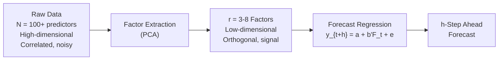
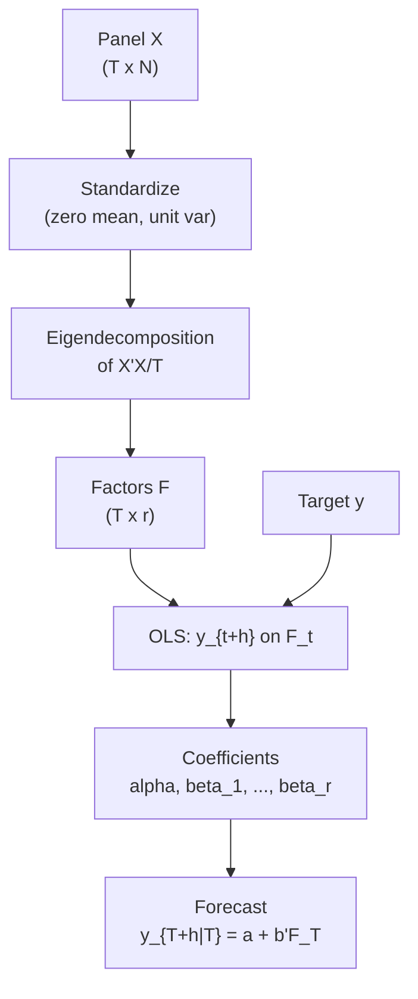
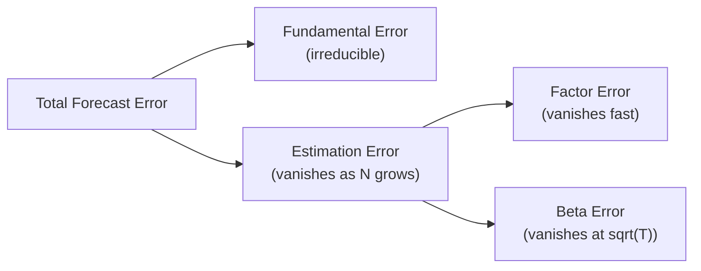
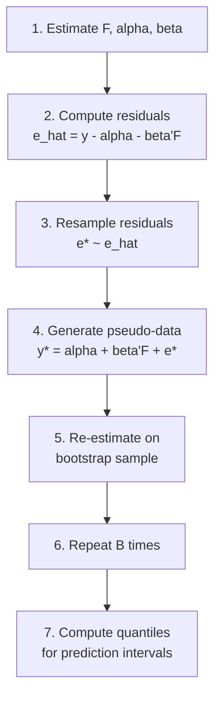
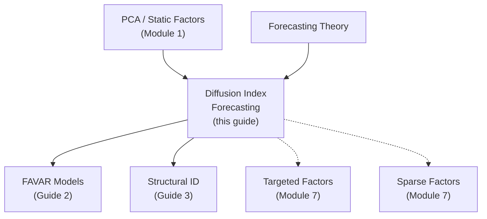

<!-- _class: lead -->

# Diffusion Index Forecasting

## Module 6: Factor-Augmented Models

**Key idea:** Extract common factors from hundreds of predictors via PCA, then use these factors as regressors -- transforming a high-dimensional problem into a tractable low-dimensional one.

<!-- Speaker notes: Welcome to Diffusion Index Forecasting. This deck is part of Module 06 Factor Augmented. -->
---

# The Dimensionality Problem

> With $N$ predictors and $T$ observations, if $N > T$, OLS is infeasible. Diffusion indices solve this elegantly.



| Method | Parameters | Overfitting | Information Used |
|--------|:----------:|:-----------:|:----------------:|
| All predictors | $N$ | Severe | All (if feasible) |
| Variable selection | $k \ll N$ | Moderate | Subset |
| **Diffusion index** | $r \ll N$ | **Low** | **All** |

<!-- Speaker notes: Use this diagram to illustrate the overall flow. Trace through each step with the audience. -->
---

<!-- _class: lead -->

# 1. Two-Step Estimation

<!-- Speaker notes: Welcome to 1. Two-Step Estimation. This deck is part of Module 06 Factor Augmented. -->
---

# Step 1: Factor Extraction + Step 2: Forecast

**Step 1:** From standardized data $X$ ($T \times N$):
$$\hat{F} = \sqrt{T} \cdot \text{eigenvectors}_{1:r}\left(\frac{X'X}{T}\right)$$

**Step 2:** Regress target on factors:
$$y_{t+h} = \alpha + \sum_{j=1}^r \beta_j \hat{F}_{jt} + \varepsilon_{t+h}$$



<!-- Speaker notes: Use this diagram to illustrate the overall flow. Trace through each step with the audience. -->
---

# Forecast Specifications

<div class="columns">
<div>

**Direct Forecasting:**
$$y_{t+h} = \alpha_h + \beta_h' \hat{F}_t + \varepsilon_{t+h}$$

Horizon-specific coefficients. No iterating.

**Iterated Forecasting:**
$$\hat{F}_{t+1} = A \hat{F}_t + u_{t+1}$$
$$y_{t+1} = \alpha_1 + \beta_1' \hat{F}_t + \varepsilon_{t+1}$$

Iterate forward to horizon $h$.

</div>
<div>

**AR-Augmented:**
$$y_{t+h} = \alpha + \sum_{i=1}^p \phi_i y_{t-i} + \beta' \hat{F}_t + \varepsilon_{t+h}$$

Adds lagged target for improved accuracy.

| Approach | Pros | Cons |
|----------|------|------|
| Direct | Simple, robust | Horizon-specific |
| Iterated | One model | Compounds errors |
| AR-augmented | Best fit | More parameters |

</div>
</div>

<!-- Speaker notes: Explain the notation carefully. Connect each term to its intuitive meaning before moving on. -->
---

<!-- _class: lead -->

# 2. Theoretical Properties

<!-- Speaker notes: Welcome to 2. Theoretical Properties. This deck is part of Module 06 Factor Augmented. -->
---

# Consistency and Asymptotic Theory

**Key result (Stock-Watson 2002):**

$$\sqrt{T}(\hat{\beta} - \beta^*) \xrightarrow{d} N(0, V_\beta)$$

Factor estimation error **does not** affect asymptotic distribution when $N, T \to \infty$ with $\sqrt{T}/N \to 0$.

**Forecast Error Decomposition:**
$$\underbrace{y_{T+h} - \hat{y}_{T+h|T}}_{\text{Total error}} = \underbrace{y_{T+h} - y_{T+h}^*}_{\text{Fundamental}} + \underbrace{y_{T+h}^* - \hat{y}_{T+h|T}}_{\text{Estimation}}$$



<!-- Speaker notes: Use this diagram to illustrate the overall flow. Trace through each step with the audience. -->
---

# Choosing the Number of Factors

**Trade-off:** More factors reduce bias but increase variance.

| Method | Approach | Typical Result |
|--------|----------|---------------|
| Bai-Ng IC | Information criteria on factor model | $r = 3-8$ for macro |
| Cross-validation | Minimize out-of-sample RMSFE | Horizon-specific $r$ |
| Scree plot | Explained variance elbow | Visual inspection |
| OOS performance | Expanding window backtest | Most reliable |

<!-- Speaker notes: Walk through the key rows of this comparison table. Highlight the most important distinctions. -->
---

<!-- _class: lead -->

# 3. Uncertainty Quantification

<!-- Speaker notes: Welcome to 3. Uncertainty Quantification. This deck is part of Module 06 Factor Augmented. -->
---

# Forecast Standard Errors and Bootstrap

**Naive SE** (ignoring factor estimation uncertainty):
$$\text{se}(\hat{y}_{T+h|T}) = \sqrt{\hat{\sigma}^2_\varepsilon \cdot (1 + \hat{F}_T' (\hat{F}'\hat{F})^{-1} \hat{F}_T)}$$

**Residual Bootstrap** (more accurate):



**95% prediction interval:** $\hat{y}_{T+h|T} \pm 1.96 \cdot \text{se}(\hat{y}_{T+h|T})$

<!-- Speaker notes: Use this diagram to illustrate the overall flow. Trace through each step with the audience. -->
---

<!-- _class: lead -->

# 4. Code Implementation

<!-- Speaker notes: Welcome to 4. Code Implementation. This deck is part of Module 06 Factor Augmented. -->
---

# DiffusionIndexForecaster Class

```python
class DiffusionIndexForecaster:
    def __init__(self, n_factors=5, horizon=1, include_ar=False, ar_lags=1):
        self.n_factors = n_factors
        self.horizon = horizon
        self.include_ar = include_ar
        self.ar_lags = ar_lags
        self.scaler = StandardScaler()
        self.pca = PCA(n_components=n_factors)
        self.reg = LinearRegression()

```

<!-- Speaker notes: Walk through the first part of this code implementation. The code continues on the next slide. -->
---

# DiffusionIndexForecaster Class (continued)

```python
    def fit(self, X, y):
        X_scaled = self.scaler.fit_transform(X)
        self.factors_ = self.pca.fit_transform(X_scaled)
        T_forecast = len(X) - self.horizon
        F_t = self.factors_[:T_forecast, :]
        y_ahead = y[self.horizon:T_forecast + self.horizon]
        if self.include_ar:
            y_lags = self._create_lags(y, self.ar_lags)[:T_forecast]
            predictors = np.column_stack([F_t, y_lags])
        else:
            predictors = F_t
        self.reg.fit(predictors, y_ahead)
        return self
```

<!-- Speaker notes: Continue walking through the implementation. Highlight the key output and how to verify correctness. -->
---

# Forecasting and Model Selection

```python
# Compare different factor counts
results = []
for n_factors in range(1, 11):
    model = DiffusionIndexForecaster(n_factors=n_factors, horizon=1)
    model.fit(X_train, y_train)
    y_pred = model.predict(X_test[:len(y_test)-1])
    rmse = np.sqrt(np.mean((y_test[1:] - y_pred)**2))
    results.append({'n_factors': n_factors, 'RMSE': rmse})

# Select optimal number of factors
best_r = min(results, key=lambda x: x['RMSE'])['n_factors']
print(f"Optimal factors: {best_r}")
```

> Variance explained:
> Factor 1 (Real activity): ~30-40%
> Factors 1-3: ~50-60%
> Factors 1-5: ~70%+ of total panel variance

<!-- Speaker notes: Walk through this code step by step. Highlight the key lines and explain the output. -->
---

# Common Pitfalls

| Pitfall | Problem | Solution |
|---------|---------|----------|
| In-sample factor extraction | Lookahead bias | Fit PCA on training data only |
| Same factors for all horizons | Sub-optimal forecasts | Horizon-specific or unified (FAVAR) |
| Overfitting factor count | Too many factors | OOS validation or Bai-Ng criteria |
| Raw data without transforms | Non-stationarity dominates | Log-differences + standardize |

```python
# WRONG: Extract factors from all data (lookahead bias!)
factors_all = PCA().fit_transform(X_all)

# CORRECT: Fit only on training data
pca = PCA().fit(X_train)
factors_train = pca.transform(X_train)
factors_test = pca.transform(X_test)  # Training loadings only
```

<!-- Speaker notes: Emphasize these common mistakes. Ask learners if they have encountered any of these in practice. -->
---

# Practice Problems

**Conceptual:**
1. Why do diffusion indices avoid overfitting despite using many predictors?
2. Economic interpretation of using the first PC to forecast GDP?
3. How to modify for real-time forecasting with different release dates?

**Mathematical:**
4. Show diffusion index forecast equals restricted regression: $\gamma = \Lambda \beta$
5. Derive forecast error variance accounting for factor estimation error
6. Prove factor estimation error is asymptotically negligible when $\sqrt{T}/N \to 0$

**Implementation:**
7. Compare: diffusion index vs AR vs small VAR vs ridge regression
8. Implement bootstrap prediction intervals with factor uncertainty
9. Show forecast invariance to orthogonal factor rotations

<!-- Speaker notes: Give learners 3-5 minutes to work through these practice problems before discussing solutions. -->
---

# Connections & Summary



| Key Result | Detail |
|------------|--------|
| Two-step estimation | PCA for factors, OLS for forecast |
| Consistency | Factor estimation error negligible for large $N$ |
| Optimal $r$ | Bai-Ng criteria or OOS validation; typically 3-8 |
| Bootstrap | Proper uncertainty quantification |

**References:** Stock & Watson (2002a, 2002b), Bai & Ng (2008), McCracken & Ng (2016)

<!-- Speaker notes: Summarize the key takeaways and highlight how this topic connects to upcoming material. -->